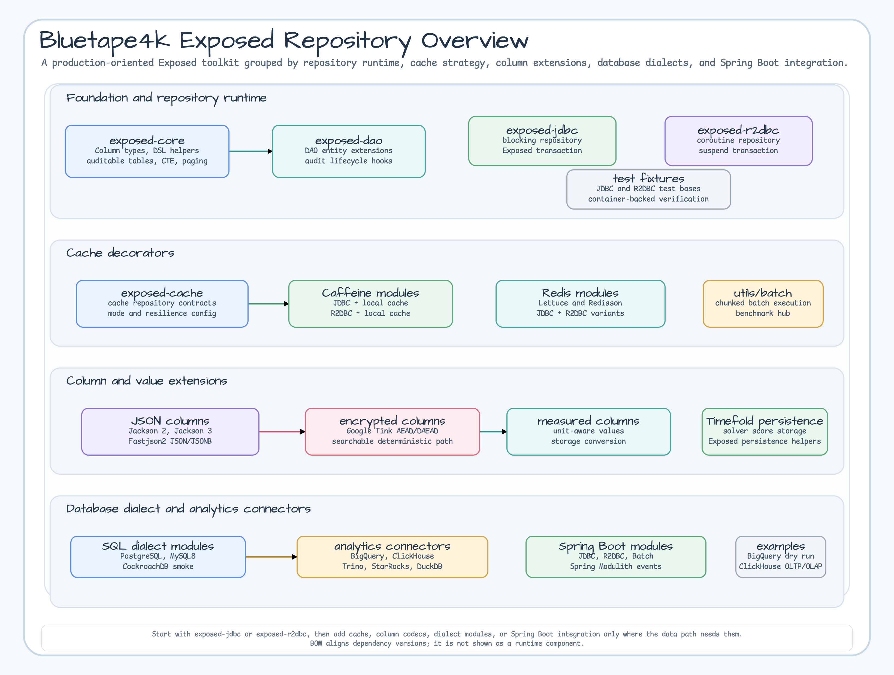
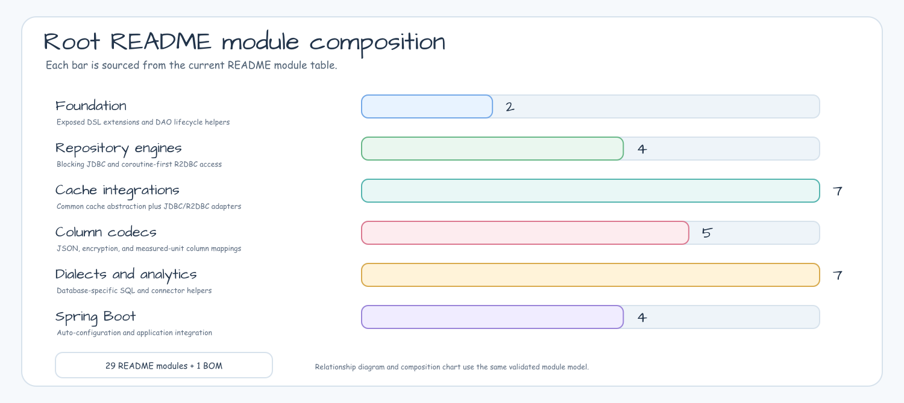

# bluetape4k-exposed

[](https://github.com/bluetape4k/bluetape4k-exposed/actions/workflows/ci.yml)
[](https://kotlinlang.org)
[](https://openjdk.org)
[](LICENSE)

[English](README.md) | 한국어


[JetBrains Exposed](https://github.com/JetBrains/Exposed) ORM을 위한 Kotlin 확장 라이브러리입니다. Repository runtime, cache decorator, JSON/암호화 Column, 데이터베이스별 helper, Spring Boot 자동 설정을 제공합니다.

---

## 프로젝트 목적

`bluetape4k-exposed`는 JetBrains Exposed를 운영 환경에 맞는 Kotlin 데이터 툴킷으로 확장합니다.
먼저 JDBC 또는 R2DBC Repository runtime을 고르고, 필요한 데이터 경로에만 cache decorator,
Column codec, 데이터베이스별 helper, Spring Boot 4 자동 설정을 더하는 식으로 사용할 수 있습니다.

## 주요 기능

- **Repository 패턴** — Exposed DSL 기반 타입 안전한 JDBC 및 R2DBC(코루틴) Repository 추상화
- **CTE Query DSL** — PostgreSQL/MySQL `WITH`, `WITH RECURSIVE` SELECT를 위한 JDBC/R2DBC 헬퍼
- **캐시 통합** — Caffeine(로컬), Lettuce/Redisson(분산 Redis) 캐시 백엔드
- **JSON Column** — Jackson 2.x, Jackson 3.x, Fastjson2 Column 직렬화
- **암호화** — Google Tink 기반 암호화 Column
- **DB 특화 확장** — PostgreSQL, MySQL 8, BigQuery, ClickHouse, Trino, StarRocks, CockroachDB, DuckDB, Timefold persistence 헬퍼
- **Ktor** — 호출자가 소유한 Exposed JDBC/R2DBC resource, readiness route, 안전한 status page를 위한 명시적 Ktor helper
- **Spring Boot** — Spring Boot 4.x 자동 설정 (JDBC, R2DBC, Batch, Spring Modulith JDBC 이벤트 발행 통합)
- **측정 단위 Column** — `bluetape4k-measured` 단위를 위한 Exposed Custom ColumnType

<!-- README_VISUAL_OVERVIEW:START -->
## Overview Diagram



## Module Composition Diagram


<!-- README_VISUAL_OVERVIEW:END -->

## 매뉴얼

저장소의 `docs/manual/`이 안정판 1.11 문서의 기준입니다.

- [매뉴얼 개요](docs/manual/ko/index.md)
- [시작하기](docs/manual/ko/getting-started.md)
- [모듈 목록과 학습 경로](docs/manual/ko/guides/learning-path.md)

배포된 Gradle 프로젝트 40개를 모두 다루며, 소유권 경계, 실행 예제, 실패 진단,
운영 고려 사항, 배포본에 고정한 소스 링크를 영어와 한국어로 제공합니다. README는
간단한 입구로 유지하고 상세 동작은 `docs/manual/`에서 설명합니다.

## 모듈 목록

| 모듈 | 설명 |
|------|------|
| `exposed-core` | 핵심 Column 타입, DSL 헬퍼, 확장 함수 |
| `exposed-dao` | DAO Entity 확장, 라이프사이클 훅 |
| `exposed-jdbc` | JDBC 기반 Repository 패턴, 트랜잭션 DSL |
| `exposed-r2dbc` | R2DBC 코루틴 네이티브 Repository, suspend 트랜잭션 |
| `exposed-jdbc-tests` | JDBC 통합 테스트 픽스처 |
| `exposed-r2dbc-tests` | R2DBC 통합 테스트 픽스처 |
| `exposed-cache` | 캐시 추상화 인터페이스 |
| `exposed-jdbc-caffeine` | JDBC + Caffeine 로컬 캐시 |
| `exposed-jdbc-lettuce` | JDBC + Lettuce Redis 분산 캐시 |
| `exposed-jdbc-redisson` | JDBC + Redisson Redis 분산 캐시 |
| `exposed-r2dbc-caffeine` | R2DBC + Caffeine 로컬 캐시 |
| `exposed-r2dbc-lettuce` | R2DBC + Lettuce Redis 분산 캐시 |
| `exposed-r2dbc-redisson` | R2DBC + Redisson Redis 분산 캐시 |
| `exposed-jackson2` | Jackson 2.x JSON Column 직렬화 |
| `exposed-jackson3` | Jackson 3.x JSON Column 직렬화 |
| `exposed-fastjson2` | Fastjson2 JSON Column 직렬화 |
| `exposed-tink` | Google Tink 암호화 Column |
| `exposed-measured` | 측정 단위용 Custom ColumnType 매핑 |
| `exposed-postgresql` | PostgreSQL 다이얼렉트 확장 |
| `exposed-mysql8` | MySQL 8 다이얼렉트 확장 |
| `exposed-bigquery` | BigQuery connector 지원 |
| `exposed-clickhouse` | ClickHouse connector 지원 |
| `exposed-trino` | Trino connector 지원 |
| `exposed-starrocks` | StarRocks local-first OLAP connector 지원 |
| `exposed-cockroachdb` | CockroachDB PostgreSQL-wire smoke 지원 |
| `exposed-duckdb` | DuckDB embedded analytics 지원 |
| `exposed-druid` | Apache Druid query-only Avatica JDBC 실험 |
| `exposed-timefold-solver-persistence` | Timefold Score 값을 위한 Exposed 컬럼 매핑 |
| `exposed-ktor` | 명시적 Exposed JDBC/R2DBC 트랜잭션, readiness route, status page용 Ktor 통합 |
| `exposed-spring-boot-jdbc` | Spring Boot 4.x JDBC 자동 설정 |
| `exposed-spring-boot-r2dbc` | Spring Boot 4.x R2DBC 자동 설정 |
| `exposed-spring-boot-batch` | Spring Boot 4.x Batch 통합 |
| `exposed-spring-modulith` | Exposed 기반 Spring Modulith JDBC 이벤트 발행 Repository |

## JaVers와의 경계

`bluetape4k-exposed`는 JetBrains Exposed 주변의 애플리케이션 데이터 경로를
담당합니다. Repository 실행, 트랜잭션 경계, cache read/write 동작, Spring Boot와
Ktor 통합이 이 저장소의 책임입니다. 따라서 이 저장소의 DDD 계약은 Spring에도
JaVers에도 묶이지 않는 최소 계약이어야 합니다. Aggregate root, 보류 중인 domain
event, after-commit 발행 hook은 다룰 수 있지만 JaVers audit 개념을 직접 담지는
않습니다.

객체 이력, diff, JaVers commit metadata가 필요하면 `bluetape4k-javers`를 사용하세요.
그쪽의 `javers-exposed`는 Exposed JDBC로 JaVers CDO snapshot을 저장하고,
`javers-ddd`는 aggregate/domain-event workflow를 JaVers commit으로 연결합니다. 두
모듈은 이 저장소를 보완하지만 source-of-truth Exposed Repository나 cache decorator를
대체하지 않습니다.

## Spring-neutral DDD 계약

`bluetape4k-exposed-core`는 aggregate가 repository adapter에 이벤트를 넘기기
전에 domain event를 기록할 수 있도록 Spring-neutral `AggregateRoot`,
`DomainEvent`, `AbstractAggregateRoot` contract를 제공합니다.

이 계약은 선택형 helper입니다. 애플리케이션이 새 aggregate base class/interface를
명시적으로 채택하기 전까지 기존 repository, cache decorator, Spring Modulith 통합,
JaVers 통합의 동작은 바뀌지 않습니다. 자동 발행이나 자동 저장도 실행하지 않습니다.

```kotlin
import io.bluetape4k.exposed.core.ddd.AbstractAggregateRoot
import io.bluetape4k.exposed.core.ddd.DomainEvent
import java.io.Serializable
import java.time.Instant

@JvmInline
value class OrderId(val value: Long) : Serializable {
    companion object {
        private const val serialVersionUID: Long = 1L
    }
}

class Order(
    override val id: OrderId,
) : AbstractAggregateRoot<OrderId>() {

    fun place() {
        recordDomainEvent(OrderPlaced(id))
    }
}

data class OrderPlaced(
    override val aggregateId: OrderId,
    override val occurredAt: Instant = Instant.now(),
) : DomainEvent<OrderId>, Serializable {
    companion object {
        private const val serialVersionUID: Long = 1L
    }
}
```

이 계약은 in-memory event buffer만 다룹니다. Durable outbox, publisher
adapter, Exposed DAO lifecycle hook, Exposed DAO `EntityCache` event registry,
in-memory event queue, Spring Modulith publication store를 제공하지 않습니다.
Rollback될 수 있는 database flush도 durable event boundary가 아닙니다.

Repository 통합은 다음 순서를 따라야 합니다.

1. `domainEvents()`로 event snapshot을 만듭니다.
2. Aggregate 상태를 persist하고 after-transaction-commit 또는 동등한 durability
   boundary를 기다립니다.
3. Snapshot을 outbox, persisted retry queue, transactionally recorded handoff처럼
   durable owner가 있는 경로에 넘깁니다.
4. 그 durable owner가 event 책임을 인수한 뒤에만 aggregate buffer를
   clear/drain합니다.

Durable publication을 command transaction에 포함해야 하는 transaction-aware
publisher는 다른 순서를 사용합니다. Commit 전에 aggregate를 저장하고 read-only
snapshot을 인계한 뒤, commit 완료 후에만 buffer를 비웁니다. 동기 listener와 rollback
경계는 [JDBC transaction-aware publisher](spring-boot/jdbc/README.ko.md#transaction-aware-domain-events)를 참고하세요.

Spring Modulith와 JaVers module은 별도 adapter로 유지됩니다. Core 계약은 Spring
Modulith publication semantics나 JaVers audit commit semantics를 담지 않습니다.

Event payload는 opaque하고 민감하지 않은 identifier와 최소 business fact 위주로
유지하세요. Secret, credential, token, natural key, 불필요한 PII를 domain event에
넣지 않습니다.

## 빠른 시작

### Gradle 의존성 추가

```kotlin
dependencies {
    implementation(platform("io.github.bluetape4k:bluetape4k-dependencies:<version>"))
    // 핵심 JDBC
    implementation("io.github.bluetape4k.exposed:bluetape4k-exposed-jdbc")
    // R2DBC (코루틴)
    implementation("io.github.bluetape4k.exposed:bluetape4k-exposed-r2dbc")
    // Redis 캐시 (Lettuce)
    implementation("io.github.bluetape4k.exposed:bluetape4k-exposed-jdbc-lettuce")
    // Jackson JSON Column
    implementation("io.github.bluetape4k.exposed:bluetape4k-exposed-jackson2")
    // Ktor 통합
    implementation("io.github.bluetape4k.exposed:bluetape4k-exposed-ktor")
    // Spring Boot 자동 설정
    implementation("io.github.bluetape4k.exposed:bluetape4k-exposed-spring-boot-jdbc")
    // Exposed 기반 Spring Modulith JDBC 이벤트 발행
    implementation("io.github.bluetape4k.exposed:bluetape4k-exposed-spring-modulith")
}
```

스냅샷은 Maven Central Snapshots에 배포됩니다:

```kotlin
repositories {
    maven("https://central.sonatype.com/repository/maven-snapshots/")
    mavenCentral()
}
```

<!-- migration-guide:start -->
<!-- migration-guide:heading:migration-generation -->
### Migration 생성과 Schema Drift

<!-- migration-guide:heading:availability -->
#### 제공 범위

JetBrains Exposed 1.3.1은 Gradle migration plugin과 JDBC/R2DBC
`MigrationUtils` API를 제공합니다. 여기서 설명하는 `migrationDriftTest` task와
CI 검증은 `develop`에서 사용할 수 있고 bluetape4k-exposed 1.12.0부터
배포됩니다. 자세한 내용은
[Exposed Gradle plugin documentation](https://www.jetbrains.com/help/exposed/exposed-gradle-plugin.html),
[Exposed migration documentation](https://www.jetbrains.com/help/exposed/migrations.html),
[Gradle Plugin Portal entry](https://plugins.gradle.org/plugin/org.jetbrains.exposed.plugin)를
참고하세요.

<!-- migration-guide:heading:application-users -->
#### Application 사용자

Gradle plugin은 Exposed table 정의와 database metadata를 비교해 검토 가능한 SQL
파일을 만듭니다. 출력 directory, credential, filename 순서, SQL 검토, Flyway나
Liquibase 같은 migration runner로 실행하는 과정은 application이 책임집니다.

아래 PostgreSQL 예제는 upstream plugin을 직접 고정해 그대로 사용할 수 있고,
모든 접속 정보를 build file 밖에서 읽으며 `MIGRATION_JDBC_URL`에 맞는 JDBC
driver를 포함합니다. 중앙 `bluetape4k-dependencies` catalog를 이미 가져온
application은 직접 선언한 plugin 줄을 `alias(bt4k.plugins.exposed.plugin)`으로
바꿀 수 있습니다.

```kotlin
plugins {
    id("org.jetbrains.exposed.plugin") version "1.3.1"
}

val migrationJdbcUrl = providers.environmentVariable("MIGRATION_JDBC_URL")
val migrationDbUser = providers.environmentVariable("MIGRATION_DB_USER")
val migrationDbPassword = providers.environmentVariable("MIGRATION_DB_PASSWORD")

exposed {
    migrations {
        tablesPackage.set("com.example.app.persistence")
        fileDirectory.set(layout.projectDirectory.dir("src/main/resources/db/migration"))
        databaseUrl.set(migrationJdbcUrl)
        databaseUser.set(migrationDbUser)
        databasePassword.set(migrationDbPassword)
    }
}

dependencies {
    runtimeOnly("org.postgresql:postgresql")
}
```

변경할 때마다 단조 증가하는 새 filename을 사용하고, 이미 같은 파일이 있으면
생성 전에 실패하게 만듭니다.

```bash
MIGRATION_FILE=V202607170001__add_description.sql
test ! -e "src/main/resources/db/migration/$MIGRATION_FILE" &&
  ./gradlew generateMigrations --filename="$MIGRATION_FILE"
```

<!-- migration-guide:warning:credentials -->
> Migration credential을 commit하거나 shared/production database를 생성 대상으로
> 지정하지 마세요. Production과 비슷한 metadata를 가진 disposable 또는 staging
> 복사본을 사용하고, 생성된 SQL을 승격하기 전에 검토합니다.

<!-- migration-guide:warning:r2dbc-jdbc-boundary -->
> R2DBC application도 Gradle plugin을 실행할 때는 build-time JDBC URL과 그에 맞는
> JDBC driver가 필요합니다. R2DBC URL이나 R2DBC runtime driver만으로는 plugin이
> migration을 생성할 수 없습니다.

<!-- migration-guide:warning:no-runtime-management -->
> Application startup이나 request path에서 plugin 생성 또는 `MigrationUtils`
> 비교를 실행하지 마세요. 어느 API도 production migration runner가 아닙니다.

<!-- migration-guide:warning:immutable-migrations -->
> 이미 적용했을 수 있는 migration은 절대 덮어쓰지 마세요. 이 repository의 demo에
> 들어 있는 V1 파일은 교체 가능한 test fixture일 뿐, application filename 규칙이
> 아닙니다.

<!-- migration-guide:heading:surface-boundaries -->
#### 기능별 경계

<!-- migration-guide:table:surface-boundaries -->
| 기능 | 연결 방식과 용도 | 보장하지 않는 것 |
|---|---|---|
| `Gradle plugin` | Build-time JDBC metadata 연결과 script 생성 | R2DBC로 연결하지 않으며 production migration을 적용하지 않음 |
| `JDBC MigrationUtils` | Programmatic 또는 test-time JDBC schema 비교 | Startup이나 request path의 schema 관리에 사용하면 안 됨 |
| `R2DBC MigrationUtils` | Programmatic 또는 test-time R2DBC schema 비교 | Startup이나 request path의 schema 관리에 사용하면 안 됨 |

<!-- migration-guide:heading:repository-contributors -->
#### Repository 기여자

Demo V1 파일은 이름을 고정한 repository fixture입니다. 기여자는 의도적으로
다시 생성하고 교체할 수 있지만, application에서 이 naming 정책을 따라서는 안
됩니다. Demo 검증에는 Gradle wrapper와 H2 JDBC driver만 필요하며 결과는 두 demo
migration directory에 기록됩니다. 제한된 directory의 status가 깨끗하면 Exposed
1.3.1이 repository drift 없이 fixture를 다시 만들었다는 뜻입니다. 임의의
application migration이 안전하다는 뜻은 아닙니다.

```bash
./gradlew :exposed-spring-boot-jdbc-demo:generateMigrations --filename=V1__create_products.sql --rerun --no-build-cache --no-configuration-cache --no-daemon
./gradlew :exposed-spring-boot-r2dbc-demo:generateMigrations --filename=V1__create_webflux_products.sql --rerun --no-build-cache --no-configuration-cache --no-daemon
git status --short --untracked-files=all -- examples/jdbc-demo/src/main/resources/db/migration examples/r2dbc-demo/src/main/resources/db/migration
```

H2 집중 검증에는 외부 database가 필요하지 않습니다. JUnit XML은
`exposed/jdbc-tests/build/test-results/migrationDriftTest`와
`exposed/r2dbc-tests/build/test-results/migrationDriftTest`에 기록되고, CI는
정제한 status와 XML을 `build/migration-drift-reports/h2/<api>`에 모읍니다. 통과하면
두 API의 H2 nullable column 추가 계약을 확인한 것입니다. Schema 동등성이나 rollout
안전성을 증명하지는 않습니다.

```bash
EXPOSED_TEST_DB=H2 ./gradlew \
  :bluetape4k-exposed-jdbc-tests:migrationDriftTest \
  :bluetape4k-exposed-r2dbc-tests:migrationDriftTest \
  --no-configuration-cache \
  --no-parallel --max-workers=1 --no-daemon
```

실제 database 검증을 실행하려면 Testcontainers가 사용할 수 있는 Docker 호환
runtime이 필요합니다. 아래 명령은 순서대로 실행합니다. 각 명령은 해당 module의
`build/test-results/migrationDriftTest`에 XML을 기록하고, CI는 정제한 증거를
`build/migration-drift-reports/<api>-<database>`에 모읍니다. 통과하면 선택한
dialect에서 같은 nullable column 추가 계약을 확인한 것입니다. Type 변경,
destructive DDL, production data 처리, lock, rollout 순서를 승인하는 검증은
아닙니다.

```bash
EXPOSED_TEST_DB=POSTGRESQL ./gradlew \
  :bluetape4k-exposed-jdbc-tests:migrationDriftTest \
  --no-configuration-cache \
  --no-parallel --max-workers=1 --no-daemon

EXPOSED_TEST_DB=POSTGRESQL ./gradlew \
  :bluetape4k-exposed-r2dbc-tests:migrationDriftTest \
  --no-configuration-cache \
  --no-parallel --max-workers=1 --no-daemon

EXPOSED_TEST_DB=MYSQL_V8 ./gradlew \
  :bluetape4k-exposed-jdbc-tests:migrationDriftTest \
  --no-configuration-cache \
  --no-parallel --max-workers=1 --no-daemon

EXPOSED_TEST_DB=MYSQL_V8 ./gradlew \
  :bluetape4k-exposed-r2dbc-tests:migrationDriftTest \
  --no-configuration-cache \
  --no-parallel --max-workers=1 --no-daemon
```

<!-- migration-guide:heading:failure-diagnostics -->
#### 실패 진단

<!-- migration-guide:table:failure-diagnostics -->
| 실패 지점 | 첫 진단과 증거 확인 순서 |
|---|---|
| `Gradle plugin` | 고정 filename 명령에 `--stacktrace --info`를 붙여 다시 실행하고 제한된 migration directory status를 확인 |
| `H2 JDBC drift` | `EXPOSED_TEST_DB=H2 ./gradlew :bluetape4k-exposed-jdbc-tests:migrationDriftTest --tests '*JdbcMigrationDriftTest*' --stacktrace --info`를 실행하고, local에서는 module의 `build/test-results/migrationDriftTest`, CI에서는 staged status와 정제된 XML 순서로 확인 |
| `H2 R2DBC drift` | `EXPOSED_TEST_DB=H2 ./gradlew :bluetape4k-exposed-r2dbc-tests:migrationDriftTest --tests '*R2dbcMigrationDriftTest*' --stacktrace --info`를 실행하고, local에서는 module의 `build/test-results/migrationDriftTest`, CI에서는 staged status와 정제된 XML 순서로 확인 |
| `PostgreSQL/MySQL 8` | Docker를 먼저 확인하고, local에서는 선택한 module의 `build/test-results/migrationDriftTest`, CI에서는 `command-summary.log`, `status.txt`, 정제된 JUnit XML 순서로 확인 |

<!-- migration-guide:heading:support-matrix -->
#### 지원 범위

<!-- migration-guide:table:support-matrix -->
| 변경 | 증거 수준 | 의미 |
|---|---|---|
| `Add nullable column` | H2 PR lane과 PostgreSQL/MySQL 8 full Nightly/manual lane | JDBC/R2DBC 집중 검증이 정확한 nullable column 추가문 하나와 두 번째 비교 결과가 깨끗한지 확인 |
| `Change column type on H2` | 현재 동작만 기록 | Regression이 현재 출력을 기록할 뿐, 변경을 승인하지 않음 |
| `Change column type on PostgreSQL/MySQL 8` | 보장하지 않음 | 대상 dialect에서 생성된 SQL을 검토하고 test해야 함 |
| `Rename or remove column` | 보장하지 않음 | Destructive 변경으로 보고 별도 data migration을 설계해야 함 |
| `Defaults and indexes` | 보장하지 않음 | Expression, 순서, locking, 기존 row 영향을 검토해야 함 |
| `Foreign/unique/check constraints` | 보장하지 않음 | 기존 data와 enforcement/locking 동작을 검증해야 함 |
| `Vendor-specific DDL` | 보장하지 않음 | 정확한 database 버전과 운영 정책에 맞춰 test해야 함 |

빈 diff는 "이 API와 버전이 차이를 찾지 못했다"는 뜻일 뿐입니다. 두 schema가
같다는 증거는 아닙니다.

<!-- migration-guide:heading:promotion-review -->
#### 승격 전 검토

<!-- migration-guide:table:promotion-review -->
| 검토 영역 | 필수 확인 항목 |
|---|---|
| `Schema safety` | `DROP`/`TRUNCATE`, 삭제, rename, type 변경, `NOT NULL`, default, index, unique/foreign/check constraint, statement 순서를 검토 |
| `Data safety` | Backfill 정확성, production과 비슷한 row 수, table rewrite, data 재해석 위험을 검증 |
| `Rollout safety` | Lock 시간, nullable column 추가/backfill/constraint 적용을 나눈 단계, database transaction 지원, backup, rollback, migration runner ownership을 확인 |

Application의 migration runner에 넘기기 전에 disposable 또는 staging 복사본에서
raw SQL을 검토합니다.
<!-- migration-guide:end -->

### Database 예제

| 예제 | 목적 | 검증 |
|------|------|------|
| `examples-ddd-spring-modulith-demo` | DDD aggregate event, Spring Modulith module boundary, Exposed-backed publication row, idempotent listener 검증 | `./gradlew :examples-ddd-spring-modulith-demo:test` |
| `examples-exposed-clickhouse-oltp-olap` | PostgreSQL OLTP에서 ClickHouse OLAP으로 forwarding 후 집계 분석 | `./gradlew :examples-exposed-clickhouse-oltp-olap:test` |
| `examples-exposed-bigquery-dry-run` | Credential 없이 BigQuery REST dry-run과 query-job option 검증 | `./gradlew :examples-exposed-bigquery-dry-run:test` |

### JDBC Repository (H2 / PostgreSQL / MySQL)

```kotlin
import org.jetbrains.exposed.sql.*
import org.jetbrains.exposed.sql.transactions.transaction

object UserTable : LongIdTable("users") {
    val name = varchar("name", 255)
    val email = varchar("email", 255)
    val createdAt = datetime("created_at")
}

class UserRepository(private val database: Database) {

    fun findById(id: Long): ResultRow? = transaction(database) {
        UserTable.selectAll()
            .where { UserTable.id eq id }
            .singleOrNull()
    }

    fun findAll(): List<ResultRow> = transaction(database) {
        UserTable.selectAll().toList()
    }

    fun create(name: String, email: String): Long = transaction(database) {
        UserTable.insertAndGetId {
            it[UserTable.name] = name
            it[UserTable.email] = email
            it[UserTable.createdAt] = org.joda.time.DateTime.now()
        }.value
    }

    fun deleteById(id: Long): Boolean = transaction(database) {
        UserTable.deleteWhere { UserTable.id eq id } > 0
    }
}

// 사용 예
val db = Database.connect(dataSource)
SchemaUtils.create(UserTable)

val repo = UserRepository(db)
val id = repo.create("홍길동", "gildong@example.com")
val user = repo.findById(id)
```

### R2DBC 코루틴 Repository

```kotlin
import io.bluetape4k.exposed.r2dbc.transactions.suspendTransaction

class UserR2dbcRepository(private val database: R2dbcDatabase) {

    suspend fun findById(id: Long): ResultRow? = suspendTransaction(database) {
        UserTable.selectAll()
            .where { UserTable.id eq id }
            .singleOrNull()
    }

    suspend fun create(name: String, email: String): Long = suspendTransaction(database) {
        UserTable.insertAndGetId {
            it[UserTable.name] = name
            it[UserTable.email] = email
        }.value
    }
}
```

### Common Table Expression (PostgreSQL / MySQL)

```kotlin
import io.bluetape4k.exposed.core.CteTable
import io.bluetape4k.exposed.jdbc.withCte
import org.jetbrains.exposed.v1.jdbc.select

val activeUsers = CteTable(
    name = "active_users",
    query = Users.select(Users.id, Users.name).where { Users.active eq true }
)

val rows = activeUsers
    .select(activeUsers[Users.id], activeUsers[Users.name])
    .withCte(activeUsers)
    .orderBy(activeUsers[Users.id])
    .toList()
```

### JSON Column (Jackson)

```kotlin
import io.bluetape4k.exposed.jackson2.json

data class Address(val street: String, val city: String)

object ContactTable : LongIdTable("contacts") {
    val name = varchar("name", 255)
    val address = json<Address>("address")  // JSON 텍스트로 저장
}
```

### 암호화 Column (Tink)

```kotlin
import io.bluetape4k.exposed.tink.encrypted

object SecretTable : LongIdTable("secrets") {
    val sensitiveData = encrypted("data")  // AES-GCM으로 암호화 저장
}
```

### Spring Boot 자동 설정

```kotlin
@SpringBootApplication
@EnableExposedJdbc
class MyApplication

// application.yml
// spring:
//   datasource:
//     url: ${APP_JDBC_URL}
```

### Spring Modulith 이벤트 발행

`exposed-spring-modulith`는 Exposed DSL과 동일한
Exposed `DataSource`/`springTransactionManager`를 사용하는 JDBC-only Spring
Modulith `EventPublicationRepository`를 제공합니다. artifact 이름은 공식
Spring Modulith 저장소 모듈처럼 보이지 않도록 `exposed-spring-modulith`
형태로 둡니다.

```yaml
bluetape4k:
  spring:
    modulith:
      exposed:
        completion-mode: update
        initialize-schema: false
```

운영 스키마는 Flyway 또는 Liquibase 사용을 권장합니다. `initialize-schema`는
테스트와 작은 로컬 애플리케이션 용도입니다.

### Testcontainers 수명주기

모듈 테스트는 각 `XxxServer.Launcher`를 하나의 test JVM 안에서만 공유하며,
Docker container를 프로세스 사이에서 재사용하지 않습니다. BigQuery와
StarRocks의 직접 fixture도 같은 non-reuse 기본값을 따릅니다. 로컬 개발에서만
재사용하려면 `~/.testcontainers.properties`에
`testcontainers.reuse.enable=true`를 설정한 뒤, 실행할 명령에 명시적으로
opt-in합니다.

```bash
BLUETAPE4K_TESTCONTAINERS_REUSE=true ./gradlew :bluetape4k-exposed-bigquery:test
```

`CI` 또는 `GITHUB_ACTIONS` 환경 변수가 존재하면 값과 관계없이 이 opt-in은
무시됩니다 (`CI=1` 포함). 재사용 컨테이너는 JVM 종료 시 stop/removal 대상으로
등록하지 않으며, 테스트와 예제는 reuse를 암묵적으로 활성화하지 않습니다.

### Ktor 통합

`exposed-ktor`는 호출자가 소유한 Exposed resource 위에 명시적 Ktor helper를
추가합니다. 기본 `installBluetape4kExposedKtor()` 호출은 no-op입니다. Status
page와 health/readiness route는 애플리케이션이 opt-in할 때만 설치됩니다.

```kotlin
dependencies {
    implementation(platform("io.github.bluetape4k:bluetape4k-dependencies:<version>"))
    implementation("io.github.bluetape4k.exposed:bluetape4k-exposed-ktor")
}
```

```kotlin
import io.bluetape4k.exposed.ktor.Bluetape4kExposedKtorConfig
import io.bluetape4k.exposed.ktor.bluetape4kExposedErrors
import io.bluetape4k.exposed.ktor.installBluetape4kExposedKtor
import io.bluetape4k.ktor.core.Bluetape4kKtorCoreConfig
import io.bluetape4k.ktor.core.bluetape4kErrorResponses
import io.bluetape4k.ktor.core.installBluetape4kKtorCore
import io.ktor.server.application.Application
import io.ktor.server.application.install
import io.ktor.server.plugins.statuspages.StatusPages
import kotlinx.coroutines.asCoroutineDispatcher
import org.jetbrains.exposed.v1.jdbc.Database
import org.jetbrains.exposed.v1.r2dbc.R2dbcDatabase
import java.util.concurrent.Executors
import kotlin.time.Duration.Companion.seconds

fun Application.module(
    jdbcDatabase: Database,
    r2dbcDatabase: R2dbcDatabase,
) {
    val jdbcDispatcher = Executors.newFixedThreadPool(8).asCoroutineDispatcher()

    installBluetape4kKtorCore(
        Bluetape4kKtorCoreConfig(
            installStatusPages = false,
            installHealthRoutes = false,
        )
    )
    install(StatusPages) {
        bluetape4kErrorResponses()
        bluetape4kExposedErrors()
    }
    installBluetape4kExposedKtor(
        Bluetape4kExposedKtorConfig(
            jdbcDatabase = jdbcDatabase,
            jdbcBlockingDispatcher = jdbcDispatcher,
            r2dbcDatabase = r2dbcDatabase,
            installHealthRoutes = true,
            readinessProbeTimeout = 2.seconds,
            installStatusPages = false,
        )
    )
}
```

JDBC 작업은 blocking입니다. 전용 dispatcher를 넘기고 애플리케이션 lifecycle에서
닫아야 합니다. R2DBC 작업은 `exposedR2dbcTransaction()` /
`suspendTransaction`을 통해 coroutine-native로 실행됩니다. StatusPages 조합,
readiness triage, rollback, non-goal은 [ktor/exposed/README.ko.md](ktor/exposed/README.ko.md)를
참고하세요.

## 요구사항

- JVM 21+
- Kotlin 2.3+
- JetBrains Exposed 1.3+

## 라이선스

MIT — [LICENSE](LICENSE) 참고.
