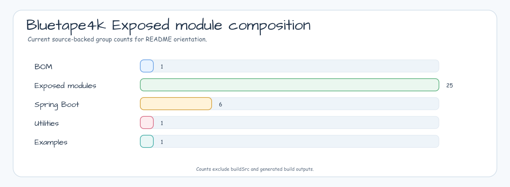
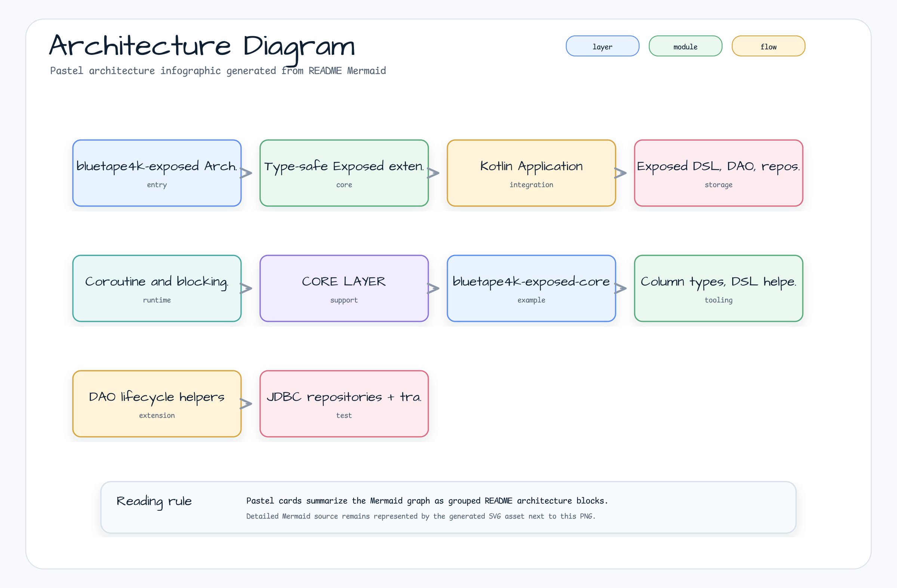

# bluetape4k-exposed

[](https://github.com/bluetape4k/bluetape4k-exposed/actions/workflows/ci.yml)
[](https://kotlinlang.org)
[](https://openjdk.org)
[](LICENSE)

[한국어](README.ko.md)


Kotlin extensions for [JetBrains Exposed](https://github.com/JetBrains/Exposed) ORM — providing Repository patterns, cache integrations, JSON column serialization, encryption, and Spring Boot auto-configuration.

---

## Project Purpose

`bluetape4k-exposed` turns JetBrains Exposed into a production-oriented Kotlin
data toolkit. It standardizes JDBC and R2DBC repository patterns, cache-backed
read paths, JSON/encrypted columns, database dialect extensions, and Spring Boot
4 auto-configuration while preserving Exposed DSL ergonomics.

## Features

- **Repository Pattern** — Type-safe JDBC and R2DBC (coroutine) repository abstractions built on Exposed DSL
- **CTE Query DSL** — PostgreSQL/MySQL `WITH` and `WITH RECURSIVE` SELECT helpers for JDBC and R2DBC
- **Cache Integrations** — Caffeine (local), Lettuce and Redisson (distributed Redis) cache backends
- **JSON Columns** — Jackson 2.x, Jackson 3.x, and Fastjson2 column serializers
- **Encryption** — Google Tink-based encrypted columns
- **Database-specific Extensions** — PostgreSQL, MySQL 8, BigQuery, ClickHouse, Trino, DuckDB, and Timefold persistence helpers
- **Spring Boot** — Spring Boot 4.x auto-configuration (JDBC, R2DBC, Batch, and Spring Modulith JDBC event publication integration)
- **Measured Columns** — Exposed custom column types for `bluetape4k-measured` units

<!-- README_VISUAL_OVERVIEW:START -->
## Overview Diagram


## Module Composition Chart


<!-- README_VISUAL_OVERVIEW:END -->

## Architecture



## Modules

| Module | Description |
|--------|-------------|
| `exposed-core` | Core Column types, DSL helpers, extension functions |
| `exposed-dao` | DAO Entity extensions, lifecycle hooks |
| `exposed-jdbc` | JDBC-based Repository pattern, transaction DSL |
| `exposed-r2dbc` | R2DBC coroutine-native Repository, suspend transactions |
| `exposed-jdbc-tests` | JDBC integration test fixtures |
| `exposed-r2dbc-tests` | R2DBC integration test fixtures |
| `exposed-cache` | Cache abstraction interfaces |
| `exposed-jdbc-caffeine` | JDBC + Caffeine local cache |
| `exposed-jdbc-lettuce` | JDBC + Lettuce Redis distributed cache |
| `exposed-jdbc-redisson` | JDBC + Redisson Redis distributed cache |
| `exposed-r2dbc-caffeine` | R2DBC + Caffeine local cache |
| `exposed-r2dbc-lettuce` | R2DBC + Lettuce Redis distributed cache |
| `exposed-r2dbc-redisson` | R2DBC + Redisson Redis distributed cache |
| `exposed-jackson2` | Jackson 2.x JSON column serialization |
| `exposed-jackson3` | Jackson 3.x JSON column serialization |
| `exposed-fastjson2` | Fastjson2 JSON column serialization |
| `exposed-tink` | Google Tink encrypted columns |
| `exposed-measured` | Custom ColumnType mappings for measured units |
| `exposed-postgresql` | PostgreSQL dialect extensions |
| `exposed-mysql8` | MySQL 8 dialect extensions |
| `exposed-bigquery` | BigQuery connector support |
| `exposed-clickhouse` | ClickHouse connector support |
| `exposed-trino` | Trino connector support |
| `exposed-duckdb` | DuckDB embedded analytics support |
| `exposed-timefold-solver-persistence` | Timefold Solver persistence integration |
| `exposed-spring-boot-jdbc` | Spring Boot 4.x JDBC auto-configuration |
| `exposed-spring-boot-r2dbc` | Spring Boot 4.x R2DBC auto-configuration |
| `exposed-spring-boot-batch` | Spring Boot 4.x batch integration |
| `exposed-spring-modulith` | Spring Modulith JDBC event publication repository backed by Exposed |

## Quick Start

### Gradle

```kotlin
dependencies {
    // Core
    implementation("io.github.bluetape4k.exposed:bluetape4k-exposed-jdbc:1.8.1-SNAPSHOT")
    // R2DBC (coroutines)
    implementation("io.github.bluetape4k.exposed:bluetape4k-exposed-r2dbc:1.8.1-SNAPSHOT")
    // Redis cache
    implementation("io.github.bluetape4k.exposed:bluetape4k-exposed-jdbc-lettuce:1.8.1-SNAPSHOT")
    // Jackson JSON columns
    implementation("io.github.bluetape4k.exposed:bluetape4k-exposed-jackson2:1.8.1-SNAPSHOT")
    // Spring Boot auto-configuration
    implementation("io.github.bluetape4k.exposed:bluetape4k-exposed-spring-boot-jdbc:1.8.1-SNAPSHOT")
    // Spring Modulith JDBC event publication through Exposed
    implementation("io.github.bluetape4k.exposed:bluetape4k-exposed-spring-modulith:1.8.1-SNAPSHOT")
}
```

Snapshots are published to Maven Central Snapshots. Add the repository:

```kotlin
repositories {
    maven("https://central.sonatype.com/repository/maven-snapshots/")
    mavenCentral()
}
```

### Exposed Gradle Plugin

Use JetBrains' official Exposed Gradle plugin in application or example modules
that generate migration scripts from Exposed table definitions. Keep its version
aligned with the JetBrains Exposed version used by the project. In bluetape4k
repositories, consume the plugin from the central `bluetape4k-dependencies`
catalog so the plugin version follows the shared `exposed` compatibility line.

```kotlin
plugins {
    alias(bt4k.plugins.exposed.plugin)
}
```

The plugin adds the `generateMigrations` workflow and uses the
`exposed.migrations` block to configure the table package and the target
database or Testcontainers image. See the
[Exposed Gradle plugin documentation](https://www.jetbrains.com/help/exposed/exposed-gradle-plugin.html)
and the
[Gradle Plugin Portal entry](https://plugins.gradle.org/plugin/org.jetbrains.exposed.plugin).

### JDBC Repository (H2 / PostgreSQL / MySQL)

```kotlin
import org.jetbrains.exposed.sql.*
import org.jetbrains.exposed.sql.transactions.transaction

object UserTable : LongIdTable("users") {
    val name = varchar("name", 255)
    val email = varchar("email", 255)
    val createdAt = datetime("created_at")
}

class UserRepository(private val database: Database) {

    fun findById(id: Long): ResultRow? = transaction(database) {
        UserTable.selectAll()
            .where { UserTable.id eq id }
            .singleOrNull()
    }

    fun findAll(): List<ResultRow> = transaction(database) {
        UserTable.selectAll().toList()
    }

    fun create(name: String, email: String): Long = transaction(database) {
        UserTable.insertAndGetId {
            it[UserTable.name] = name
            it[UserTable.email] = email
            it[UserTable.createdAt] = org.joda.time.DateTime.now()
        }.value
    }

    fun deleteById(id: Long): Boolean = transaction(database) {
        UserTable.deleteWhere { UserTable.id eq id } > 0
    }
}

// Usage
val db = Database.connect(dataSource)
SchemaUtils.create(UserTable)

val repo = UserRepository(db)
val id = repo.create("Alice", "alice@example.com")
val user = repo.findById(id)
```

### R2DBC Coroutine Repository

```kotlin
import io.bluetape4k.exposed.r2dbc.transactions.suspendTransaction

class UserR2dbcRepository(private val database: R2dbcDatabase) {

    suspend fun findById(id: Long): ResultRow? = suspendTransaction(database) {
        UserTable.selectAll()
            .where { UserTable.id eq id }
            .singleOrNull()
    }

    suspend fun create(name: String, email: String): Long = suspendTransaction(database) {
        UserTable.insertAndGetId {
            it[UserTable.name] = name
            it[UserTable.email] = email
        }.value
    }
}

// Usage in a coroutine scope
val repo = UserR2dbcRepository(r2dbcDatabase)
val id = repo.create("Bob", "bob@example.com")
```

### Common Table Expressions (PostgreSQL / MySQL)

```kotlin
import io.bluetape4k.exposed.core.CteTable
import io.bluetape4k.exposed.jdbc.withCte
import org.jetbrains.exposed.v1.jdbc.select

val activeUsers = CteTable(
    name = "active_users",
    query = Users.select(Users.id, Users.name).where { Users.active eq true }
)

val rows = activeUsers
    .select(activeUsers[Users.id], activeUsers[Users.name])
    .withCte(activeUsers)
    .orderBy(activeUsers[Users.id])
    .toList()
```

### JSON Columns (Jackson)

```kotlin
import io.bluetape4k.exposed.jackson2.json

data class Address(val street: String, val city: String)

object ContactTable : LongIdTable("contacts") {
    val name = varchar("name", 255)
    val address = json<Address>("address")  // stored as JSON text
}
```

### Encrypted Columns (Tink)

```kotlin
import io.bluetape4k.exposed.tink.encrypted

object SecretTable : LongIdTable("secrets") {
    val sensitiveData = encrypted("data")  // AES-GCM encrypted at rest
}
```

### Spring Boot Auto-configuration

```kotlin
@SpringBootApplication
@EnableExposedJdbc
class MyApplication

// application.yml
// spring:
//   datasource:
//     url: jdbc:postgresql://localhost:5432/mydb
```

### Spring Modulith Event Publication

`exposed-spring-modulith` provides a JDBC-only
Spring Modulith `EventPublicationRepository` backed by Exposed DSL and the
same Exposed `DataSource`/`springTransactionManager`. The artifact is named
`exposed-spring-modulith` to avoid looking like an official Spring Modulith
store module.

```yaml
bluetape4k:
  spring:
    modulith:
      exposed:
        completion-mode: update
        initialize-schema: false
```

Use Flyway or Liquibase for production schema creation. `initialize-schema`
is intended for tests and small local applications.

## Requirements

- JVM 21+
- Kotlin 2.3+
- JetBrains Exposed 1.3+

## License

MIT — see [LICENSE](LICENSE).
