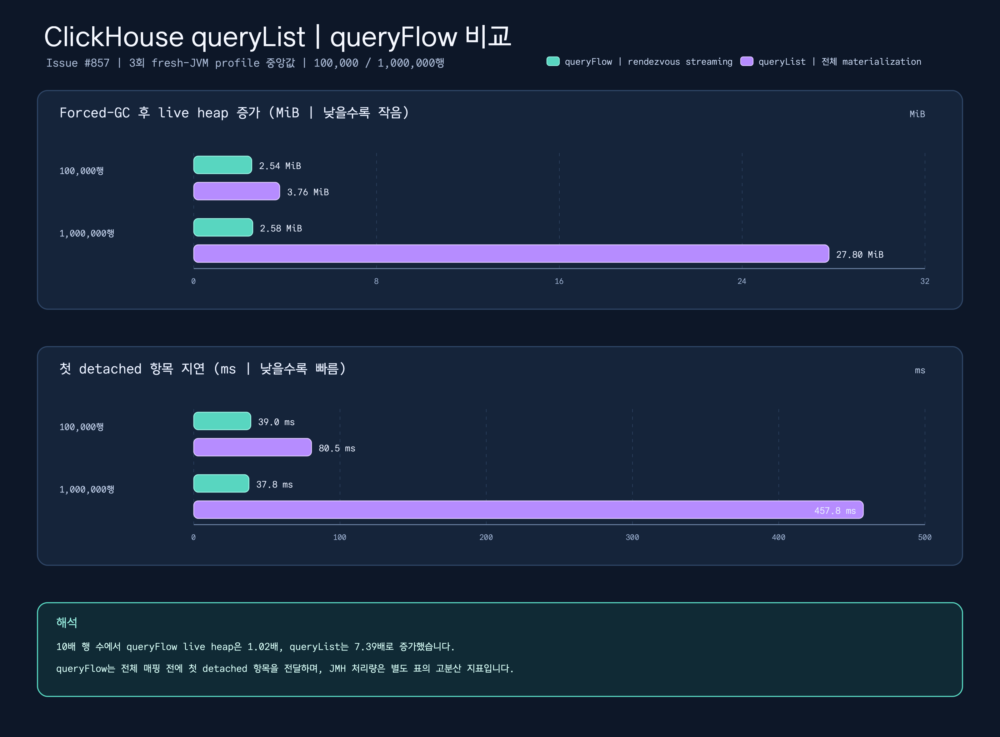

# Exposed Benchmark Suite

Exposed JDBC, R2DBC, custom ID table, cache 전략을 독립적으로 실행하는 kotlinx-benchmark 모듈입니다.

## 시나리오

| 영역 | Benchmark task | 측정 대상 |
|---|---|---|
| JDBC vs R2DBC | `./gradlew :benchmark-exposed-benchmark:jdbcR2dbcBenchmark` | JDBC platform thread select, JDBC virtual thread dispatch, R2DBC suspend transaction select 처리량 |
| JDBC key enumeration | `./gradlew :benchmark-exposed-benchmark:jdbcKeyEnumerationBenchmark` | 1,000/10,000 H2 행에서 기존 lazy keyset paging과 opt-in Virtual Thread range enumeration 비교 |
| Custom ID tables | `./gradlew :benchmark-exposed-benchmark:idTablesBenchmark` | `UUIDTable`, `TimebasedUUIDTable`, `UlidTable`, Base62 UUIDv7, Snowflake, KSUID, KSUID millis 대량 insert/select 처리량 |
| Local and near cache | `./gradlew :benchmark-exposed-benchmark:cacheBenchmark` | Caffeine hit, near-cache hit, read-through miss 처리량 |
| Redis cache clients | `./gradlew :benchmark-exposed-benchmark:redisCacheBenchmark -Pbenchmark.parameters.redisUri=redis://127.0.0.1:6379` | Lettuce와 Redisson remote cache get 처리량 |
| ClickHouse query collection | `./gradlew :benchmark-exposed-benchmark:clickHouseBenchmark` | 100,000/1,000,000행에서 materialized `queryList`와 매핑된 `queryFlow`의 JMH 처리량 |
| ClickHouse memory profile | `./gradlew :benchmark-exposed-benchmark:profileClickHouseStreaming -PprofileApi=flow -PprofileRows=100000 -PprofileRun=1` | fresh JVM의 첫 항목 지연, 전체 시간, live heap, RSS, buffer pool, JFR 근거 |
| Smoke | `./gradlew :benchmark-exposed-benchmark:smokeBenchmark` | Redis를 제외한 짧은 H2 기반 검증 실행 |

### Issue #857: ClickHouse 전체 수집과 스트리밍 비교

JMH 비교는 두 API에서 같은 `system.numbers` 쿼리와 detached `Long` 매핑을
사용합니다. profile task는 API/행 수/run 조합마다 fresh JVM을 하나씩 실행합니다.
Docker 환경에서 12개 조합을 순차 실행하고 JSON, CSV, JFR 원본을
`build/reports/clickhouse-profile/`에 보관합니다.

```bash
./gradlew :benchmark-exposed-benchmark:clickHouseBenchmark \
  --no-build-cache --no-configuration-cache --no-parallel --max-workers=1 --console=plain
./gradlew :benchmark-exposed-benchmark:profileClickHouseStreaming \
  -PprofileApi=flow -PprofileRows=100000 -PprofileRun=1 \
  --no-build-cache --no-configuration-cache --no-parallel --max-workers=1 --console=plain
```

확인한 JMH 실행은 메서드마다 warmup 1회와 1초 iteration 3회를 사용했습니다.
수치는 ops/s이며 JMH error 추정치를 함께 표시합니다.

| API | 행 수 | 점수 |
|---|---:|---:|
| `queryList` (`collected`) | 100,000 | 76.556 ± 42.276 |
| `queryList` (`collected`) | 1,000,000 | 5.582 ± 8.882 |
| `queryFlow` (`streamed`) | 100,000 | 2.072 ± 3.211 |
| `queryFlow` (`streamed`) | 1,000,000 | 0.147 ± 1.118 |



이 source-backed chart는 live heap과 첫 항목 지연을 별도 panel로 나누어
단위와 낮을수록 좋은 방향을 명확히 보여줍니다. 원시 summary, JMH 표와 분석은
[`Issue #857 evidence`](../../docs/benchmarks/exposed-benchmark-2026-09-09-issue-857/README.ko.md)에서 확인할 수 있습니다.

스트리밍 경로는 rendezvous backpressure와 행 단위 매핑을 의도적으로 적용하므로,
이 결과는 처리량과 메모리 사이의 trade-off를 보여줄 뿐 스트리밍이 더 빠르다는
주장이 아닙니다. 계측하지 않은 JMH 수치를 forced-GC profile과 합쳐 latency SLO로
해석하지 않습니다.

최종 3회 profile 중앙값은 다음과 같습니다.

| API | 행 수 | live heap 증가 | 1m/100k 비율 | 첫 항목 | 전체 시간 |
|---|---:|---:|---:|---:|---:|
| `queryFlow` | 100,000 | 2,660,696 B | — | 39.0 ms | 1.239 s |
| `queryFlow` | 1,000,000 | 2,705,872 B | **1.02x** | 37.8 ms | 7.693 s |
| `queryList` | 100,000 | 3,944,736 B | — | 80.5 ms | 110 ms |
| `queryList` | 1,000,000 | 29,148,136 B | **7.39x** | 457.8 ms | 517 ms |

profile은 1,000행 bounded warmup 2회, bounded GC settle 5회, forced-GC checkpoint를
사용합니다. 따라서 이전의 행 수 의존 warmup 기준선 오염을 제거했습니다. 드라이버
버퍼, downstream `buffer()` 연산자, test container는 한 개 pending item이라는 API
계약에 포함되지 않습니다. 애플리케이션 retained memory 상한이 중요하면
`queryFlow`를 선택하고, detached 전체 materialization이나 행 단위 오버헤드가 더
중요하면 `queryList` 또는 paging을 선택합니다.

## 결과

2026-08-19 Oracle GraalVM `25.0.4` (Java 25), H2에서 같은 profile을 세 번 순차 실행했습니다. 아래 값은 세 실행의 중앙값이며, 단일 실행의 최고값이 아닙니다.

| workload | configuration | 중앙값 | 해석 |
|---|---|---:|---|
| Cache | near-cache hit, cache size 10,000 | 206,595,487 ops/s | 같은 profile에서 local Caffeine hit보다 약 3.79배, read-through miss보다 약 4.38배 높음 |
| Cache | local Caffeine hit, cache size 10,000 | 54,531,040 ops/s | 같은 cache profile 내부 비교 |
| Cache | near-cache read-through miss, cache size 10,000 | 47,137,612 ops/s | 같은 cache profile 내부 비교 |
| JDBC/R2DBC | platform-thread select by ID, 10,000 rows | 34,688 ops/s | H2 단건 조회 기준선 |
| JDBC/R2DBC | virtual-thread select by ID, 10,000 rows | 24,376 ops/s | 이 profile에서 platform-thread 기준의 약 70.3% |
| JDBC/R2DBC | R2DBC suspend transaction select by ID, 10,000 rows | 19,197 ops/s | 이 profile에서 platform-thread 기준의 약 55.3% |
| Custom IDs | 선택된 반복에서 가장 빠른 `selectByName`, 10,000 rows | 216,715 ops/s | UUID table |
| Custom IDs | 선택된 반복에서 가장 느린 `selectByName`, 10,000 rows | 196,483 ops/s | Time-based UUID table |


### Issue #690: lazy paging과 parallel range enumeration

전용 benchmark는 같은 JDK 25/H2 fixture, pool size 10, 네 개의 disjoint PK range에서
세 번 순차 실행했습니다. 저장소에 고정한 값은 세 실행의 중앙값입니다.

| 행 수 | 기존 `sequentialKeysetPaging` | opt-in `parallelKeyEnumeration` | 병렬/순차 |
|---:|---:|---:|---:|
| 1,000 | 12,607 ops/s | 14,191 ops/s | 1.13x |
| 10,000 | 1,250 ops/s | 2,960 ops/s | 2.37x |


### 분석 및 한계

- 세 패널은 각 비교 그룹 안에서 선형 bar 폭을 사용합니다. 단위와 workload가 다르므로 세 패널을 하나의 전역 순위로 읽으면 안 됩니다.
- 기존 단건 H2 결과만으로 #690의 opt-in parallel key enumeration 기본값을 정하지 않습니다. 위 전용 비교도 방향성 evidence이며 contention 또는 producer/consumer benchmark가 아닙니다.
- 선택된 최고/최저 custom-ID 중앙값 차이는 약 10.3%이며, 특정 ID 전략의 보편적 우위를 뜻하지 않습니다.
- Redis는 endpoint를 제공하지 않아 `N/A`입니다. 비-H2 driver, connection pool, cache hit ratio, mutation contention은 별도 환경 검증이 필요합니다.

## 근거와 재현

- 원시 JSON과 정확한 세 실행 선택은 [`docs/benchmarks/exposed-benchmark-2026-08-19`](../../docs/benchmarks/exposed-benchmark-2026-08-19/README.md) 및 [`Issue #690 evidence`](../../docs/benchmarks/exposed-benchmark-2026-08-19-issue-690/README.md)에 기록했습니다.
- 세 benchmark task를 `--rerun-tasks --no-build-cache --no-configuration-cache --no-parallel --max-workers=1`로 순차 실행한 뒤 `scripts/benchmark/render_exposed_benchmark_chart.py`로 SVG를 만들고 CairoSVG로 PNG pair를 생성합니다.
- `generateBenchmarkDocs` task는 한 번의 로컬 report를 만드는 보조 도구입니다. 저장소에 고정한 세 실행 중앙값의 source가 아니므로, 이 비교를 갱신할 때는 위 evidence 디렉터리와 renderer를 사용합니다.
