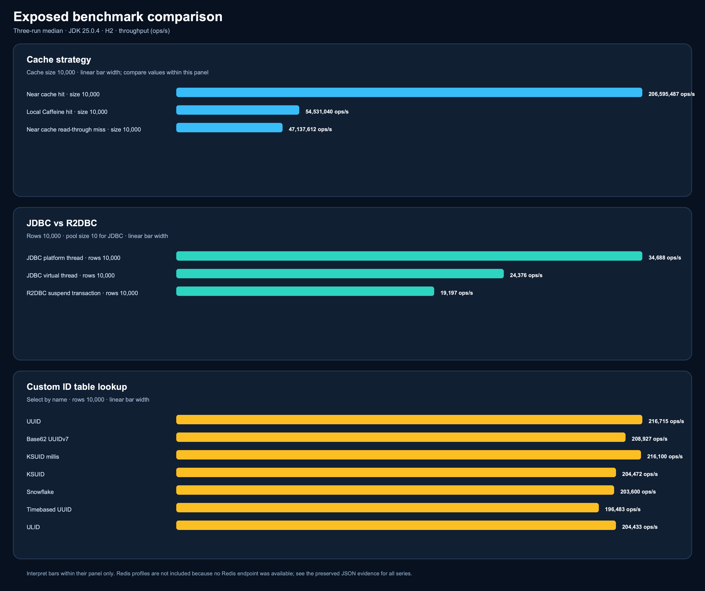
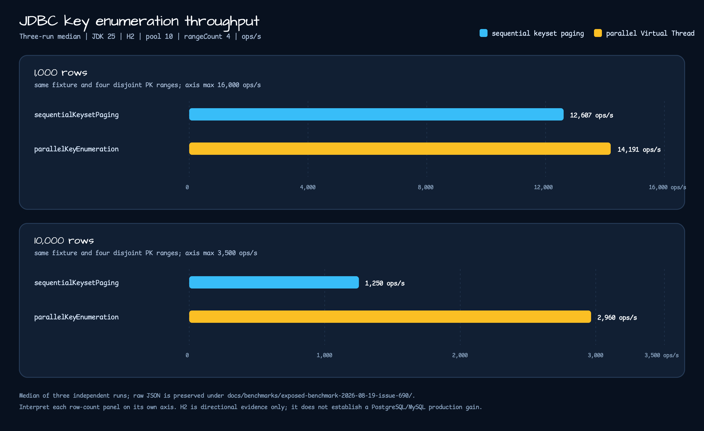

# Exposed Benchmark Suite

Dedicated kotlinx-benchmark module for Exposed JDBC, R2DBC, custom ID tables, and cache strategies.

## Scenarios

| Area | Benchmark task | What it measures |
|---|---|---|
| JDBC vs R2DBC | `./gradlew :benchmark-exposed-benchmark:jdbcR2dbcBenchmark` | JDBC platform-thread select, JDBC virtual-thread dispatch, and R2DBC suspend transaction select throughput |
| JDBC key enumeration | `./gradlew :benchmark-exposed-benchmark:jdbcKeyEnumerationBenchmark` | Existing lazy keyset paging versus opt-in Virtual Thread range enumeration for 1,000 and 10,000 H2 rows |
| Custom ID tables | `./gradlew :benchmark-exposed-benchmark:idTablesBenchmark` | Bulk insert and select throughput for `UUIDTable`, `TimebasedUUIDTable`, `UlidTable`, Base62 UUIDv7, Snowflake, KSUID, and KSUID millis tables |
| Local and near cache | `./gradlew :benchmark-exposed-benchmark:cacheBenchmark` | Caffeine hit, near-cache hit, and read-through miss behavior |
| Redis cache clients | `./gradlew :benchmark-exposed-benchmark:redisCacheBenchmark -Pbenchmark.parameters.redisUri=redis://127.0.0.1:6379` | Lettuce and Redisson remote cache get throughput |
| Smoke | `./gradlew :benchmark-exposed-benchmark:smokeBenchmark` | Short H2-only benchmark run that excludes Redis |

## Results

The checked-in comparison was produced on 2026-08-19 with Oracle GraalVM `25.0.4` (Java 25), H2, and three sequential repetitions. Each value below is the median of those repetitions; it is not the best single run.

| Workload | Configuration | Median | Interpretation |
|---|---|---:|---|
| Cache | near-cache hit, cache size 10,000 | 206,595,487 ops/s | Within this profile, about 3.79x local Caffeine hit and 4.38x read-through miss |
| Cache | local Caffeine hit, cache size 10,000 | 54,531,040 ops/s | Same cache profile comparison |
| Cache | near-cache read-through miss, cache size 10,000 | 47,137,612 ops/s | Same cache profile comparison |
| JDBC/R2DBC | platform-thread select by ID, 10,000 rows | 34,688 ops/s | H2 single-row select baseline |
| JDBC/R2DBC | virtual-thread select by ID, 10,000 rows | 24,376 ops/s | About 70.3% of the platform-thread baseline in this profile |
| JDBC/R2DBC | R2DBC suspend transaction select by ID, 10,000 rows | 19,197 ops/s | About 55.3% of the platform-thread baseline in this profile |
| Custom IDs | fastest `selectByName`, 10,000 rows | 216,715 ops/s | UUID table in the selected repetitions |
| Custom IDs | slowest `selectByName`, 10,000 rows | 196,483 ops/s | Time-based UUID table in the selected repetitions |

### Issue #690: lazy paging versus parallel range enumeration

The dedicated benchmark uses the same JDK 25/H2 fixture, pool size 10, four disjoint
PK ranges, and three sequential repetitions. The checked-in value is the median of the
three runs:

| Rows | Existing `sequentialKeysetPaging` | Opt-in `parallelKeyEnumeration` | Parallel/sequential |
|---:|---:|---:|---:|
| 1,000 | 12,607 ops/s | 14,191 ops/s | 1.13x |
| 10,000 | 1,250 ops/s | 2,960 ops/s | 2.37x |

### Interpretation and limits

- All three panels use linear bar widths within their own comparison group. The panels must not be read as one global ranking because their units and workloads differ.
- The existing single-row H2 result does not choose the default for #690's opt-in parallel key enumeration. The dedicated comparison above is still directional: it is not a contention or producer/consumer benchmark.
- The custom-ID spread between the selected maximum and minimum is about 10.3%; it does not establish a universal ID-strategy winner.
- Redis is `N/A` because no endpoint was supplied. Non-H2 drivers, connection-pool effects, cache hit ratios, and mutation contention require separate environment validation.

## Evidence and reproduction

- Raw JSON and the exact three-run selections are recorded in [`docs/benchmarks/exposed-benchmark-2026-08-19`](../../docs/benchmarks/exposed-benchmark-2026-08-19/README.md) and [`Issue #690 evidence`](../../docs/benchmarks/exposed-benchmark-2026-08-19-issue-690/README.md).
- Re-run the three benchmark tasks sequentially with `--rerun-tasks --no-build-cache --no-configuration-cache --no-parallel --max-workers=1`; then use `scripts/benchmark/render_exposed_benchmark_chart.py` to render the SVG and CairoSVG to create the paired PNG.
- The `generateBenchmarkDocs` task remains a one-run local report helper. It is not the source of the checked-in three-run median evidence; use the evidence directory and renderer above when refreshing this comparison.
