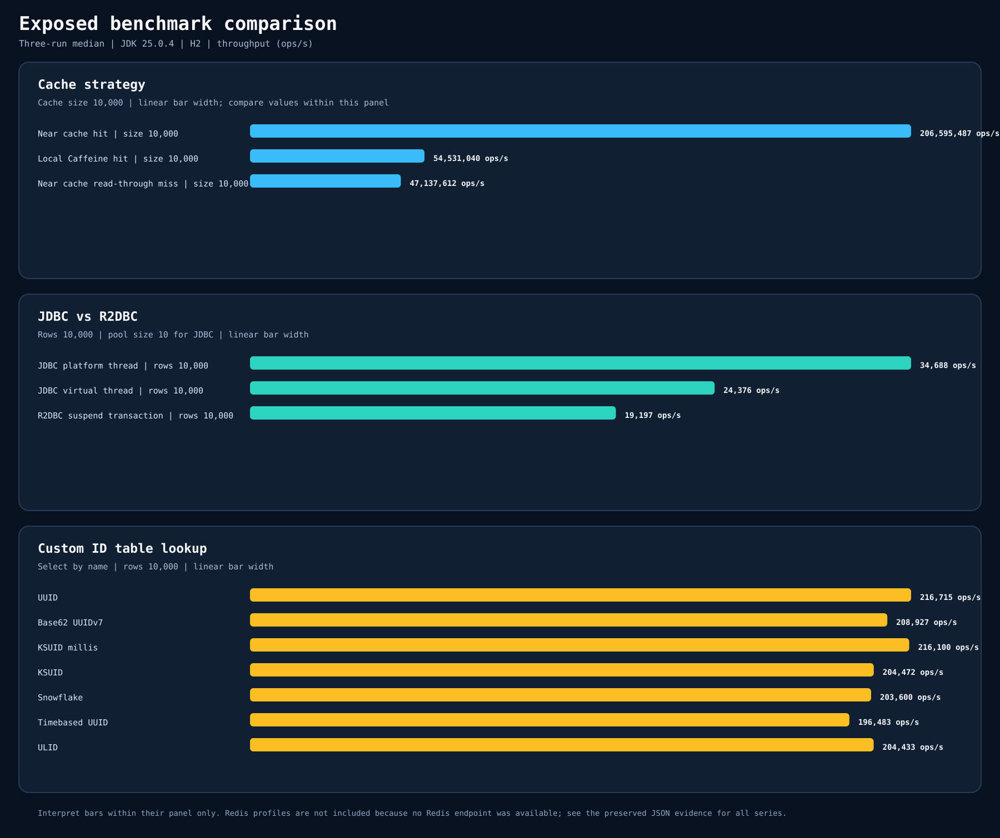

# Exposed Benchmark Suite

Dedicated kotlinx-benchmark module for Exposed JDBC, R2DBC, custom ID tables, and cache strategies.

## Scenarios

| Area | Benchmark task | What it measures |
|---|---|---|
| JDBC vs R2DBC | `./gradlew :benchmark-exposed-benchmark:jdbcR2dbcBenchmark` | JDBC platform-thread select, JDBC virtual-thread dispatch, and R2DBC suspend transaction select throughput |
| Custom ID tables | `./gradlew :benchmark-exposed-benchmark:idTablesBenchmark` | Bulk insert and select throughput for `UUIDTable`, `TimebasedUUIDTable`, `UlidTable`, Base62 UUIDv7, Snowflake, KSUID, and KSUID millis tables |
| Local and near cache | `./gradlew :benchmark-exposed-benchmark:cacheBenchmark` | Caffeine hit, near-cache hit, and read-through miss behavior |
| Redis cache clients | `./gradlew :benchmark-exposed-benchmark:redisCacheBenchmark -Pbenchmark.parameters.redisUri=redis://127.0.0.1:6379` | Lettuce and Redisson remote cache get throughput |
| Smoke | `./gradlew :benchmark-exposed-benchmark:smokeBenchmark` | Short H2-only benchmark run that excludes Redis |

## Results

Generated on 2026-06-23 from `build/reports/benchmarks`.

| Benchmark | Mode | Score | Error | Unit |
|---|---:|---:|---:|---|
| `io.bluetape4k.exposed.benchmark.cache.CacheStrategyBenchmark.nearCacheHit` | thrpt | 160467607.91 | - | ops/s |
| `io.bluetape4k.exposed.benchmark.cache.CacheStrategyBenchmark.localCaffeineHit` | thrpt | 44643332.35 | - | ops/s |
| `io.bluetape4k.exposed.benchmark.cache.CacheStrategyBenchmark.nearCacheReadThroughMiss` | thrpt | 22240956.17 | - | ops/s |
| `io.bluetape4k.exposed.benchmark.id.CustomIdTableBenchmark.snowflakeTableSelectByName` | thrpt | 51790.86 | - | ops/s |
| `io.bluetape4k.exposed.benchmark.id.CustomIdTableBenchmark.uuidTableSelectByName` | thrpt | 51668.71 | - | ops/s |
| `io.bluetape4k.exposed.benchmark.id.CustomIdTableBenchmark.base62TableSelectByName` | thrpt | 50944.82 | - | ops/s |
| `io.bluetape4k.exposed.benchmark.id.CustomIdTableBenchmark.ulidTableSelectByName` | thrpt | 49409.24 | - | ops/s |
| `io.bluetape4k.exposed.benchmark.id.CustomIdTableBenchmark.ksuidMillisTableSelectByName` | thrpt | 48990.12 | - | ops/s |
| `io.bluetape4k.exposed.benchmark.id.CustomIdTableBenchmark.timebasedUuidTableSelectByName` | thrpt | 48084.84 | - | ops/s |
| `io.bluetape4k.exposed.benchmark.id.CustomIdTableBenchmark.ksuidTableSelectByName` | thrpt | 45473.50 | - | ops/s |
| `io.bluetape4k.exposed.benchmark.jdbc.JdbcThreadingBenchmark.platformThreadSelectById` | thrpt | 30178.75 | - | ops/s |
| `io.bluetape4k.exposed.benchmark.jdbc.JdbcThreadingBenchmark.virtualThreadSelectById` | thrpt | 18892.00 | - | ops/s |
| `io.bluetape4k.exposed.benchmark.r2dbc.R2dbcCoroutineBenchmark.suspendTransactionSelectById` | thrpt | 2473.53 | - | ops/s |
| `io.bluetape4k.exposed.benchmark.id.CustomIdTableBenchmark.snowflakeTableBatchInsert` | thrpt | 1205.55 | - | ops/s |
| `io.bluetape4k.exposed.benchmark.id.CustomIdTableBenchmark.timebasedUuidTableBatchInsert` | thrpt | 983.04 | - | ops/s |
| `io.bluetape4k.exposed.benchmark.id.CustomIdTableBenchmark.ulidTableBatchInsert` | thrpt | 829.82 | - | ops/s |
| `io.bluetape4k.exposed.benchmark.id.CustomIdTableBenchmark.ksuidMillisTableBatchInsert` | thrpt | 821.43 | - | ops/s |
| `io.bluetape4k.exposed.benchmark.id.CustomIdTableBenchmark.uuidTableBatchInsert` | thrpt | 815.68 | - | ops/s |
| `io.bluetape4k.exposed.benchmark.id.CustomIdTableBenchmark.base62TableBatchInsert` | thrpt | 770.43 | - | ops/s |
| `io.bluetape4k.exposed.benchmark.id.CustomIdTableBenchmark.ksuidTableBatchInsert` | thrpt | 660.85 | - | ops/s |

## Notes

- Redis benchmarks are intentionally separated from smoke because they require a reachable Redis server.
- H2 keeps default verification cheap; database-specific benchmark profiles can be added without changing the module boundary.
- Re-run `./gradlew :benchmark-exposed-benchmark:generateBenchmarkDocs` after benchmark runs to refresh tables and charts.
