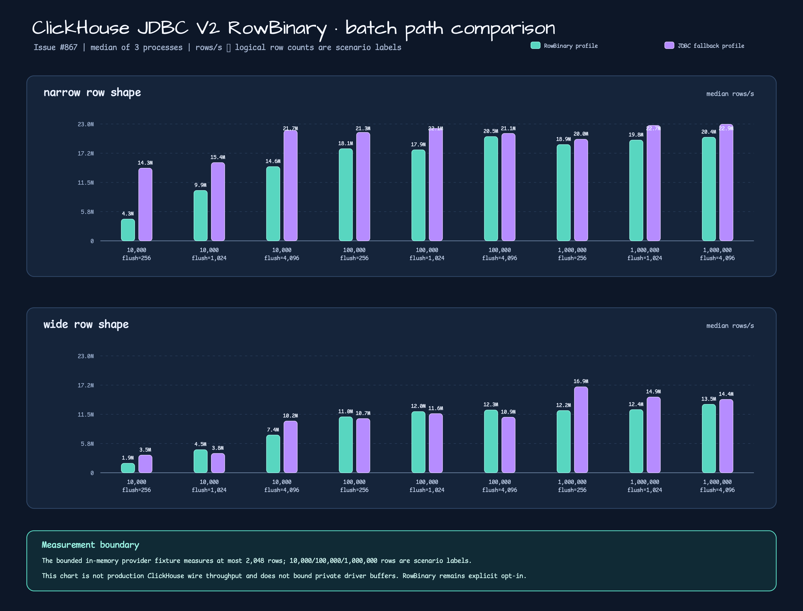

# Issue #867 ClickHouse JDBC V2 RowBinary benchmark

This directory is the machine-readable evidence for the JDBC V2 RowBinary
batch writer. The raw JSON files are generated by
`ClickHouseRowBinaryBenchmarkTest`; the chart is a deterministic SVG
rendered from those files.

## Scope and conditions

- Driver artifact: `com.clickhouse:clickhouse-jdbc:0.9.9`.
- Three fresh Gradle test processes (`run=1..3`) are recorded for each path.
- Matrix: 3 logical row counts (10,000 / 100,000 / 1,000,000) × 3 flush sizes
  (256 / 1,024 / 4,096) × 2 row shapes (narrow / wide) × 2 paths.
- Every JSON file contains 18 scenarios, two warmup iterations, five measured
  iterations, raw elapsed samples, heap observations, and environment
  provenance.
- The in-memory provider fixture measures at most 2,048 rows. Logical row
  counts are scenario labels; this is not production ClickHouse wire
  throughput and does not establish a private driver buffer or heap bound.
- `firstByteNs` is a fixture timing marker (the scenario median elapsed
  time), not a packet-level measurement of the driver's first byte.

## Three-process median

The table reports median `medianRowsPerSecond` across the three process
JSON files. Higher rows/s is better within this fixture; the ratio is
RowBinary divided by JDBC fallback.

| Row shape | Logical rows | Flush | RowBinary rows/s | JDBC fallback rows/s | Ratio |
| --- | ---: | ---: | ---: | ---: | ---: |
| narrow | 10,000 | 256 | 4.28M | 14.30M | 0.30x |
| narrow | 10,000 | 1,024 | 9.91M | 15.40M | 0.64x |
| narrow | 10,000 | 4,096 | 14.60M | 21.74M | 0.67x |
| narrow | 100,000 | 256 | 18.12M | 21.34M | 0.85x |
| narrow | 100,000 | 1,024 | 17.91M | 22.12M | 0.81x |
| narrow | 100,000 | 4,096 | 20.51M | 21.14M | 0.97x |
| narrow | 1,000,000 | 256 | 18.94M | 19.99M | 0.95x |
| narrow | 1,000,000 | 1,024 | 19.83M | 22.71M | 0.87x |
| narrow | 1,000,000 | 4,096 | 20.39M | 22.94M | 0.89x |
| wide | 10,000 | 256 | 1.85M | 3.46M | 0.54x |
| wide | 10,000 | 1,024 | 4.53M | 3.80M | 1.19x |
| wide | 10,000 | 4,096 | 7.42M | 10.18M | 0.73x |
| wide | 100,000 | 256 | 11.00M | 10.66M | 1.03x |
| wide | 100,000 | 1,024 | 12.04M | 11.63M | 1.04x |
| wide | 100,000 | 4,096 | 12.34M | 10.93M | 1.13x |
| wide | 1,000,000 | 256 | 12.24M | 16.91M | 0.72x |
| wide | 1,000,000 | 1,024 | 12.42M | 14.90M | 0.83x |
| wide | 1,000,000 | 4,096 | 13.46M | 14.43M | 0.93x |



## Analysis

- The result is an interaction between path, row shape, and flush size, not a
  universal optimization claim.
- JDBC fallback is faster in every narrow cell; the 100,000-row, 4,096-row
  flush is closest to parity at 0.97x.
- Wide rows split by flush size: RowBinary leads at 10,000/1,024 (1.19x) and
  all three 100,000-row cells (1.03x–1.13x), while the other wide ratios are
  below 1.0x.
- These figures are local bounded-fixture evidence only. Select the profile
  explicitly and remeasure with the target driver/server before making an SLO
  or capacity decision.

## Reproduction

Run from the repository root:

```bash
for run in 1 2 3; do
  ./gradlew :bluetape4k-exposed-clickhouse:test \
    --tests '*ClickHouseRowBinaryBenchmarkTest' \
    -PclickhouseV2Benchmark=true -PclickhouseV2BenchmarkRun="$run" \
    --no-parallel --max-workers=1 --no-daemon --console=plain
done
python3 docs/benchmarks/clickhouse-v2-rowbinary/render_rowbinary_chart.py \
  --input-dir docs/benchmarks/clickhouse-v2-rowbinary --locale en \
  --output docs/images/readme-charts/exposed-clickhouse-rowbinary-issue-867.svg \
  --semantic-ledger docs/images/readme-charts/exposed-clickhouse-rowbinary-issue-867.semantic.json
/Users/debop/.local/bin/cairosvg \
  docs/images/readme-charts/exposed-clickhouse-rowbinary-issue-867.svg \
  -o docs/images/readme-charts/exposed-clickhouse-rowbinary-issue-867.png -s 2
```

The real ClickHouse profile assertion is separate from this benchmark:

```bash
./gradlew :bluetape4k-exposed-clickhouse:test \
  --tests '*ClickHouseRowBinaryIntegrationTest' \
  -PclickhouseV2Integration=true \
  --no-parallel --max-workers=1 --no-daemon --console=plain
```

`SHA256SUMS` covers all six raw JSON files, the semantic ledger, and the
EN/KO SVG/PNG pair. Regenerate it only after the source and renderer have
passed their validation gates.

## Limits

The benchmark uses a fake connection provider and
`container=not-run`; it does not exercise ClickHouse network I/O,
server-side backpressure, remote cancellation, or the driver's private
RowBinary buffer. General stream-writer support, `async_insert`, and
remote `KILL QUERY` completion remain outside Issue #867; remote
cancellation is tracked by #863.
