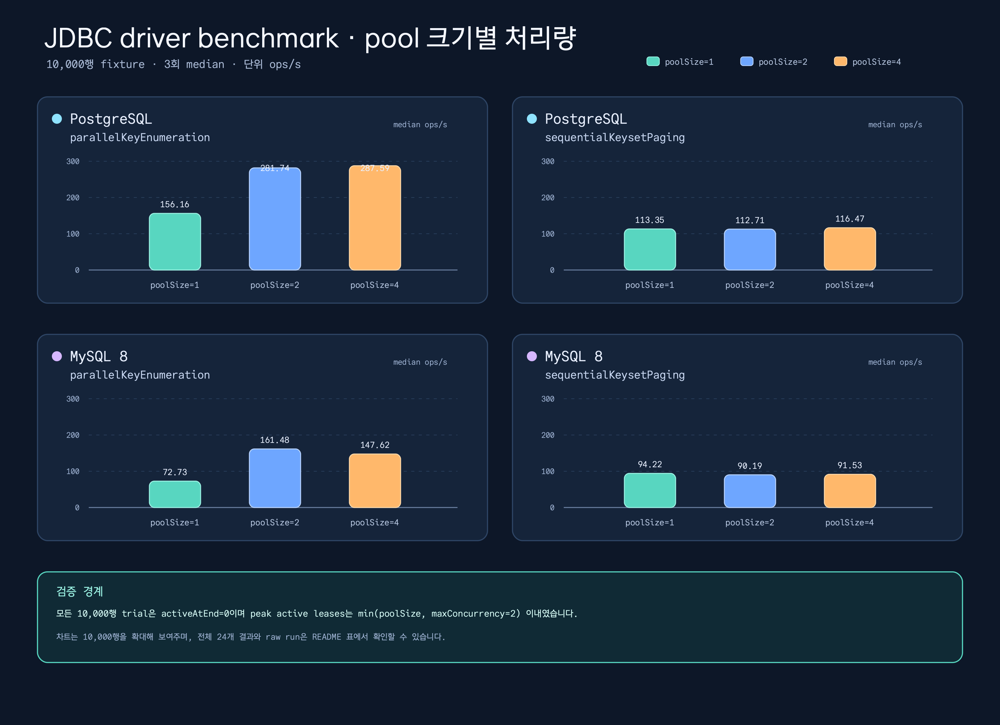

# Issue #694 JDBC driver benchmark 증거

이 디렉터리는 Issue #694에서 요청한 PostgreSQL 및 MySQL 8 JDBC driver
비교를 benchmark 전용으로 기록합니다. 동일하게 seed된 fixture에서 기존
sequential keyset paging 경로와 opt-in parallel key enumeration 경로를
비교했으며, 증거 기준 구현 커밋은
`f325a70fbd2047cdef28be928eeea4675b4b05b6`입니다.



차트는 pool 크기에 따른 형태가 잘 보이도록 10,000행 구간을 확대합니다.
아래 표는 두 driver × 두 method × 두 row count × 세 pool size로 구성된
전체 24개 결과입니다.

## 결과 표

`ops/s`는 JMH primary throughput입니다. `rows/s`는 `ops/s × rowCount`로
계산했습니다. 나머지 열은 선택한 JMH auxiliary counter이며, 전체 raw
파일은 capture한 모든 counter를 보존하고 `summary.json`은 표에 표시한
선택된 median과 파생값만 저장합니다. `/op` 열은 각 run 안에서
`sum(counter.rawData) / sum(primaryMetric.rawData)`로 계산한 뒤 run 1–3의
median을 취합니다. `ops/s`와 counter 비율은 소수 둘째 자리, `rows/s`는
가장 가까운 행 단위로 반올림했습니다.

| Driver | Method | Rows | poolSize | Median ops/s | Median rows/s | Statement executions/op | Connection requests/op | Peak active leases | Active-at-end |
| --- | --- | ---: | ---: | ---: | ---: | ---: | ---: | ---: | ---: |
| `POSTGRESQL` | `parallelKeyEnumeration` | 1,000 | 1 | 316.55 | 316553 | 4.03 | 4.03 | 1.00 | 0.00 |
| `POSTGRESQL` | `parallelKeyEnumeration` | 1,000 | 2 | 575.99 | 575992 | 4.02 | 4.02 | 2.00 | 0.00 |
| `POSTGRESQL` | `parallelKeyEnumeration` | 1,000 | 4 | 575.58 | 575575 | 4.01 | 4.01 | 2.00 | 0.00 |
| `POSTGRESQL` | `parallelKeyEnumeration` | 10,000 | 1 | 156.16 | 1561565 | 4.03 | 4.03 | 1.00 | 0.00 |
| `POSTGRESQL` | `parallelKeyEnumeration` | 10,000 | 2 | 281.74 | 2817364 | 4.03 | 4.03 | 2.00 | 0.00 |
| `POSTGRESQL` | `parallelKeyEnumeration` | 10,000 | 4 | 287.59 | 2875877 | 4.02 | 4.02 | 2.00 | 0.00 |
| `POSTGRESQL` | `sequentialKeysetPaging` | 1,000 | 1 | 935.42 | 935423 | 2.01 | 1.01 | 1.00 | 0.00 |
| `POSTGRESQL` | `sequentialKeysetPaging` | 1,000 | 2 | 940.97 | 940974 | 2.01 | 1.01 | 1.00 | 0.00 |
| `POSTGRESQL` | `sequentialKeysetPaging` | 1,000 | 4 | 982.09 | 982093 | 2.02 | 1.01 | 1.00 | 0.00 |
| `POSTGRESQL` | `sequentialKeysetPaging` | 10,000 | 1 | 113.35 | 1133525 | 11.09 | 1.01 | 1.00 | 0.00 |
| `POSTGRESQL` | `sequentialKeysetPaging` | 10,000 | 2 | 112.71 | 1127061 | 11.12 | 1.01 | 1.00 | 0.00 |
| `POSTGRESQL` | `sequentialKeysetPaging` | 10,000 | 4 | 116.47 | 1164748 | 11.10 | 1.01 | 1.00 | 0.00 |
| `MYSQL_V8` | `parallelKeyEnumeration` | 1,000 | 1 | 115.73 | 115727 | 4.03 | 4.03 | 1.00 | 0.00 |
| `MYSQL_V8` | `parallelKeyEnumeration` | 1,000 | 2 | 222.68 | 222684 | 4.03 | 4.03 | 2.00 | 0.00 |
| `MYSQL_V8` | `parallelKeyEnumeration` | 1,000 | 4 | 227.78 | 227777 | 4.03 | 4.03 | 2.00 | 0.00 |
| `MYSQL_V8` | `parallelKeyEnumeration` | 10,000 | 1 | 72.73 | 727272 | 4.05 | 4.05 | 1.00 | 0.00 |
| `MYSQL_V8` | `parallelKeyEnumeration` | 10,000 | 2 | 161.48 | 1614811 | 4.03 | 4.03 | 2.00 | 0.00 |
| `MYSQL_V8` | `parallelKeyEnumeration` | 10,000 | 4 | 147.62 | 1476197 | 4.04 | 4.04 | 2.00 | 0.00 |
| `MYSQL_V8` | `sequentialKeysetPaging` | 1,000 | 1 | 448.78 | 448778 | 2.02 | 1.01 | 1.00 | 0.00 |
| `MYSQL_V8` | `sequentialKeysetPaging` | 1,000 | 2 | 408.80 | 408796 | 2.01 | 1.01 | 1.00 | 0.00 |
| `MYSQL_V8` | `sequentialKeysetPaging` | 1,000 | 4 | 330.26 | 330262 | 2.01 | 1.01 | 1.00 | 0.00 |
| `MYSQL_V8` | `sequentialKeysetPaging` | 10,000 | 1 | 94.22 | 942160 | 11.13 | 1.01 | 1.00 | 0.00 |
| `MYSQL_V8` | `sequentialKeysetPaging` | 10,000 | 2 | 90.19 | 901854 | 11.10 | 1.01 | 1.00 | 0.00 |
| `MYSQL_V8` | `sequentialKeysetPaging` | 10,000 | 4 | 91.53 | 915267 | 11.10 | 1.01 | 1.00 | 0.00 |

## 측정 결과 해석

- 10,000행 PostgreSQL 구간에서 `parallelKeyEnumeration`은 이 로컬 실행에서
  `poolSize=1`의 156.16 ops/s에서 pool 4의 287.59 ops/s로 증가했습니다.
  MySQL 8도 pool 1의 72.73 ops/s에서 pool 4의 147.62 ops/s로 증가했지만,
  이는 로컬 관찰값이며 tuning 권고가 아닙니다.
- 표의 모든 `sequentialKeysetPaging` 결과가 single lease를 유지하는 것은
  명시적인 transaction 경계와 일치합니다. parallel method는 benchmark
  계약의 고정값 `maxConcurrency=2` 때문에 동시에 최대 두 lease를
  사용합니다.
- 모든 capture 행의 `activeAtEnd`는 `0`이고 관찰된 peak는 설정된 pool
  size보다 크지 않았습니다. 이는 lifecycle guard이며 latency 또는
  production capacity 보장이 아닙니다.

## Benchmark 계약

- JMH 1.37, `Mode.Throughput`, `@Threads(1)`, `@Fork(1)`.
- 각 생성 point마다 warmup 1회와 1초 measurement iteration 3회.
- Repository catalog ref
  `91f9ea9336b5ea991f5675323a1cf25ccfd6f5ed`로 고정한 driver: PostgreSQL
  `org.postgresql:postgresql:42.7.13`, MySQL 8
  `com.mysql:mysql-connector-j:9.7.0`.
- Seed row count: 1,000 및 10,000.
- Hikari `maximumPoolSize`: 1, 2, 4; parallel `maxConcurrency=2`.
- Setup, fixture seeding, preflight, teardown은 timed method에서 제외.
- PostgreSQL 및 MySQL container lifecycle은 기존 JDBC test
  infrastructure가 소유하며, benchmark는 자신의 datasource와 executor만
  닫습니다.

각 driver의 생성 task를 세 번 실행하고, 새 evidence directory에 immutable
report를 capture합니다. Testcontainers 사전 조건을 명시하여 container
경로가 skip된 상태를 driver 결과로 오인하지 않도록 합니다.

```bash
set -euo pipefail
cleanup_capture_temp() {
  [ -z "${before_reports:-}" ] || rm -f "$before_reports"
  [ -z "${after_reports:-}" ] || rm -f "$after_reports"
}
trap cleanup_capture_temp EXIT
colima status
test "$(docker context show)" = "default"
docker info >/dev/null
export TESTCONTAINERS_RYUK_DISABLED=true

evidence_dir="$(mktemp -d -t issue-694-driver-benchmark)"
metadata="$evidence_dir/raw-metadata.jsonl"
git_sha="$(git rev-parse HEAD)"
capture_driver() {
  local driver="$1" task="$2" report_root="$3" driver_version="$4"
  local image="$5" image_digest="$6" prefix="$7"
  for run in 1 2 3; do
    before_reports="$(mktemp -t issue-694-before)"
    after_reports="$(mktemp -t issue-694-after)"
    find "$report_root" -mindepth 1 -maxdepth 1 -type d -print 2>/dev/null | sort > "$before_reports"
    ./gradlew ":benchmark-exposed-benchmark:${task}" \
      --rerun-tasks --no-build-cache --no-configuration-cache \
      --no-parallel --max-workers=1 --console=plain
    find "$report_root" -mindepth 1 -maxdepth 1 -type d -print 2>/dev/null | sort > "$after_reports"
    new_reports="$(comm -13 "$before_reports" "$after_reports")"
    test "$(printf '%s\n' "$new_reports" | awk 'NF { count++ } END { print count + 0 }')" = 1
    report_dir="$new_reports"
    python3 docs/benchmarks/exposed-benchmark-2026-08-22-issue-694/capture_jmh_run.py \
      --report-dir "$report_dir" \
      --destination "$evidence_dir/${prefix}-run-${run}.json" \
      --metadata "$metadata" --driver "$driver" --run-id "$run" \
      --git-sha "$git_sha" --driver-version "$driver_version" \
      --image "$image" --image-digest "$image_digest"
    rm -f "$before_reports" "$after_reports"
  done
}

capture_driver POSTGRESQL benchmarkJdbcDriverPostgreSQLBenchmark \
  benchmark/exposed-benchmark/build/reports/benchmarks/jdbcDriverPostgreSQL \
  42.7.13 postgres:18.4-alpine \
  sha256:9a8afca54e7861fd90fab5fdf4c42477a6b1cb7d293595148e674e0a3181de15 \
  postgresql
capture_driver MYSQL_V8 benchmarkJdbcDriverMySQLBenchmark \
  benchmark/exposed-benchmark/build/reports/benchmarks/jdbcDriverMySQL \
  9.7.0 mysql:8.4.11 \
  sha256:b3b90af2a6552ae30c266fdb7d5dd55f3afb72404bb78d37fe8a23eb857fd3fb \
  mysql
python3 docs/benchmarks/exposed-benchmark-2026-08-22-issue-694/summarize_jmh.py \
  "$evidence_dir" --output "$evidence_dir/summary.json"
python3 docs/benchmarks/exposed-benchmark-2026-08-22-issue-694/validate_readme_parity.py \
  docs/benchmarks/exposed-benchmark-2026-08-22-issue-694/README.md \
  docs/benchmarks/exposed-benchmark-2026-08-22-issue-694/README.ko.md \
  --output "$evidence_dir/readme-parity.json"
python3 docs/benchmarks/exposed-benchmark-2026-08-22-issue-694/render_jmh_chart.py \
  --summary "$evidence_dir/summary.json" --locale en --output "$evidence_dir/chart.svg"
python3 docs/benchmarks/exposed-benchmark-2026-08-22-issue-694/render_jmh_chart.py \
  --summary "$evidence_dir/summary.json" --locale ko --output "$evidence_dir/chart.ko.svg"
canonical_dir="docs/benchmarks/exposed-benchmark-2026-08-22-issue-694"
for file in postgresql-run-1.json postgresql-run-2.json postgresql-run-3.json \
  mysql-run-1.json mysql-run-2.json mysql-run-3.json raw-metadata.jsonl summary.json; do
  test ! -e "$canonical_dir/$file"
  cp "$evidence_dir/$file" "$canonical_dir/$file"
done
echo "Evidence written to $evidence_dir"
```

승격 loop는 fail-closed로 동작합니다. 모든 destination이 없을 때만
checked-in evidence directory로 복사하므로 기존 raw capture를 조용히
대체하지 않습니다.

## 재현성 및 raw 증거

6개 immutable capture는 2026-08-22 JDK `25.0.4`로 생성했습니다. Container
image reference는 다음 digest로 고정했습니다.

| Driver | Image | Digest |
| --- | --- | --- |
| PostgreSQL | `postgres:18.4-alpine` | `sha256:9a8afca54e7861fd90fab5fdf4c42477a6b1cb7d293595148e674e0a3181de15` |
| MySQL 8 | `mysql:8.4.11` | `sha256:b3b90af2a6552ae30c266fdb7d5dd55f3afb72404bb78d37fe8a23eb857fd3fb` |

JDBC driver 버전은 PostgreSQL `42.7.13`, MySQL Connector/J `9.7.0`이며,
둘 다 catalog ref
`91f9ea9336b5ea991f5675323a1cf25ccfd6f5ed`에서 해석했습니다.

Capture metadata에는 관찰한 resolved driver artifact, catalog ref,
Testcontainers `2.0.5`, Gradle `9.7.0`, Docker server `29.2.1`, Docker context,
Colima `0.10.3`, host OS/architecture와 Git dirty flag도 기록합니다. Raw evidence는 구현 SHA
`f325a70fbd2047cdef28be928eeea4675b4b05b6`에 연결하며, benchmark capture 당시
worktree에 문서/evidence 파일이 있었으므로 dirty flag를 숨기지 않습니다.

- PostgreSQL raw run: [1회](./postgresql-run-1.json), [2회](./postgresql-run-2.json), [3회](./postgresql-run-3.json).
- MySQL 8 raw run: [1회](./mysql-run-1.json), [2회](./mysql-run-2.json), [3회](./mysql-run-3.json).
- Capture metadata 및 SHA-256 receipt: [raw-metadata.jsonl](./raw-metadata.jsonl).
- 표와 차트가 사용한 parser output: [summary.json](./summary.json).
- Capture validator: [capture_jmh_run.py](./capture_jmh_run.py).
- Summary validator: [summarize_jmh.py](./summarize_jmh.py).
- Chart generator: [render_jmh_chart.py](./render_jmh_chart.py).
- EN/KO parity validator 및 receipt: [validate_readme_parity.py](./validate_readme_parity.py), [readme-parity.json](./readme-parity.json).

Capture helper는 regular top-level report 하나, 정확히 12개 entry, 선택한
driver, immutable destination, 관찰한 Git/Docker/Gradle/Testcontainers/catalog
provenance와 안전하고 구체적인 metadata 값을 확인합니다. Summary validator는
driver마다 세 capture를 요구하고 각 metadata를 raw SHA 및 예상 driver/image/
artifact와 대조한 뒤 JMH envelope, 전체 matrix, 유한한 primary/auxiliary raw
data, lease bound, 알려진 금지 token 부재와 median 산출을 검증하며 raw file은
수정하지 않습니다.

## 구현 source

- Matrix 및 range 계약:
  [JdbcDriverBenchmarkMatrix.kt](../../../benchmark/exposed-benchmark/src/main/kotlin/io/bluetape4k/exposed/benchmark/jdbc/JdbcDriverBenchmarkMatrix.kt)
- Fixture, datasource tracking, cleanup:
  [DriverBenchmarkFixture.kt](../../../benchmark/exposed-benchmark/src/benchmark/kotlin/io/bluetape4k/exposed/benchmark/jdbc/DriverBenchmarkFixture.kt)
- JMH benchmark 및 lifecycle assertion:
  [JdbcDriverKeyEnumerationBenchmark.kt](../../../benchmark/exposed-benchmark/src/benchmark/kotlin/io/bluetape4k/exposed/benchmark/jdbc/JdbcDriverKeyEnumerationBenchmark.kt)
- 생성 matrix 단위 테스트:
  [DriverBenchmarkSupportTest.kt](../../../benchmark/exposed-benchmark/src/test/kotlin/io/bluetape4k/exposed/benchmark/jdbc/DriverBenchmarkSupportTest.kt)

## 범위 및 한계

이 자료는 Issue #694를 위한 재현 가능한 로컬 Docker/JMH 증거 세트입니다.
일반적인 driver 순위, round-trip latency, allocation profile 또는 production
pool 권고를 의미하지 않습니다. `poolSize=1`은 의도적인 pressure condition
입니다. 각 point는 fork 1회와 1초 measurement iteration 3회만 사용하며,
raw JMH `scoreError`가 point estimate보다 클 수 있으므로 통계적으로 확정적인
비교가 아닌 방향성 있는 로컬 evidence로 해석해야 합니다. tracker proxy와
counter도 timed path에 포함되므로 throughput은 instrumented benchmark
throughput이며 uninstrumented driver-only 상한이 아닙니다. 전체 exact-head
nightly CI matrix는 이 benchmark 측정값과 별도의 delivery gate입니다.

## DoD Status

- Raw capture, SHA-256 metadata, 24-row summary: **PASS**.
- EN/KO README 및 PNG 기반 chart: **PASS**.
- Exact-head full nightly CI: PR head 확인 전까지 **PENDING**.
