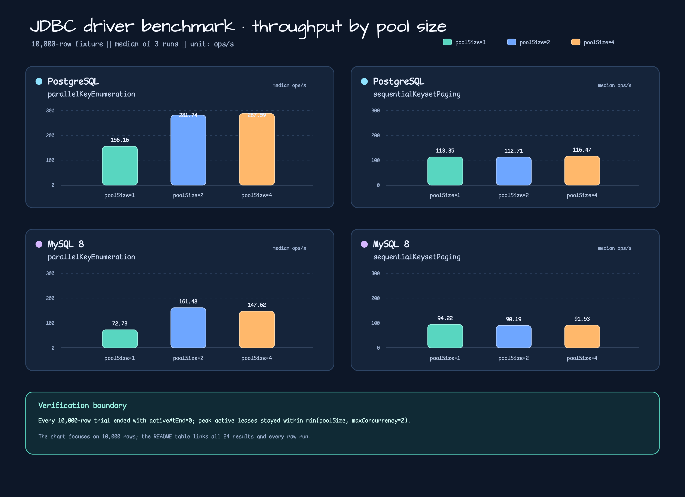

# Issue #694 JDBC driver benchmark evidence

This directory records the benchmark-only PostgreSQL and MySQL 8 JDBC driver
comparison requested by Issue #694. It compares the existing sequential
keyset-paging path with the opt-in parallel key-enumeration path on one seeded
fixture. The evidence is tied to implementation commit
`f325a70fbd2047cdef28be928eeea4675b4b05b6`.



The chart expands the 10,000-row slice so the pool-size shape is visible. The
table below is the complete 24-row summary: two drivers × two methods × two
row counts × three pool sizes.

## Result table

`ops/s` is the primary JMH throughput. `rows/s` is derived as
`ops/s × rowCount`. The remaining columns are selected JMH auxiliary counters;
the raw files preserve every captured counter, while `summary.json` stores only
the selected medians and derived values shown here. The `/op` columns are
`sum(counter.rawData) / sum(primaryMetric.rawData)` within each run and then
the median of runs 1–3; `ops/s` and counter ratios use two decimals, while
`rows/s` is rounded to the nearest row.

| Driver | Method | Rows | poolSize | Median ops/s | Median rows/s | Statement executions/op | Connection requests/op | Peak active leases | Active-at-end |
| --- | --- | ---: | ---: | ---: | ---: | ---: | ---: | ---: | ---: |
| `POSTGRESQL` | `parallelKeyEnumeration` | 1,000 | 1 | 316.55 | 316553 | 4.03 | 4.03 | 1.00 | 0.00 |
| `POSTGRESQL` | `parallelKeyEnumeration` | 1,000 | 2 | 575.99 | 575992 | 4.02 | 4.02 | 2.00 | 0.00 |
| `POSTGRESQL` | `parallelKeyEnumeration` | 1,000 | 4 | 575.58 | 575575 | 4.01 | 4.01 | 2.00 | 0.00 |
| `POSTGRESQL` | `parallelKeyEnumeration` | 10,000 | 1 | 156.16 | 1561565 | 4.03 | 4.03 | 1.00 | 0.00 |
| `POSTGRESQL` | `parallelKeyEnumeration` | 10,000 | 2 | 281.74 | 2817364 | 4.03 | 4.03 | 2.00 | 0.00 |
| `POSTGRESQL` | `parallelKeyEnumeration` | 10,000 | 4 | 287.59 | 2875877 | 4.02 | 4.02 | 2.00 | 0.00 |
| `POSTGRESQL` | `sequentialKeysetPaging` | 1,000 | 1 | 935.42 | 935423 | 2.01 | 1.01 | 1.00 | 0.00 |
| `POSTGRESQL` | `sequentialKeysetPaging` | 1,000 | 2 | 940.97 | 940974 | 2.01 | 1.01 | 1.00 | 0.00 |
| `POSTGRESQL` | `sequentialKeysetPaging` | 1,000 | 4 | 982.09 | 982093 | 2.02 | 1.01 | 1.00 | 0.00 |
| `POSTGRESQL` | `sequentialKeysetPaging` | 10,000 | 1 | 113.35 | 1133525 | 11.09 | 1.01 | 1.00 | 0.00 |
| `POSTGRESQL` | `sequentialKeysetPaging` | 10,000 | 2 | 112.71 | 1127061 | 11.12 | 1.01 | 1.00 | 0.00 |
| `POSTGRESQL` | `sequentialKeysetPaging` | 10,000 | 4 | 116.47 | 1164748 | 11.10 | 1.01 | 1.00 | 0.00 |
| `MYSQL_V8` | `parallelKeyEnumeration` | 1,000 | 1 | 115.73 | 115727 | 4.03 | 4.03 | 1.00 | 0.00 |
| `MYSQL_V8` | `parallelKeyEnumeration` | 1,000 | 2 | 222.68 | 222684 | 4.03 | 4.03 | 2.00 | 0.00 |
| `MYSQL_V8` | `parallelKeyEnumeration` | 1,000 | 4 | 227.78 | 227777 | 4.03 | 4.03 | 2.00 | 0.00 |
| `MYSQL_V8` | `parallelKeyEnumeration` | 10,000 | 1 | 72.73 | 727272 | 4.05 | 4.05 | 1.00 | 0.00 |
| `MYSQL_V8` | `parallelKeyEnumeration` | 10,000 | 2 | 161.48 | 1614811 | 4.03 | 4.03 | 2.00 | 0.00 |
| `MYSQL_V8` | `parallelKeyEnumeration` | 10,000 | 4 | 147.62 | 1476197 | 4.04 | 4.04 | 2.00 | 0.00 |
| `MYSQL_V8` | `sequentialKeysetPaging` | 1,000 | 1 | 448.78 | 448778 | 2.02 | 1.01 | 1.00 | 0.00 |
| `MYSQL_V8` | `sequentialKeysetPaging` | 1,000 | 2 | 408.80 | 408796 | 2.01 | 1.01 | 1.00 | 0.00 |
| `MYSQL_V8` | `sequentialKeysetPaging` | 1,000 | 4 | 330.26 | 330262 | 2.01 | 1.01 | 1.00 | 0.00 |
| `MYSQL_V8` | `sequentialKeysetPaging` | 10,000 | 1 | 94.22 | 942160 | 11.13 | 1.01 | 1.00 | 0.00 |
| `MYSQL_V8` | `sequentialKeysetPaging` | 10,000 | 2 | 90.19 | 901854 | 11.10 | 1.01 | 1.00 | 0.00 |
| `MYSQL_V8` | `sequentialKeysetPaging` | 10,000 | 4 | 91.53 | 915267 | 11.10 | 1.01 | 1.00 | 0.00 |

## What the measurements show

- On the 10,000-row PostgreSQL slice, `parallelKeyEnumeration` rises from
  156.16 ops/s at `poolSize=1` to 287.59 ops/s at `poolSize=4` in this local
  run. MySQL 8 rises from 72.73 to 147.62 ops/s between
  pool sizes 1 and 4, but this is still a local observation rather than a
  tuning recommendation.
- `sequentialKeysetPaging` stays single-lease in every row of the table, as
  expected from its explicit transaction boundary. The parallel method uses
  at most two active leases because `maxConcurrency=2` is fixed by the
  benchmark contract.
- Every captured row has `activeAtEnd=0`, and every observed peak is no larger
  than the configured pool size. These are lifecycle guards, not latency or
  production-capacity claims.

## Benchmark contract

- JMH 1.37, `Mode.Throughput`, `@Threads(1)`, `@Fork(1)`.
- One warmup and three one-second measurement iterations for each generated
  point.
- Drivers pinned by the repository catalog ref
  `91f9ea9336b5ea991f5675323a1cf25ccfd6f5ed`: PostgreSQL
  `org.postgresql:postgresql:42.7.13` and MySQL 8
  `com.mysql:mysql-connector-j:9.7.0`.
- Seeded row counts: 1,000 and 10,000.
- Hikari `maximumPoolSize`: 1, 2, and 4; parallel `maxConcurrency=2`.
- Setup, fixture seeding, preflight, and teardown are outside timed methods.
- PostgreSQL and MySQL containers are shared by the existing JDBC test
  infrastructure; the benchmark closes only its datasource and executor.

Run the generated tasks three times per driver and capture each immutable
report in a fresh evidence directory. The Testcontainers precondition is
explicit so a skipped container path cannot be mistaken for a driver result:

```bash
set -euo pipefail
cleanup_capture_temp() {
  [ -z "${before_reports:-}" ] || rm -f "$before_reports"
  [ -z "${after_reports:-}" ] || rm -f "$after_reports"
}
trap cleanup_capture_temp EXIT
colima status
test "$(docker context show)" = "default"
docker info >/dev/null
export TESTCONTAINERS_RYUK_DISABLED=true

evidence_dir="$(mktemp -d -t issue-694-driver-benchmark)"
metadata="$evidence_dir/raw-metadata.jsonl"
git_sha="$(git rev-parse HEAD)"
capture_driver() {
  local driver="$1" task="$2" report_root="$3" driver_version="$4"
  local image="$5" image_digest="$6" prefix="$7"
  for run in 1 2 3; do
    before_reports="$(mktemp -t issue-694-before)"
    after_reports="$(mktemp -t issue-694-after)"
    find "$report_root" -mindepth 1 -maxdepth 1 -type d -print 2>/dev/null | sort > "$before_reports"
    ./gradlew ":benchmark-exposed-benchmark:${task}" \
      --rerun-tasks --no-build-cache --no-configuration-cache \
      --no-parallel --max-workers=1 --console=plain
    find "$report_root" -mindepth 1 -maxdepth 1 -type d -print 2>/dev/null | sort > "$after_reports"
    new_reports="$(comm -13 "$before_reports" "$after_reports")"
    test "$(printf '%s\n' "$new_reports" | awk 'NF { count++ } END { print count + 0 }')" = 1
    report_dir="$new_reports"
    python3 docs/benchmarks/exposed-benchmark-2026-08-22-issue-694/capture_jmh_run.py \
      --report-dir "$report_dir" \
      --destination "$evidence_dir/${prefix}-run-${run}.json" \
      --metadata "$metadata" --driver "$driver" --run-id "$run" \
      --git-sha "$git_sha" --driver-version "$driver_version" \
      --image "$image" --image-digest "$image_digest"
    rm -f "$before_reports" "$after_reports"
  done
}

capture_driver POSTGRESQL benchmarkJdbcDriverPostgreSQLBenchmark \
  benchmark/exposed-benchmark/build/reports/benchmarks/jdbcDriverPostgreSQL \
  42.7.13 postgres:18.4-alpine \
  sha256:9a8afca54e7861fd90fab5fdf4c42477a6b1cb7d293595148e674e0a3181de15 \
  postgresql
capture_driver MYSQL_V8 benchmarkJdbcDriverMySQLBenchmark \
  benchmark/exposed-benchmark/build/reports/benchmarks/jdbcDriverMySQL \
  9.7.0 mysql:8.4.11 \
  sha256:b3b90af2a6552ae30c266fdb7d5dd55f3afb72404bb78d37fe8a23eb857fd3fb \
  mysql
python3 docs/benchmarks/exposed-benchmark-2026-08-22-issue-694/summarize_jmh.py \
  "$evidence_dir" --output "$evidence_dir/summary.json"
python3 docs/benchmarks/exposed-benchmark-2026-08-22-issue-694/validate_readme_parity.py \
  docs/benchmarks/exposed-benchmark-2026-08-22-issue-694/README.md \
  docs/benchmarks/exposed-benchmark-2026-08-22-issue-694/README.ko.md \
  --output "$evidence_dir/readme-parity.json"
python3 docs/benchmarks/exposed-benchmark-2026-08-22-issue-694/render_jmh_chart.py \
  --summary "$evidence_dir/summary.json" --locale en --output "$evidence_dir/chart.svg"
python3 docs/benchmarks/exposed-benchmark-2026-08-22-issue-694/render_jmh_chart.py \
  --summary "$evidence_dir/summary.json" --locale ko --output "$evidence_dir/chart.ko.svg"
canonical_dir="docs/benchmarks/exposed-benchmark-2026-08-22-issue-694"
for file in postgresql-run-1.json postgresql-run-2.json postgresql-run-3.json \
  mysql-run-1.json mysql-run-2.json mysql-run-3.json raw-metadata.jsonl summary.json; do
  test ! -e "$canonical_dir/$file"
  cp "$evidence_dir/$file" "$canonical_dir/$file"
done
echo "Evidence written to $evidence_dir"
```

The promotion loop is intentionally fail-closed: it copies into the checked-in
evidence directory only when every destination is absent, so an existing raw
capture cannot be silently replaced.

## Reproducibility and raw evidence

The six immutable captures were taken with JDK `25.0.4` on 2026-08-22. The
container image references were pinned as follows:

| Driver | Image | Digest |
| --- | --- | --- |
| PostgreSQL | `postgres:18.4-alpine` | `sha256:9a8afca54e7861fd90fab5fdf4c42477a6b1cb7d293595148e674e0a3181de15` |
| MySQL 8 | `mysql:8.4.11` | `sha256:b3b90af2a6552ae30c266fdb7d5dd55f3afb72404bb78d37fe8a23eb857fd3fb` |

The JDBC driver versions are PostgreSQL `42.7.13` and MySQL Connector/J
`9.7.0`; both are resolved from catalog ref
`91f9ea9336b5ea991f5675323a1cf25ccfd6f5ed`.

The capture metadata also records the observed resolved driver artifact, catalog
ref, Testcontainers `2.0.5`, Gradle `9.7.0`, Docker server `29.2.1`, Docker
context, Colima `0.10.3`, host OS/architecture, and the Git dirty flag. The raw evidence
is tied to implementation SHA `f325a70fbd2047cdef28be928eeea4675b4b05b6`; the
dirty flag is retained because documentation/evidence files were present in the
worktree while the benchmark was captured.

- Raw PostgreSQL runs: [run 1](./postgresql-run-1.json), [run 2](./postgresql-run-2.json), [run 3](./postgresql-run-3.json).
- Raw MySQL 8 runs: [run 1](./mysql-run-1.json), [run 2](./mysql-run-2.json), [run 3](./mysql-run-3.json).
- Capture metadata and SHA-256 receipts: [raw-metadata.jsonl](./raw-metadata.jsonl).
- Parser output used by the table and chart: [summary.json](./summary.json).
- Capture validator: [capture_jmh_run.py](./capture_jmh_run.py).
- Summary validator: [summarize_jmh.py](./summarize_jmh.py).
- Chart generator: [render_jmh_chart.py](./render_jmh_chart.py).
- EN/KO parity validator and receipt: [validate_readme_parity.py](./validate_readme_parity.py), [readme-parity.json](./readme-parity.json).

The capture helper checks one regular top-level report, exactly 12 entries, the
selected driver, immutable destinations, observed Git/Docker/Gradle/
Testcontainers/catalog provenance, and safe concrete metadata values. The summary
validator then requires three captures per driver, cross-checks every metadata
record against its raw SHA and expected driver/image/artifact, and validates the
JMH envelope, full matrix, finite primary/auxiliary raw data, lease bounds,
known-forbidden-token absence, and median derivation without editing raw files.

## Implementation source

- Matrix and range contract:
  [JdbcDriverBenchmarkMatrix.kt](../../../benchmark/exposed-benchmark/src/main/kotlin/io/bluetape4k/exposed/benchmark/jdbc/JdbcDriverBenchmarkMatrix.kt)
- Fixture, datasource tracking, and cleanup:
  [DriverBenchmarkFixture.kt](../../../benchmark/exposed-benchmark/src/benchmark/kotlin/io/bluetape4k/exposed/benchmark/jdbc/DriverBenchmarkFixture.kt)
- JMH benchmark and lifecycle assertions:
  [JdbcDriverKeyEnumerationBenchmark.kt](../../../benchmark/exposed-benchmark/src/benchmark/kotlin/io/bluetape4k/exposed/benchmark/jdbc/JdbcDriverKeyEnumerationBenchmark.kt)
- Unit tests for the generated matrix:
  [DriverBenchmarkSupportTest.kt](../../../benchmark/exposed-benchmark/src/test/kotlin/io/bluetape4k/exposed/benchmark/jdbc/DriverBenchmarkSupportTest.kt)

## Scope and limitations

This is a reproducible local Docker/JMH evidence set for Issue #694. It does
not establish a universal driver ranking, round-trip latency, allocation
profile, or production pool recommendation. The `poolSize=1` points are an
intentional pressure condition. Each point uses one fork and three one-second
measurement iterations; the raw JMH `scoreError` can be material (and can
exceed the point estimate), so these values are directional local evidence,
not statistically conclusive comparisons. The tracker proxy and counters are
also included in the timed path, so throughput is instrumented benchmark
throughput rather than an uninstrumented driver-only ceiling. The full
exact-head nightly CI matrix remains a separate delivery gate from these
benchmark measurements.

## DoD Status

- Raw captures, SHA-256 metadata, and 24-row summary: **PASS**.
- EN/KO README and PNG-backed chart: **PASS**.
- Exact-head full nightly CI: **PENDING** until the PR head is verified.
