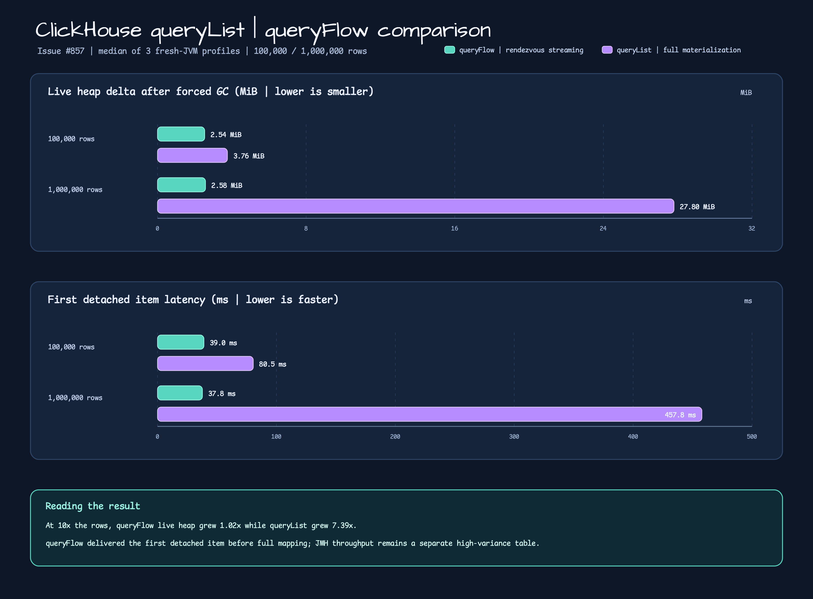

# Issue #857 ClickHouse benchmark evidence

This evidence compares the new mapped `queryFlow` with materialized
`queryList` over the same `system.numbers` query and detached `Long` mapper.
The reader question is whether row-count growth changes retained application
memory and the time to receive the first detached item.

## Conditions

- JDK 25, ClickHouse Testcontainers, and the repository `ClickHouseServer.Launcher` fixture.
- JMH: one warmup and three one-second throughput iterations per method.
- Profile: one fresh JVM per API/row-count/run, two 1,000-row bounded warmups,
  five bounded GC-settle rounds, forced-GC checkpoints, and JFR.
- Final order: `run=1/3` list then flow; `run=2` flow then list.
- The tracked machine-readable source is [`summary.json`](./summary.json).

## JMH throughput

Scores are ops/s with the JMH error estimate. The error is large for this small
local sample, so these are directional throughput evidence rather than an SLO.

| API | Rows | Score |
|---|---:|---:|
| `queryList` (`collected`) | 100,000 | 76.556 ± 42.276 |
| `queryList` (`collected`) | 1,000,000 | 5.582 ± 8.882 |
| `queryFlow` (`streamed`) | 100,000 | 2.072 ± 3.211 |
| `queryFlow` (`streamed`) | 1,000,000 | 0.147 ± 1.118 |

## Fresh-JVM profile medians

| API | Rows | Live heap delta | Raw heap peak | RSS peak | First item | Total time |
|---|---:|---:|---:|---:|---:|---:|
| `queryFlow` | 100,000 | 2,660,696 B | 44,927,912 B | 325,856 KiB | 39.0 ms | 1.239 s |
| `queryFlow` | 1,000,000 | 2,705,872 B | 159,776,408 B | 379,472 KiB | 37.8 ms | 7.693 s |
| `queryList` | 100,000 | 3,944,736 B | 82,472,408 B | 326,896 KiB | 80.5 ms | 110 ms |
| `queryList` | 1,000,000 | 29,148,136 B | 261,918,432 B | 511,312 KiB | 457.8 ms | 517 ms |



## Analysis

- At ten times the rows, `queryFlow` live heap grew from 2.54 MiB to 2.58 MiB
  (`1.02x`), while `queryList` grew from 3.76 MiB to 27.80 MiB (`7.39x`).
- `queryFlow` delivered its first detached item in about 38–39 ms in both
  profiles. `queryList` waited for full materialization and reached 457.8 ms at
  one million rows.
- `queryFlow` is intentionally backpressured by a rendezvous channel, so the
  JMH throughput is lower in this fixture. The chart is a memory/latency view;
  throughput remains the table above and must not be combined with forced-GC
  profile numbers as one latency SLO.
- JFR `jdk.OldObjectSample` retained a 3.8 MB `Object[1000000]` through
  `ArrayList.toArray` in the List run. The Flow run had no matching full-result
  array sample. Absence from a sample is not proof that the driver has no
  internal buffers; live heap, RSS, and JFR are interpreted together.

## Reproduction

```bash
./gradlew :benchmark-exposed-benchmark:clickHouseBenchmark \
  --no-build-cache --no-configuration-cache --no-parallel --max-workers=1 --console=plain
./gradlew :benchmark-exposed-benchmark:profileClickHouseStreaming \
  -PprofileApi=flow -PprofileRows=100000 -PprofileRun=1 \
  --no-build-cache --no-configuration-cache --no-parallel --max-workers=1 --console=plain
```

Run all twelve profile combinations sequentially and keep the JSON, CSV, and
JFR files under `benchmark/exposed-benchmark/build/reports/clickhouse-profile/`.
The JMH report is under
`benchmark/exposed-benchmark/build/reports/benchmarks/clickHouse/<timestamp>/`.

The chart is regenerated from `summary.json` with the tracked renderer, then
converted to the canonical PNG with CairoSVG:

```bash
python3 render_chart.py --summary summary.json --locale en --output /tmp/issue-857.en.svg
cairosvg /tmp/issue-857.en.svg -o /tmp/issue-857.en.png -s 2
python3 render_chart.py --summary summary.json --locale ko --output /tmp/issue-857.ko.svg
cairosvg /tmp/issue-857.ko.svg -o /tmp/issue-857.ko.png -s 2
```

## Limits

The profile does not establish production driver behavior, server-side read
timeouts, row limits, or the complete cleanup-failure matrix. The chart and
summary are local evidence for Issue #857, not a release or hosted-CI result.
