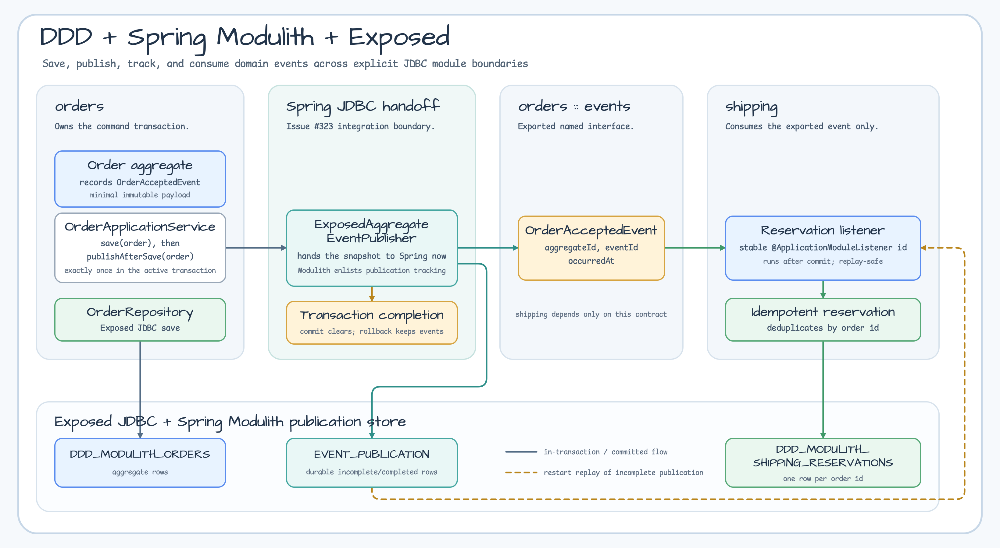

# DDD Spring Modulith Demo

English | [한국어](README.ko.md)

This example shows how to combine bluetape4k Exposed DDD aggregate contracts, Spring Modulith application-module boundaries, and the Exposed-backed Spring Modulith publication repository in a small JDBC application.



## Overview

The sample has two application modules:

- `orders`: accepts an order command, persists an `Order` aggregate with Exposed JDBC, and records an `OrderAcceptedEvent`.
- `orders :: events`: the named interface exported to other modules. The event payload contains only `aggregateId`, `eventId`, and `occurredAt`.
- `shipping`: listens with `@ApplicationModuleListener(id = "shipping.reserve-order")` and creates one shipping reservation per order id.

`shipping` is allowed to depend only on `orders :: events`. The tests include a negative fixture that proves direct dependency on `orders.internal` is rejected by Spring Modulith verification.

<!-- issue-323-section:start -->
## Transaction And Publication Boundary

`OrderApplicationService.accept(...)` saves the aggregate and then calls
`ExposedAggregateEventPublisher.publishAfterSave(aggregate)` exactly once as the final aggregate operation inside
the same command transaction. The publisher hands the immutable event snapshot to Spring immediately. Spring
Modulith records its durable publication in that transaction, while the default module listener runs in
`AFTER_COMMIT`.

Committed completion clears the aggregate event buffer. Publication failure or transaction rollback preserves the
buffer and rolls back the order and publication rows together. The example replaces the former manual
`ApplicationEventPublisher` loop and manual `clearDomainEvents()` call; both paths must never run together.
Shipping writes are idempotent by order id because restart replay or listener recovery can deliver an event again.
This flow does not provide an application outbox or exactly-once delivery.

The publication table is an application-owned trust boundary. Production deployments require least-privilege
database access, encryption at rest and encryption in transit as infrastructure permits, integrity protection, an
explicit retention/deletion policy, and payload minimization. Stored event class names are exposed schema metadata,
so event packages and migrations require review. The allowlisting serializer accepts only `OrderAcceptedEvent` and
avoids polymorphic type metadata. Audit history, snapshot persistence, and JaVers commit semantics are forbidden
dependencies of `ExposedAggregateEventPublisher`.
<!-- issue-323-section:end -->

## Supported

- JDBC-only Exposed repositories with Spring Boot.
- Spring Modulith publication rows stored through `bluetape4k-exposed-spring-modulith`.
- Stable listener ids and idempotent consumers.
- Restart replay of incomplete publications with `spring.modulith.events.republish-outstanding-events-on-restart=true`.
- Minimal event payloads that avoid secrets, natural keys, customer ids, and full aggregate snapshots.

## Not Supported

- R2DBC or `suspend` Spring Modulith publication SPI.
- Exactly-once delivery.
- A durable application outbox beyond Spring Modulith's publication table.
- Benchmark, throughput, or latency claims.
- Treating publication rows as an external input channel.
- Renaming event DTO packages without migrating existing publication rows.

## Operational Notes

The sample enables `bluetape4k.spring.modulith.exposed.initialize-schema=true` for local tests. Production applications should manage publication tables with Flyway or Liquibase and restrict write access to the application. The publication table is application-owned internal state.

The narrow `EventSerializer` accepts only `OrderAcceptedEvent`, emits deterministic JSON, and avoids default typing or polymorphic type metadata. This keeps the stored payload inspectable while avoiding unsafe deserialization patterns.

The Exposed Modulith store meter is `bluetape4k.exposed.modulith.publications` with states such as `incomplete`, `completed`, `failed`, and `unloadable` when Micrometer is enabled.

If an event DTO package is renamed, existing rows can become unloadable. Treat those rows as repair data: restore the event class, migrate `EVENT_TYPE` and `SERIALIZED_EVENT`, or delete/resubmit the row through an operator-controlled path after validating delivery state.

The concrete tables in this sample are `DDD_MODULITH_ORDERS`, `EVENT_PUBLICATION`, and `DDD_MODULITH_SHIPPING_RESERVATIONS`.

## Migration From Direct Calls

If a service currently calls another module's repository directly after saving an aggregate, move the shared fact into a stable event DTO under a named interface package. The consumer module should depend on that named interface, listen with a stable `@ApplicationModuleListener` id, and make projection or reservation writes idempotent by a business key such as order id.

## Running Tests

Source packages to inspect:

- `io.bluetape4k.exposed.examples.modulith.orders`
- `io.bluetape4k.exposed.examples.modulith.orders.events`
- `io.bluetape4k.exposed.examples.modulith.shipping`
- `io.bluetape4k.exposed.examples.modulithinvalid`

```bash
./gradlew :examples-ddd-spring-modulith-demo:test --no-configuration-cache --no-daemon --console=plain
```

The happy-path test accepts one order and expects one order row, one completed publication row, and one shipping reservation. The restart test reopens the same H2 database with an incomplete publication row and verifies replay completes the row without creating a duplicate reservation.
