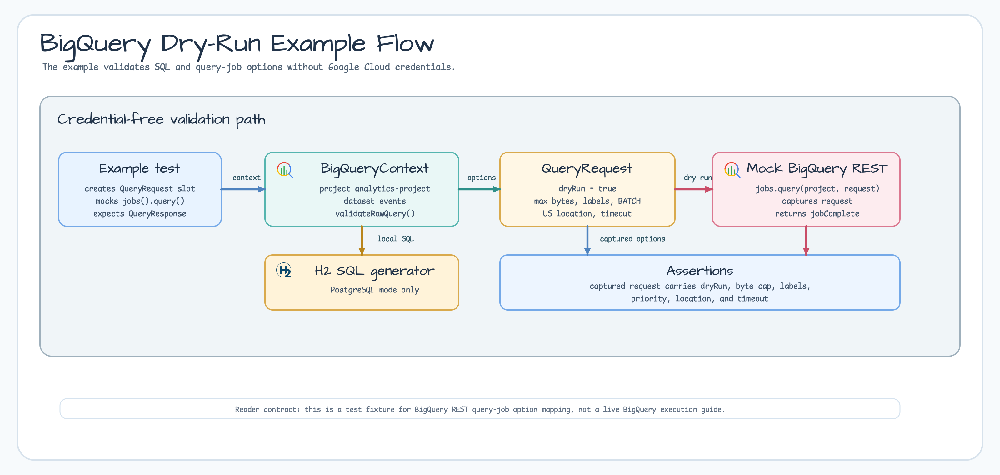

# examples-exposed-bigquery-dry-run

[한국어](./README.ko.md) | English

Credential-free BigQuery example that validates raw SQL with the
`BigQueryContext.validateRawQuery` dry-run path and applies query-job options
such as billed-byte caps, labels, priority, location, and timeout.

## Running

This example uses a mocked BigQuery REST client, so it does not require Google
Cloud credentials:

```bash
./gradlew :examples-exposed-bigquery-dry-run:test
```

## Scenario



- Build a `BigQueryContext` with a generated SQL database backed by H2.
- Submit SQL through `validateRawQuery`.
- Verify the outgoing BigQuery REST `QueryRequest` uses `dryRun=true` and
  carries the requested job options.

## See Also

- [`exposed-bigquery`](../../exposed/bigquery/README.md) — BigQuery REST executor
