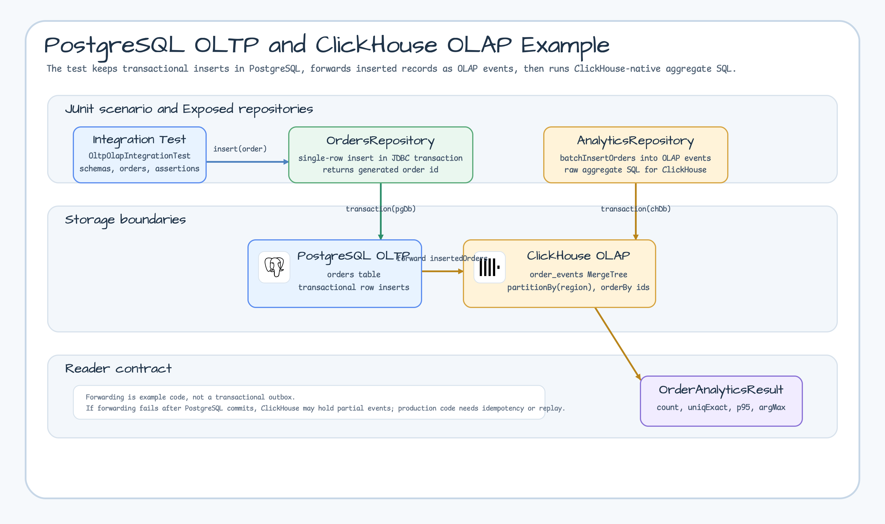
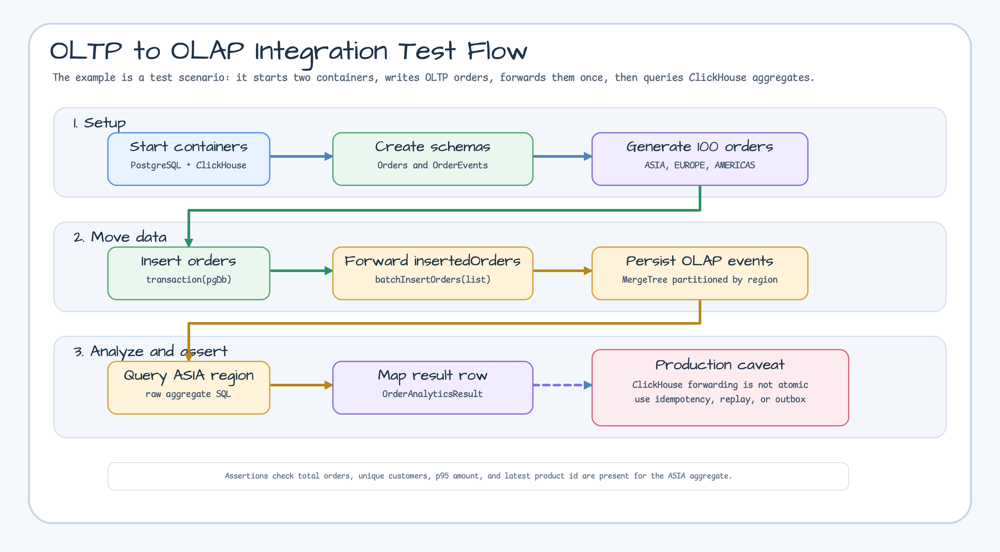

# examples-exposed-clickhouse-oltp-olap

[한국어](./README.ko.md) | English

End-to-end example combining **PostgreSQL (OLTP)** and **ClickHouse (OLAP)** through Exposed.
The integration test writes transactional order rows to PostgreSQL, forwards the inserted records
to a ClickHouse `MergeTree` table, and runs regional analytics with ClickHouse-native aggregate
functions.

## Example Topology



## Test Flow



## Components

| Component             | Role                                                               |
|-----------------------|--------------------------------------------------------------------|
| `Orders` table        | PostgreSQL OLTP table for transactional order rows                 |
| `OrdersRepository`    | Synchronous JDBC repository that inserts one order per transaction |
| `OrderEvents` table   | ClickHouse OLAP `MergeTree`, ordered by IDs and partitioned by `region` |
| `AnalyticsRepository` | Batch forwarding plus aggregate query (`uniqExact`, `quantile`, `argMax`) |

## Running

The integration test uses **Testcontainers** to spin up both PostgreSQL and ClickHouse:

```bash
./gradlew :examples-exposed-clickhouse-oltp-olap:test
```

## Caveats

- ClickHouse forwarding in this example is **not atomic with PostgreSQL commits**. A failure after
  the OLTP transaction can leave partial OLAP events. Production pipelines should add idempotency,
  replay, or an outbox boundary.
- Aggregate functions (`uniqExact`, `quantile`, `argMax`) are issued as raw SQL because
  the Exposed expression API does not yet model these ClickHouse-native functions.

## See Also

- [`exposed-clickhouse`](../../exposed/exposed-clickhouse/README.md) — the underlying ClickHouse adapter
