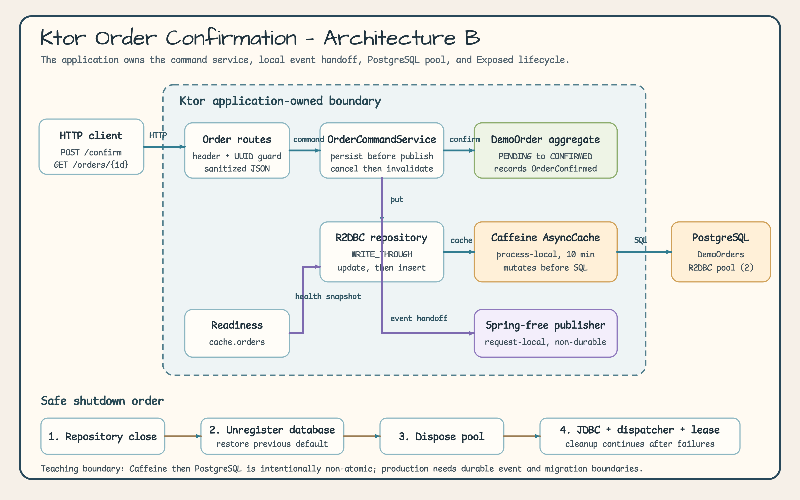
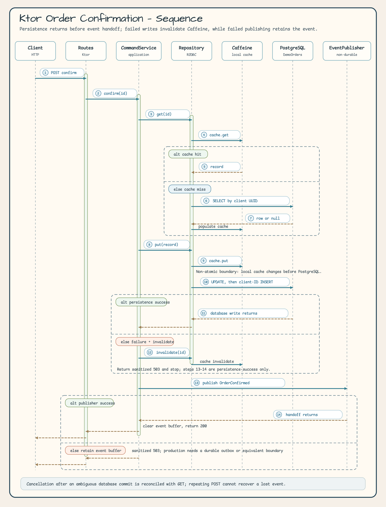

# Ktor Exposed 데모

[English](README.md)

## 개요

이 실행 가능한 Ktor 예제는 다음 요소를 조합합니다.

- 간단한 트랜잭션 수 조회 라우트를 위한 H2 JDBC
- 주문 확인 시나리오를 위한 PostgreSQL R2DBC
- `WRITE_THROUGH` 모드의 `OrderR2dbcCaffeineRepository`
- Spring에 의존하지 않는 Aggregate와 애플리케이션 소유 이벤트 발행기
- JDBC, R2DBC, 캐시 readiness contributor
- 명시적인 리소스 획득, Exposed 기본 데이터베이스 복원, 제한 시간이 있는 풀 해제

HTTP 요청부터 PostgreSQL까지 흐름을 따라가기 쉽도록 예제를 작게 유지했습니다.
운영 환경에서 보장하지 않는 지점도 숨기지 않고 명시합니다.

## 예제 시나리오

클라이언트가 소문자 정규 UUID를 생성한 뒤 해당 주문을 확인합니다.

1. `POST /orders/{orderId}/confirm`이 학습용 헤더와 UUID를 검증합니다.
2. `OrderCommandService`가 대기 상태의 `DemoOrder`를 조회하거나 생성합니다.
3. Aggregate가 `PENDING`에서 `CONFIRMED`로 전이하고 `OrderConfirmed`를 기록합니다.
4. R2DBC Caffeine repository가 로컬 캐시를 갱신한 다음 PostgreSQL에 저장합니다.
5. 저장이 반환된 뒤에만 애플리케이션 소유 발행기가 이벤트를 전달받으며, 전달에
   성공하면 Aggregate 이벤트 버퍼를 비웁니다.
6. 같은 주문을 순차적으로 다시 확인하면 `eventPublished=false`를 반환하고 행이나
   이벤트를 추가로 만들지 않습니다.

## 아키텍처



[원본 아키텍처 SVG 열기](../../docs/images/readme-diagrams/examples-ktor-exposed-demo-architecture-01.svg)

범례: 파란 화살표는 요청/repository 호출, 보라색 화살표는 readiness 또는 이벤트
전달, 주황색 화살표는 종료 순서를 뜻합니다. 초록색은 Aggregate, 주황색은
캐시/데이터베이스 상태, 보라색은 비영속 발행기입니다. 점선 경계 안의 모든 구성
요소는 애플리케이션이 소유합니다. Caffeine이 PostgreSQL보다 먼저 변경되므로 두
작업을 하나의 원자적 박스로 표현하지 않았습니다. 종료할 때는 repository를 먼저
닫고 Exposed 데이터베이스 등록을 해제한 다음 풀을 해제합니다.

## 주문 확인 시퀀스



[원본 시퀀스 SVG 열기](../../docs/images/readme-diagrams/examples-ktor-exposed-demo-sequence-01.svg)

범례: 파란 실선은 호출, 주황색 점선은 반환, 초록색 프레임은 성공 분기, 파란색
프레임은 캐시 미스 처리, 주황색 프레임은 실패 분기입니다. 번호 pill은 실행 순서를
나타냅니다. 9단계에서 Caffeine을 변경한 뒤 10단계에서 PostgreSQL에 씁니다. 저장에
실패하면 캐시를 무효화합니다. 발행에 실패하면 영속 소유자가 이벤트를 전달받지
않았으므로 Aggregate에 이벤트를 남겨 둡니다.

## 프로젝트 구조

```text
examples/ktor-exposed-demo/
├── compose.yaml
├── build.gradle.kts
├── src/main/kotlin/io/bluetape4k/examples/exposed/ktor/
│   ├── KtorExposedDemoApplication.kt
│   ├── KtorExposedDemoResources.kt
│   └── order/
│       ├── OrderDomain.kt
│       ├── OrderRepository.kt
│       ├── OrderCommandService.kt
│       └── OrderRoutes.kt
├── src/test/                       # Docker 없이 실행되는 계약 테스트
└── src/postgresIntegrationTest/    # 순차 실행하는 Testcontainers 검증
```

## 리소스 소유권

`KtorExposedDemoResources`는 Hikari data source, JDBC dispatcher, PostgreSQL
R2DBC 풀/데이터베이스, 구체 repository, 발행기, command service를 소유합니다.
Repository 트랜잭션이 Exposed의 프로세스 전역 기본 R2DBC 데이터베이스를 사용하므로
한 프로세스에서는 데모 lifecycle lease를 하나만 가질 수 있습니다.

생성 과정은 실패 원자성을 갖습니다. 완료된 단계를 역순으로 되돌리고, 정리 중
발생한 실패는 최초 실패에 suppressed exception으로 추가합니다. `ApplicationStopped`와
runner가 경쟁하더라도 정상 종료는 한 번만 실행됩니다.

```text
repository.close
  -> TransactionManager.closeAndUnregister
  -> 현재 기본값이 null일 때만 캡처했던 기본값 복원
  -> R2DBC 풀 해제 (최대 5초)
  -> Hikari와 JDBC dispatcher 종료
  -> lifecycle lease 반환
```

## 라우트

| Method | Path | 요청 | 성공 media type | 용도 |
|---|---|---|---|---|
| `GET` | `/healthz/exposed` | 없음 | `application/json` | Liveness; PostgreSQL을 probe하지 않음 |
| `GET` | `/readyz/exposed` | 없음 | `application/json` | JDBC, R2DBC, `cache.orders` readiness |
| `GET` | `/transactions/jdbc-count` | 없음 | `text/plain` | H2 JDBC 예제 행 수 (`2`) |
| `GET` | `/transactions/r2dbc-count` | 없음 | `text/plain` | PostgreSQL 주문 수 |
| `POST` | `/orders/{orderId}/confirm` | **body 없음**, header `X-Demo-Command: confirm-order` | `application/json` | 주문 확인 |
| `GET` | `/orders/{orderId}` | 없음 | `application/json` | 저장된 주문 상태 조정/조회 |

첫 번째 확인 응답:

```json
{
  "orderId": "018f6f95-7f4a-7a20-8b52-70ad30c30f36",
  "status": "CONFIRMED",
  "updatedAt": "2026-07-17T00:01:00Z",
  "eventPublished": true
}
```

조회 응답:

```json
{
  "orderId": "018f6f95-7f4a-7a20-8b52-70ad30c30f36",
  "status": "CONFIRMED",
  "updatedAt": "2026-07-17T00:01:00Z"
}
```

| Status | Code | Message |
|---|---|---|
| `400` | `INVALID_ORDER_ID` | `Order id must be a canonical non-nil UUID.` |
| `403` | `DEMO_COMMAND_REQUIRED` | `Required demo command header is missing or invalid.` |
| `404` | `ORDER_NOT_FOUND` | `Order was not found.` |
| `503` | `ORDER_PERSISTENCE_FAILED` | `Order could not be stored.` |
| `503` | `ORDER_EVENT_HANDOFF_FAILED` | `Order was stored but its event was not handed off.` |
| `503` | `ORDER_CONFIRMATION_FAILED` | `Order confirmation failed.` |
| `503` | `ORDER_READ_FAILED` | `Order could not be loaded.` |

`503` 응답에만 생성된 UUIDv7 `correlationId`가 포함됩니다. 이 값은 정제된 응답과
허용 목록을 적용한 애플리케이션 logger 진단 레코드 하나를 연결합니다. 재시도
토큰이나 이벤트 재발행 토큰으로 사용할 수 없습니다.

## PostgreSQL로 실행

모든 명령은 저장소 루트에서 실행합니다.

PostgreSQL 시작:

```bash
docker compose -f examples/ktor-exposed-demo/compose.yaml up -d --wait
```

터미널 1 — Ktor 시작:

```bash
./gradlew :examples-ktor-exposed-demo:run
```

터미널 2 — 주문 ID를 만들고 예제 확인:

```bash
BASE_URL=http://127.0.0.1:8080
ORDER_ID=$(uuidgen | tr '[:upper:]' '[:lower:]')

curl -fsS "$BASE_URL/healthz/exposed"
curl -fsS "$BASE_URL/readyz/exposed"
curl -fsS "$BASE_URL/transactions/jdbc-count"
curl -fsS "$BASE_URL/transactions/r2dbc-count"

curl -fsS -X POST \
  -H 'X-Demo-Command: confirm-order' \
  "$BASE_URL/orders/$ORDER_ID/confirm"
curl -fsS "$BASE_URL/orders/$ORDER_ID"
curl -fsS -X POST \
  -H 'X-Demo-Command: confirm-order' \
  "$BASE_URL/orders/$ORDER_ID/confirm"
curl -fsS "$BASE_URL/transactions/r2dbc-count"
```

예상 결과: readiness에 `jdbc`, `r2dbc`, `cache.orders`가 표시되고 JDBC count는
`2`입니다. 첫 POST는 `eventPublished=true`를 반환하고 GET은 같은 ID, 상태,
timestamp를 반환합니다. 반복 POST는 `eventPublished=false`를 반환하며 R2DBC
count는 하나 증가합니다.

PostgreSQL named volume을 보존하면서 종료:

```bash
docker compose -f examples/ktor-exposed-demo/compose.yaml down
```

로컬 데이터 volume과 orphan을 제거하는 파괴적 종료:

```bash
docker compose -f examples/ktor-exposed-demo/compose.yaml down -v --remove-orphans
```

포트 `5432`가 사용 중이면 점유 프로세스를 확인하고, Compose와 Ktor를 모두 다른
loopback 포트로 실행합니다.

```bash
lsof -nP -iTCP:5432 -sTCP:LISTEN
DEMO_POSTGRES_PORT=55432 docker compose -f examples/ktor-exposed-demo/compose.yaml up -d --wait
DEMO_POSTGRES_R2DBC_URL=r2dbc:postgresql://localhost:55432/ktor_exposed_demo \
  ./gradlew :examples-ktor-exposed-demo:run
```

## 테스트

일반 테스트 suite는 Docker가 필요하지 않습니다. PostgreSQL 검증은 명시적으로
호출하며 순차 실행합니다.

```bash
./gradlew :examples-ktor-exposed-demo:test \
  --tests '*OrderCommandServiceTest' --no-daemon --console=plain
./gradlew :examples-ktor-exposed-demo:test --no-daemon --console=plain
./gradlew :examples-ktor-exposed-demo:postgresIntegrationTest \
  --no-parallel --no-daemon --console=plain
```

Service/발행기 경계는
[`OrderCommandService.kt`](src/main/kotlin/io/bluetape4k/examples/exposed/ktor/order/OrderCommandService.kt)에
구현되어 있으며
[`OrderCommandServiceTest.kt`](src/test/kotlin/io/bluetape4k/examples/exposed/ktor/order/OrderCommandServiceTest.kt)가
그 계약을 고정합니다.

## 동작과 제한사항

- Loopback binding과 `X-Demo-Command`는 학습용 guard이며 운영 인증이 아닙니다.
- 애플리케이션은 permissive CORS 정책을 설치하지 않습니다. 데모 헤더는 브라우저 origin을 위한 학습용 guard일 뿐입니다.
- Compose 자격 증명 `demo/demo`는 로컬 전용이며 배포 secret으로 재사용하면 안 됩니다.
- 외부 binding에는 애플리케이션 소유 인증, 인가, TLS, secret 관리, network policy가 필요합니다.
- 시작 시 DDL은 DDL 권한을 요구하며 migration system이 아닙니다.
- Caffeine/PostgreSQL write-through는 원자적이지 않으며 일시적인 dirty-read 구간이 있습니다.
- 주문 확인은 순차 호출에 대해서만 멱등입니다.
- 취소되면 PostgreSQL commit 여부가 불명확할 수 있습니다.
- 이벤트 전달은 요청 범위에만 존재하며 영속적이지 않습니다.
- 주문 확인 명령이 `503`을 반환하면 GET으로 저장 상태를 조정할 수 있지만 POST 반복은 이벤트를 복구하지 않습니다. `ORDER_READ_FAILED`는 조정 endpoint 자체도 일시적으로 사용할 수 없다는 뜻입니다.
- `ORDER_EVENT_HANDOFF_FAILED`를 운영에서 처리하려면 outbox 또는 다른 영속 경계가 필요합니다.
- 주문이 없을 때 `SELECT`, `UPDATE`, `INSERT`가 모두 실행될 수 있습니다.
- 연결 두 개짜리 풀은 데모용 크기일 뿐입니다.
- 5초 acquire 제한은 풀 연결 대기 시간에만 적용되며 실행 중인 SQL, DDL, PostgreSQL lock 시간에는 적용되지 않습니다. 운영에서는 statement/lock timeout과 migration을 설정해야 합니다.
- 한 번에 하나의 데모 resources lifecycle만 Exposed의 프로세스 전역 기본 R2DBC 데이터베이스를 소유할 수 있습니다. 데모 실행 중 외부 코드가 그 기본값을 교체하면 안 됩니다.
- 애플리케이션 logger 진단 sink는 동기식으로 emit하므로 appender backpressure에서 block될 수 있습니다. 운영에서는 제한된 구조화 logging을 사용해야 합니다.
- Ktor가 내부 engine-stop exception logging을 소유합니다. 상태 `2`는 애플리케이션 리소스 정리 실패를 나타내며, 운영 환경은 engine-level log policy와 종료 observability를 직접 소유해야 합니다.
- 데모는 readiness drain을 제공하지 않습니다. 운영 환경이 traffic withdrawal을 소유합니다.

## 참고

- [`bluetape4k-exposed-ktor`](../../ktor/exposed/README.ko.md)
- [`bluetape4k-exposed-r2dbc-caffeine`](../../exposed/r2dbc-caffeine/README.ko.md)
- [Ktor 데모 리소스](src/main/kotlin/io/bluetape4k/examples/exposed/ktor/KtorExposedDemoResources.kt)
- [PostgreSQL 통합 검증](src/postgresIntegrationTest/kotlin/io/bluetape4k/examples/exposed/ktor/KtorExposedDemoPostgresIntegrationTest.kt)
