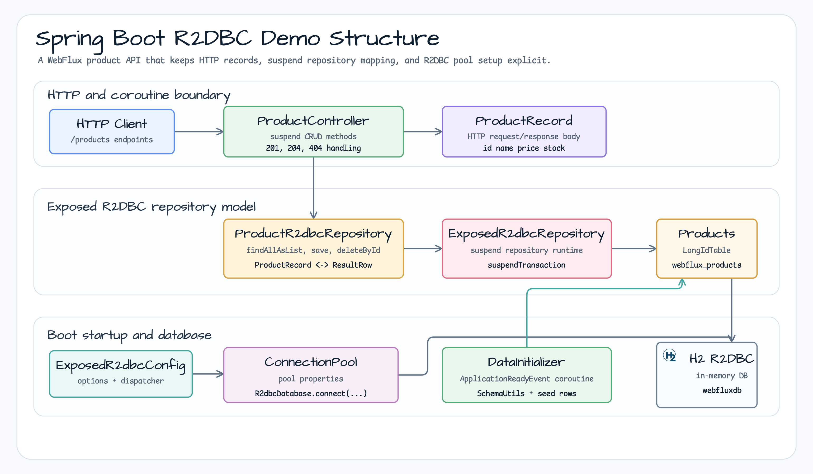
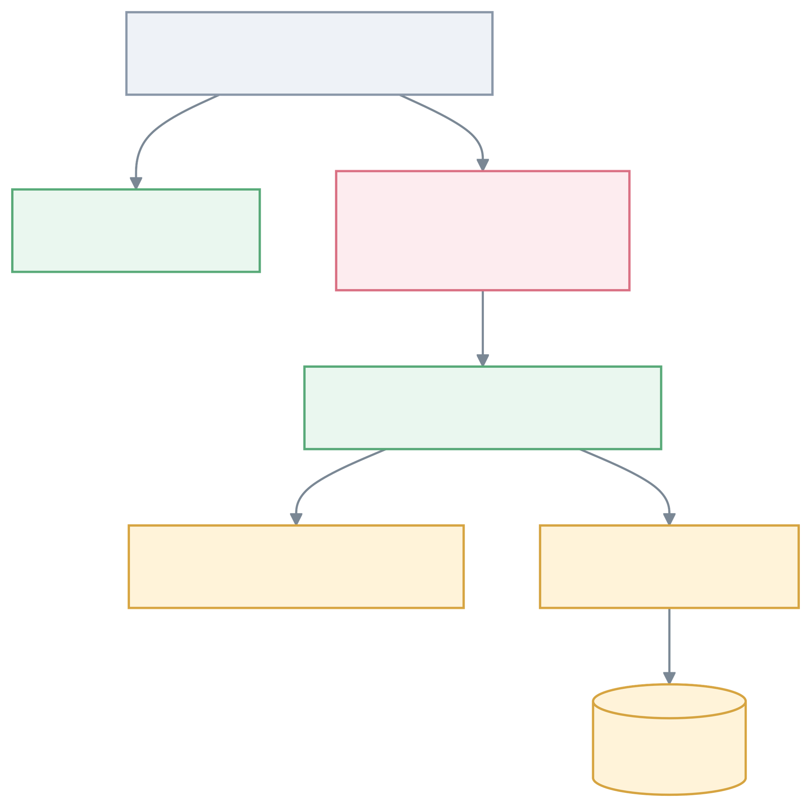

# exposed-spring-boot-r2dbc-demo

English | [한국어](./README.ko.md)

Exposed R2DBC + suspend Repository + Spring WebFlux Integration Demo (Spring Boot 4)

## Overview

This module demonstrates a Spring WebFlux product API built on **Exposed R2DBC** and Kotlin coroutine `suspend`
functions. The repository maps `ProductRecord` values to the `Products` table, while Spring Boot supplies the
WebFlux runtime, R2DBC pool configuration, and platform dependency management through the **Spring Boot BOM**.

## Demo Structure



## WebFlux Suspend Request Flow



## Key Characteristics

- **Exposed R2DBC-based**: `ProductRecord` and `Products` table definitions
- **Suspend functions**: All Repository and Controller methods are Kotlin coroutine `suspend` functions
- **ExposedR2dbcRepository**: record-centric row mapping implementation
- **Spring WebFlux**: Async non-blocking REST API
- **Coroutines**: R2DBC database access via `suspendTransaction`
- **Automatic schema creation**: Async initialization after the application is ready
- **Spring Boot compatible**: Spring Boot 4+ platform dependency management

## Project Structure

```
src/main/kotlin/io/bluetape4k/examples/exposed/webflux/
├── WebfluxDemoApplication.kt       # Spring Boot application
├── domain/
│   └── ProductEntity.kt            # ProductRecord + Products table
├── repository/
│   └── ProductR2dbcRepository.kt    # suspend CRUD Repository
├── controller/
│   └── ProductController.kt         # Async REST API
└── config/
    ├── ExposedR2dbcConfig.kt        # R2DBC database configuration
    └── DataInitializer.kt           # Async data initializer
```

## Domain Model

### Products (Exposed R2DBC Table)

```kotlin
object Products : LongIdTable("webflux_products") {
    val name = varchar("name", 255)
    val price = decimal("price", 10, 2)
    val stock = integer("stock").default(0)
}
```

### ProductRecord (HTTP Record)

```kotlin
data class ProductRecord(
    val id: Long? = null,
    val name: String,
    val price: java.math.BigDecimal = java.math.BigDecimal.ZERO,
    val stock: Int = 0,
) : java.io.Serializable
```

The repository extracts the ID through `extractId(entity)`.

## Repository

### ExposedR2dbcRepository Implementation

```kotlin
interface ProductR2dbcRepository: ExposedR2dbcRepository<ProductRecord, Long> {
    override val table: IdTable<Long> get() = Products

    override fun extractId(entity: ProductRecord): Long? = entity.id

    override fun toDomain(row: ResultRow): ProductRecord =
        ProductRecord(
            id = row[Products.id].value,
            name = row[Products.name],
            price = row[Products.price],
            stock = row[Products.stock],
        )

    override fun toPersistValues(domain: ProductRecord): Map<Column<*>, Any?> =
        mapOf(
            Products.name to domain.name,
            Products.price to domain.price,
            Products.stock to domain.stock,
        )
}
```

All Repository methods are `suspend` functions:

```kotlin
suspend fun findAll(): List<ProductRecord>
suspend fun findByIdOrNull(id: Long): ProductRecord?
suspend fun save(entity: ProductRecord): ProductRecord
suspend fun deleteById(id: Long)
```

## REST API

### Basic CRUD

| Method | Path             | Description                    |
|--------|------------------|--------------------------------|
| GET    | `/products`      | List all products (async)      |
| GET    | `/products/{id}` | Get a specific product (async) |
| POST   | `/products`      | Create a product (async)       |
| PUT    | `/products/{id}` | Update a product (async)       |
| DELETE | `/products/{id}` | Delete a product (async)       |

All endpoints are `suspend` functions; Spring WebFlux handles coroutines automatically.

### Request/Response Examples

**List all products (async)**

```bash
curl http://localhost:8080/products
```

Response:

```json
[
  {
    "id": 1,
    "name": "Kotlin Coroutines Book",
    "price": 39.99,
    "stock": 100
  },
  {
    "id": 2,
    "name": "Spring WebFlux Guide",
    "price": 49.99,
    "stock": 50
  }
]
```

**Create a product (async)**

```bash
curl -X POST http://localhost:8080/products \
  -H "Content-Type: application/json" \
  -d '{
    "name": "Reactive Programming",
    "price": 29.99,
    "stock": 200
  }'
```

Response (201 Created):

```json
{
  "id": 3,
  "name": "Reactive Programming",
  "price": 29.99,
  "stock": 200
}
```

**Update a product (async)**

```bash
curl -X PUT http://localhost:8080/products/1 \
  -H "Content-Type: application/json" \
  -d '{
    "name": "Advanced Kotlin Coroutines",
    "price": 49.99,
    "stock": 150
  }'
```

**Delete a product (async)**

```bash
curl -X DELETE http://localhost:8080/products/1
```

## Running the Application

### Prerequisites

- Java 21+
- Gradle 8.x+
- Spring Boot 4+

### Build

```bash
./gradlew :exposed-spring-boot-r2dbc-demo:build
```

### Run the Application

```bash
./gradlew :exposed-spring-boot-r2dbc-demo:bootRun
```

Or run as a JAR:

```bash
./gradlew :exposed-spring-boot-r2dbc-demo:assemble
java -jar examples/r2dbc-demo/build/libs/exposed-r2dbc-spring-data-webflux-demo-*.jar
```

### Default Port

The application starts on port `8080` by default.

### Initial Data

After the application is ready (`ApplicationReadyEvent`), three sample products are asynchronously created:

```
1. Kotlin Coroutines Book - $39.99 (100 in stock)
2. Spring WebFlux Guide - $49.99 (50 in stock)
3. Reactive Programming - $29.99 (200 in stock)
```

## Database

The application uses an **H2 R2DBC in-memory database** by default. This can be changed in `application.yml`.

### application.yml

```yaml
spring:
  datasource:
    url: jdbc:h2:mem:webfluxdb;DB_CLOSE_DELAY=-1;DB_CLOSE_ON_EXIT=FALSE
    driver-class-name: org.h2.Driver
  r2dbc:
    url: r2dbc:h2:mem:///webfluxdb;DB_CLOSE_DELAY=-1;DB_CLOSE_ON_EXIT=FALSE;MODE=LEGACY
    username: sa
    password:
```

### Switching to PostgreSQL

```yaml
spring:
  r2dbc:
    url: r2dbc:postgresql://localhost:5432/exposed_demo
    username: postgres
    password: password
  datasource:
    url: jdbc:postgresql://localhost:5432/exposed_demo
    driver-class-name: org.postgresql.Driver
    username: postgres
    password: password
```

And in `build.gradle.kts`:

```kotlin
implementation("org.postgresql:r2dbc-postgresql")
runtimeOnly("org.postgresql:postgresql")
```

## Testing

### Run Unit Tests

```bash
./gradlew :exposed-spring-boot-r2dbc-demo:test
```

### Coroutine Tests

All tests run within `runTest { ... }` blocks to support coroutines.

```bash
./gradlew :exposed-spring-boot-r2dbc-demo:test --tests "ProductControllerTest"
```

## Core Patterns

### Suspend Function-based

All Repository and Controller methods are `suspend` functions.

```kotlin
@GetMapping("/{id}")
suspend fun findById(@PathVariable id: Long): ProductRecord =
    productRepository.findByIdOrNull(id)
        ?: throw ResponseStatusException(HttpStatus.NOT_FOUND, "Product not found: $id")
```

Spring WebFlux handles coroutines automatically.

### suspendTransaction

R2DBC database access is wrapped with `suspendTransaction`.

```kotlin
@PutMapping("/{id}")
suspend fun update(@PathVariable id: Long, @RequestBody dto: ProductRecord): ProductRecord =
    suspendTransaction {
        val existing = productRepository.findByIdOrNull(id)
            ?: throw ResponseStatusException(HttpStatus.NOT_FOUND, "Product not found: $id")
        productRepository.save(dto.copy(id = existing.id ?: id))
    }
```

### Async Initialization

Data initialization runs in a separate coroutine on `ApplicationReadyEvent`, avoiding blocking the startup thread.

```kotlin
@Component
class DataInitializer(private val r2dbcDatabase: R2dbcDatabase) {
    private val scope = CoroutineScope(SupervisorJob() + Dispatchers.IO)

    @EventListener(ApplicationReadyEvent::class)
    fun onApplicationReady(event: ApplicationReadyEvent) {
        scope.launch {
            initializeData()
        }
    }
}
```

## Record Mapping

Repository methods are record-centric, so you must implement Row -> `ProductRecord` conversion.

```kotlin
override fun toDomain(row: ResultRow): ProductRecord =
    ProductRecord(
        id = row[Products.id].value,
        name = row[Products.name],
        price = row[Products.price],
        stock = row[Products.stock],
    )

override fun toPersistValues(domain: ProductRecord): Map<Column<*>, Any?> =
    mapOf(
        Products.name to domain.name,
        Products.price to domain.price,
        Products.stock to domain.stock,
    )
```

## Spring Boot 4 Notes

### BOM Change

`build.gradle.kts`:

```kotlin
dependencies {
    // Use Spring Boot BOM
    implementation(platform(Libs.spring_boot_dependencies))

    // Other dependencies remain the same
    implementation("io.github.bluetape4k.exposed:bluetape4k-exposed-spring-boot-r2dbc:${bluetape4kVersion}")
    implementation(Libs.springBootStarter("webflux"))
}
```

### Platform Management

The Spring Boot BOM keeps the WebFlux, R2DBC, test, and Spring Framework versions aligned:

- Spring Boot 4+
- Java 21+
- Spring WebFlux
- Spring R2DBC
- Spring Boot Test

## Important Notes

1. **No runBlocking in suspend functions**: Spring WebFlux handles this automatically.

2. **R2DBC driver**: The R2DBC driver for your target database must be on the classpath.

3. **Use suspendTransaction**: Use `suspendTransaction` when a transaction is required.

4. **Spring Boot platform**: Use `implementation(platform(...))` instead of `dependencyManagement { imports }`.

## Dependencies

```kotlin
dependencies {
    implementation(platform(Libs.spring_boot_dependencies))
    implementation("io.github.bluetape4k.exposed:bluetape4k-exposed-spring-boot-r2dbc:${bluetape4kVersion}")
    implementation(Libs.springBootStarter("webflux"))
    implementation(Libs.exposed_spring_boot_starter)
    implementation(Libs.exposed_r2dbc)
    runtimeOnly(Libs.h2_r2dbc)

    testImplementation(Libs.springBootStarter("test"))
}
```

## References

- [Exposed R2DBC Documentation](https://github.com/JetBrains/Exposed)
- [Spring Boot Migration Guide](https://spring.io/blog/2023/09/06/spring-boot-4-0-m1-released)
- [Spring WebFlux Guide](https://spring.io/projects/spring-webflux)
- [Kotlin Coroutines Official Documentation](https://kotlinlang.org/docs/coroutines-overview.html)
- [R2DBC Specification](https://r2dbc.io/)
