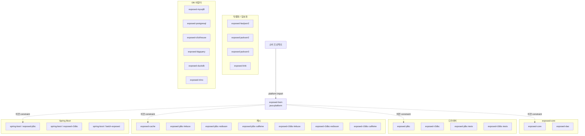

# exposed-bom

한국어 | [English](./README.md)

Exposed extension 생태계용 Maven BOM (Bill of Materials). 모든 `io.github.bluetape4k.exposed:*`
모듈의 버전을 중앙 관리한다.

## Architecture



BOM은 Gradle `java-platform` 으로 `<dependencyManagement>` constraint 만 게시한다.

## 핵심 기능

- 모든 `exposed-*` 모듈 버전 중앙 관리
- JetBrains Exposed 확장 (JDBC + R2DBC) 버전 일관성 보장
- `bluetape4k-dependencies` 가 상위에서 통합

## 관리 모듈

| 그룹 | 모듈 |
|------|------|
| 코어 | `exposed-core`, `exposed-dao` |
| 드라이버 | `exposed-jdbc`, `exposed-r2dbc`, `exposed-jdbc-tests`, `exposed-r2dbc-tests` |
| 캐시 | `exposed-cache`, `exposed-jdbc-{lettuce,redisson,caffeine}`, `exposed-r2dbc-{lettuce,redisson,caffeine}` |
| 직렬화 | `exposed-fastjson2`, `exposed-jackson2`, `exposed-jackson3` |
| 암호화 | `exposed-tink` |
| DB 어댑터 | `exposed-{mysql8,postgresql,clickhouse,bigquery,duckdb,trino,measured,timefold-solver-persistence}` |
| Spring Boot | `exposed-spring-boot-{jdbc,r2dbc}`, `exposed-spring-boot-batch` |
| 유틸 | `exposed-batch` |

> 참고: `examples/*` 및 `*-demo` 모듈은 BOM constraint 에서 제외된다.

## 사용 예제

### Gradle Kotlin DSL

```kotlin
plugins {
    id("io.spring.dependency-management") version "1.1.x"
}

dependencyManagement {
    imports {
        mavenBom("io.github.bluetape4k.exposed:exposed-bom:<version>")
    }
}

dependencies {
    implementation("io.github.bluetape4k.exposed:exposed-jdbc")
    implementation("io.github.bluetape4k.exposed:exposed-cache")
    implementation("io.github.bluetape4k.exposed:exposed-jdbc-redisson")
}
```

### 순수 Gradle

```kotlin
dependencies {
    implementation(platform("io.github.bluetape4k.exposed:exposed-bom:<version>"))
    implementation("io.github.bluetape4k.exposed:exposed-jdbc")
}
```

### Maven

```xml
<dependencyManagement>
    <dependencies>
        <dependency>
            <groupId>io.github.bluetape4k.exposed</groupId>
            <artifactId>exposed-bom</artifactId>
            <version>${exposed.version}</version>
            <type>pom</type>
            <scope>import</scope>
        </dependency>
    </dependencies>
</dependencyManagement>
```

## 설정 옵션

BOM 자체는 별도 설정이 없다. SNAPSHOT 사용 시 Sonatype Central Snapshots 저장소 추가:

```kotlin
repositories {
    mavenCentral()
    maven {
        name = "central-snapshots"
        url = uri("https://central.sonatype.com/repository/maven-snapshots/")
    }
}
```

## 의존성

이 BOM은 `bluetape4k-dependencies` 에서 자동 통합된다. 여러 bluetape4k 생태계를 함께 사용한다면
`io.github.bluetape4k:bluetape4k-dependencies` import 권장.
