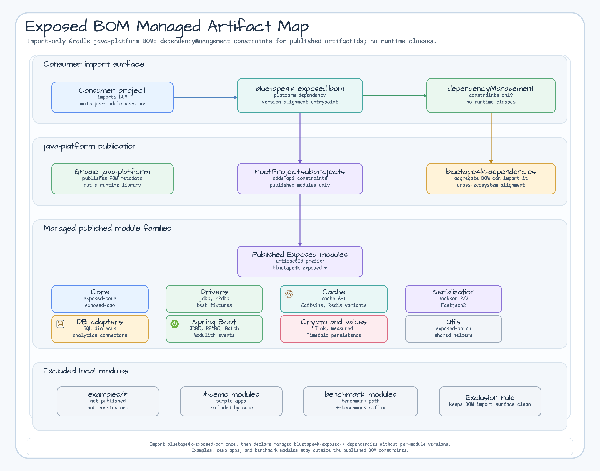

# bluetape4k-exposed-bom

[한국어](./README.ko.md) | English

Maven BOM (Bill of Materials) for the Exposed extension ecosystem. It manages
published `io.github.bluetape4k.exposed:bluetape4k-exposed-*` artifact versions
so consumers can declare modules without repeating individual versions.

## Managed Artifact Map



The BOM is a Gradle `java-platform` that publishes only `<dependencyManagement>` constraints — no runtime classes.

## Core Features

- Centralized version management for all `exposed-*` modules
- Single source of truth for JetBrains Exposed extensions (JDBC + R2DBC)
- Aggregated by `bluetape4k-dependencies` for cross-ecosystem version coordination

## Managed ArtifactIds

| Group | ArtifactIds |
|-------|-------------|
| Core | `bluetape4k-exposed-core`, `bluetape4k-exposed-dao` |
| Repository runtimes | `bluetape4k-exposed-jdbc`, `bluetape4k-exposed-r2dbc`, `bluetape4k-exposed-jdbc-tests`, `bluetape4k-exposed-r2dbc-tests` |
| Cache decorators | `bluetape4k-exposed-cache`, `bluetape4k-exposed-jdbc-caffeine`, `bluetape4k-exposed-jdbc-lettuce`, `bluetape4k-exposed-jdbc-redisson`, `bluetape4k-exposed-r2dbc-caffeine`, `bluetape4k-exposed-r2dbc-lettuce`, `bluetape4k-exposed-r2dbc-redisson` |
| Column codecs | `bluetape4k-exposed-jackson2`, `bluetape4k-exposed-jackson3`, `bluetape4k-exposed-fastjson2`, `bluetape4k-exposed-tink`, `bluetape4k-exposed-measured` |
| Dialects and analytics | `bluetape4k-exposed-postgresql`, `bluetape4k-exposed-mysql8`, `bluetape4k-exposed-cockroachdb`, `bluetape4k-exposed-bigquery`, `bluetape4k-exposed-clickhouse`, `bluetape4k-exposed-trino`, `bluetape4k-exposed-starrocks`, `bluetape4k-exposed-duckdb` |
| Persistence integration | `bluetape4k-exposed-timefold-solver-persistence` |
| Spring Boot | `bluetape4k-exposed-spring-boot-jdbc`, `bluetape4k-exposed-spring-boot-r2dbc`, `bluetape4k-exposed-spring-boot-batch`, `bluetape4k-exposed-spring-modulith` |
| Utils | `bluetape4k-exposed-batch` |

> Note: `examples/*` and `*-demo` modules are excluded from the BOM constraints.

## Usage Examples

### Gradle Kotlin DSL

```kotlin
plugins {
    id("io.spring.dependency-management") version "1.1.x"
}

dependencyManagement {
    imports {
        mavenBom("io.github.bluetape4k.exposed:bluetape4k-exposed-bom:<version>")
    }
}

dependencies {
    implementation("io.github.bluetape4k.exposed:bluetape4k-exposed-jdbc")
    implementation("io.github.bluetape4k.exposed:bluetape4k-exposed-cache")
    implementation("io.github.bluetape4k.exposed:bluetape4k-exposed-jdbc-redisson")
}
```

### Plain Gradle

```kotlin
dependencies {
    implementation(platform("io.github.bluetape4k.exposed:bluetape4k-exposed-bom:<version>"))
    implementation("io.github.bluetape4k.exposed:bluetape4k-exposed-jdbc")
}
```

### Maven

```xml
<dependencyManagement>
    <dependencies>
        <dependency>
            <groupId>io.github.bluetape4k.exposed</groupId>
            <artifactId>bluetape4k-exposed-bom</artifactId>
            <version>${exposed.version}</version>
            <type>pom</type>
            <scope>import</scope>
        </dependency>
    </dependencies>
</dependencyManagement>
```

## Configuration Options

The BOM itself has no configuration. For SNAPSHOT builds, add the Sonatype Central Snapshots repository:

```kotlin
repositories {
    mavenCentral()
    maven {
        name = "central-snapshots"
        url = uri("https://central.sonatype.com/repository/maven-snapshots/")
    }
}
```

## Dependency

This BOM is automatically aggregated by `bluetape4k-dependencies`. Prefer importing
`io.github.bluetape4k:bluetape4k-dependencies` when consuming multiple bluetape4k ecosystems.
