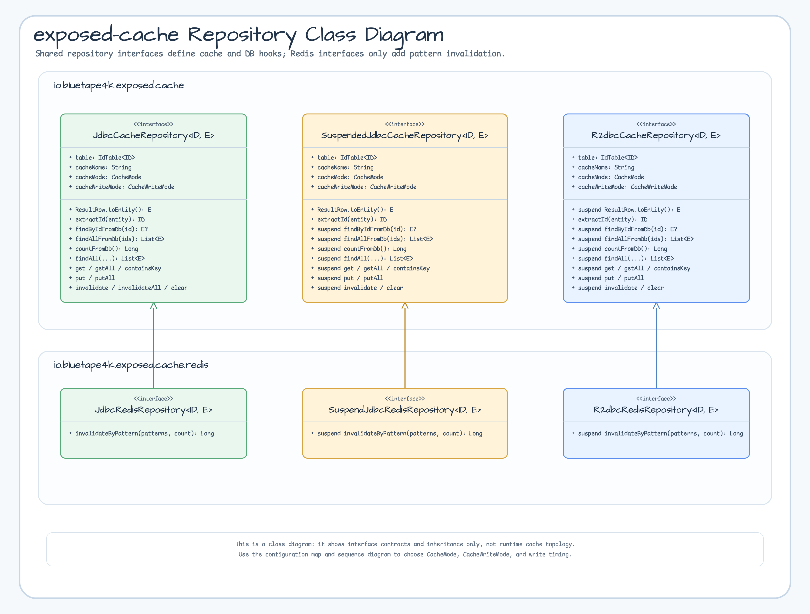
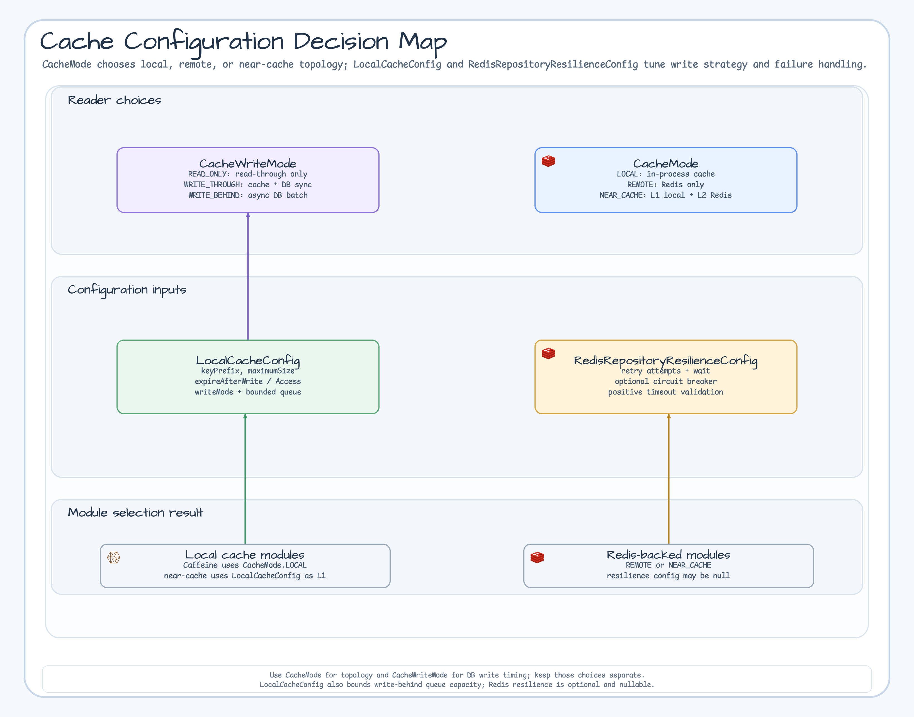
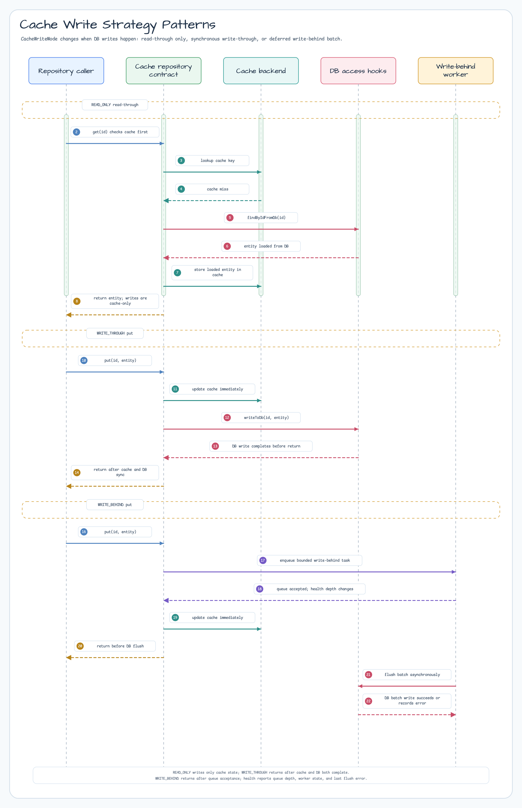

# exposed-cache

[English](./README.md) | 한국어

[](https://central.sonatype.com/artifact/io.github.bluetape4k.exposed/bluetape4k-exposed-cache)

## 개요

`exposed-cache`는 캐시 기반 Exposed 저장소를 위한 **핵심 인터페이스와 공통 설정**을 정의합니다.

**캐시 백엔드에 독립적**으로 설계되어, 동일한 인터페이스를 로컬 캐시(Caffeine)와 분산 캐시(Redis — Lettuce/Redisson) 모듈이 모두 구현합니다. 각 캐시 모듈은 이 허브 모듈에 의존하며, 백엔드 특화 구현만 추가합니다.

## 모듈 생태계

| 모듈 | 캐시 백엔드 | 캐시 모드 | DB 접근 | Suspend 지원 |
|------|-----------|---------|--------|-------------|
| `exposed-jdbc-caffeine` | Caffeine (로컬) | `LOCAL` | JDBC | sync + suspend |
| `exposed-r2dbc-caffeine` | Caffeine (로컬) | `LOCAL` | R2DBC | suspend 전용 |
| `exposed-jdbc-lettuce` | Redis (Lettuce) | `REMOTE` / `NEAR_CACHE` | JDBC | sync + suspend |
| `exposed-r2dbc-lettuce` | Redis (Lettuce) | `REMOTE` | R2DBC | suspend 전용 |
| `exposed-jdbc-redisson` | Redis (Redisson) | `REMOTE` / `NEAR_CACHE` | JDBC | sync + suspend |
| `exposed-r2dbc-redisson` | Redis (Redisson) | `REMOTE` | R2DBC | suspend 전용 |

## 다이어그램

### Repository Interface Class Diagram

공통 캐시 저장소 계약과 Redis 전용 확장 인터페이스를 UML 스타일 class diagram으로 정리했습니다.



### Cache Configuration Decision Map

`CacheMode`, `CacheWriteMode`, 로컬 캐시 제한, 선택적 Redis resilience 설정은 상속 구조가 아니라 설정 선택지입니다.



## CacheMode

| 값 | 설명 |
|----|------|
| `LOCAL` | 인프로세스 캐시만 사용 (Caffeine). 가장 빠르지만 JVM 프로세스 간 공유 불가. |
| `REMOTE` | 원격 캐시만 사용 (Redis). 모든 인스턴스에서 공유. |
| `NEAR_CACHE` | L1 로컬 캐시 + L2 Redis. 네트워크 왕복을 줄여 읽기 성능 극대화. Lettuce/Redisson 모듈에서 지원. |

## CacheWriteMode

| 값 | 읽기 | 쓰기 |
|----|------|------|
| `READ_ONLY` | Read-through: 캐시 미스 시 DB에서 로드 후 캐싱 | 캐시만 갱신 — DB 쓰기 없음 |
| `WRITE_THROUGH` | Read-through | 캐시 + DB 동기 쓰기 |
| `WRITE_BEHIND` | Read-through | 캐시 즉시 쓰기, DB는 비동기 배치 쓰기 |

## LocalCacheConfig

로컬(인프로세스) 캐시 구현체의 공통 설정입니다. Caffeine 모듈은 이를 직접 사용하며, Redis 모듈은 L1 NearCache 설정으로 활용합니다.

| 프로퍼티 | 기본값 | 설명 |
|---------|-------|------|
| `keyPrefix` | `"local"` | 캐시 키 접두사 |
| `maximumSize` | `10_000` | 캐시 최대 항목 수 |
| `expireAfterWrite` | `10분` | 마지막 쓰기 이후 TTL |
| `expireAfterAccess` | `null` (비활성) | 마지막 접근 이후 TTL |
| `writeMode` | `READ_ONLY` | 쓰기 전략 (`READ_ONLY` / `WRITE_THROUGH` / `WRITE_BEHIND`) |
| `writeBehindBatchSize` | `100` | Write-Behind flush 배치 크기 |
| `writeBehindQueueCapacity` | `10_000` | Write-Behind 큐 용량 (무제한 금지) |

**사전 정의 상수**:

```kotlin
LocalCacheConfig.READ_ONLY      // writeMode = READ_ONLY
LocalCacheConfig.WRITE_THROUGH  // writeMode = WRITE_THROUGH
LocalCacheConfig.WRITE_BEHIND   // writeMode = WRITE_BEHIND
```

## RedisRepositoryResilienceConfig

Redis 기반 저장소의 선택적 Resilience 설정입니다. `null`(기본값)로 설정하면 Resilience 래핑을 비활성화합니다.

| 프로퍼티 | 기본값 | 설명 |
|---------|-------|------|
| `retryMaxAttempts` | `3` | Redis 장애 시 최대 재시도 횟수 |
| `retryWaitDuration` | `500ms` | 재시도 대기 시간 |
| `retryExponentialBackoff` | `true` | 지수 백오프 사용 여부 |
| `circuitBreakerEnabled` | `false` | Circuit Breaker 활성화 여부 |
| `timeoutDuration` | `2초` | Redis 작업 타임아웃 |

`retryMaxAttempts`는 1 이상이어야 하며, `retryWaitDuration`과 `timeoutDuration`은 양수여야 합니다.

## 쓰기 전략 흐름



<!-- SNAPSHOT-CACHE-CONTRACT -->
## 트랜잭션 인식 스냅샷 캐시 (opt-in)

스냅샷 캐시 API는 캐시만 다루는 opt-in 경로입니다. 기존 `JdbcCacheRepository`, `R2dbcCacheRepository`,
Caffeine Repository, Redis Repository의 동작을 바꾸거나 데이터를 이전하지 않습니다. 조회 결과를 분리된 불변
DTO로 복사하고, 바깥쪽 Exposed 트랜잭션이 커밋된 뒤에만 공개할 수 있을 때 사용합니다.

| 경계 | Exposed 트랜잭션 로컬 `EntityCache` | 애플리케이션 스냅샷 Near Cache |
|---|---|---|
| 수명 | Exposed 트랜잭션 하나 | 한 프로세스의 여러 트랜잭션. 무효화를 붙이면 여러 노드 |
| 값 | 관리 중인 DAO `Entity` 상태 | 분리된 직렬화 가능 DTO를 담은 `CacheSnapshot` |
| 공개 시점 | 트랜잭션 내부 | 커밋하면 공개하고 롤백하면 폐기 |
| 일관성 역할 | Exposed 안에서 같은 엔티티를 추적하고 변경 사항을 관리 | 복구 책임을 애플리케이션이 맡는 읽기 최적화 |

`CacheSnapshotMapper`는 현재 최상위 트랜잭션에서 실행됩니다. 필요한 필드는 이때 모두 복사해야 합니다.
DAO `Entity`, 트랜잭션, 요청 객체, 지연 로딩 관계, 변경 가능한 영속성 객체를 보관하면 안 됩니다.
기본 `rejectDirectEntitySnapshotValues()` validator는 최상위 값으로 직접 전달한 `Entity`를 거부합니다. 값 전체를
깊은 불변 상태로 만드는 책임은 애플리케이션에 있습니다. 캐시 작업을 적용하는 후처리에서는 DB에 쓰지 않습니다.

`SnapshotCacheConfig`에는 스냅샷 저장소가 공유할 namespace와 transaction 제한, schema version
(Redisson compatibility fingerprint에 포함됨)을 지정합니다.
로컬 Caffeine 저장소의 용량과 만료 정책은 `CaffeineSnapshotCacheConfig`에 추가로 지정합니다. 호출자가 소유할 실패
queue는 `snapshotCacheFailureBuffer(capacity)`로 만들고 `SnapshotCacheFailureBuffer`로 노출합니다.

안전한 miss 경로에서는 조회 실패 시 받은 권한을 한 번만 쓸 수 있습니다.

1. DB 작업 전에 `lookup(id)`를 호출합니다. `maxOutstandingMissTokens`가 소진되면 DB 읽기를 시작하기 전에 실패합니다.
2. miss라면 현재 최상위 트랜잭션에서 DB를 읽고 `stageSnapshot`을 호출합니다. 불투명한 `SnapshotCacheMiss`는
   일회용입니다. 값 변환, 검증, 준비 작업이 실패해도 다시 쓸 수 없습니다.
3. 스냅샷을 채우는 트랜잭션은 `maxAttempts = 1`이어야 합니다. 일시적인 DB 장애 재시도는 트랜잭션 바깥에 두고,
   바깥쪽 시도마다 새로 `lookup`해야 합니다. 중첩 트랜잭션과 savepoint를 쓰는 트랜잭션은 거부됩니다.
4. 커밋하면 준비한 작업을 적용하고, 롤백하거나 Exposed 시도가 실패하면 폐기합니다. 무효화도 시도별로 분리되므로
   Exposed 재시도가 성공한 한 번만 공개됩니다. 같은 key를 여러 번 바꾸면 마지막 변경만 반영합니다.
5. 프로세스 로컬 fence는 더 새로운 로컬 mutation 뒤에 도착한 늦은 fill을 거부합니다. 분산 lock이 아니며
   직렬화하지 않습니다.

앞서 등록된 트랜잭션 후처리가 예외를 던지면 캐시 후처리가 실행되지 않아 이전 캐시 값이 남을 수 있습니다.
`maxStagedMutations`, `maxParticipatingStores`, 선택적 staged weight, `localDrainBudget`, 처리 중인 miss 용량으로
보관 작업을 제한합니다. 커밋 뒤 캐시 실패는 호출자가 소유하고 용량이 제한된 `SnapshotCacheFailureBuffer`에 들어가며
`drainTo`로 꺼냅니다. 이미 커밋된 DB 결과는 바뀌지 않습니다.

공개 실패/상태 정보에는 크기가 제한된 구조 정보와, 안전할 때 exception type만 남습니다. exception text,
stack trace, payload, identifier, SQL, URL, endpoint, credential은 보관하지 않습니다. identifier나 payload에서 만든
값을 metric tag로 사용하면 안 됩니다.

commit-safe는 롤백할 때 공개하지 않고 커밋을 공개 경계로 삼는다는 뜻입니다. DB와 캐시의 원자성을 보장하지 않고,
crash durability도 제공하지 않습니다. 커밋 뒤 캐시 실패를 처리하는 애플리케이션 소유 outbox나 repair path를
대체하지도 않습니다.

## testFixtures 시나리오

`exposed-cache`는 모든 구현 모듈이 재사용할 수 있는 테스트 시나리오 클래스를 testFixtures로 제공합니다.

| 시나리오 클래스 | 대상 인터페이스 | 커버 시나리오 |
|--------------|--------------|------------|
| `JdbcCacheTestScenario` | `JdbcCacheRepository` | Read-through, Write-through, Write-behind, invalidate |
| `JdbcReadThroughScenario` | `JdbcCacheRepository` | 캐시 미스 → DB 로드, 캐시 히트, getAll 부분 미스 |
| `JdbcWriteThroughScenario` | `JdbcCacheRepository` | put / putAll → DB 즉시 반영 |
| `JdbcWriteBehindScenario` | `JdbcCacheRepository` | put → 캐시 즉시, DB 비동기 flush |
| `SuspendedJdbcCacheTestScenario` | `SuspendedJdbcCacheRepository` | 위와 동일, suspend 버전 |
| `SuspendedJdbcReadThroughScenario` | `SuspendedJdbcCacheRepository` | suspend Read-through 시나리오 |
| `SuspendedJdbcWriteThroughScenario` | `SuspendedJdbcCacheRepository` | suspend Write-through 시나리오 |
| `SuspendedJdbcWriteBehindScenario` | `SuspendedJdbcCacheRepository` | suspend Write-behind 시나리오 |
| `R2dbcCacheTestScenario` | `R2dbcCacheRepository` | R2DBC 전체 시나리오 |
| `R2dbcReadThroughScenario` | `R2dbcCacheRepository` | R2DBC Read-through |
| `R2dbcWriteThroughScenario` | `R2dbcCacheRepository` | R2DBC Write-through |
| `R2dbcWriteBehindScenario` | `R2dbcCacheRepository` | R2DBC Write-behind |

**테스트에서 재사용**:

```kotlin
// build.gradle.kts
testImplementation(testFixtures("io.github.bluetape4k.exposed:bluetape4k-exposed-cache"))

// 모듈 테스트에서 시나리오 상속
class MyCaffeineReadThroughTest : JdbcReadThroughScenario() {
    override val repo = ActorCaffeineRepository(LocalCacheConfig.WRITE_THROUGH)
}
```

## 모듈 선택 가이드

| 상황 | 권장 모듈 |
|------|---------|
| 단일 인스턴스, Redis 없음 | `exposed-jdbc-caffeine` / `exposed-r2dbc-caffeine` |
| 분산 캐시, Redis 있음 | `exposed-jdbc-lettuce` / `exposed-r2dbc-lettuce` |
| L1(로컬) + L2(Redis) NearCache | `exposed-jdbc-lettuce` (nearCacheEnabled=true) |
| R2DBC + Redis | `exposed-r2dbc-lettuce` / `exposed-r2dbc-redisson` |
| 패턴 기반 캐시 무효화 필요 | Redis 계열 (`invalidateByPattern`) |
| Redisson 기능(분산 락 등) 필요 | `exposed-jdbc-redisson` / `exposed-r2dbc-redisson` |

## Cache Worker State Migration

`CacheHealthReport.isFlushJobRunning`은 stable release 전에 제거됐습니다.
호환 alias 없이 `workerState`를 직접 읽으세요.

```kotlin
val healthy = report.lastFlushError == null && report.workerState in setOf(
    CacheWorkerState.NOT_APPLICABLE,
    CacheWorkerState.IDLE,
    CacheWorkerState.RUNNING,
)
```

`NOT_APPLICABLE`은 설정된 mode에 background worker가 없다는 뜻입니다. 새로 만든
`IDLE` worker는 flush를 실행하지 않아도 정상이고, `RUNNING`은 작업을 받은 뒤에도
사용할 수 있는 상태입니다. `DRAINING`은 받은 write를 마무리하는 중이고, `FAILED`는
worker의 terminal failure, `STOPPED`는 더 이상 작업을 받지 않는 종료 상태입니다.
기존 Boolean으로는 이 상태들을 구분할 수 없습니다. 호환 alias를 남기면 lifecycle
모델이 없애려던 종료와 장애의 모호함이 다시 생깁니다.

## 모듈 링크

- [exposed-jdbc-caffeine](../exposed-jdbc-caffeine/README.ko.md) — JDBC + Caffeine 로컬 캐시
- [exposed-r2dbc-caffeine](../exposed-r2dbc-caffeine/README.ko.md) — R2DBC + Caffeine 로컬 캐시
- [exposed-jdbc-lettuce](../exposed-jdbc-lettuce/README.ko.md) — JDBC + Lettuce Redis 캐시
- [exposed-r2dbc-lettuce](../exposed-r2dbc-lettuce/README.ko.md) — R2DBC + Lettuce Redis 캐시

## 의존성

```kotlin
dependencies {
    api("io.github.bluetape4k.exposed:bluetape4k-exposed-cache")
}
```

애플리케이션이 `bluetape4k-dependencies` BOM 버전을 소유하므로 모듈 좌표에는 버전을 쓰지 않습니다.
