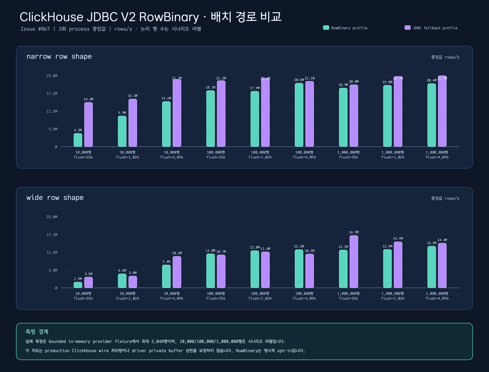

[English](./README.md) | 한국어

# exposed-clickhouse

ClickHouse JDBC를 위한 Kotlin/Exposed 다이얼렉트입니다. Exposed의 테이블/쿼리 문법은 유지하면서 ClickHouse 엔진 절, 전용 컬럼 타입, 집계/날짜 함수, 블로킹 JDBC 작업을 코루틴에서 다루기 위한 헬퍼를 제공합니다.

## 아키텍처


## 주요 기능

- **ClickHouseDatabase** — `connect(host, port, database)` 및 `connect(jdbcUrl)` 팩토리 함수로 JDBC 연결 설정
- **ClickHouseTable** — `engine: ClickHouseEngine` 파라미터를 받는 추상 기본 클래스; DDL 정제 및 ENGINE 절 주입 처리
- **MergeTree 엔진 DSL** — `mergeTree {}`, `replacingMergeTree {}`, `summingMergeTree {}`, `aggregatingMergeTree {}`, `Log`, `TinyLog`, `Memory` 타입 안전 DSL
- **풍부한 컬럼 타입** — `String`, `FixedString(N)`, `Int8`–`Int64`, `UInt8`–`UInt64`, `Float32/64`, `DateTime64`, `Date32`, `LowCardinality(T)`, `Array(T)`, `Nullable(T)`
- **날짜 함수** — `toYYYYMM()`, `dateDiff(unit, start, end)`, `toStartOfInterval()`
- **집계 함수** — `argMax()`, `argMin()`, `quantile(level)()`, `uniq()`, `uniqExact()`
- **코루틴 헬퍼** — `suspendTransaction {}`은 호출자가 선택한 dispatcher에서 blocking JDBC를 실행하고, `queryList {}`는 전체 결과를 수집하며, `queryFlow(query = ..., mapper = ...)`는 변환한 행을 점진적으로 전달합니다. 기존 `queryFlow {}`의 전체 수집 동작은 유지합니다.

### ClickHouse JDBC V2 연결 옵션

`ClickHouseV2Options`는 불변 `AbstractValueObject`입니다. 연결을 열기 전에
ClickHouse JDBC V2 property 경계를 검증하고 collection 입력을 방어적으로
복사합니다. options overload는 기존 `connect` overload와 분리되어 기존 소스와
JVM descriptor를 그대로 유지합니다.

```kotlin
val options = ClickHouseV2Options(
    connectionTimeoutMillis = 1_500,
    socketOperationTimeoutMillis = 2_000,
    connectionPoolEnabled = true,
    maxOpenConnections = 8,
    clientName = "analytics-api",
    customHeaders = mapOf("X-ClickHouse-User-Agent" to "bluetape/analytics"),
)

val database = ClickHouseDatabase.connect(
    host = "localhost",
    port = 8123,
    database = "analytics",
    user = "default",
    password = "",
    options = options,
)
```

typed field는 `connection_timeout`, `socket_timeout`,
`connection_request_timeout`, `connection_ttl`, `http_keep_alive_timeout`,
압축/재시도 설정, `query_id`, `clickhouse_setting_<name>` 같은 V2 property로
변환됩니다. timeout 값은 milliseconds 단위이며 driver가 default로 정의한 경우에만
`0`을 허용합니다. pool limit와 buffer 크기는 양수여야 합니다.

`authentication`은 `Basic`, `AccessToken`, `BearerToken` 중 하나입니다.
Basic 인증은 `user`/`password` 인자를 사용합니다. token mode는 placeholder인
`user = "default"`, `password = ""`만 허용하며 token property와
`http_use_basic_auth=false`만 내보냅니다. credential이나 token 값을
`rawProperties` 또는 JDBC URL query에 넣지 마세요. 알 수 없는 raw key,
RowBinary beta key, typed/raw 중복은 즉시 실패합니다. raw server setting은
`clickhouse_setting_<name>`으로 제한하고 custom header는
`X-ClickHouse-User-Agent`만 허용하며 header value는 로그에 남기지 않습니다.

TLS에는 파일 또는 secret-store reference만 지정하고 인증서/키 본문은 넣지
않습니다. `ClickHouseV2SecretProvider`는 property 변환 순간에만 password를
제공하며 반환된 `CharArray`는 즉시 지웁니다. `toString()`과 연결 예외는
password, token, secret, JDBC URL query 값을 redact합니다. options URL에서
인증 property를 지정하면 선택한 인증 모드를 우회할 수 없도록 거부하며,
인증 이외의 JDBC URL query property는 driver precedence에 따라 가장 높은
우선순위를 가집니다.
`tls`가 있으면 adapter가 driver의 Boolean property `ssl=true`를 설정하고,
선택한 `sslAuthentication`도 driver의 Boolean property로 전달합니다.
`user:password@host`처럼 authority userinfo가 포함된 options URL은 연결 전에
거부하며 오류 경계에는 redacted authority만 남깁니다.

### ClickHouse JDBC V2 RowBinary 배치 writer

`ClickHouseRowBinaryExecutor`는 ClickHouse JDBC V2
`RowBinaryWithDefaults` 경로를 명시적으로 opt-in하는 배치 writer입니다.
호출자가 `ClickHouseConnectionProvider`를 소유하며, RowBinary profile에는
`beta.row_binary_for_simple_insert=true`, JDBC fallback profile에는 `false`를
connection별로 적용해 연결을 엽니다. 이 property는 connection-scoped이므로
`ClickHouseV2Options`에는 의도적으로 포함하지 않습니다.

```kotlin
val writer = ClickHouseRowBinaryExecutor(
    provider = ClickHouseConnectionProvider { rowBinaryEnabled ->
        openConnection(rowBinaryEnabled) // 호출자가 V2 profile property를 적용
    },
    options = ClickHouseRowBinaryOptions(
        enabled = true,
        maxRowsPerFlush = 1_024,
    ),
)

val result = writer.executeBatch(
    sql = "INSERT INTO events (id, label) VALUES (?, ?)",
    rows = events.asSequence().map { event ->
        ClickHouseRowBinaryRow { statement ->
            statement.setLong(1, event.id)
            statement.setString(2, event.label)
        }
    }.asIterable(),
)
```

정확히 하나의 단순한 `INSERT ... VALUES (...)` 그룹만 eligible입니다.
placeholder와 `DEFAULT`는 driver에 위임합니다. `INSERT ... SELECT`, 여러
VALUES 그룹, 중첩 value expression/function, 지원하지 않는 setter, provider
부재, driver capability 미확인은 첫 byte 전에 비활성 JDBC profile을
선택합니다. setter가 실행된 뒤 또는 첫 byte가 기록된 뒤에는 fallback으로
재시도하거나 chunk를 재전송하지 않습니다. setter/first-byte 오류가 나면
해당 executor 인스턴스는 terminal 상태가 되고 원래 예외를 그대로 보존합니다.

`ClickHouseRowBinaryResult.updateCounts`는 `SUCCESS_NO_INFO`와
`EXECUTE_FAILED` 같은 driver sentinel을 보존합니다. `acceptedCount`는
음수가 아닌 count만 합산하며, sentinel이 있으면
`acceptedCountMayBeIncomplete=true`로 기록합니다. writer는 입력을
`maxRowsPerFlush` 단위로 나누고 호출자가 소유한 connection에서
commit/rollback을 수행하지 않으며, 호출자의 pool/dispatcher도 닫지 않습니다.
전송 후 오류가 난 writer 인스턴스는 재사용할 수 없습니다.

실제 profile 테스트는 `clickhouse-jdbc` `0.9.9`와 ClickHouse Server
`26.7.3.19`를 사용하고, opt-in 경로의 driver가 `WriterStatementImpl`인지,
지원하지 않는 SQL이 `PreparedStatementImpl`인지, `DEFAULT` 처리가
동작하는지 확인합니다.

```bash
./gradlew :bluetape4k-exposed-clickhouse:test \
  --tests '*ClickHouseRowBinaryIntegrationTest' \
  -PclickhouseV2Integration=true \
  --no-parallel --max-workers=1 --no-daemon --console=plain
```

bounded fixture benchmark는 논리 행 수 3종 × flush 크기 3종 × row shape
2종 × path 2종을 fresh test process 세 번에 걸쳐 측정합니다(run set 기준
36개 record). fixture는 메모리 안에서 최대 2,048행만 측정하므로
10,000/100,000/1,000,000행 라벨은 production wire 처리량이 아니며 driver
private buffer나 heap 상한을 입증하지 않습니다. 숫자의 원본은
[clickhouse-v2-rowbinary](../../docs/benchmarks/clickhouse-v2-rowbinary)이고,
chart는 세 process 중앙값을 비교합니다.

| Row shape | 논리 행 수 | Flush | RowBinary rows/s | JDBC fallback rows/s | RowBinary / fallback |
| --- | ---: | ---: | ---: | ---: | ---: |
| narrow | 10,000 | 256 | 4.28M | 14.30M | 0.30x |
| narrow | 10,000 | 1,024 | 9.91M | 15.40M | 0.64x |
| narrow | 10,000 | 4,096 | 14.60M | 21.74M | 0.67x |
| narrow | 100,000 | 256 | 18.12M | 21.34M | 0.85x |
| narrow | 100,000 | 1,024 | 17.91M | 22.12M | 0.81x |
| narrow | 100,000 | 4,096 | 20.51M | 21.14M | 0.97x |
| narrow | 1,000,000 | 256 | 18.94M | 19.99M | 0.95x |
| narrow | 1,000,000 | 1,024 | 19.83M | 22.71M | 0.87x |
| narrow | 1,000,000 | 4,096 | 20.39M | 22.94M | 0.89x |
| wide | 10,000 | 256 | 1.85M | 3.46M | 0.54x |
| wide | 10,000 | 1,024 | 4.53M | 3.80M | 1.19x |
| wide | 10,000 | 4,096 | 7.42M | 10.18M | 0.73x |
| wide | 100,000 | 256 | 11.00M | 10.66M | 1.03x |
| wide | 100,000 | 1,024 | 12.04M | 11.63M | 1.04x |
| wide | 100,000 | 4,096 | 12.34M | 10.93M | 1.13x |
| wide | 1,000,000 | 256 | 12.24M | 16.91M | 0.72x |
| wide | 1,000,000 | 1,024 | 12.42M | 14.90M | 0.83x |
| wide | 1,000,000 | 4,096 | 13.46M | 14.43M | 0.93x |



fixture 결과는 보편적인 최적화가 아니라 path/shape/flush 상호작용을
보여줍니다. narrow 모든 cell에서는 JDBC fallback이 더 빠르고, wide
10,000행·1,024 flush(1.19x)와 100,000행의 세 cell(1.03x–1.13x)에서는
RowBinary가 앞섭니다. 비율은 로컬 방향성 근거로만 해석하세요. raw run과 chart 재생성 명령은 영어 README의
`Recreate` 블록과 동일하며, output locale만 `ko`로 바꿉니다.

일반 stream writer 지원, `async_insert`, remote cancellation 또는 `KILL QUERY`
완료 보장은 이 이슈 범위 밖이며 후자는 #875에서 추적합니다.

## Table 옵션 지원 정책

Exposed `1.5.0`의 generic `Table.options`·`storageParameters`는 dialect별 안전성을
검사하지 않습니다. 다음 정책은 CREATE TABLE 생성에만 적용됩니다.

| 테이블 / DB | options | storageParameters |
| --- | --- | --- |
| 기본 Table / H2 | upstream 동작 유지, 빈 옵션 기준 DDL 검증 | 빈 목록 기준 검증 |
| 기본 Table / PostgreSQL | `USING heap` 생성·실행 검증 | `FillFactorParameter(70)`·`AutovacuumEnabledParameter(false)` 보존·실행 검증 |
| StarRocksTable | 비어 있지 않으면 `IllegalArgumentException` | 비어 있지 않으면 `IllegalArgumentException` |
| ClickHouseTable | 비어 있지 않으면 `IllegalArgumentException` | 비어 있지 않으면 `IllegalArgumentException` |

custom table에서는 typed·raw·사용자 정의 옵션을 모두 SQL 생성 전에 거부하며,
옵션의 `toSQL()`이나 문자열 정제로 안전성을 추정하지 않습니다. 빈 문자열 옵션도
지원으로 취급하지 않습니다. 이는 원래 raw 옵션을 지정하던 호출자에게 동작 변경입니다.

StarRocks는 기존의 고정 `ENGINE=OLAP PROPERTIES ("replication_num" = "1")`을
유지합니다. ClickHouse는 기존 `engine` DSL의 `orderBy`·`partitionBy`·`setting`을
사용합니다. MySQL engine/charset과 PostgreSQL WITH 파라미터를 이 설정으로 자동 변환하지 않습니다.
검증된 generic 옵션 allowlist는 현재 없으며, 임의 raw SQL 우회 API도 추가하지 않습니다.

### 수동 migration

[Exposed Table 옵션 계약](https://github.com/JetBrains/Exposed/blob/1.5.0/exposed-core/src/main/kotlin/org/jetbrains/exposed/v1/core/Table.kt)에
따르면 옵션 변경은 migration diff로 추적되지 않습니다. 기존 테이블 변경은 현재 schema와
원하는 설정을 비교한 뒤 DB별 ALTER/재생성 SQL을 별도 migration으로 작성하고,
테스트 DB에서 데이터 보존과 복구 절차를 검증한 후 적용해야 합니다. `SchemaUtils.create`
재호출이나 자동 diff만으로 옵션이 갱신된다고 가정하지 마세요.

## 빠른 시작

```kotlin
// 1. ClickHouse 연결
val database = ClickHouseDatabase.connect(
    host = "localhost",
    port = 8123,
    database = "analytics"
)

// 2. 테이블 정의
object EventsTable : ClickHouseTable("events") {
    val eventDate = date32("event_date")
    val userId    = chInt64("user_id")
    val eventType = lowCardinalityString("event_type")
    val value     = chFloat64("value")

    override val engine = mergeTree {
        orderBy(eventDate, userId)
        partitionBy(eventDate.toYYYYMM())
        setting("index_granularity", 8192)
    }
}

// 3. 스키마 생성
transaction(database) {
    SchemaUtils.create(EventsTable)
}

// 4. 배치 삽입
transaction(database) {
    EventsTable.batchInsert(events) { e ->
        this[EventsTable.eventDate]  = e.date
        this[EventsTable.userId]     = e.userId
        this[EventsTable.eventType]  = e.type
        this[EventsTable.value]      = e.value
    }
}

// 5. 코루틴 쿼리 (IO 디스패처에서 블로킹 JDBC 실행)
val results = suspendTransaction(database) {
    EventsTable
        .select(EventsTable.userId, EventsTable.value.sum())
        .groupBy(EventsTable.userId)
        .toList()
}
```

## List와 Flow 선택

```kotlin
val values = queryList(database) {
    EventsTable.selectAll().limit(100).map { it[EventsTable.value] }
}
queryFlow(database,
    query = { EventsTable.selectAll().limit(100_000) },
    mapper = { it[EventsTable.value] },
).take(10).collect { value -> process(value) }
```

`queryList`는 트랜잭션 안에서 전체 수집하며 결과 크기에 비례하는 메모리를 사용합니다. 기존 `suspendTransaction`의 참여·재시도 정책을 따릅니다. 기존 `queryFlow(database) { iterable }`는 첫 방출 전에 전체 수집하는 동작을 유지하며 deprecated 처리하지 않습니다.

새 overload는 수집할 때마다 독립 트랜잭션·연결·Query를 생성합니다. 외부 트랜잭션과 연결 지역 tenant/보안 상태를 상속하지 않습니다. 권한 조건을 쿼리에 명시하고 적절한 접근 권한의 Database를 전달하세요. mapper는 짧게 실행하며 추가 SQL을 실행하지 않고, 지연 DAO나 자원 의존 값 대신 트랜잭션과 무관한 값을 반환해야 합니다. 변경 가능한 Query를 여러 수집에서 공유하지 마세요.

생산자는 소비 중인 항목 외에 전달 대기 중인 항목 하나만 유지합니다. 드라이버 버퍼와 downstream `buffer()`는 이 상한 밖입니다. 헬퍼는 쿼리를 재시도하거나 행을 재전송하지 않으며, 드라이버 요청 재시도는 별도 설정입니다. 완료·실패·취소는 내부 자원 정리를 기다립니다. 취소가 블로킹 JDBC를 즉시 중단하지 않으므로 호출자가 유한한 연결 획득·소켓·조회 timeout을 설정해야 합니다. Database·풀·디스패처는 호출자 소유이며 헬퍼가 닫지 않습니다. ClickHouse DML 원자성은 보장하지 않습니다.

헬퍼는 수명 관련 이벤트만 기록하며 SQL·바인딩·행·예외 내용은 기록하지 않습니다. Exposed와 드라이버 로그 정책은 별개입니다. 전체 결과를 독립 값으로 한 번에 받아야 하거나 연결 점유를 짧게 유지하려면 페이지 조회 또는 `queryList`를 선택하세요.

### 드라이버 timeout과 row-limit 동작

통합 테스트는 `clickhouse-jdbc` `0.9.9`와 ClickHouse Server
`26.7.3.19` 조합을 사용합니다. JDBC URL의 서버 설정에는
`clickhouse_setting_` 접두사가 필요합니다([ClickHouse JDBC URL 문서](https://github.com/ClickHouse/clickhouse-java/blob/v0.9.9/clickhouse-jdbc/README.md#jdbc-url)).
catalog의 기본 `ClickHouseDriver`(`com.clickhouse.jdbc.ClickHouseDriver`)는
V2 경로이며, 테스트에서 `ClickHouse` metadata와 `0.9.9` driver 버전을
기록하고 실제 `com.clickhouse.jdbc.ConnectionImpl`로 unwrap되는지 확인합니다.
V2 probe matrix는 연결 시도, 서버 실행 timeout, 전송 socket timeout,
로컬/downstream cancellation을 분리합니다. 호출 수락이나 로컬 정리를
원격 query cancellation 보장으로 확대하지 않습니다.

- `clickhouse_setting_max_result_rows=2`와
  `clickhouse_setting_result_overflow_mode=throw` 조합은
  `TOO_MANY_ROWS_OR_BYTES` JDBC/Exposed SQL 예외를 발생시킵니다.
  `queryFlow`는 쿼리를 재실행하지 않으며 `ResultSet`·`Statement`·`Connection`
  을 정리한 뒤 다음 수집을 성공시킵니다.
- `clickhouse_setting_result_overflow_mode=break`는 부분 결과를 반환합니다.
  서버는 블록 경계까지 결과를 반올림할 수 있으므로
  `clickhouse_setting_max_result_rows`는 클라이언트의 정확한 절단 상한이
  아닙니다. 테스트는 `clickhouse_setting_max_block_size=2`를 고정하고 매번
  cold collection에서 두 행 접두사를 확인합니다.
- V2 `Statement#setQueryTimeout(1)` 직접 probe는
  `SELECT sleepEachRow(1), number FROM system.numbers LIMIT 3`을 세 번
  실행합니다. 매번 행을 방출하기 전에
  `SQLTimeoutException("Query execution time exceeded limit")`이 발생하며,
  `ResultSet`·`Statement`·`Connection`을 정리한 뒤 후속 `queryFlow` 수집도
  성공합니다. 이는 직접 설정한 JDBC statement에서 V2 서버
  `max_execution_time`을 적용하는 계약입니다. `queryFlow`는 해당 statement
  handle을 노출하지 않습니다. Hikari `connectionTimeout`은 풀에서
  connection을 빌리는 시간일 뿐 query deadline이 아니므로, 호출자는
  `Statement#setQueryTimeout` 또는 `clickhouse_setting_max_execution_time`을
  JDBC/DataSource 경계에서 설정해야 합니다.
- 같은 지연 행 형태에 V2 `socket_timeout=200`을 설정한 probe는 세 번 모두
  약 2.0초에 두 행을 정상 반환하고 SQL 예외를 발생시키지 않았습니다. 이
  probe 조건과 서버/driver 조합의 전송 read-timeout 계약은 `N/A`이며 URL에
  옵션을 넣었다는 이유만으로 socket timeout을 가정하지 마세요.
- V2 연결 probe는 닫힌 ephemeral loopback 포트에
  `connect_timeout=200&connection_timeout=200`을 넣은 `DriverManager` 연결을
  세 번 시도합니다. 모두 5초 이내 `SQLException`으로 거부됩니다. 이는
  bounded 연결 거부 결과일 뿐 timeout 만료나 ClickHouse handshake 중단의
  증거가 아닙니다. V2 client 속성 목록의 연결 timeout 키는
  `connection_timeout`이며, 이슈에서 요청한 표기인 `connect_timeout`은 V2
  보장으로 문서화하지 않습니다.
- `queryFlow(...).take(1)` 수집 세 번은 로컬 cursor와 풀 connection을 정리하고
  bounded 테스트 시간 안에 후속 수집을 성공시켰습니다. 이는 로컬
  producer/ResultSet 정리를 입증하지만, 블로킹 V2 JDBC read 즉시 중단이나
  원격 query 종료를 입증하지 않습니다.
- in-flight V2 `Statement#cancel()`을 첫 행 이후 세 번 호출했고 모두 요청을
  수락한 뒤 로컬 자원을 정리했습니다. test-only `system.processes` observer가
  각 `query_id`를 5초 동안 polling했지만 세 번 모두 첫 관찰 없이 `TIMEOUT`
  (`POLL_DEADLINE_EXPIRED`)이었습니다. 따라서 원격 종료는 `N/A`이며 성공으로
  주장하지 않습니다. `clickhouse-jdbc` `0.9.9` V2 구현은 비동기 `KILL QUERY`를
  전송합니다([driver source](https://github.com/ClickHouse/clickhouse-java/blob/v0.9.9/jdbc-v2/src/main/java/com/clickhouse/jdbc/StatementImpl.java), [KILL QUERY 문서](https://clickhouse.com/docs/reference/statements/kill)).
  `cancel()` 반환 성공만으로 ClickHouse가 원격 query를 종료했다는 증거로
  삼지 않습니다. redact한 receipt는
  [`issue-875-timeout-cleanup.md`](../../docs/superpowers/verification/2026-09-13-issue-875-timeout-cleanup.md)에
  보존합니다.
- V1 read-timeout 테스트는 `com.clickhouse.jdbc.DriverV1`을 명시적으로 선택하고
  `socket_timeout=200`을 설정합니다. 행마다 1초가 걸리는 쿼리는 mapper가
  한 행도 방출하기 전에 드라이버의 `BatchUpdateException("Read timed out")`
  (Exposed wrapping)을 발생시킵니다. 풀 자원을 반환한 직후 후속 수집도
  성공합니다. 이는 실제 JDBC socket-read timeout이며 서버 측
  `clickhouse_setting_max_execution_time` query-timeout과 다릅니다. 블로킹
  JDBC 취소를 위해 선택한 driver의 연결 획득·소켓·조회 timeout을 유한하게
  설정하고, timeout이나 limit 오류가 발생한 수집은 종료된 것으로 처리하세요.
  이 V1 결과를 V2 보장으로 해석하지 마세요.

## 컬럼 타입

| ClickHouse 타입 | Kotlin 타입 | 빌더 |
|----------------|-------------|------|
| String | String | `chString(name)` |
| FixedString(N) | String | `fixedString(name, n)` |
| Int8 | Byte | `chInt8(name)` |
| Int16 | Short | `chInt16(name)` |
| Int32 | Int | `chInt32(name)` |
| Int64 | Long | `chInt64(name)` |
| UInt8 | UByte | `chUByte(name)` |
| UInt16 | UShort | `chUShort(name)` |
| UInt32 | UInt | `chUInt(name)` |
| UInt64 | ULong | `chULong(name)` |
| UInt64 | BigInteger | `chUInt64BigInt(name)` |
| Float32 | Float | `chFloat32(name)` |
| Float64 | Double | `chFloat64(name)` |
| DateTime64(n[, timezone]) | Instant | `dateTime64(name, precision, zone)` |
| Date32 | LocalDate | `date32(name)` |
| LowCardinality(T) | T | `lowCardinality(name, innerType)` / `lowCardinalityString(name)` |
| Array(T) | List\<T\> | `chArray(name, innerType)` |
| Array(Nullable(T)) | List\<T?\> | `chArrayNullableElements(name, innerType)` |
| Array(Array(...)) | List\<List\<...\>\> | `chArray(name, ClickHouseArrayNullableElementsColumnType(...))` |
| Nullable(Array(...)) | List\<T\>? | `chNullableArray(name, innerType)` (컨테이너만 nullable; nullable 원소는 `chArrayNullableElements`) |
| Map(K, V) | Map\<K, V\> | `chMap(name, keyType, valueType)` |
| Tuple(...) | List\<Any?\> | `chTuple(name, elements)` |
| Nested(...) | List\<List\<Any?\>\> | `chNested(name, elements)` (의미론 adapter) |
| JSON | String / caller type | `chJson(name)` / `chJson(name, codec)` |
| UUID | UUID | `chUuid(name)` |
| IPv4 | Inet4Address | `chIpv4(name)` |
| IPv6 | Inet6Address | `chIpv6(name)` |
| Decimal(P, S) | BigDecimal | `chDecimal(name, precision, scale)` |
| Enum8/Enum16 | Enum\<E\> | `chEnum(name, values)` |
| Nullable(T) | T? | `chNullable(name, innerType)` |

복합 타입 adapter는 JDBC `Array`/`Struct`/`ResultSet` 값을 반환 전에 복사해
불변 collection으로 만들고, 같은 변환 경계에서 driver 소유 자원을 해제합니다.
JSON raw 모드는 JSON text를 검증하고 codec overload의 직렬화·역직렬화는
호출자가 소유합니다. Enum은 명시한 wire name과 타입 지정
`CAST(? AS Enum...)` marker를 사용하며 ordinal 값은 사용하지 않습니다.
DateTime64 입력 소수부는 선언된 정밀도에 맞춰 절삭합니다.

ClickHouse 26.7.3.19는 `Nullable(Array(...))` (Code 43)을 거부하며, 단일
Exposed column으로는 서버가 물리 subcolumn으로 확장하는 `Nested(...)`를
표현할 수 없습니다(Code 16). 따라서 이 두 형태는 H2/의미론 adapter에서
검증하고 wire fixture에서는 의도적으로 제외했습니다. 서버에서 Nested를
사용할 때는 물리 subcolumn을 선언하세요. JDBC V2 JSON object는 driver의
canonical JSON spacing을 가진 map으로 반환될 수 있습니다.

## 엔진 DSL

```kotlin
// MergeTree — ClickHouseTable override에서 typed expression 사용
val engine1 = mergeTree {
    orderBy(EventsTable.eventDate, EventsTable.userId)
    partitionBy(EventsTable.eventDate.toYYYYMM())
    primaryKey(EventsTable.eventDate)
    setting("index_granularity", 8192)
    setting("storage_policy", "hot")
}

// ReplacingMergeTree — 버전 컬럼을 이용한 중복 제거
val engine2 = replacingMergeTree {
    orderBy(EventsTable.userId)
    versionColumn(EventsTable.eventDate)
}

// SummingMergeTree — 사전 집계
val engine3 = summingMergeTree {
    orderBy(EventsTable.eventType, EventsTable.eventDate)
    sumColumns(EventsTable.value)
}

// AggregatingMergeTree — 구체화된 뷰용
val engine4 = aggregatingMergeTree {
    orderBy(EventsTable.userId)
    partitionBy(EventsTable.eventDate.toYYYYMM())
}

// ClickHouse 문법을 Exposed가 아직 모델링하지 못하는 경우에만 raw fragment를 사용합니다.
// 이 API들은 statement delimiter, comment, quote, clause-boundary token을 거부합니다.
val rawEngine = mergeTree {
    unsafeRawOrderBy("event_date", "user_id")
    unsafeRawPartitionBy("toYYYYMM(event_date)")
}

// 경량 엔진
val logEngine    = Log
val tinyLog      = TinyLog
val memoryEngine = Memory
```

## 날짜 및 집계 함수

```kotlin
transaction(database) {
    // toYYYYMM — 연월 정수 추출
    EventsTable
        .select(toYYYYMM(EventsTable.eventDate).alias("month"), EventsTable.value.sum())
        .groupBy(toYYYYMM(EventsTable.eventDate))
        .toList()

    // dateDiff — 두 날짜의 차이
    val diff = dateDiff("day", EventsTable.eventDate, EventsTable.eventDate)

    // toStartOfInterval — 인터벌 경계로 내림
    val monthly = toStartOfInterval(EventsTable.eventDate, "1 MONTH")

    // argMax — 다른 컬럼이 최대일 때의 값
    val latestValue = argMax(EventsTable.value, EventsTable.eventDate)

    // quantile — 근사 분위수
    val p95 = quantile(0.95)(EventsTable.value)

    // uniq — HyperLogLog 카디널리티 추정
    val approxUniq = uniq(EventsTable.userId)

    // uniqExact — 정확한 카디널리티
    val exactUniq = uniqExact(EventsTable.userId)
}
```

## DDL 라이프사이클


## 주의사항

1. **트랜잭션 원자성 없음** — `ClickHouseConnectionWrapper`에서 `commit()`과 `rollback()`은 no-op입니다. 실패 전에 실행된 DML은 **롤백되지 않습니다**. 멱등 삽입이나 ReplacingMergeTree를 이용한 중복 제거로 설계하세요.

2. **`modifyColumn` 미지원** — `alterTable { modifyColumn(...) }`은 빈 리스트를 반환합니다. 컬럼 타입 변경은 ClickHouse 네이티브 DDL로 직접 처리해야 합니다.

3. **JDBC 전용, R2DBC 미지원** — 이 모듈은 JDBC 기반입니다. R2DBC/리액티브 통합은 지원하지 않습니다.

4. **`LowCardinality` 래핑 순서** — ClickHouse는 `Nullable(LowCardinality(T))`를 지원하지 않습니다. 반드시 `LowCardinality(Nullable(T))` 순서를 사용하세요.

5. **HikariCP 설정** — `autoCommit=true`가 강제됩니다. 불필요한 연결 낭비를 막으려면 `minimumIdle=1`을 설정하세요.

6. **DDL 제약 변환** — Exposed가 생성한 `CREATE TABLE`에서 기본 키 제약·인라인 `REFERENCES`·컬럼 nullability 제약을 제거합니다. 인용된 문자열과 식별자, 주석, `Nullable(T)`, `DEFAULT` 식은 보존합니다. 엔진 DSL의 `ORDER BY`로 물리적 정렬 키를 정의하세요. 테이블 수준 외래 키 제약은 지원하지 않으므로 ClickHouse 테이블에는 외래 키를 선언하지 마세요. Exposed DDL에 한정된 어댑터이며 수동 SQL이나 다른 dialect를 위한 범용 파서는 아닙니다.

7. **컬럼 코멘트 제거** — `COMMENT ON COLUMN` 구문은 DDL 필터에 의해 제거되어 효과가 없습니다.

## 라이선스

MIT License — 자세한 내용은 [LICENSE](../../LICENSE)를 참조하세요.
