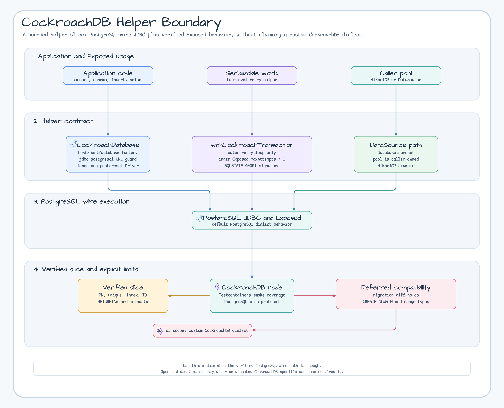
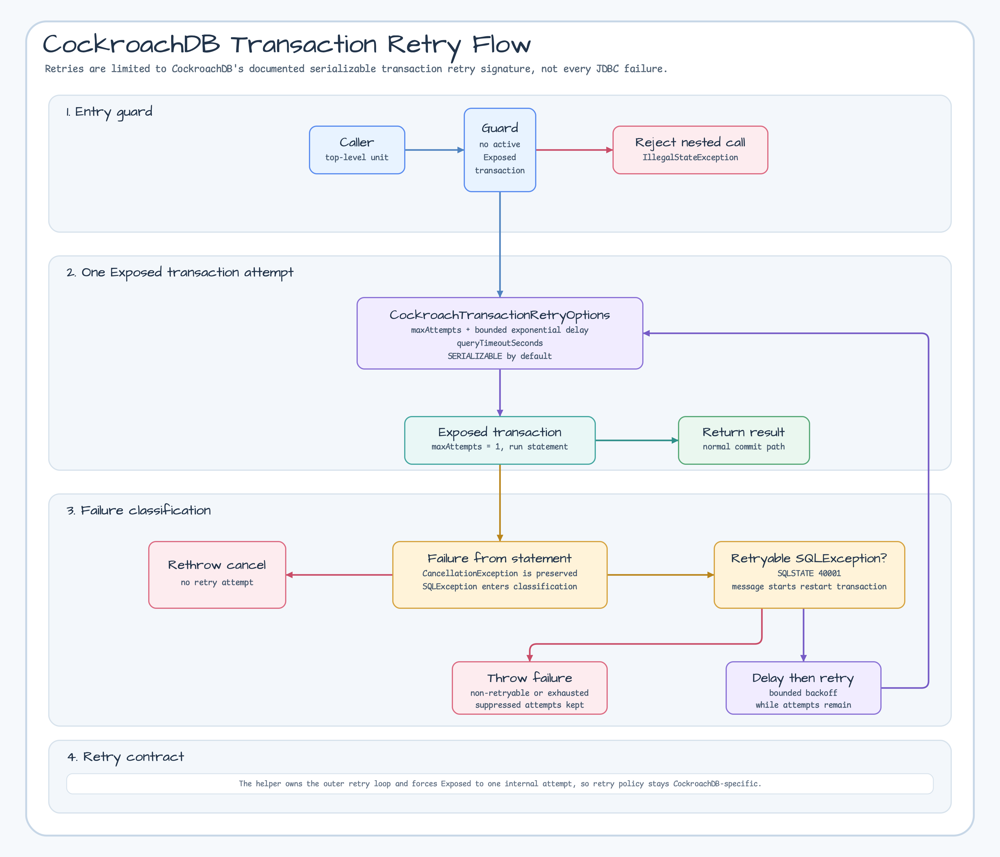

# Module exposed-cockroachdb

English | [한국어](./README.ko.md)

Minimal CockroachDB JDBC integration for JetBrains Exposed ORM. This module
proves the first supported path for CockroachDB in `bluetape4k-exposed`:
PostgreSQL-wire JDBC connectivity, bounded serializable transaction retry
helpers, and real Testcontainers-backed smoke tests.

## Scope

`exposed-cockroachdb` provides:

- **CockroachDatabase**: a small connection factory for
  `jdbc:postgresql://<host>:<sql_port>/<database>` CockroachDB URLs and
  caller-managed `DataSource` instances.
- **DDL boundary coverage**: targeted CockroachDB tests for the supported
  Exposed schema subset.
- **Testcontainers smoke coverage**: a single-node CockroachDB test using
  `CockroachServer` from `bluetape4k-testcontainers`.
- **Serializable transaction retry helper**: `withCockroachTransaction` retries
  only CockroachDB transaction retry errors (`40001` + `restart transaction`).

CockroachDB is PostgreSQL-wire-compatible but not PostgreSQL-equivalent. This
module intentionally does not register a custom Exposed dialect and does not
claim broad PostgreSQL DDL parity.

The current `bluetape4k-exposed` 1.13.0 development line targets JetBrains
Exposed 1.4.0. The [Exposed 1.4.0 release](https://github.com/JetBrains/Exposed/releases/tag/1.4.0)
and [1.4.0 changelog](https://github.com/JetBrains/Exposed/blob/1.4.0/CHANGELOG.md)
do not add a built-in CockroachDB dialect. Treat this module as a bounded
helper and verified compatibility slice, not as a full dialect.

## Helper Boundary



## Compatibility Boundary

| Feature | Status | Evidence |
|---|---|---|
| Primary key DDL | Supported | `SchemaUtils.create/drop` succeeds against CockroachDB. |
| Unique and index DDL | Supported | Unique duplicate insert fails and index metadata is discoverable. |
| Generated ID | Supported | `LongIdTable.insertAndGetId` returns generated IDs. |
| `RETURNING` | Supported | Raw `INSERT ... RETURNING` succeeds through PostgreSQL JDBC. |
| Schema metadata | Supported | `DatabaseMetaData` discovers table and index metadata through HikariCP. |
| Serializable transaction retry | Supported | `withCockroachTransaction` retries only CockroachDB retryable transaction errors. |
| Migration diff no-op | Deferred | `MigrationUtils` still proposes generated-ID sequence ownership changes after create. |
| `CREATE DOMAIN` | Deferred | [CockroachDB documents this PostgreSQL feature as unsupported](https://www.cockroachlabs.com/docs/stable/query-behavior-troubleshooting). |
| PostgreSQL range types | Deferred | [CockroachDB documents PostgreSQL range types as unsupported](https://www.cockroachlabs.com/docs/stable/postgresql-compatibility). |
| Custom CockroachDB dialect | Out of scope | The `bluetape4k-exposed` 1.13.0 development line keeps the helper-only contract until accepted paths require a dialect. |

## Out Of Scope

- Custom CockroachDB dialect registration.
- Full PostgreSQL compatibility.
- No-op migration diff guarantees.
- R2DBC support.

Those items remain parent-epic follow-up candidates until a later slice accepts
them.

## Dependency

```kotlin
dependencies {
    implementation("io.github.bluetape4k.exposed:bluetape4k-exposed-cockroachdb:${version}")
}
```

The module uses the PostgreSQL JDBC driver because CockroachDB exposes the
PostgreSQL wire protocol:

```kotlin
implementation("org.postgresql:postgresql")
```

If you use the optional `bluetape4k-jdbc` HikariCP example below, also add:

```kotlin
implementation("io.github.bluetape4k:bluetape4k-jdbc:${version}")
implementation("com.zaxxer:HikariCP")
```

## Basic Usage

```kotlin
import io.bluetape4k.exposed.cockroachdb.CockroachDatabase
import org.jetbrains.exposed.v1.jdbc.transactions.transaction

val db = CockroachDatabase.connect(
    host = "localhost",
    port = 26257,
    database = "defaultdb",
    user = "root",
)

transaction(db) {
    exec("SELECT 1") { rs ->
        rs.next()
        rs.getInt(1)
    }
}
```

## Serializable Transaction Retry

CockroachDB documents transaction retry errors as SQLSTATE `40001` with a
message beginning with `restart transaction` in its [transaction retry error
reference](https://www.cockroachlabs.com/docs/stable/transaction-retry-error-reference).
Use `withCockroachTransaction` for bounded serializable work that should retry
only that CockroachDB retryable signature:

```kotlin
import io.bluetape4k.exposed.cockroachdb.CockroachTransactionRetryOptions
import io.bluetape4k.exposed.cockroachdb.withCockroachTransaction
import org.jetbrains.exposed.v1.jdbc.insert
import kotlin.time.Duration.Companion.milliseconds

val options = CockroachTransactionRetryOptions(
    maxAttempts = 5,
    minRetryDelay = 25.milliseconds,
    maxRetryDelay = 250.milliseconds,
)

withCockroachTransaction(db, options) {
    Events.insert {
        it[eventName] = "order-created"
    }
}
```

JetBrains Exposed also has generic transaction retry knobs such as
`maxAttempts`, `minRetryDelay`, and `maxRetryDelay`, but the Exposed JDBC retry
loop catches `SQLException` broadly. `withCockroachTransaction` keeps the retry
boundary CockroachDB-specific by forcing the wrapped Exposed transaction to one
internal attempt and retrying only the documented CockroachDB transaction retry
signature.



For caller-managed pools, pass any `DataSource` to `CockroachDatabase.connect`.
For example, `bluetape4k-jdbc` can create a HikariCP pool with the PostgreSQL
JDBC URL:

```kotlin
import io.bluetape4k.jdbc.JdbcDrivers
import io.bluetape4k.jdbc.hikari.hikariDataSourceOf

val dataSource = hikariDataSourceOf(
    jdbcUrl = "jdbc:postgresql://localhost:26257/defaultdb",
    username = "root",
    password = "",
) {
    driverClassName = JdbcDrivers.DRIVER_CLASS_POSTGRESQL
    maximumPoolSize = 4
    minimumIdle = 1
}

val db = CockroachDatabase.connect(dataSource)
```

## Testcontainers Usage

```kotlin
import io.bluetape4k.testcontainers.database.CockroachServer

val cockroach = CockroachServer.Launcher.cockroach
val db = CockroachDatabase.connect(
    jdbcUrl = cockroach.url,
    user = cockroach.username ?: CockroachServer.USERNAME,
    password = cockroach.password ?: CockroachServer.PASSWORD,
)
```

## Verification

```bash
./gradlew :bluetape4k-exposed-cockroachdb:test --rerun-tasks --no-configuration-cache --no-daemon
```

Related issues: [#30](https://github.com/bluetape4k/bluetape4k-exposed/issues/30),
[#31](https://github.com/bluetape4k/bluetape4k-exposed/issues/31), and
[#32](https://github.com/bluetape4k/bluetape4k-exposed/issues/32).
