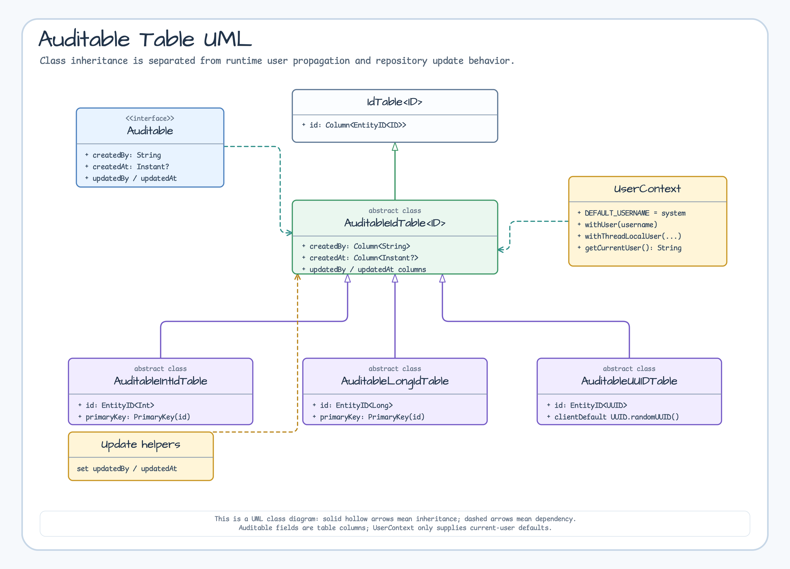
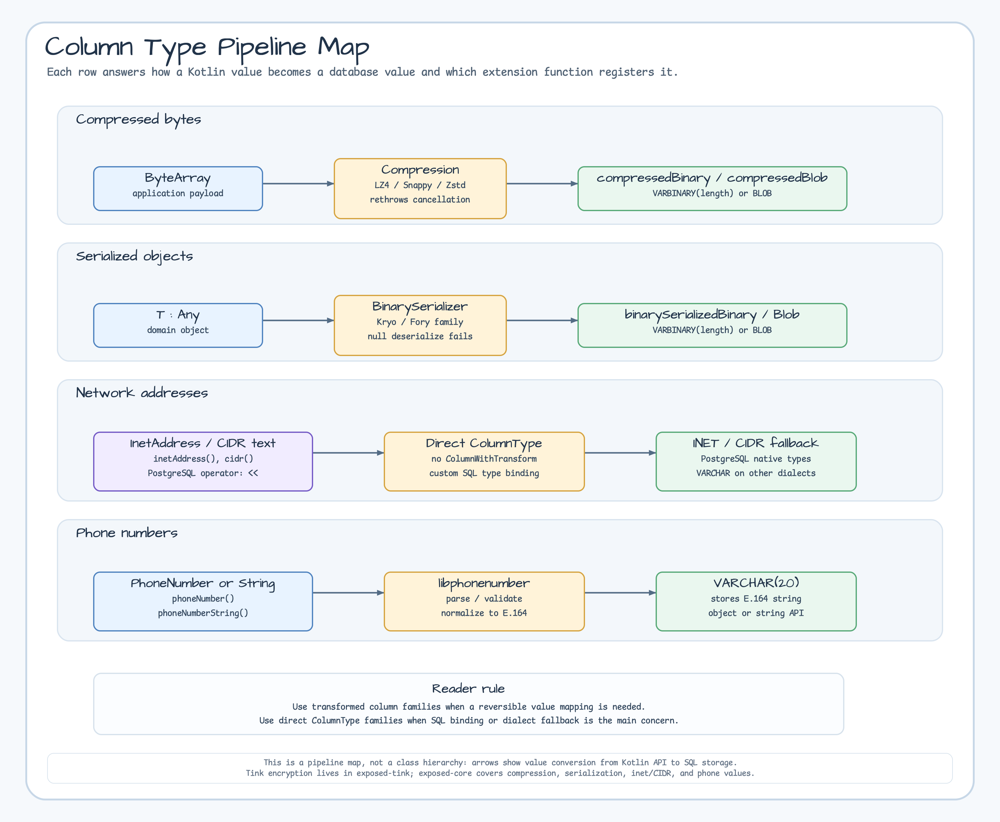
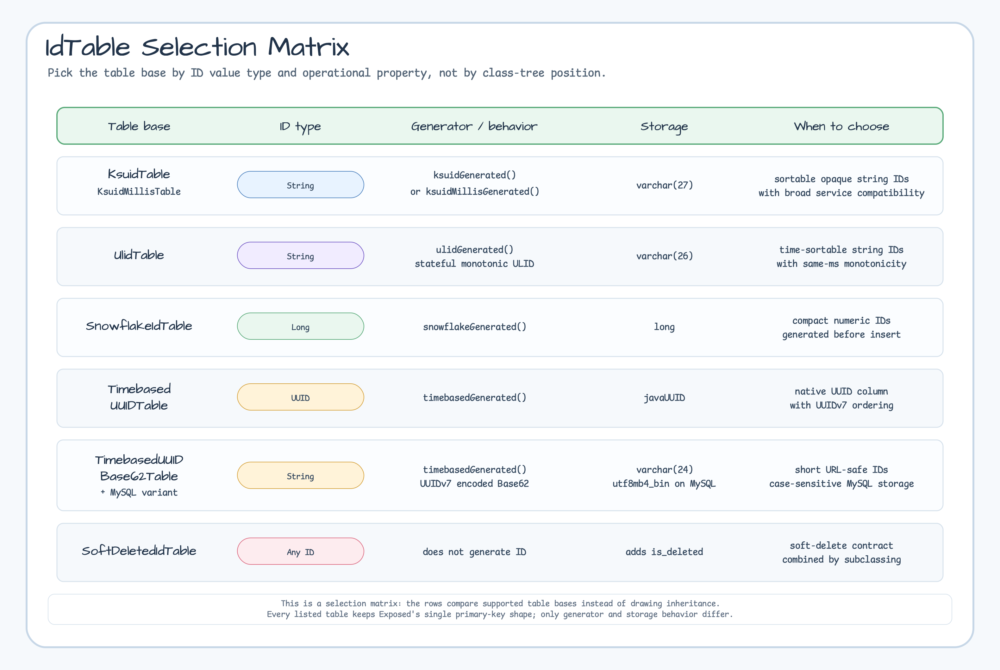
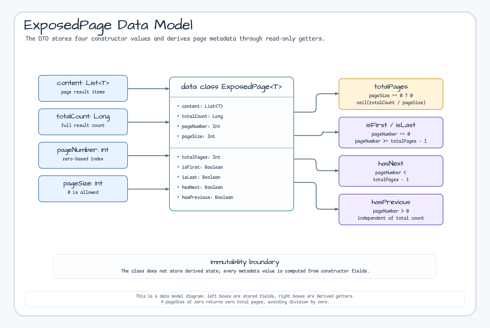
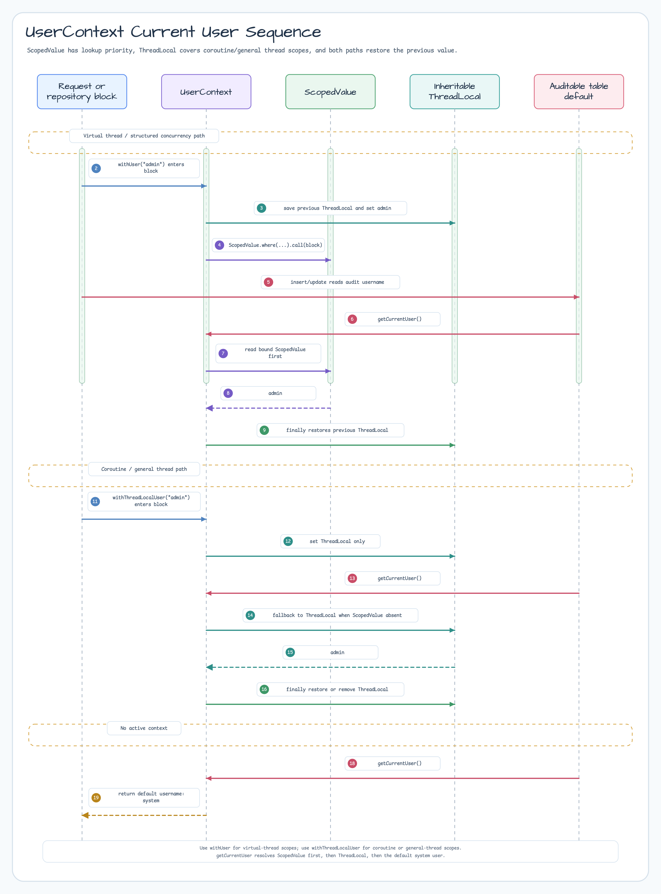

# Module exposed-core

[English](./README.md) | 한국어

JetBrains Exposed에서 공통으로 쓰는 컬럼 타입, 테이블 helper, 확장 함수, DTO를 제공하는 기반 모듈입니다. JDBC 의존이 없기 때문에 JDBC/R2DBC, 직렬화, Tink 암호화, Spring 연동 모듈에서 함께 사용할 수 있습니다.

## 개요

`exposed-core`는 다음을 제공합니다:

- **커스텀 컬럼 타입**: 압축(LZ4/Snappy/Zstd), 직렬화(Kryo/Fory) 기반의 Binary/Blob 컬럼
- **네트워크 컬럼 타입**: IPv4/IPv6 주소(`inetAddress`), CIDR 블록(`cidr`), PostgreSQL `<<` 연산자
- **전화번호 컬럼 타입**: E.164 정규화 저장(`phoneNumber`, `phoneNumberString`), Google libphonenumber 기반
- **컬럼 확장 함수**: 클라이언트 측 ID 생성(`timebasedGenerated`, `snowflakeGenerated`, `ksuidGenerated`, `ulidGenerated` 등)
- **ResultRow 확장**: `getOrNull`, `toMap` 등 ResultRow 처리 보조
- **Blob 확장**: `ExposedBlob` 유틸 함수
- **배치 삽입**: `BatchInsertOnConflictDoNothing` (중복 무시 배치 삽입)
- **CTE 테이블 facade**: JDBC/R2DBC `WITH` 쿼리에서 선택 필드를 매핑하는 `CteTable`
- **페이징 DTO**: 파생 페이지 메타데이터를 제공하는 `ExposedPage<T>`
- **타입이 있는 커서 DTO**: 기본 키 keyset 페이지를 제한하는 `ExposedCursorPage<T, C>`

## 의존성 추가

```kotlin
dependencies {
    implementation("io.github.bluetape4k.exposed:bluetape4k-exposed-core:${version}")

    // 압축 컬럼 타입 사용 시
    implementation("io.github.bluetape4k:bluetape4k-io:${version}")

    // 전화번호 컬럼 타입 사용 시 (phoneNumber, phoneNumberString)
    implementation("com.googlecode.libphonenumber:libphonenumber:8.13.52")
}
```

## 다이어그램

### Auditable UML 클래스 다이어그램

`AuditableIdTable`과 구체 Auditable 테이블 베이스의 상속 관계를 보여줍니다. 런타임 사용자 전파는 `UserContext` 의존으로만 표시해 클래스 구조와 업데이트 흐름이 섞이지 않도록 했습니다.



### 컬럼 타입 파이프라인 맵

각 컬럼 확장 family가 Kotlin API 값에서 변환 로직을 거쳐 어떤 SQL 저장 타입으로 이어지는지 보여줍니다. 클래스 계층도가 아니라 값 변환 파이프라인 맵입니다.



### IdTable 선택 매트릭스

커스텀 `IdTable` 베이스를 값 타입, 생성기, 저장 형태, 선택 기준으로 비교합니다.



### ExposedPage 데이터 모델

생성자에 저장되는 네 개의 필드와 요청 시 계산되는 페이지 메타데이터를 구분해서 보여줍니다.



## 기본 사용법

### 1. 클라이언트 측 ID 자동 생성 컬럼

```kotlin
import io.bluetape4k.exposed.core.ksuidGenerated
import io.bluetape4k.exposed.core.snowflakeGenerated
import io.bluetape4k.exposed.core.timebasedGenerated
import org.jetbrains.exposed.v1.core.dao.id.IntIdTable

object Orders: IntIdTable("orders") {
    // 클라이언트에서 Timebased UUID 자동 생성
    val trackingId = javaUUID("tracking_id").timebasedGenerated()

    // 클라이언트에서 Snowflake ID 자동 생성
    val snowflakeId = long("snowflake_id").snowflakeGenerated()

    // 클라이언트에서 KSUID 자동 생성
    val ksuid = varchar("ksuid", 27).ksuidGenerated()

    // StatefulMonotonic ULID 자동 생성
    val ulid = varchar("ulid", 26).ulidGenerated()

    val name = varchar("name", 255)
}
```

### 2. 압축 컬럼 타입

```kotlin
import io.bluetape4k.exposed.core.compress.compressedBinary
import io.bluetape4k.exposed.core.compress.compressedBlob
import io.bluetape4k.io.compressor.Compressors
import org.jetbrains.exposed.v1.core.dao.id.LongIdTable

object Documents: LongIdTable("documents") {
    val title = varchar("title", 255)

    // LZ4 압축으로 Binary 저장
    val contentLz4 = compressedBinary("content_lz4", 65535, Compressors.LZ4)

    // Zstd 압축으로 Blob 저장
    val contentZstd = compressedBlob("content_zstd", Compressors.Zstd).nullable()
}
```

### 3. 직렬화 컬럼 타입

```kotlin
import io.bluetape4k.exposed.core.serializable.binarySerializedBinary
import io.bluetape4k.io.serializer.BinarySerializers
import org.jetbrains.exposed.v1.core.dao.id.LongIdTable

data class UserProfile(val age: Int, val tags: List<String>)

object Users: LongIdTable("users") {
    val name = varchar("name", 100)

    // Kryo 직렬화로 Binary 저장
    val profile = binarySerializedBinary<UserProfile>(
        "profile", 4096, BinarySerializers.Kryo
    ).nullable()
}
```

### 4. 네트워크 주소 컬럼 타입

```kotlin
import io.bluetape4k.exposed.core.inet.inetAddress
import io.bluetape4k.exposed.core.inet.cidr
import io.bluetape4k.exposed.core.inet.isContainedBy
import org.jetbrains.exposed.v1.core.dao.id.LongIdTable
import java.net.InetAddress

object Networks : LongIdTable("networks") {
    val ip = inetAddress("ip")        // PostgreSQL: INET, 기타: VARCHAR(45)
    val network = cidr("network")     // PostgreSQL: CIDR, 기타: VARCHAR(50)
}

// PostgreSQL 전용 << 연산자 (IP가 CIDR에 속하는지 확인)
Networks.selectAll()
    .where { Networks.ip.isContainedBy(Networks.network) }
```

### 5. 전화번호 컬럼 타입

```kotlin
import io.bluetape4k.exposed.core.phone.phoneNumber
import io.bluetape4k.exposed.core.phone.phoneNumberString
import org.jetbrains.exposed.v1.core.dao.id.LongIdTable

// 의존성: com.googlecode.libphonenumber:libphonenumber

object Contacts : LongIdTable("contacts") {
    val phone = phoneNumber("phone")           // PhoneNumber 객체, E.164로 저장
    val phoneStr = phoneNumberString("phone_str") // E.164 문자열로 정규화하여 저장
}

// 저장: "010-1234-5678" → "+821012345678"
```

### 6. 중복 무시 배치 삽입

```kotlin
import io.bluetape4k.exposed.core.BatchInsertOnConflictDoNothing
import org.jetbrains.exposed.v1.jdbc.statements.BatchInsertBlockingExecutable

val executable = BatchInsertBlockingExecutable(
    statement = BatchInsertOnConflictDoNothing(MyTable)
)
executable.run {
    statement.addBatch()
    statement[MyTable.uniqueKey] = "key1"
    execute(transaction)
}
```

### 7. CTE 테이블 facade

```kotlin
import io.bluetape4k.exposed.core.CteTable
import org.jetbrains.exposed.v1.jdbc.select

val activeUsers = CteTable(
    name = "active_users",
    query = Users.select(Users.id, Users.name).where { Users.active eq true }
)

val activeUserId = activeUsers[Users.id]
val activeUserName = activeUsers[Users.name]
```

`CteTable`은 JDBC/R2DBC 모듈이 공유합니다. 최종 SELECT query 앞에 `WITH` 절을 붙일 때는 각 모듈의
`withCte()`를 사용합니다.

### 8. ExposedPage (페이징 결과)

```kotlin
import io.bluetape4k.exposed.core.ExposedPage

// 페이징 결과 래퍼
val page: ExposedPage<UserRecord> = ExposedPage(
    content = users,
    totalCount = 100L,
    pageNumber = 0,
    pageSize = 20
)

println("총 페이지: ${page.totalPages}")
println("마지막 페이지: ${page.isLast}")
```

### 9. ExposedCursorPage (타입이 있는 커서 결과)

`ExposedCursorPage`는 앞으로만 이동하는 keyset pagination의 제한된 결과 DTO입니다. 커서는 저장소의
`IdTable`이 가진 null이 아닌 원시 기본 키 값이며, 전송용 불투명 토큰 자체는 아닙니다.

```kotlin
import io.bluetape4k.exposed.core.ExposedCursorPage

val page = ExposedCursorPage<UserRecord, Long>(
    content = users,
    nextCursor = 42L,
    hasNext = true,
)
```

JDBC와 R2DBC 저장소 확장은 `LIMIT pageSize + 1`을 사용하는 SELECT 하나만 실행하며 count나 offset
쿼리를 실행하지 않습니다. `pageSize`는 1부터 10,000까지이고, `ASC` 계열은 엄격한 `>` 경계,
`DESC` 계열은 엄격한 `<` 경계를 사용합니다. `IdTable` 기본 키는 null이 아니므로 null 배치 변형은
방향만 보존합니다. `hasNext == false`이면 `nextCursor`는 항상 null입니다.

커서의 encode, 서명, 범위 지정, decode는 호출자가 소유하며 다음 요청에서도 같은 정렬과 predicate를
재사용해야 합니다. 일관된 시점 읽기 격리는 보장하지 않고 기본 predicate가 `Op.TRUE`이므로 활성 조건을
전달하지 않으면 논리 삭제 행도 보입니다. `Long`, `Int`, `String`, `UUID`, Kotlin `Uuid`처럼
`Comparable`인 ID를 지원하며 `CompositeID`와 비교할 수 없는 custom ID는 이 확장 범위에서 제외합니다.
기존 offset 기반 `ExposedPage`/`findPage` API는 변경하지 않습니다.

`ExposedCursorPage`는 `java.io.Serializable`을 구현하고 명시적인 `serialVersionUID = 1L`을 사용합니다.
구체적인 `T` 원소와 `C` 커서, 런타임 content 리스트 구현이 직렬화 가능할 때만 Java serialization을
사용할 수 있으며 generic 경계로 이 조건을 강제하지는 않습니다. DTO 객체 직렬화는 전송용 불투명
cursor token의 encode, 서명, 범위 지정, 만료, decode를 대신하지 않으며 이 책임은 계속 호출자에게
있습니다.

## 주요 파일/클래스 목록

| 파일                                                 | 설명                                     |
|----------------------------------------------------|----------------------------------------|
| `ColumnExtensions.kt`                              | 클라이언트 측 ID 자동 생성 확장 함수                 |
| `ExposedColumnSupports.kt`                         | 컬럼 타입 관련 지원 함수                         |
| `ResultRowExtensions.kt`                           | ResultRow 처리 확장 함수                     |
| `BatchInsertOnConflictDoNothing.kt`                | 중복 무시 배치 삽입                            |
| `statements/api/ExposedBlobExtensions.kt`          | ExposedBlob 유틸 함수                      |
| `compress/CompressedBinaryColumnType.kt`           | 압축 Binary 컬럼 타입                        |
| `compress/CompressedBlobColumnType.kt`             | 압축 Blob 컬럼 타입                          |
| `serializable/BinarySerializedBinaryColumnType.kt` | 직렬화 Binary 컬럼 타입                       |
| `serializable/BinarySerializedBlobColumnType.kt`   | 직렬화 Blob 컬럼 타입                         |
| `ExposedPage.kt`                                   | 페이징 결과 데이터 클래스                         |
| `ExposedCursorPage.kt`                             | 타입이 있는 keyset/cursor 결과 데이터 클래스      |
| `HasIdentifier.kt`                                 | Deprecated 호환 인터페이스; `Serializable` record 권장 |
| `dao/id/KsuidTable.kt`                             | KSUID 기본키 테이블                          |
| `dao/id/KsuidMillisTable.kt`                       | KsuidMillis 기본키 테이블                    |
| `dao/id/UlidTable.kt`                              | ULID 기본키 테이블                           |
| `dao/id/SnowflakeIdTable.kt`                       | Snowflake Long 기본키 테이블                 |
| `dao/id/TimebasedUUIDTable.kt`                     | UUIDv7 기본키 테이블                         |
| `dao/id/TimebasedUUIDBase62Table.kt`               | UUIDv7 Base62 기본키 테이블                  |
| `dao/id/SoftDeletedIdTable.kt`                     | 소프트 삭제 기본키 테이블                         |
| `inet/InetColumnTypes.kt`                          | IPv4/IPv6, CIDR 컬럼 타입                  |
| `inet/InetExtensions.kt`                           | inetAddress, cidr, isContainedBy 확장 함수 |
| `phone/PhoneNumberColumnType.kt`                   | 전화번호 컬럼 타입 (E.164 정규화)                 |
| `phone/PhoneNumberExtensions.kt`                   | phoneNumber, phoneNumberString 확장 함수   |

## Auditable (감사 추적)

`Auditable` 인터페이스 및 `AuditableIdTable`을 통해 모든 엔티티의 생성자, 생성 시간, 수정자, 수정 시간을 자동으로 추적합니다.

### Auditable 인터페이스

```kotlin
import io.bluetape4k.exposed.core.auditable.Auditable
import java.time.Instant

interface Auditable {
    val createdBy: String        // INSERT 시 자동 설정 (기본값: "system")
    val createdAt: Instant?      // INSERT 시 DB CURRENT_TIMESTAMP 자동 설정
    val updatedBy: String?       // UPDATE 시 자동 설정
    val updatedAt: Instant?      // UPDATE 시 DB CURRENT_TIMESTAMP 자동 설정
}
```

### UserContext — 사용자 컨텍스트 관리

현재 작업 중인 사용자명을 전파하는 컨텍스트 객체입니다. `withUser(...)`는 Virtual Thread/Structured Concurrency 범위에서 `ScopedValue`와 `ThreadLocal`을 함께 묶고, `withThreadLocalUser(...)`는 Coroutine이나 일반 Thread 환경에서 사용합니다.



#### Virtual Thread 환경

```kotlin
import io.bluetape4k.exposed.core.auditable.UserContext

UserContext.withUser("admin") {
    // 이 블록 내에서 INSERT/UPDATE 시 createdBy/updatedBy = "admin"
    userRepository.save(entity)
}
```

중첩 `withUser(...)` 호출도 안전합니다. inner 블록 종료 후 outer 사용자 컨텍스트가 다시 복원됩니다.

#### Coroutines 환경

```kotlin
UserContext.withThreadLocalUser("admin") {
    // Coroutines 환경에서는 ThreadLocal 전용 메서드 사용
    userRepository.save(entity)
}
```

#### 현재 사용자 조회

```kotlin
val user = UserContext.getCurrentUser()  // 우선순위: ScopedValue > ThreadLocal > "system"
```

### AuditableIdTable 사용법

#### 1. 테이블 정의

```kotlin
import io.bluetape4k.exposed.core.auditable.AuditableLongIdTable
import org.jetbrains.exposed.v1.core.varchar
import org.jetbrains.exposed.v1.core.text

object ArticleTable : AuditableLongIdTable("articles") {
    val title = varchar("title", 255)
    val content = text("content")
    // createdBy, createdAt, updatedBy, updatedAt은 자동으로 추가됨
}
```

#### 2. 컬럼 동작

| 컬럼           | INSERT 시                             | UPDATE 시                          | 비고              |
|--------------|--------------------------------------|-----------------------------------|-----------------|
| `created_by` | `UserContext.getCurrentUser()` 자동 설정 | 변경 없음                             | 기본값: "system"   |
| `created_at` | DB `CURRENT_TIMESTAMP` 자동 설정         | 변경 없음                             | UTC, nullable   |
| `updated_by` | null                                 | `UserContext.getCurrentUser()` 설정 | Repository에서 관리 |
| `updated_at` | null                                 | DB `CURRENT_TIMESTAMP` 설정         | Repository에서 관리 |

#### 3. 구체 테이블 클래스

| 클래스                    | 기본키 타입                            | 사용 시기          |
|------------------------|-----------------------------------|----------------|
| `AuditableIntIdTable`  | `Int` (자동증가)                      | 소규모 데이터셋       |
| `AuditableLongIdTable` | `Long` (자동증가)                     | 대규모 데이터셋, 분산환경 |
| `AuditableUUIDTable`   | `java.util.UUID` (client-side 생성) | 분산 환경          |

#### 4. 완전한 예시

```kotlin
import io.bluetape4k.exposed.core.auditable.AuditableLongIdTable
import org.jetbrains.exposed.v1.core.varchar
import org.jetbrains.exposed.v1.core.text
import org.jetbrains.exposed.v1.jdbc.transactions.transaction
import org.jetbrains.exposed.v1.jdbc.insert
import io.bluetape4k.exposed.core.auditable.UserContext

object ArticleTable : AuditableLongIdTable("articles") {
    val title = varchar("title", 255)
    val content = text("content")
}

transaction {
    UserContext.withUser("john@example.com") {
        // INSERT: createdBy="john@example.com", createdAt=DB현재시각 자동 설정
        ArticleTable.insert {
            it[title] = "Hello Exposed"
            it[content] = "Auditable demo"
        }
    }
}

transaction {
    UserContext.withUser("editor@example.com") {
        // UPDATE: updatedBy="editor@example.com", updatedAt=DB현재시각 자동 설정
        // (auditedUpdateById 메서드 사용, exposed-jdbc 참고)
    }
}
```

### 의존성

`exposed-java-time` 모듈이 필요합니다:

```kotlin
dependencies {
    implementation("io.github.bluetape4k.exposed:bluetape4k-exposed-core:${version}")

    // Auditable 사용 시
    compileOnly("org.jetbrains.exposed:exposed-java-time:${exposedVersion}")
}
```

## 테스트

```bash
./gradlew :exposed-core:test
```

## 참고

- [JetBrains Exposed](https://github.com/JetBrains/Exposed)
- [bluetape4k-io (압축/직렬화)](../../../io/io)
- [bluetape4k-idgenerators (ID 생성)](../../../utils/idgenerators)
