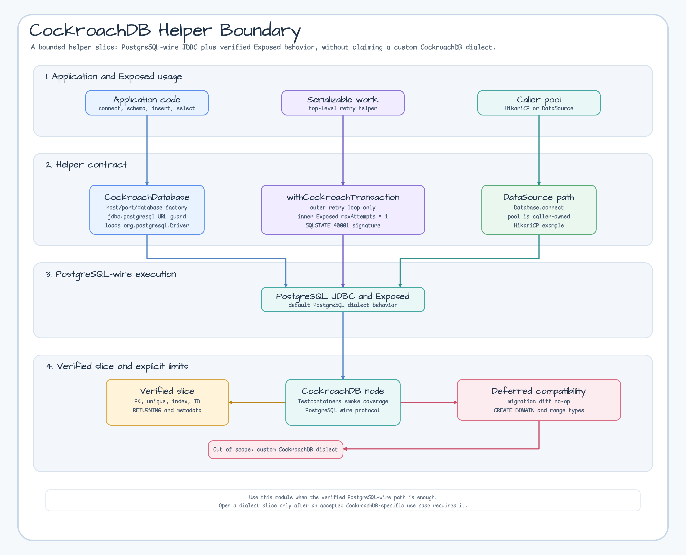
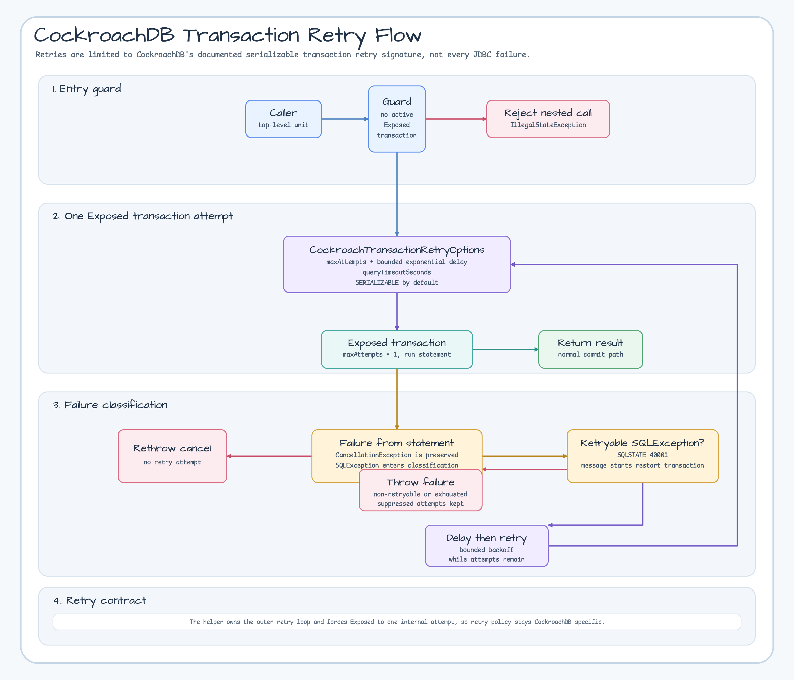

# Module exposed-cockroachdb

[English](./README.md) | 한국어

JetBrains Exposed ORM을 위한 최소 CockroachDB JDBC 통합 모듈입니다. 이 모듈은
`bluetape4k-exposed`에서 CockroachDB를 지원하기 위한 첫 경로로 PostgreSQL wire
JDBC 연결, 제한된 serializable transaction retry helper, 실제 Testcontainers 기반
smoke test를 검증합니다.

## 범위

`exposed-cockroachdb`는 다음을 제공합니다:

- **CockroachDatabase**:
  `jdbc:postgresql://<host>:<sql_port>/<database>` CockroachDB URL과 caller-managed
  `DataSource` 연결 팩토리
- **DDL boundary coverage**:
  지원하는 Exposed schema subset을 CockroachDB에서 직접 검증하는 테스트
- **Testcontainers smoke coverage**:
  `bluetape4k-testcontainers`의 `CockroachServer`를 사용하는 단일 노드 CockroachDB 테스트
- **Serializable transaction retry helper**:
  CockroachDB transaction retry error(`40001` + `restart transaction`)만 재시도하는
  `withCockroachTransaction`

CockroachDB는 PostgreSQL wire protocol과 호환되지만 PostgreSQL과 동일하지는
않습니다. 이 모듈은 의도적으로 custom Exposed dialect를 등록하지 않으며 넓은
PostgreSQL DDL parity를 주장하지 않습니다.

JetBrains Exposed 1.3.0은 CockroachDB를 built-in supported database로 나열하지
않습니다. 이 모듈은 full dialect가 아니라 제한된 helper와 검증된 compatibility
slice로 보아야 합니다.

## 헬퍼 경계



## 호환성 경계

| 기능 | 상태 | 근거 |
|---|---|---|
| Primary key DDL | Supported | CockroachDB에서 `SchemaUtils.create/drop` 성공 |
| Unique and index DDL | Supported | unique duplicate insert 실패 및 index metadata 조회 성공 |
| Generated ID | Supported | `LongIdTable.insertAndGetId`가 generated ID 반환 |
| `RETURNING` | Supported | PostgreSQL JDBC를 통한 raw `INSERT ... RETURNING` 성공 |
| Schema metadata | Supported | HikariCP 경유 `DatabaseMetaData`로 table/index metadata 조회 성공 |
| Serializable transaction retry | Supported | `withCockroachTransaction`이 CockroachDB retryable transaction error만 재시도 |
| Migration diff no-op | Deferred | `MigrationUtils`가 create 이후에도 generated-ID sequence ownership 변경을 제안 |
| `CREATE DOMAIN` | Deferred | CockroachDB 공식 문서에서 unsupported PostgreSQL feature로 분류 |
| PostgreSQL range types | Deferred | CockroachDB 공식 문서에서 PostgreSQL range types를 unsupported로 분류 |
| Custom CockroachDB dialect | Out of scope | accepted path가 dialect를 요구하기 전까지 1.11.0은 helper-only 계약 유지 |

## 범위 밖

- Custom CockroachDB dialect 등록
- Full PostgreSQL compatibility
- No-op migration diff 보장
- R2DBC 지원

위 항목은 이후 slice에서 수용하기 전까지 parent epic의 follow-up 후보로 남겨둡니다.

## 의존성

```kotlin
dependencies {
    implementation("io.github.bluetape4k.exposed:bluetape4k-exposed-cockroachdb:${version}")
}
```

이 모듈은 CockroachDB의 PostgreSQL wire protocol을 사용하므로 PostgreSQL JDBC
driver를 사용합니다:

```kotlin
implementation("org.postgresql:postgresql")
```

아래의 선택적 `bluetape4k-jdbc` HikariCP 예제를 사용하는 경우 다음 의존성도
추가합니다:

```kotlin
implementation("io.github.bluetape4k:bluetape4k-jdbc:${version}")
implementation("com.zaxxer:HikariCP")
```

## 기본 사용법

```kotlin
import io.bluetape4k.exposed.cockroachdb.CockroachDatabase
import org.jetbrains.exposed.v1.jdbc.transactions.transaction

val db = CockroachDatabase.connect(
    host = "localhost",
    port = 26257,
    database = "defaultdb",
    user = "root",
)

transaction(db) {
    exec("SELECT 1") { rs ->
        rs.next()
        rs.getInt(1)
    }
}
```

## Serializable Transaction Retry

CockroachDB transaction retry error는 SQLSTATE `40001`과 `restart transaction`으로
시작하는 메시지로 식별합니다. 이 retryable signature만 제한적으로 재시도하려면
`withCockroachTransaction`을 사용합니다:

```kotlin
import io.bluetape4k.exposed.cockroachdb.CockroachTransactionRetryOptions
import io.bluetape4k.exposed.cockroachdb.withCockroachTransaction
import org.jetbrains.exposed.v1.jdbc.insert
import kotlin.time.Duration.Companion.milliseconds

val options = CockroachTransactionRetryOptions(
    maxAttempts = 5,
    minRetryDelay = 25.milliseconds,
    maxRetryDelay = 250.milliseconds,
)

withCockroachTransaction(db, options) {
    Events.insert {
        it[eventName] = "order-created"
    }
}
```

JetBrains Exposed에도 `maxAttempts`, `minRetryDelay`, `maxRetryDelay` 같은 generic
transaction retry knob이 있습니다. 하지만 Exposed JDBC retry loop는 `SQLException`
전체를 재시도합니다. `withCockroachTransaction`은 내부 Exposed transaction을 한 번만
시도하도록 고정한 뒤, CockroachDB가 문서화한 transaction retry signature만
재시도합니다.



caller-managed pool을 쓰는 경우 `DataSource`를 `CockroachDatabase.connect`에
전달합니다. 예를 들어 `bluetape4k-jdbc`로 PostgreSQL JDBC URL 기반 HikariCP
pool을 만들 수 있습니다:

```kotlin
import io.bluetape4k.jdbc.JdbcDrivers
import io.bluetape4k.jdbc.hikari.hikariDataSourceOf

val dataSource = hikariDataSourceOf(
    jdbcUrl = "jdbc:postgresql://localhost:26257/defaultdb",
    username = "root",
    password = "",
) {
    driverClassName = JdbcDrivers.DRIVER_CLASS_POSTGRESQL
    maximumPoolSize = 4
    minimumIdle = 1
}

val db = CockroachDatabase.connect(dataSource)
```

## Testcontainers 사용법

```kotlin
import io.bluetape4k.testcontainers.database.CockroachServer

val cockroach = CockroachServer.Launcher.cockroach
val db = CockroachDatabase.connect(
    jdbcUrl = cockroach.url,
    user = cockroach.username ?: CockroachServer.USERNAME,
    password = cockroach.password ?: CockroachServer.PASSWORD,
)
```

## 검증

```bash
./gradlew :bluetape4k-exposed-cockroachdb:test --rerun-tasks --no-configuration-cache --no-daemon
```

관련 이슈: [#30](https://github.com/bluetape4k/bluetape4k-exposed/issues/30),
[#31](https://github.com/bluetape4k/bluetape4k-exposed/issues/31),
[#32](https://github.com/bluetape4k/bluetape4k-exposed/issues/32).
