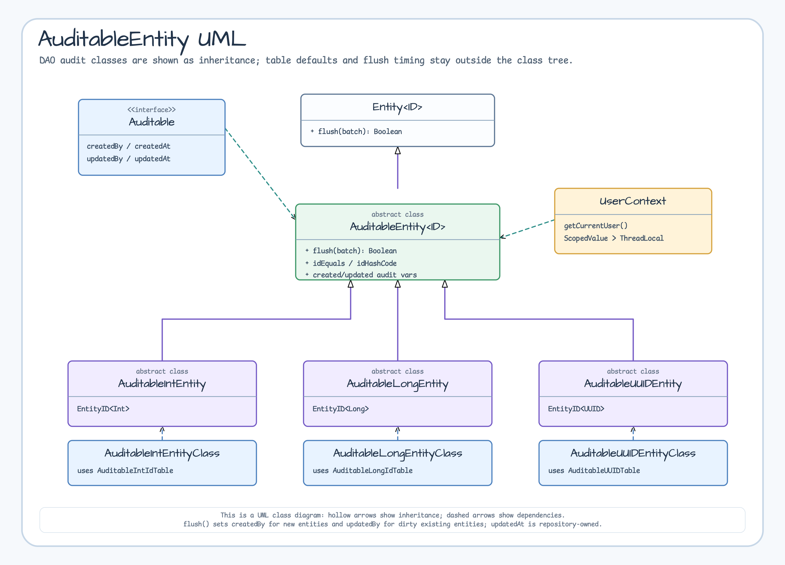
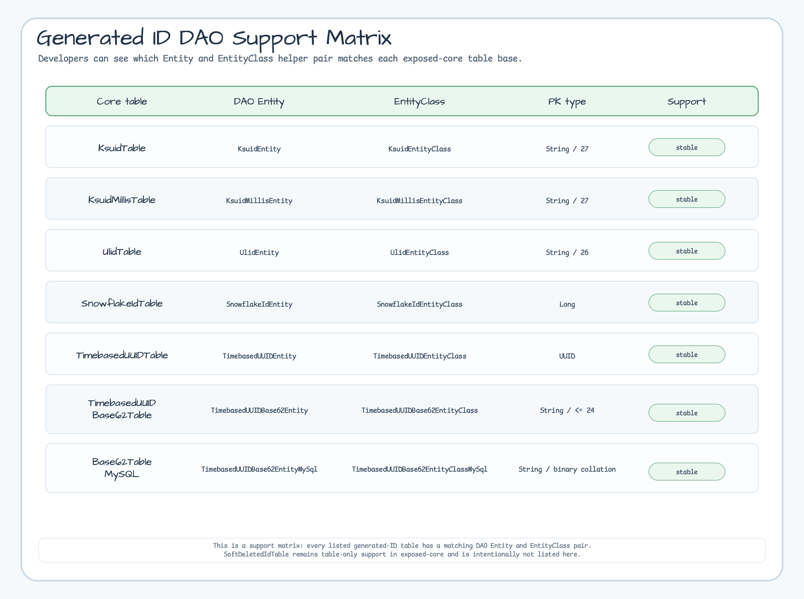
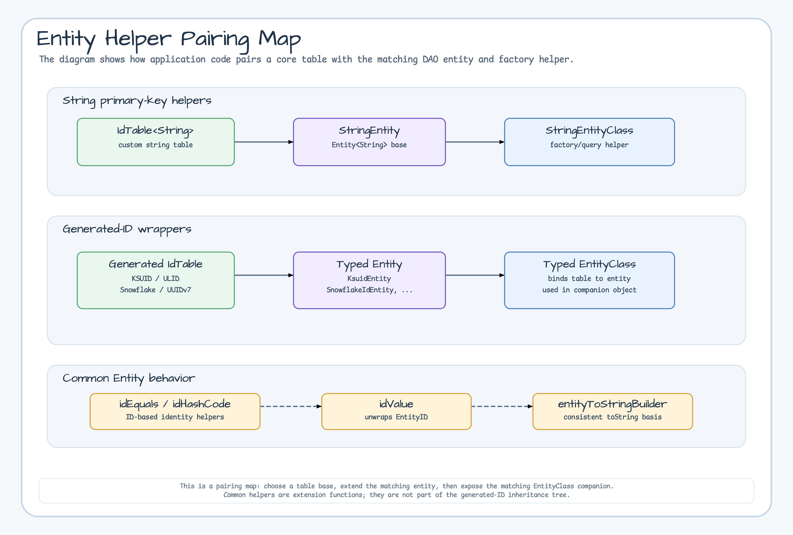
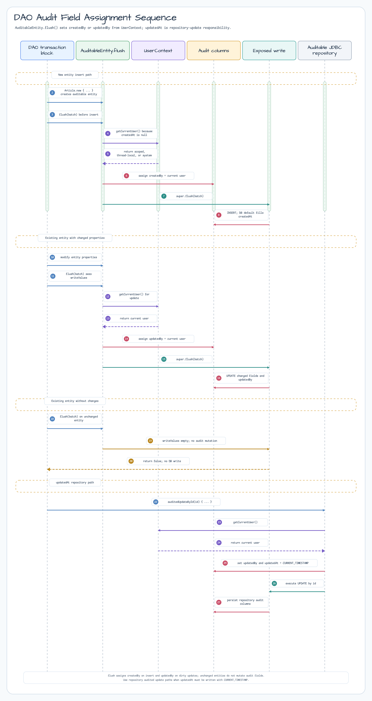

# Module exposed-dao

English | [한국어](./README.ko.md)

Provides Entity helpers, String-based DAO entities, auditable DAO bases, and Entity/EntityClass wrappers for the client-side ID tables defined in `exposed-core`.

## Overview

`exposed-dao` provides:

- **DAO extension functions**: Helpers for common Entity implementations such as `idEquals`, `idHashCode`, and
  `entityToStringBuilder`
- **StringEntity**: DAO entity and EntityClass bases for `String` primary keys
- **Generated-ID DAO wrappers**: Entity and EntityClass pairs for KSUID, KSUID millis, ULID, Snowflake, Timebased UUID, and Timebased UUID Base62 tables from `exposed-core`
- **Auditable DAO bases**: `AuditableEntity` and Int/Long/UUID EntityClass pairs that fill audit users during `flush()`
- Built on `exposed-core`, keeping table definitions and DAO entity helpers in separate modules

## Adding Dependencies

```kotlin
dependencies {
    implementation("io.github.bluetape4k.exposed:bluetape4k-exposed-dao:${version}")
}
```

## Diagrams

### AuditableEntity UML Class Diagram

Shows the inheritance among `AuditableEntity`, typed auditable DAO entities, and their `EntityClass` helpers. Runtime audit assignment is summarized separately so class structure is not confused with flush timing.



### Generated-ID DAO Support Matrix

Maps each generated-ID table from `exposed-core` to the DAO `Entity` and `EntityClass` helper pair available in this module.



### Entity Helper Pairing Map

Shows the application pattern: choose a table base, extend the matching entity, and expose the matching `EntityClass` companion. Common extension functions are shown as shared helpers, not as inheritance.



## Basic Usage

### 1. Common DAO Entity implementation

```kotlin
import io.bluetape4k.exposed.dao.idEquals
import io.bluetape4k.exposed.dao.idHashCode
import io.bluetape4k.exposed.dao.entityToStringBuilder
import org.jetbrains.exposed.v1.core.dao.id.EntityID
import org.jetbrains.exposed.v1.core.dao.id.LongIdTable
import org.jetbrains.exposed.v1.dao.LongEntity
import org.jetbrains.exposed.v1.dao.LongEntityClass

object UserTable: LongIdTable("users") {
    val name = varchar("name", 100)
    val email = varchar("email", 200)
}

class UserEntity(id: EntityID<Long>): LongEntity(id) {
    companion object: LongEntityClass<UserEntity>(UserTable)

    var name by UserTable.name
    var email by UserTable.email

    // ID-based equals/hashCode via idEquals/idHashCode
    override fun equals(other: Any?): Boolean = idEquals(other)
    override fun hashCode(): Int = idHashCode()

    // Convenient toString via entityToStringBuilder
    override fun toString(): String = entityToStringBuilder()
        .add("name", name)
        .add("email", email)
        .toString()
}
```

### 2. StringEntity (String primary key)

```kotlin
import io.bluetape4k.exposed.dao.StringEntity
import io.bluetape4k.exposed.dao.StringEntityClass
import org.jetbrains.exposed.v1.core.dao.id.EntityID
import org.jetbrains.exposed.v1.core.dao.id.IdTable

object TagTable: IdTable<String>("tags") {
    override val id = varchar("id", 64).entityId()
    val description = text("description").nullable()
    override val primaryKey = PrimaryKey(id)
}

class TagEntity(id: EntityID<String>): StringEntity(id) {
    companion object: StringEntityClass<TagEntity>(TagTable)

    var description by TagTable.description
}

// Usage: create an entity with an explicit ID
val tag = TagEntity.new("kotlin") {
    description = "Kotlin-related tag"
}
```

### 3. KSUID-based DAO entity

```kotlin
import io.bluetape4k.exposed.core.dao.id.KsuidTable
import io.bluetape4k.exposed.dao.id.KsuidEntity
import io.bluetape4k.exposed.dao.id.KsuidEntityClass
import io.bluetape4k.exposed.dao.id.KsuidEntityID

// Table with a KSUID primary key (auto-generated client-side, time-sortable)
object OrderTable: KsuidTable("orders") {
    val amount = decimal("amount", 10, 2)
    val status = varchar("status", 20)
}

class OrderEntity(id: KsuidEntityID): KsuidEntity(id) {
    companion object: KsuidEntityClass<OrderEntity>(OrderTable)

    var amount by OrderTable.amount
    var status by OrderTable.status
}

// KSUID is auto-generated on insert
val order = OrderEntity.new {
    amount = 15000.toBigDecimal()
    status = "PENDING"
}
println(order.id.value) // e.g. "2Dgh3kZ..." (27-character KSUID)
```

### 4. Snowflake ID-based DAO entity

```kotlin
import io.bluetape4k.exposed.core.dao.id.SnowflakeIdTable
import io.bluetape4k.exposed.dao.id.SnowflakeIdEntity
import io.bluetape4k.exposed.dao.id.SnowflakeIdEntityClass
import io.bluetape4k.exposed.dao.id.SnowflakeIdEntityID

// Table with a Snowflake ID (Long) primary key
object EventTable: SnowflakeIdTable("events") {
    val type = varchar("type", 50)
    val payload = text("payload")
}

class EventEntity(id: SnowflakeIdEntityID): SnowflakeIdEntity(id) {
    companion object: SnowflakeIdEntityClass<EventEntity>(EventTable)

    var type by EventTable.type
    var payload by EventTable.payload
}
```

### 5. ULID-based DAO entity

```kotlin
import io.bluetape4k.exposed.core.dao.id.UlidTable
import io.bluetape4k.exposed.dao.id.UlidEntity
import io.bluetape4k.exposed.dao.id.UlidEntityClass
import io.bluetape4k.exposed.dao.id.UlidEntityID

object SessionTable: UlidTable("sessions") {
    val userId = long("user_id")
    val status = varchar("status", 20)
}

class SessionEntity(id: UlidEntityID): UlidEntity(id) {
    companion object: UlidEntityClass<SessionEntity>(SessionTable)

    var userId by SessionTable.userId
    var status by SessionTable.status
}
```

### 6. Timebased UUID-based DAO entity

```kotlin
import io.bluetape4k.exposed.core.dao.id.TimebasedUUIDTable
import io.bluetape4k.exposed.core.dao.id.TimebasedUUIDBase62Table
import io.bluetape4k.exposed.dao.id.TimebasedUUIDEntity
import io.bluetape4k.exposed.dao.id.TimebasedUUIDEntityClass
import io.bluetape4k.exposed.dao.id.TimebasedUUIDEntityID
import io.bluetape4k.exposed.dao.id.TimebasedUUIDBase62Entity
import io.bluetape4k.exposed.dao.id.TimebasedUUIDBase62EntityClass
import io.bluetape4k.exposed.dao.id.TimebasedUUIDBase62EntityID

// UUID v7 (time-based) primary key
object SessionTable: TimebasedUUIDTable("sessions") {
    val userId = long("user_id")
    val expiresAt = long("expires_at")
}

class SessionEntity(id: TimebasedUUIDEntityID): TimebasedUUIDEntity(id) {
    companion object: TimebasedUUIDEntityClass<SessionEntity>(SessionTable)

    var userId by SessionTable.userId
}

// Base62-encoded UUID primary key (URL-safe)
object TokenTable: TimebasedUUIDBase62Table("tokens") {
    val userId = long("user_id")
    val scope = varchar("scope", 100)
}

class TokenEntity(id: TimebasedUUIDBase62EntityID): TimebasedUUIDBase62Entity(id) {
    companion object: TimebasedUUIDBase62EntityClass<TokenEntity>(TokenTable)

    var userId by TokenTable.userId
}
```

### 7. Soft Delete table-only support

`SoftDeletedIdTable` lives in `exposed-core` and can still be used with your own DAO entity class. `exposed-dao`
does not add a dedicated `SoftDeletedEntity` base, so soft-delete filtering remains an explicit table/query concern.

## Key Files and Classes

| File                                 | Description                                                       |
|--------------------------------------|-------------------------------------------------------------------|
| `EntityExtensions.kt`                | Entity helpers: `idEquals`, `idHashCode`, `entityToStringBuilder` |
| `StringEntity.kt`                    | Entity/EntityClass with a String primary key                      |
| `auditable/AuditableEntity.kt`       | DAO audit base; sets `createdBy` or `updatedBy` during `flush()`   |
| `auditable/AuditableEntityClass.kt`  | Int/Long/UUID auditable EntityClass helpers                       |
| `dao/id/KsuidEntity.kt`              | KSUID Entity/EntityClass pair                                     |
| `dao/id/KsuidMillisEntity.kt`        | KSUID millis Entity/EntityClass pair                              |
| `dao/id/UlidEntity.kt`               | ULID Entity/EntityClass pair                                      |
| `dao/id/SnowflakeIdEntity.kt`        | Snowflake Long Entity/EntityClass pair                            |
| `dao/id/TimebasedUUIDEntity.kt`      | UUIDv7 Entity/EntityClass pair                                    |
| `dao/id/TimebasedUUIDBase62Entity.kt` | UUIDv7 Base62 Entity/EntityClass pairs, including MySQL variant  |

## ID Strategy Comparison

| Core table                  | DAO helper pair                           | PK type  | Length   | Characteristics                           |
|-----------------------------|-------------------------------------------|----------|----------|-------------------------------------------|
| `KsuidTable`                | `KsuidEntity` / `KsuidEntityClass`         | `String` | 27 chars | Time-sortable, URL-safe                   |
| `KsuidMillisTable`          | `KsuidMillisEntity` / Class                | `String` | 27 chars | Millisecond-precision KSUID               |
| `UlidTable`                 | `UlidEntity` / `UlidEntityClass`           | `String` | 26 chars | StatefulMonotonic ULID                    |
| `SnowflakeIdTable`          | `SnowflakeIdEntity` / Class                | `Long`   | —        | Distributed environments, high throughput |
| `TimebasedUUIDTable`        | `TimebasedUUIDEntity` / Class              | `UUID`   | 36 chars | Time-sortable UUID v7                     |
| `TimebasedUUIDBase62Table`  | `TimebasedUUIDBase62Entity` / Class        | `String` | up to 24 | UUID v7 encoded as Base62                 |
| `TimebasedUUIDBase62TableMySql` | `TimebasedUUIDBase62EntityMySql` / Class | `String` | up to 24 | Base62 UUID with MySQL binary collation   |
| `SoftDeletedIdTable`        | Core table only                            | Generic  | —        | Includes an `isDeleted` column            |

## AuditableEntity (Audit Tracking for DAO)

`AuditableEntity` and `AuditableEntityClass` add automatic audit tracking to DAO entities.

### How AuditableEntity Works

Overrides `flush()` to automatically set `createdBy` and `updatedBy`.

#### Automatic field assignment

| Situation              | Auto-set field | Notes                                                                      |
|------------------------|----------------|----------------------------------------------------------------------------|
| New entity INSERT      | `createdBy`    | `createdAt` is set by the table's DB `defaultExpression(CurrentTimestamp)` |
| Existing entity UPDATE | `updatedBy`    | `updatedAt` is set when `auditedUpdateById()` is called on the Repository  |



#### Important notes

- Calling `flush()` alone does not automatically set `updatedAt`.
- Automatic `updatedAt` assignment is only guaranteed when using `AuditableJdbcRepository.auditedUpdateById()`.

### Table definition (exposed-core)

```kotlin
import io.bluetape4k.exposed.core.auditable.AuditableLongIdTable

object ArticleTable : AuditableLongIdTable("articles") {
    val title = varchar("title", 255)
    val content = text("content")
    // createdBy, createdAt, updatedBy, updatedAt are added automatically
}
```

### Entity definition

```kotlin
import io.bluetape4k.exposed.dao.auditable.AuditableLongEntity
import io.bluetape4k.exposed.dao.auditable.AuditableLongEntityClass
import org.jetbrains.exposed.v1.core.dao.id.EntityID
import java.time.Instant

class Article(id: EntityID<Long>) : AuditableLongEntity(id) {
    companion object : AuditableLongEntityClass<Article>(ArticleTable)

    var title by ArticleTable.title
    var content by ArticleTable.content

    override var createdBy by ArticleTable.createdBy
    override var createdAt by ArticleTable.createdAt
    override var updatedBy by ArticleTable.updatedBy
    override var updatedAt by ArticleTable.updatedAt
}
```

### Using the entity

```kotlin
import org.jetbrains.exposed.v1.jdbc.transactions.transaction
import io.bluetape4k.exposed.core.auditable.UserContext

transaction {
    UserContext.withUser("alice@example.com") {
        // INSERT: createdBy is automatically set to "alice@example.com" when flush() is called
        val article = Article.new {
            title = "Exposed DAO Auditing"
            content = "Auto tracking of changes"
        }
        println("Creator: ${article.createdBy}")  // "alice@example.com"
    }

    UserContext.withUser("bob@example.com") {
        // UPDATE: updatedBy is automatically set to "bob@example.com" when flush() is called
        article.title = "Updated Title"
        article.flush()
        println("Modifier: ${article.updatedBy}")  // "bob@example.com"
    }
}
```

`UserContext.withUser(...)` restores the outer user context after a nested call exits, so the audit scope remains consistent.

### Concrete entity and EntityClass types

| Primary key | Entity                | EntityClass                |
|-------------|-----------------------|----------------------------|
| `Int`       | `AuditableIntEntity`  | `AuditableIntEntityClass`  |
| `Long`      | `AuditableLongEntity` | `AuditableLongEntityClass` |
| `UUID`      | `AuditableUUIDEntity` | `AuditableUUIDEntityClass` |

## Testing

```bash
./gradlew :bluetape4k-exposed-dao:test
```

## References

- [JetBrains Exposed DAO](https://github.com/JetBrains/Exposed/wiki/DAO)
- [exposed-core](../exposed-core)
- [exposed-jdbc (AuditableJdbcRepository)](../exposed-jdbc)
- [bluetape4k-idgenerators](../../../utils/idgenerators)
