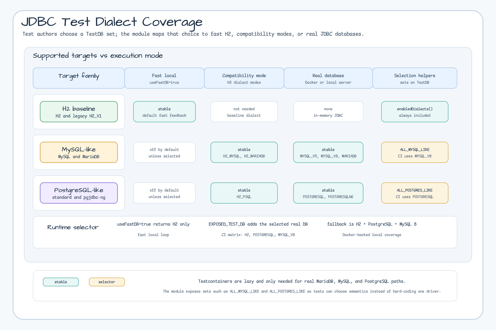
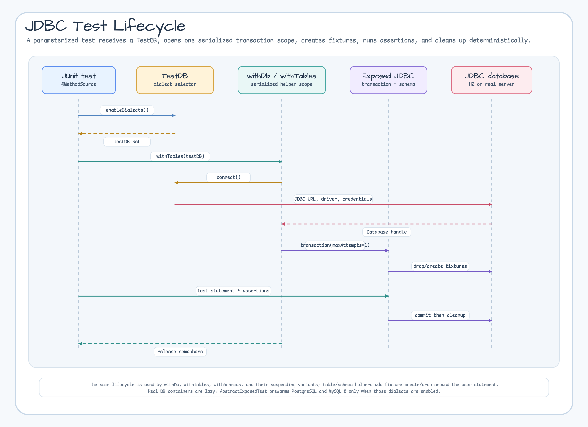

# Module exposed-jdbc-tests

[English](./README.md) | 한국어

## 개요

Exposed 기반 모듈을 JDBC로 검증할 때 쓰는 공통 테스트 인프라입니다. 테스트 작성자는 `TestDB`로 실행 대상 DB를 고르고, 트랜잭션 스코프 헬퍼와 테이블/스키마 fixture 유틸을 사용해 H2 빠른 피드백부터 실제 MySQL/PostgreSQL 커버리지까지 같은 테스트 코드로 다룰 수 있습니다.

## Dialect 커버리지



### 테스트 생명주기



## 의존성 추가

```kotlin
dependencies {
    testImplementation("io.github.bluetape4k.exposed:bluetape4k-exposed-jdbc-tests:${version}")
}
```

## 주요 기능

- **공통 테스트 베이스**: `AbstractExposedTest`가 기본 시간대를 UTC로 고정하고, parameterized test용 `ENABLE_DIALECTS_METHOD`를 제공합니다.
- **Dialect 선택**: `TestDB.enabledDialects()`가 `useFastDB`, `EXPOSED_TEST_DB`, 기본 `H2 + PostgreSQL + MySQL 8` 조합을 기준으로 실행 대상을 정합니다.
- **JDBC 스코프 헬퍼**: `withDb`, `withTables`, `withSchemas`, auto-commit 변형이 하나의 Exposed transaction 안에서 fixture를 준비하고 정리합니다.
- **Coroutine 변형**: suspending 헬퍼가 blocking JDBC 헬퍼와 같은 흐름을 `newSuspendedTransaction`으로 제공합니다.
- **공유 스키마와 assertion**: movie, board, blog, person, order, composite-id fixture를 재사용해 각 모듈 테스트 코드를 줄입니다.

## 지원 데이터베이스

| 데이터베이스             | TestDB         | Testcontainers |
|--------------------|----------------|----------------|
| H2 v1              | `H2_V1`        | 아니요            |
| H2 v2              | `H2`           | 아니요            |
| H2 MySQL 모드        | `H2_MYSQL`     | 아니요            |
| H2 MariaDB 모드      | `H2_MARIADB`   | 아니요            |
| H2 PostgreSQL 모드   | `H2_PSQL`      | 아니요            |
| MariaDB            | `MARIADB`      | 예              |
| MySQL 5.7          | `MYSQL_V5`     | 예              |
| MySQL 8.0          | `MYSQL_V8`     | 예              |
| PostgreSQL         | `POSTGRESQL`   | 예              |
| PostgreSQL pgjdbc-ng | `POSTGRESQLNG` | 예              |

## 사용 예시

### 기본 테스트 작성

```kotlin
import io.bluetape4k.exposed.tests.AbstractExposedTest
import io.bluetape4k.exposed.tests.TestDB
import io.bluetape4k.exposed.tests.withTables
import org.jetbrains.exposed.v1.core.Table
import org.jetbrains.exposed.v1.core.dao.id.LongIdTable
import org.junit.jupiter.params.ParameterizedTest
import org.junit.jupiter.params.provider.MethodSource

object Users: LongIdTable("users") {
    val name = varchar("name", 50)
    val email = varchar("email", 100)
}

class UserRepositoryTest: AbstractExposedTest() {

    @ParameterizedTest
    @MethodSource(ENABLE_DIALECTS_METHOD)
    fun `should insert and find user`(testDB: TestDB) {
        withTables(testDB, Users) {
            // Insert
            Users.insert {
                it[name] = "John"
                it[email] = "john@example.com"
            }

            // Query
            val user = Users.selectAll().single()

            assertEquals("John", user[Users.name])
            assertEquals("john@example.com", user[Users.email])
        }
    }
}
```

### withDb - 테이블 없이 DB 연결만 필요한 경우

```kotlin
import io.bluetape4k.exposed.tests.TestDB
import io.bluetape4k.exposed.tests.withDb

@ParameterizedTest
@MethodSource(ENABLE_DIALECTS_METHOD)
fun `should connect to database`(testDB: TestDB) {
    withDb(testDB) {
        // 트랜잭션 내에서 실행
        val isConnected = connection.isValid(5)
        assertTrue(isConnected)
    }
}
```

### withTables - 테이블 자동 생성/삭제

```kotlin
import io.bluetape4k.exposed.tests.TestDB
import io.bluetape4k.exposed.tests.withTables

@ParameterizedTest
@MethodSource(ENABLE_DIALECTS_METHOD)
fun `should create and drop tables`(testDB: TestDB) {
    withTables(testDB, Users, Orders) {
        // 테스트 시작 전 테이블 자동 생성
        // 테스트 종료 후 테이블 자동 삭제

        Users.insert { /* ... */ }
        Orders.insert { /* ... */ }

        // 테스트 로직
    }
}
```

### Coroutine 환경 (비동기 테스트)

```kotlin
import io.bluetape4k.exposed.tests.TestDB
import io.bluetape4k.exposed.tests.withTablesSuspending
import kotlinx.coroutines.Dispatchers
import org.junit.jupiter.params.ParameterizedTest
import org.junit.jupiter.params.provider.MethodSource

class AsyncRepositoryTest: AbstractExposedTest() {

    @ParameterizedTest
    @MethodSource(ENABLE_DIALECTS_METHOD)
    fun `should insert user in coroutine`(testDB: TestDB) = runBlocking {
        withTablesSuspending(testDB, Users) {
            // suspend 함수 내에서 실행
            Users.insert {
                it[name] = "John"
                it[email] = "john@example.com"
            }

            val user = Users.selectAll().single()
            assertEquals("John", user[Users.name])
        }
    }
}
```

### 특정 DB만 테스트

```kotlin
import io.bluetape4k.exposed.tests.TestDB

class PostgresOnlyTest: AbstractExposedTest() {

    // PostgreSQL만 테스트
    companion object {
        @JvmStatic
        fun databases() = TestDB.ALL_POSTGRES
    }

    @ParameterizedTest
    @MethodSource("databases")
    fun `postgres specific test`(testDB: TestDB) {
        withTables(testDB, Users) {
            // PostgreSQL 전용 테스트
        }
    }
}
```

### DB 그룹별 테스트

```kotlin
import io.bluetape4k.exposed.tests.TestDB

class MySQLLikeTest: AbstractExposedTest() {

    companion object {
        // MySQL + MariaDB + H2 MySQL 모드
        @JvmStatic
        fun databases() = TestDB.ALL_MYSQL_LIKE

        // PostgreSQL + H2 PostgreSQL 모드
        @JvmStatic
        fun postgresDatabases() = TestDB.ALL_POSTGRES_LIKE
    }

    @ParameterizedTest
    @MethodSource("databases")
    fun `mysql compatible test`(testDB: TestDB) {
        withTables(testDB, Users) {
            // MySQL 호환 DB 테스트
        }
    }
}
```

## TestDB 설정

```kotlin
import io.bluetape4k.exposed.tests.TestDBConfig

// Testcontainers 사용 여부
TestDBConfig.useTestcontainers = true  // 기본값

// 빠른 테스트를 위해 H2만 사용 (기본값: false)
TestDBConfig.useFastDB = true
```

## 테스트용 스키마/데이터

### MovieSchema (DAO 예시)

```kotlin
import io.bluetape4k.exposed.shared.entities.MovieSchema

class MovieTest: AbstractExposedTest() {

    @ParameterizedTest
    @MethodSource(ENABLE_DIALECTS_METHOD)
    fun `should query actors by movie`(testDB: TestDB) {
        withMovieAndActors(testDB) {
            // 샘플 데이터가 미리 로드됨
            val actors = ActorEntity.all()
            assertTrue(actors.isNotEmpty())
        }
    }
}
```

### 공유 테이블 스키마

| 파일                               | 설명                             |
|----------------------------------|--------------------------------|
| `shared/entities/MovieSchema.kt` | Movie, Actor, ActorInMovie 테이블 |
| `shared/entities/BoardSchema.kt` | Board 테이블                      |
| `shared/entities/BlogSchema.kt`  | Blog 테이블                       |
| `shared/mapping/PersonSchema.kt` | Person 매핑 테이블                  |
| `shared/mapping/OrderSchema.kt`  | Order 매핑 테이블                   |

## Testcontainers 구성

```kotlin
import io.bluetape4k.exposed.tests.Containers

// MariaDB 컨테이너
Containers.MariaDB

// MySQL 5.7 컨테이너
Containers.MySQL5

// MySQL 8.0 컨테이너
Containers.MySQL8

// PostgreSQL 컨테이너
Containers.Postgres
```

## 주요 기능 상세

| 파일                            | 설명                                                                                                                      |
|-------------------------------|-------------------------------------------------------------------------------------------------------------------------|
| `AbstractExposedTest.kt`      | 테스트 기본 클래스                                                                                                              |
| `TestDB.kt`                   | 지원 DB 정의 및 연결 정보                                                                                                        |
| `TestDBConfig.kt`             | 테스트 환경 설정 (useTestcontainers, useFastDB)                                                                                |
| `Containers.kt`               | Testcontainers 컨테이너 관리                                                                                                  |
| `WithDB.kt`                   | DB 연결 유틸                                                                                                                |
| `WithTables.kt`               | 테이블 생성/삭제 유틸                                                                                                            |
| `WithSchemas.kt`              | Schema 유틸                                                                                                               |
| `WithAutoCommit.kt`           | AutoCommit 모드 유틸                                                                                                        |
| `WithDBSuspending.kt`         | Coroutine DB 연결 유틸                                                                                                      |
| `WithTablesSuspending.kt`     | Coroutine 테이블 유틸                                                                                                        |
| `WithSchemasSuspending.kt`    | Coroutine Schema 유틸                                                                                                     |
| `WithAutoCommitSuspending.kt` | Coroutine AutoCommit 유틸                                                                                                 |
| `Assertions.kt`               | 테스트 어설션 유틸 (`assertTrue`, `assertFalse`, `assertEquals`, `assertNotEquals`, `assertFailAndRollback`, `expectException`) |
| `TestSupports.kt`             | 테스트 보조 유틸 (`inProperCase`, `currentDialectTest` 등)                                                                      |

## 테스트 실행 옵션

```bash
# H2만 실행
EXPOSED_TEST_DB=H2 ./gradlew :bluetape4k-exposed-jdbc-tests:test

# 기본 활성 dialect: H2 + PostgreSQL + MySQL 8
./gradlew :bluetape4k-exposed-jdbc-tests:test

# CI 매트릭스처럼 H2 옆에 실제 DB 하나를 추가
EXPOSED_TEST_DB=POSTGRESQL ./gradlew :bluetape4k-exposed-jdbc-tests:test
EXPOSED_TEST_DB=MYSQL_V8 ./gradlew :bluetape4k-exposed-jdbc-tests:test
```

## 참고 사항

- 이 테스트 지원 모듈은 Detekt 검사가 비활성화되어 있습니다.
- `TestDBConfig.useTestcontainers`가 `true`이면 Docker가 필요합니다.
- 로컬 PostgreSQL/MySQL/MariaDB 서버를 사용할 때는 `TestDBConfig.useTestcontainers = false`로 설정합니다.
- CI 매트릭스처럼 H2 옆에 실제 DB를 하나 더 붙일 때는 `EXPOSED_TEST_DB=POSTGRESQL` 또는 `EXPOSED_TEST_DB=MYSQL_V8`을 사용합니다.
