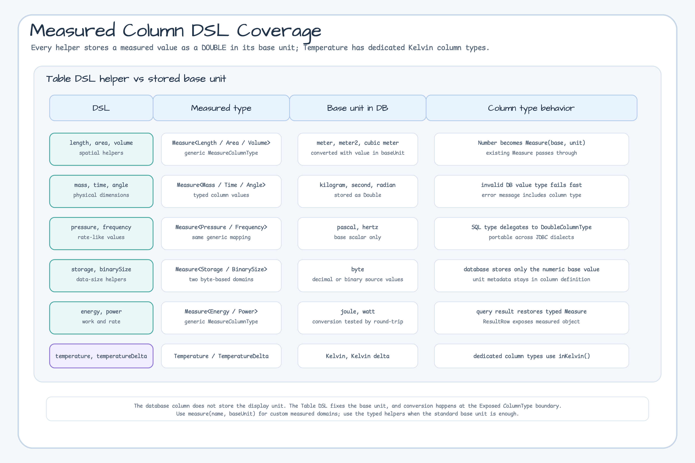
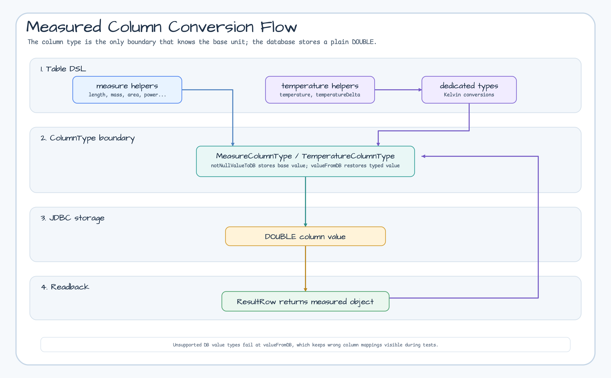

# Module exposed-measured

English | [한국어](./README.ko.md)

`exposed-measured` maps `bluetape4k-measured` values to Exposed `DOUBLE` columns. Table DSL helpers fix the base unit, `ColumnType` converts values at the database boundary, and reads restore `Measure<T>`, `Temperature`, or `TemperatureDelta` objects.

## Column DSL Coverage



## Supported Helpers

- `measure(name, baseUnit)`
- `length(name)`, `mass(name)`, `time(name)`, `area(name)`, `volume(name)`
- `angle(name)`, `pressure(name)`, `storage(name)`, `binarySize(name)`, `frequency(name)`
- `energy(name)`, `power(name)`
- `temperature(name)`, `temperatureDelta(name)`

## Conversion Flow



## Storage / Retrieval Sequence


## Example

```kotlin
object ProductTable: Table("products") {
    val width = length("width")
    val weight = mass("weight")
    val duration = time("duration")
    val storage = storage("storage")
    val binarySize = binarySize("binary_size")
    val temp = temperature("temp")
}
```

## Notes

- All generic `Measure<T>` helpers store the numeric value converted to the helper's base unit.
- `temperature(name)` stores Kelvin; `temperatureDelta(name)` stores Kelvin delta.
- The database does not store the original display unit, so use a stable base unit per column.
