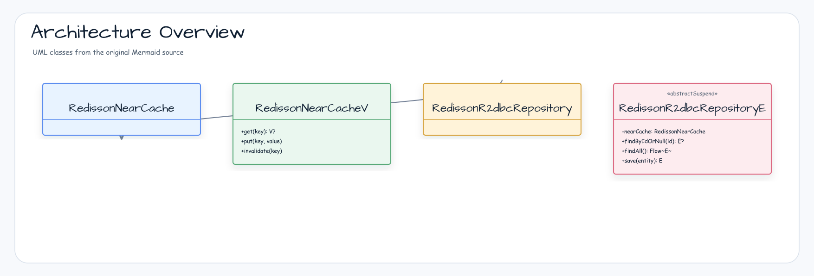
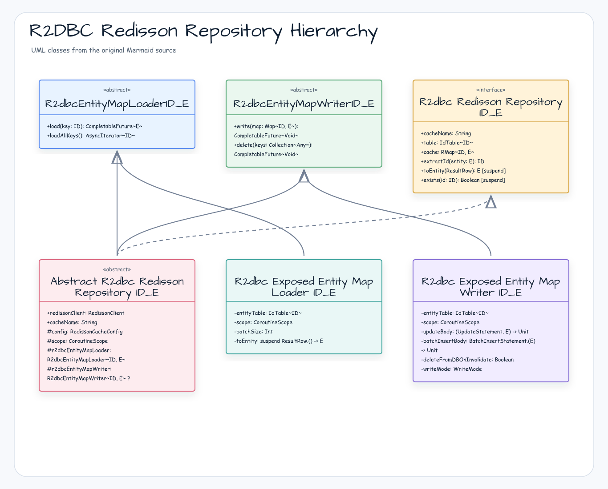
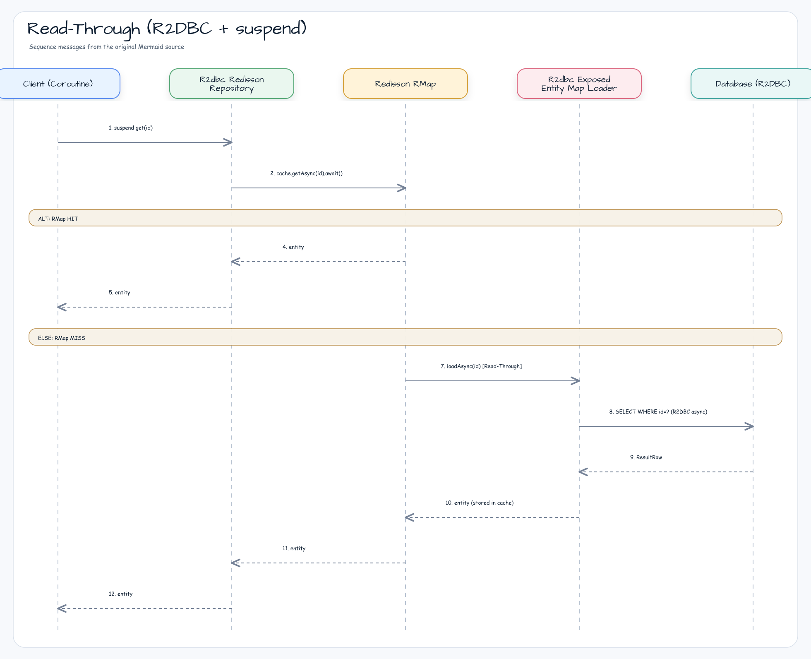
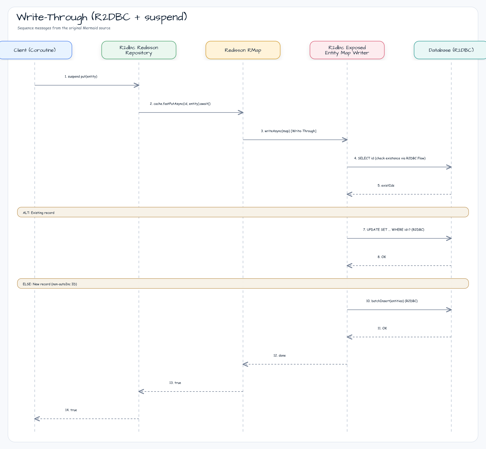
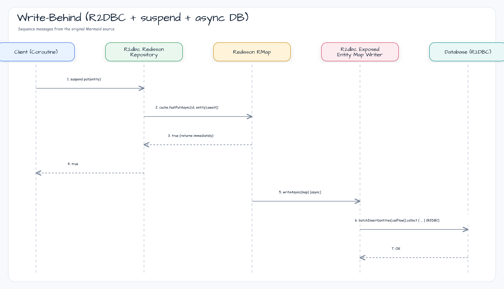

# Module exposed-r2dbc-redisson

[English](./README.md) | 한국어

Exposed R2DBC와 Redisson 캐시를 결합해 비동기 Read-Through/Write-Through 캐시 패턴을 구성하는 모듈입니다.

## 개요

`exposed-r2dbc-redisson`은 Exposed R2DBC(비동기)와 [Redisson](https://github.com/redisson/redisson) Redis 클라이언트를 통합하여, 비동기 환경에서 데이터베이스 조회 결과를 Redis에 캐싱하는 패턴을 쉽게 구현할 수 있도록 지원합니다. 모든 인터페이스는
`suspend` 함수 기반이며 Kotlin Coroutines와 완벽하게 호환됩니다.

### 주요 기능

- **MapLoader/MapWriter 비동기 지원**: Redisson `AsyncMapLoader`/`AsyncMapWriter` 연동
    - `loadAllKeys()`는 PK 오름차순으로 안정적으로 순회
- **Repository 추상화**: 캐시 + DB 접근 공통 패턴 (`R2dbcRedissonRepository`)
- **Coroutines 네이티브**: 모든 연산이 `suspend` 함수
- **Near Cache 지원**: Local Cache + Redis 2-Tier 캐시
- **Read-Through/Write-Through/Write-Behind**: 다양한 캐시 패턴 지원

## 의존성 추가

```kotlin
dependencies {
    implementation("io.github.bluetape4k.exposed:bluetape4k-exposed-r2dbc-redisson:${version}")
    implementation("org.redisson:redisson:3.37.0")

    // R2DBC 드라이버
    implementation("org.postgresql:r2dbc-postgresql:1.0.5.RELEASE")
}
```

## 기본 사용법

### 1. R2dbcRedissonRepository 구현

`AbstractR2dbcRedissonRepository`를 상속하여 비동기 캐시 Repository를 구현합니다.

```kotlin
import io.bluetape4k.exposed.r2dbc.redisson.repository.AbstractR2dbcRedissonRepository
import io.bluetape4k.redis.redisson.cache.RedissonCacheConfig
import org.jetbrains.exposed.v1.core.ResultRow
import org.jetbrains.exposed.v1.core.dao.id.LongIdTable
import org.jetbrains.exposed.v1.core.statements.BatchInsertStatement
import org.jetbrains.exposed.v1.core.statements.UpdateStatement
import org.redisson.api.RedissonClient

// 엔티티 (java.io.Serializable 필수)
data class UserRecord(
    val id: Long,
    val name: String,
    val email: String,
): java.io.Serializable

object UserTable: LongIdTable("users") {
    val name = varchar("name", 100)
    val email = varchar("email", 200)
}

class UserR2dbcRedissonRepository(
    redissonClient: RedissonClient,
    config: RedissonCacheConfig,
): AbstractR2dbcRedissonRepository<Long, UserRecord>(
    redissonClient = redissonClient,
    config = config,
) {
    override val table = UserTable

    override fun extractId(entity: UserRecord): Long = entity.id

    override suspend fun ResultRow.toEntity() = UserRecord(
        id    = this[UserTable.id].value,
        name  = this[UserTable.name],
        email = this[UserTable.email],
    )

    // Write-Through 모드 시 구현 필요
    override fun UpdateStatement.updateEntity(entity: UserRecord) {
        this[UserTable.name]  = entity.name
        this[UserTable.email] = entity.email
    }

    override fun BatchInsertStatement.insertEntity(entity: UserRecord) {
        this[UserTable.name]  = entity.name
        this[UserTable.email] = entity.email
    }
}

// 사용 (모든 메서드가 suspend)
val repo = UserR2dbcRedissonRepository(redissonClient, RedissonCacheConfig.readOnly())

// 캐시에서 조회 (미스 시 DB에서 자동 로드)
val user = repo.get(1L)

// DB에서 직접 조회
val freshUser = repo.findByIdFromDb(1L)

// DB 조회 후 캐시 저장
val all = repo.findAll(limit = 100)

// 캐시에 저장
repo.put(user!!)
repo.putAll(users)

// 캐시 무효화
repo.invalidate(1L)
repo.invalidateAll()
repo.invalidateByPattern("user:*")
```

### 2. 캐시 패턴 설정

```kotlin
import io.bluetape4k.redis.redisson.cache.RedissonCacheConfig

// Read-Through Only
val readOnlyConfig = RedissonCacheConfig.readOnly(
    ttl = Duration.ofMinutes(30),
)

// Read-Through + Write-Through
val readWriteConfig = RedissonCacheConfig.readWrite(
    ttl = Duration.ofMinutes(30),
    writeMode = WriteMode.WRITE_THROUGH,
)

// Near Cache 활성화 (Local + Redis 2-Tier)
val nearCacheConfig = RedissonCacheConfig.readOnly(
    ttl = Duration.ofMinutes(30),
    nearCacheEnabled = true,
)
```

## 아키텍처 개요



## 클래스 다이어그램

### R2DBC Redisson Repository 계층 구조



## 캐시 패턴

### Read-Through (R2DBC + suspend)

캐시 미스 시 `R2dbcExposedEntityMapLoader`가 R2DBC `suspendTransaction`으로 DB에서 자동 로드합니다.



### Write-Through (R2DBC + suspend)

`put()` 호출 시 `R2dbcExposedEntityMapWriter`가 R2DBC `suspendTransaction`으로 DB에 즉시 반영합니다.



### Write-Behind (R2DBC + suspend + 비동기 DB)

`put()` 호출 즉시 응답하고, 이후 `R2dbcExposedEntityMapWriter`가 비동기 배치로 DB에 반영합니다.



## R2dbcRedissonRepository 주요 메서드

| 메서드                                     | 설명                                |
|-----------------------------------------|-----------------------------------|
| `containsKey(id)`                            | 캐시에 해당 ID 캐시 키 존재 여부 확인 (suspend)      |
| `get(id)`                               | 캐시에서 엔티티 조회, 미스 시 DB 로드 (suspend) |
| `getAll(ids, batchSize)`                | 캐시에서 여러 엔티티 배치 조회 (suspend)       |
| `findByIdFromDb(id)`                    | DB에서 직접 조회, 캐시 우회 (suspend)       |
| `findAllFromDb(ids)`                    | DB에서 여러 엔티티 직접 조회 (suspend)       |
| `findAll(limit, offset, sortBy, where)` | DB 조회 후 캐시 동기화 (suspend)          |
| `put(entity)`                           | 캐시에 저장 (suspend)                  |
| `putAll(entities, batchSize)`           | 캐시에 일괄 저장 (suspend)               |
| `invalidate(vararg ids)`                | 캐시에서 제거 (suspend)                 |
| `invalidateAll()`                       | 캐시 전체 비우기 (suspend)               |
| `invalidateByPattern(pattern, count)`   | 패턴에 맞는 키 캐시 제거 (suspend)          |

## 캐시 설정 상수 (`RedissonCacheConfig`)

자주 사용하는 캐시 모드 설정값이 상수로 제공됩니다.

| 상수                                                    | 설명                              |
|-------------------------------------------------------|---------------------------------|
| `RedissonCacheConfig.READ_ONLY`                          | Read-Through 전용 (원격 캐시)         |
| `RedissonCacheConfig.READ_ONLY_WITH_NEAR_CACHE`          | Read-Through + Near Cache       |
| `RedissonCacheConfig.READ_WRITE_THROUGH`                 | Read-Through + Write-Through    |
| `RedissonCacheConfig.READ_WRITE_THROUGH_WITH_NEAR_CACHE` | Read-Write-Through + Near Cache |
| `RedissonCacheConfig.WRITE_BEHIND`                       | Write-Behind (원격 캐시)            |
| `RedissonCacheConfig.WRITE_BEHIND_WITH_NEAR_CACHE`       | Write-Behind + Near Cache       |

## 주요 파일/클래스 목록

### Repository (repository/)

| 파일                                   | 설명                                 |
|--------------------------------------|------------------------------------|
| `R2dbcRedissonRepository.kt`         | R2DBC 비동기 캐시 Repository 인터페이스      |
| `AbstractR2dbcRedissonRepository.kt` | R2DBC 비동기 캐시 Repository 추상 클래스     |
| `R2dbcCacheRepository.kt`            | (Deprecated) 구 R2DBC 캐시 Repository |
| `AbstractR2dbcCacheRepository.kt`    | (Deprecated) 구 R2DBC 캐시 추상 클래스     |

### Map (map/)

| 파일                               | 설명                                                            |
|----------------------------------|---------------------------------------------------------------|
| `R2dbcEntityMapLoader.kt`        | R2DBC 비동기 MapLoader 기본 구현 (`MapLoaderAsync`)                  |
| `R2dbcEntityMapWriter.kt`        | R2DBC 비동기 MapWriter 기본 구현 (`MapWriterAsync`)                  |
| `R2dbcExposedEntityMapLoader.kt` | Exposed IdTable 기반 MapLoader 구현체                              |
| `R2dbcExposedEntityMapWriter.kt` | Exposed IdTable 기반 MapWriter 구현체 (Write-Through/Write-Behind) |
| `AsyncIteratorSupport.kt`        | Redisson `AsyncIterator`를 `List`로 수집하는 확장 함수                  |

## 테스트

```bash
./gradlew :exposed-r2dbc-redisson:test
```

## 참고

- [JetBrains Exposed R2DBC](https://github.com/JetBrains/Exposed)
- [Redisson](https://github.com/redisson/redisson)
- [Redisson AsyncMapLoader](https://www.javadoc.io/doc/org.redisson/redisson/latest/org/redisson/api/map/MapLoaderAsync.html)
- [exposed-r2dbc](../exposed-r2dbc)
- [exposed-jdbc-redisson](../exposed-jdbc-redisson)
