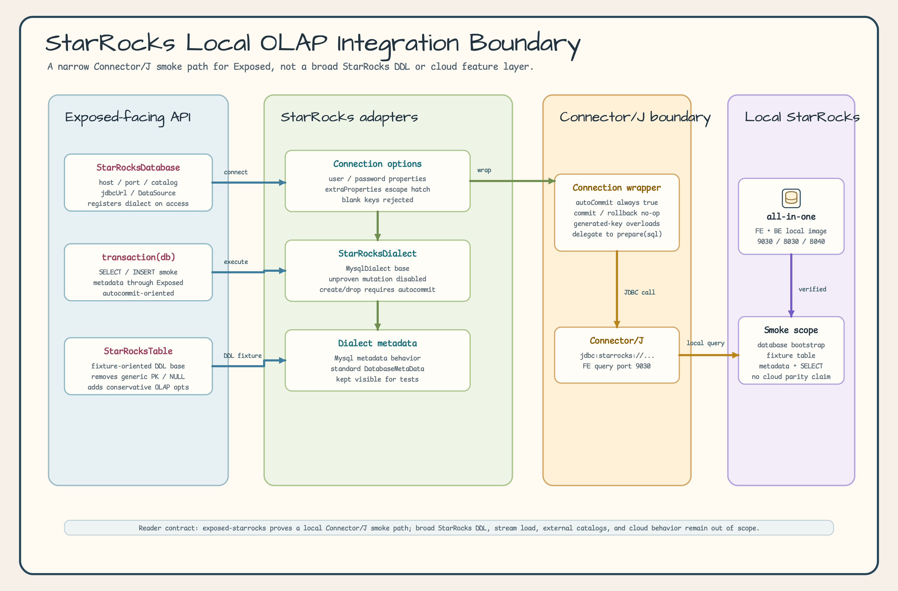
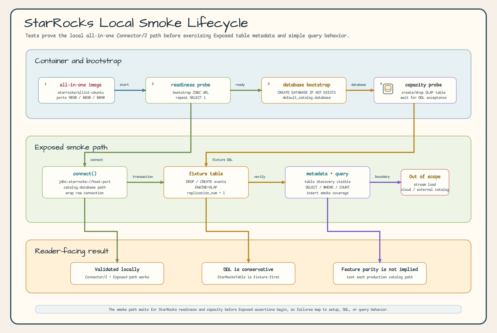

# Module exposed-starrocks

[English](./README.md) | 한국어

JetBrains Exposed ORM을 위한 StarRocks JDBC 통합 모듈입니다. 이 모듈은 native
StarRocks Connector/J 연결, Exposed dialect 등록, metadata 조회, fixture table
설정, 단순 query 실행까지의 좁은 local-first OLAP 경로를 검증합니다.

## 로컬 OLAP 통합 경계



### 로컬 Smoke Lifecycle



## 범위

`exposed-starrocks`는 다음을 제공합니다:

- **StarRocksDatabase**:
  `jdbc:starrocks://<fe_host>:<fe_query_port>/<catalog>.<database>` 연결 팩토리
- **StarRocksDialect**: `starrocks` 이름으로 등록되는 최소 Exposed dialect
- **StarRocksDialectMetadata**: 표준 JDBC `DatabaseMetaData` 조회를 유지하는 metadata adapter
- **StarRocksConnectionWrapper**: Exposed 호환을 위한 autocommit 중심 JDBC wrapper
- **StarRocksConnectionOptions**: 추가 JDBC property holder
- **StarRocksTable**: generic primary-key 구문을 제거하고 보수적인 StarRocks
  OLAP table option을 붙이는 fixture-oriented table base

이 모듈은 MySQL, PostgreSQL, Trino, ClickHouse parity를 주장하지 않습니다. 넓은
StarRocks DDL, partitioning, aggregate key variants, stream load, external
catalog, StarRocks Cloud 검증은 범위 밖입니다.

## 의존성

```kotlin
dependencies {
    implementation("io.github.bluetape4k.exposed:bluetape4k-exposed-starrocks:${version}")
}
```

이 모듈은 StarRocks Connector/J를 사용합니다:

```kotlin
implementation("com.starrocks:starrocks-connector-j:1.1.1")
```

## 로컬 StarRocks

검증된 로컬 컨테이너 경로는 공식 StarRocks all-in-one image를 따릅니다:

```bash
docker run -p 9030:9030 -p 8030:8030 -p 8040:8040 -itd \
  --name quickstart starrocks/allin1-ubuntu
```

Docker에는 최소 4 GB RAM과 10 GB 여유 디스크를 할당하는 것을 권장합니다. FE query
port는 `9030`입니다.

## 기본 사용법

```kotlin
import io.bluetape4k.exposed.starrocks.StarRocksDatabase
import org.jetbrains.exposed.v1.jdbc.transactions.transaction

val db = StarRocksDatabase.connect(
    host = "localhost",
    port = 9030,
    catalog = "default_catalog",
    database = "analytics",
    user = "root",
)

transaction(db) {
    exec("SELECT 1") { rs ->
        rs.next()
        rs.getInt(1)
    }
}
```

`default_catalog.<database>`로 연결하기 전에 대상 database를 먼저 생성해야 합니다.
로컬 테스트는 전용 database를 bootstrap한 뒤 table metadata와 `SELECT` query를
Exposed를 통해 검증합니다.

## 검증

```bash
./gradlew :bluetape4k-exposed-starrocks:test --no-configuration-cache --no-daemon
```
