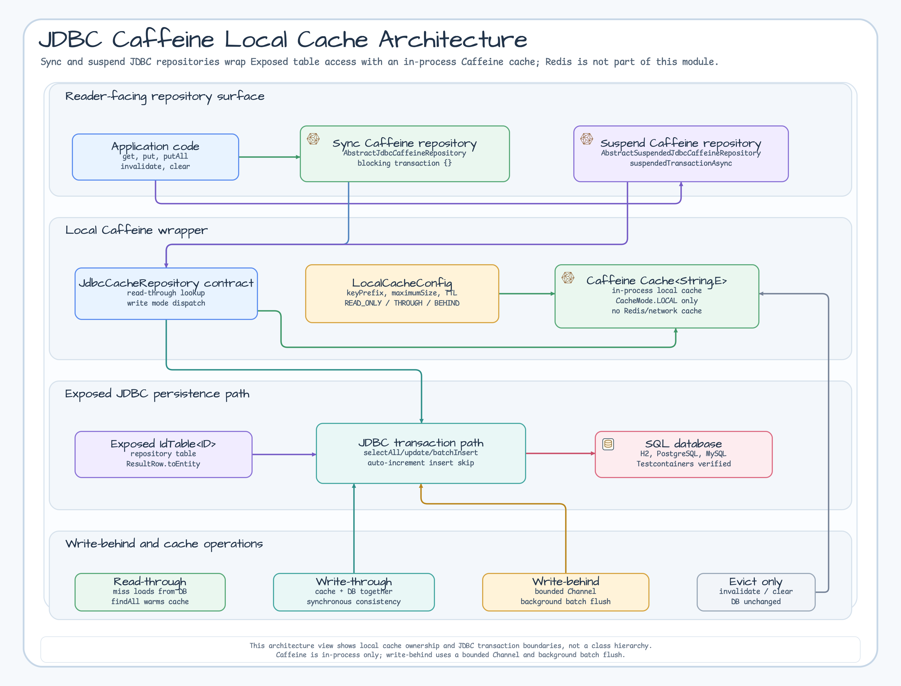
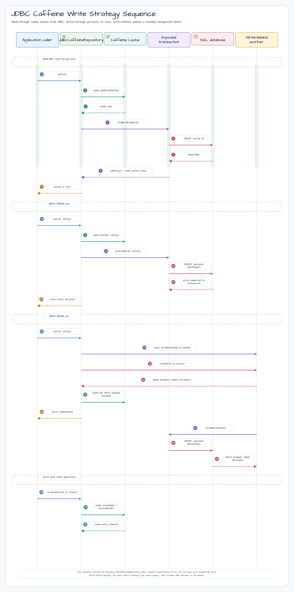

# exposed-jdbc-caffeine

English | [한국어](./README.ko.md)

[](https://central.sonatype.com/artifact/io.github.bluetape4k.exposed/exposed-jdbc-caffeine)

Exposed JDBC repository with Caffeine local (in-process) cache. No Redis dependency — only `exposed-cache` interfaces are required.

> **See also**: [exposed-cache — Full Module Ecosystem & Interface Hierarchy](../exposed-cache/README.md)

## Architecture

The architecture view shows where the in-process Caffeine cache wraps the JDBC repository contract, and where synchronous and suspend repositories enter Exposed transactions.



## Write Strategy Flows

The sequence view focuses on the blocking repository path: read-through misses, write-through durability, write-behind queueing, and cache-only eviction.



## Features

- **Read-Through**: Cache miss triggers DB load via `transaction { selectAll }`, result stored in Caffeine
- **Write-Through**: `put()` updates both Caffeine and DB synchronously in a single JDBC transaction
- **Write-Behind**: `put()` updates Caffeine immediately; DB writes are batched asynchronously via a Kotlin `Channel`
- **Sync repository**: `AbstractJdbcCaffeineRepository` — all methods use blocking `transaction {}`
- **Suspend repository**: `AbstractSuspendedJdbcCaffeineRepository` — all DB calls use `suspendedTransactionAsync`
- **No Redis dependency**: Pure in-process Caffeine; suitable for single-instance deployments
- **AutoIncrement safety**: Write-Through and Write-Behind skip INSERT for AutoInc tables (DB assigns the ID)
- **Bounded write-behind**: `writeBehindBatchSize` and `writeBehindQueueCapacity` each accept `1..100_000`; queue capacity must be greater than or equal to batch size, otherwise `IllegalArgumentException` is thrown during configuration
- **Graceful shutdown**: `close()` stops new admissions, attempts publication and worker drain within a finite shutdown boundary, then cleans up the cache; timeout or interruption can leave a residual batch or failure

<!-- JDBC-SNAPSHOT-CACHE -->
## Commit-safe JDBC snapshot cache (opt-in)

`JdbcCaffeineSnapshotCache` is separate from the repository cache above. It stores only detached immutable DTOs and
publishes staged `CacheSnapshot` values after the current root `JdbcTransaction` commits. Existing repository caches are
not migrated. A rollback publishes nothing, repeated mutations of one key use last-mutation-wins ordering, and a local
fence rejects a fill captured before a newer local invalidation.

Call `lookup` before the database read. Capacity exhaustion then fails before database work. A returned
`SnapshotCacheMiss` is one-shot, including when mapping or staging throws. `stageSnapshot` maps inside the current root
transaction and rejects nested/savepoint transactions. Snapshot fill requires `maxAttempts = 1`; wrap the complete
lookup + transaction + database-read sequence in an application retry and obtain a fresh lookup for every outer retry.
`stageInvalidation` remains attempt-local, so a failed Exposed attempt leaks no invalidation and a successful retry
publishes once.

Transaction callbacks perform cache work only and never call repository `put` or any database writer. If an earlier
`StatementInterceptor` callback throws, this callback may not run and an older cache value can remain. Observe the
bounded `SnapshotCacheFailureBuffer` and keep an application-owned outbox or repair path for post-commit failures.
Commit-safe is not database/cache atomicity or crash durability.

### Canonical JDBC example

The English and Korean blocks below are byte-for-byte equal to a compiled source-usage fixture.

<!-- README-CANONICAL-JDBC-BEGIN -->
```kotlin
import io.bluetape4k.exposed.cache.snapshot.CacheSnapshot
import io.bluetape4k.exposed.cache.snapshot.CacheSnapshotMapper
import io.bluetape4k.exposed.cache.snapshot.CaffeineSnapshotCacheConfig
import io.bluetape4k.exposed.cache.snapshot.SnapshotCacheConfig
import io.bluetape4k.exposed.jdbc.caffeine.snapshot.JdbcCaffeineSnapshotCache
import io.bluetape4k.exposed.jdbc.caffeine.snapshot.jdbcCaffeineSnapshotCache
import io.bluetape4k.exposed.jdbc.caffeine.snapshot.stageInvalidation
import io.bluetape4k.exposed.jdbc.caffeine.snapshot.stageSnapshot
import org.jetbrains.exposed.v1.jdbc.JdbcTransaction
import java.io.Serializable

data class JdbcOrderRow(val id: Long, val description: String)

data class JdbcOrderSnapshot(val id: Long, val description: String) : Serializable {
    private companion object {
        private const val serialVersionUID: Long = 1L
    }
}

private val jdbcOrderSnapshotCache = jdbcCaffeineSnapshotCache<Long, JdbcOrderSnapshot>(
    CaffeineSnapshotCacheConfig(
        snapshot = SnapshotCacheConfig(namespace = "orders:v1", schemaVersion = "order-dto-v1"),
    ),
)

fun JdbcTransaction.cacheOrderSnapshot(
    id: Long,
    loadFromDatabase: JdbcTransaction.(Long) -> JdbcOrderRow,
): CacheSnapshot<JdbcOrderSnapshot> {
    val lookup = jdbcOrderSnapshotCache.lookup(id)
    lookup.snapshot?.let { return it }
    val row = loadFromDatabase(id)
    return stageSnapshot(
        cache = jdbcOrderSnapshotCache,
        miss = requireNotNull(lookup.miss),
        source = row,
        mapper = CacheSnapshotMapper { CacheSnapshot(JdbcOrderSnapshot(it.id, it.description)) },
    )
}

fun JdbcTransaction.invalidateOrderSnapshot(id: Long) {
    stageInvalidation(jdbcOrderSnapshotCache, id)
}
```
<!-- README-CANONICAL-JDBC-END -->

## Usage

### Sync repository (AbstractJdbcCaffeineRepository)

```kotlin
import io.bluetape4k.exposed.cache.LocalCacheConfig
import io.bluetape4k.exposed.jdbc.caffeine.repository.AbstractJdbcCaffeineRepository
import org.jetbrains.exposed.v1.core.ResultRow
import org.jetbrains.exposed.v1.core.statements.BatchInsertStatement
import org.jetbrains.exposed.v1.core.statements.UpdateStatement

data class ActorRecord(val id: Long, val firstName: String, val lastName: String) : java.io.Serializable {
    companion object { private const val serialVersionUID = 1L }
}

class ActorCaffeineRepository(
    config: LocalCacheConfig = LocalCacheConfig.WRITE_THROUGH,
) : AbstractJdbcCaffeineRepository<Long, ActorRecord>(config) {

    override val table = ActorTable

    override fun ResultRow.toEntity() = ActorRecord(
        id = this[ActorTable.id].value,
        firstName = this[ActorTable.firstName],
        lastName = this[ActorTable.lastName],
    )

    override fun UpdateStatement.updateEntity(entity: ActorRecord) {
        this[ActorTable.firstName] = entity.firstName
        this[ActorTable.lastName] = entity.lastName
    }

    override fun BatchInsertStatement.insertEntity(entity: ActorRecord) {
        this[ActorTable.firstName] = entity.firstName
        this[ActorTable.lastName] = entity.lastName
    }

    override fun extractId(entity: ActorRecord) = entity.id
}

// Read-Through (cache miss -> DB load)
val actor = repo.get(1L)

// Write-Through (cache + DB synchronously)
repo.put(1L, ActorRecord(1L, "Hong", "Gildong"))

// Batch write
repo.putAll(mapOf(1L to actor1, 2L to actor2))

// Invalidate cache entry (no DB effect)
repo.invalidate(1L)
```

### Suspend repository (AbstractSuspendedJdbcCaffeineRepository)

```kotlin
import io.bluetape4k.exposed.cache.LocalCacheConfig
import io.bluetape4k.exposed.jdbc.caffeine.repository.AbstractSuspendedJdbcCaffeineRepository

class ActorSuspendedRepository(
    config: LocalCacheConfig = LocalCacheConfig.WRITE_THROUGH,
) : AbstractSuspendedJdbcCaffeineRepository<Long, ActorRecord>(config) {

    override val table = ActorTable

    override fun ResultRow.toEntity() = ActorRecord(
        id = this[ActorTable.id].value,
        firstName = this[ActorTable.firstName],
        lastName = this[ActorTable.lastName],
    )

    override fun UpdateStatement.updateEntity(entity: ActorRecord) {
        this[ActorTable.firstName] = entity.firstName
        this[ActorTable.lastName] = entity.lastName
    }

    override fun BatchInsertStatement.insertEntity(entity: ActorRecord) {
        this[ActorTable.firstName] = entity.firstName
        this[ActorTable.lastName] = entity.lastName
    }

    override fun extractId(entity: ActorRecord) = entity.id
}

// All operations are suspend functions
suspend fun example(repo: ActorSuspendedRepository) {
    val actor = repo.get(1L)                        // Read-Through
    repo.put(1L, ActorRecord(1L, "Hong", "Gil"))    // Write-Through
    repo.invalidate(1L)                             // Cache eviction only
    repo.clear()                                    // Evict all cache entries
}
```

#### Suspend read-through miss lifecycle

For a cache miss, concurrent calls for the same serialized key share a private
`Mutex` entry. A successful database load populates Caffeine, so overlapping
callers observe the cached value and do not start another loader. The entry is
removed after the last holder or waiter leaves, including exception and
cancellation paths.

An exception, `CancellationException`, or `null` result is not shared as a
deferred outcome. A queued or later caller may retry sequentially after the
previous attempt finishes. Caller cancellation is rethrown unchanged. The
coordination registry is private; this module does not expose its size as
metrics or policy APIs.

### Write-Behind configuration

```kotlin
val behindConfig = LocalCacheConfig(
    keyPrefix = "actor",
    maximumSize = 5_000L,
    writeMode = CacheWriteMode.WRITE_BEHIND,
    writeBehindBatchSize = 200,
    writeBehindQueueCapacity = 5_000,
)
val repo = ActorCaffeineRepository(behindConfig)

// put() returns immediately; DB flush happens asynchronously in batches
repo.put(1L, actor)
```

## LocalCacheConfig Reference

```kotlin
val config = LocalCacheConfig(
    keyPrefix = "actor",                          // cache key prefix
    maximumSize = 10_000L,                        // max entries in Caffeine
    expireAfterWrite = Duration.ofMinutes(30),    // TTL from last write
    expireAfterAccess = null,                     // TTL from last access (optional)
    writeMode = CacheWriteMode.WRITE_THROUGH,     // READ_ONLY | WRITE_THROUGH | WRITE_BEHIND
    writeBehindBatchSize = 100,                   // flush batch size
    writeBehindQueueCapacity = 10_000,            // queue size (must not be unlimited)
)
```

## Test Databases

Tests run against:

- **H2 (MySQL mode)** — in-memory, default for fast local runs
- **PostgreSQL** — via Testcontainers
- **MySQL 8** — via Testcontainers

## Dependency

```kotlin
dependencies {
    implementation("io.github.bluetape4k.exposed:bluetape4k-exposed-jdbc-caffeine")
}
```

The application owns the `bluetape4k-dependencies` BOM version, so the module coordinate is intentionally versionless.

## References

- [exposed-cache — Hub module](../exposed-cache/README.md)
- [exposed-jdbc](../exposed-jdbc)
- [Caffeine Cache](https://github.com/ben-manes/caffeine)
