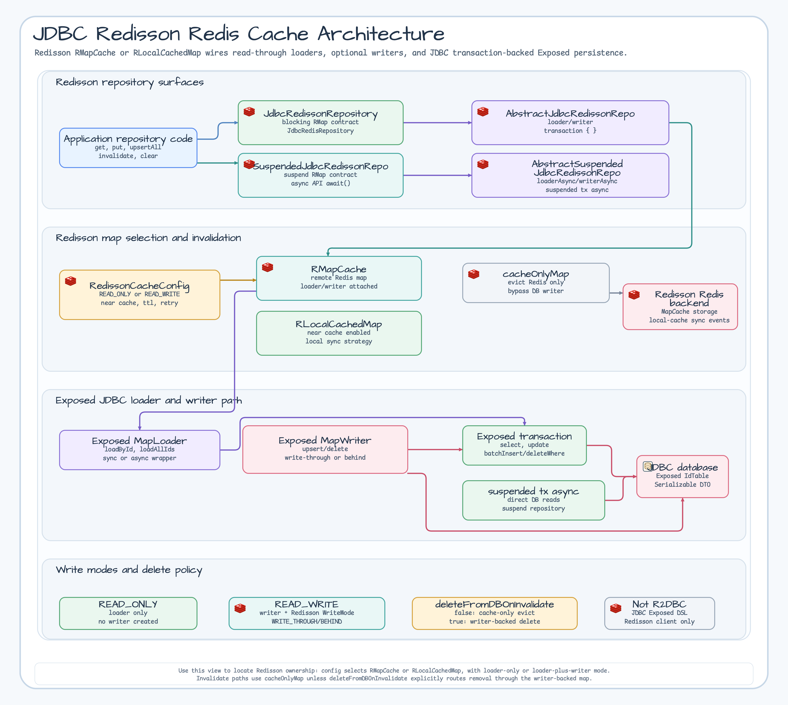
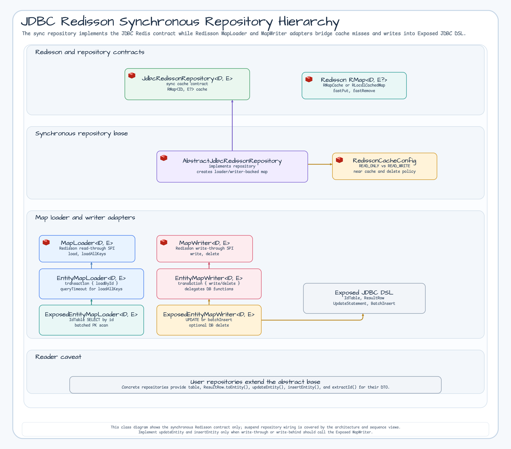
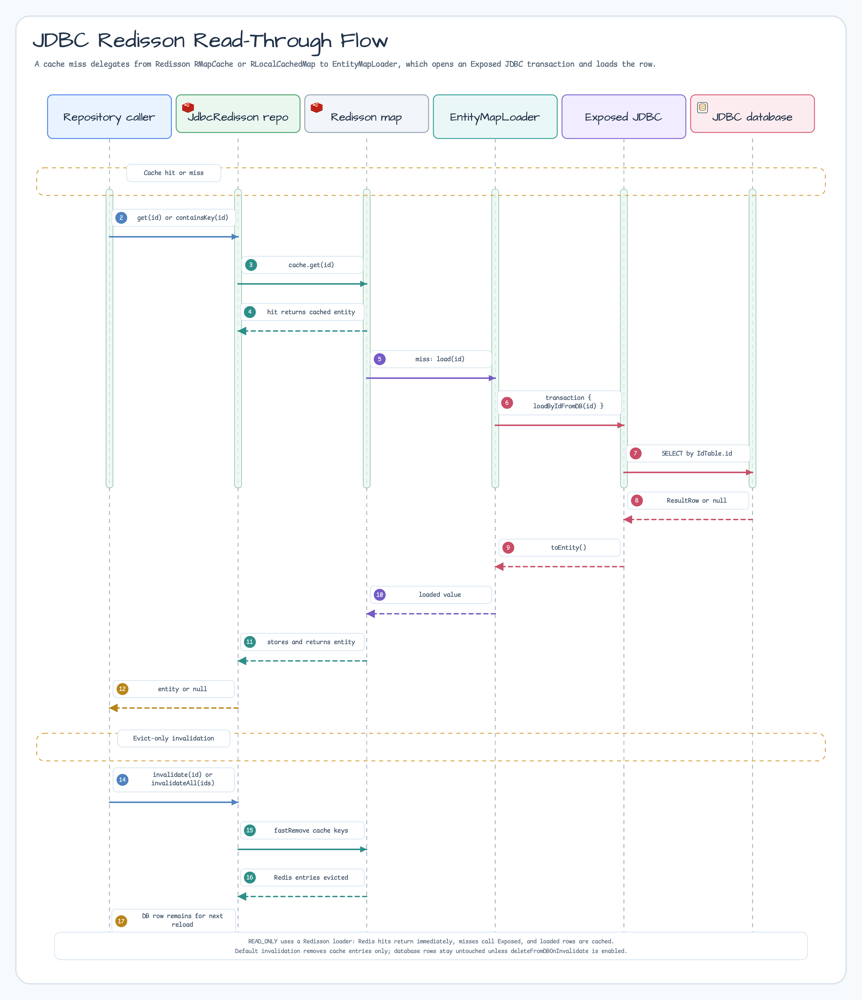
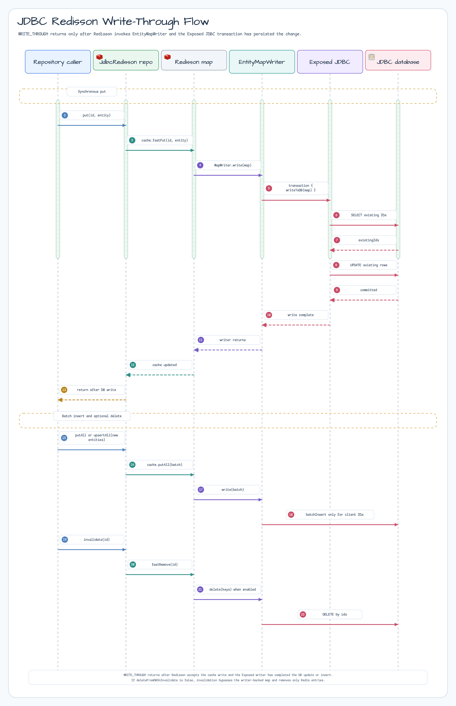
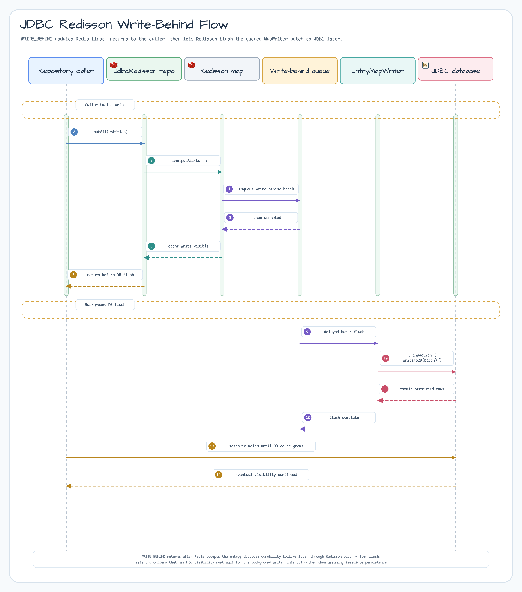
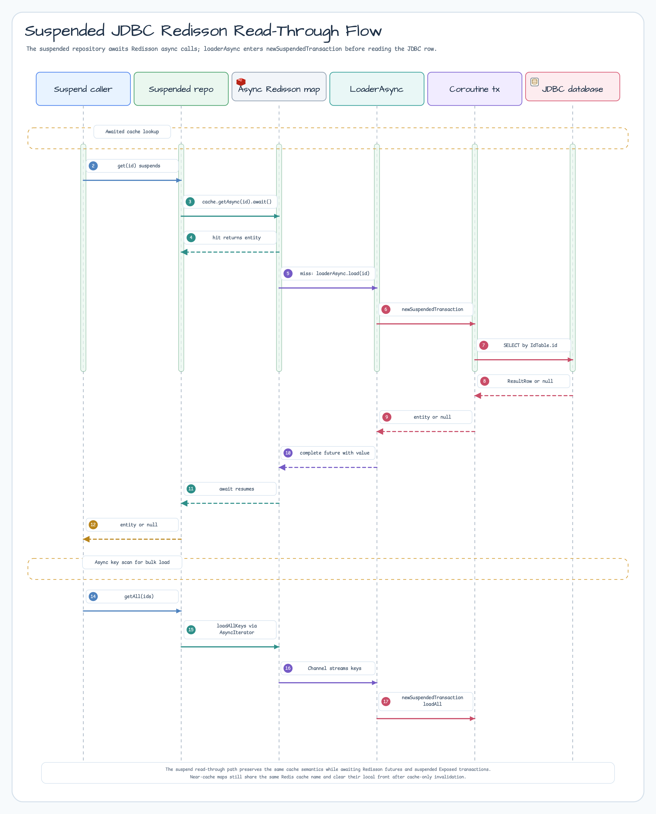
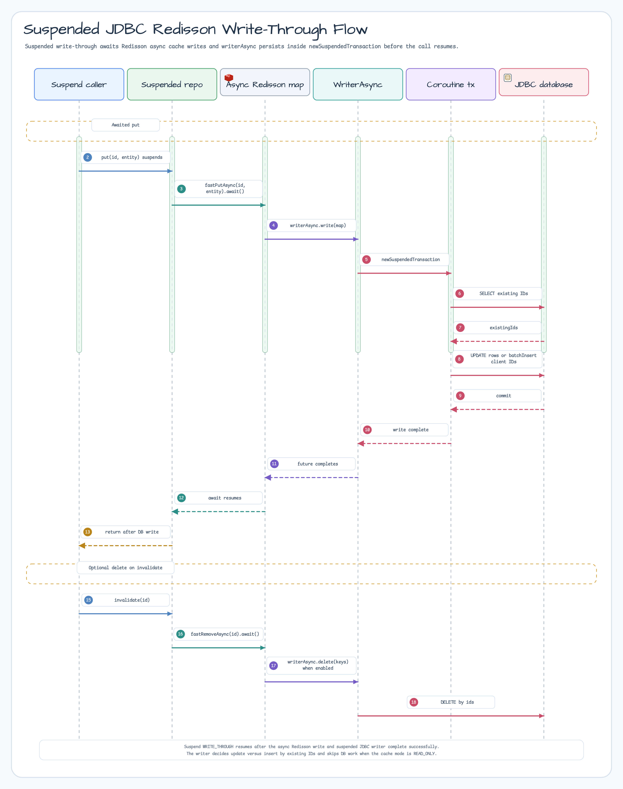
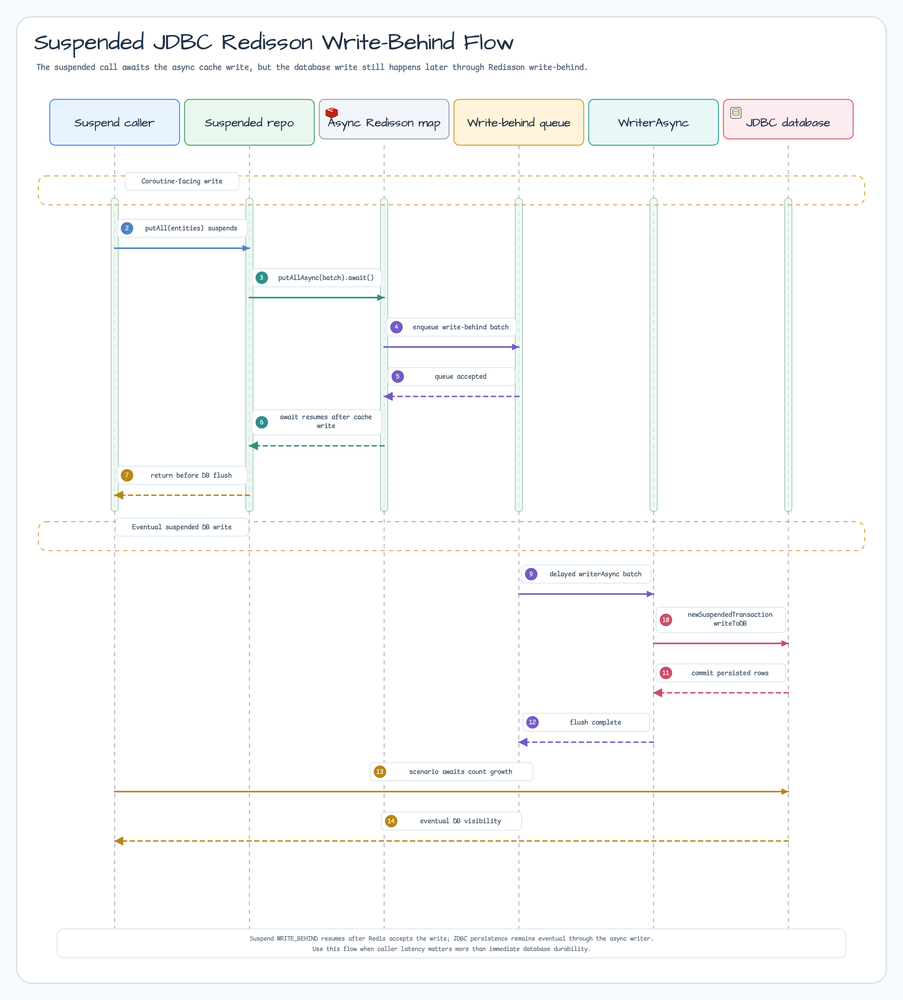

# Module exposed-jdbc-redisson

English | [한국어](./README.ko.md)

Combines Exposed JDBC with Redisson caching to implement Read-Through/Write-Through cache patterns.

## Overview

`exposed-jdbc-redisson` integrates JetBrains Exposed ORM with the [Redisson](https://github.com/redisson/redisson) Redis client, making it easy to cache database query results in Redis.

### Key Features

- **MapLoader/MapWriter support**: Integration with Redisson Read-Through/Write-Through caching
    - The synchronous `loadAllKeys()` uses ordered keyset pages for supported scalar IDs and the legacy offset fallback for custom IDs; each page is bounded by `batchSize`
    - `loadAllKeysInParallel(ranges, options)` is an opt-in materialized Virtual Thread path for caller-owned disjoint `[lowerInclusive, upperExclusive)` PK ranges; it uses independent JDBC transactions, bounded concurrency, and ordered merge, while the default sequential loader remains unchanged. Exposed range predicates require `Comparable` PK boundaries
    - The suspended `loadAllKeys()` exposes Redisson `AsyncIterator` with rendezvous-channel back-pressure and ascending keyset pages
    - Both JDBC loader paths use the custom-ID offset fallback when keyset comparison is unavailable; the suspended path keeps one `batchSize` page in flight and propagates caller cancellation to the producer transaction
    - Enumeration is weakly consistent; a page-side delete can skip an unseen row on the custom-ID fallback path. The suspended producer transaction uses `maxAttempts = 1`, so retry the whole enumeration instead of replaying channel emissions
- **Repository abstraction**: Common cache + DB access patterns (`JdbcRedissonRepository`,
  `SuspendedJdbcRedissonRepository`)
- **Sync and Coroutines implementations**: Choose the right approach for your environment
- **Near Cache support**: Two-tier Local Cache + Redis caching
- **Write-Behind support**: Asynchronous DB persistence pattern

## Adding Dependencies

```kotlin
dependencies {
    implementation("io.github.bluetape4k.exposed:bluetape4k-exposed-jdbc-redisson")
    implementation("org.redisson:redisson")
}
```

The application owns the `bluetape4k-dependencies` BOM version, so both coordinates are intentionally versionless.

## Architecture Overview

The architecture view separates the Redisson map that serves application calls from the map used for cache-only
invalidation. `RedissonCacheConfig` chooses `RMapCache` or `RLocalCachedMap`, attaches a loader in read-only mode, and
adds a writer only for read/write modes.



## Class Diagrams

### Synchronous Repository Hierarchy

The class diagram focuses on the synchronous repository contract. Coroutine behavior uses the same cache policy, but
the suspend path is easier to read in the sequence diagrams because it awaits Redisson futures and suspended Exposed
transactions.




## Basic Usage

### 1. Implementing JdbcRedissonRepository (synchronous)

Extend `AbstractJdbcRedissonRepository` to implement a synchronous cache Repository.

```kotlin
import io.bluetape4k.exposed.redisson.repository.AbstractJdbcRedissonRepository
import io.bluetape4k.redis.redisson.cache.RedissonCacheConfig
import org.jetbrains.exposed.v1.core.ResultRow
import org.jetbrains.exposed.v1.core.dao.id.LongIdTable
import org.jetbrains.exposed.v1.core.statements.BatchInsertStatement
import org.jetbrains.exposed.v1.core.statements.UpdateStatement
import org.jetbrains.exposed.v1.jdbc.update
import org.redisson.api.RedissonClient

// Entity (must implement java.io.Serializable)
data class UserRecord(
    val id: Long,
    val name: String,
    val email: String,
): java.io.Serializable

object UserTable: LongIdTable("users") {
    val name = varchar("name", 100)
    val email = varchar("email", 200)
}

class UserRedissonRepository(
    redissonClient: RedissonClient,
    config: RedissonCacheConfig,
): AbstractJdbcRedissonRepository<Long, UserRecord>(
    redissonClient = redissonClient,
    config = config,
    // Required only when using Fory/Kryo/JDK-family binary codecs with trusted Redis data.
    trustedBinaryCache = true,
) {
    override val table = UserTable

    override fun extractId(entity: UserRecord): Long = entity.id

    override fun ResultRow.toEntity() = UserRecord(
        id    = this[UserTable.id].value,
        name  = this[UserTable.name],
        email = this[UserTable.email],
    )

    // Required for Write-Through mode
    override fun UpdateStatement.updateEntity(entity: UserRecord) {
        this[UserTable.name]  = entity.name
        this[UserTable.email] = entity.email
    }

    override fun BatchInsertStatement.insertEntity(entity: UserRecord) {
        this[UserTable.name]  = entity.name
        this[UserTable.email] = entity.email
    }
}

// Usage (Read-Through)
val repo = UserRedissonRepository(redissonClient, RedissonCacheConfig.READ_ONLY)

// Retrieve from cache (auto-loads from DB on miss)
val user = repo[1L]

// Check cache key existence by ID (DB Read-Through on cache miss)
val exists = repo.containsKey(1L)

// Bypass cache and query DB directly
val freshUser = repo.findByIdFromDb(1L)

// Batch retrieval of multiple entities
val users = repo.getAll(listOf(1L, 2L, 3L))

// Load from DB and store in cache
val allUsers = repo.findAll(limit = 100)

// Invalidate cache
repo.invalidate(1L)
repo.invalidateAll()
repo.invalidateByPattern("*John*")  // Invalidate by pattern
```

### 2. Implementing SuspendedJdbcRedissonRepository (Coroutines)

Extend `AbstractSuspendedJdbcRedissonRepository` to implement a coroutine-based cache Repository.

```kotlin
import io.bluetape4k.exposed.redisson.repository.AbstractSuspendedJdbcRedissonRepository
import io.bluetape4k.redis.redisson.cache.RedissonCacheConfig
import org.jetbrains.exposed.v1.core.statements.BatchInsertStatement
import org.jetbrains.exposed.v1.core.statements.UpdateStatement
import org.redisson.api.RedissonClient

class SuspendedUserRedissonRepository(
    redissonClient: RedissonClient,
    config: RedissonCacheConfig,
): AbstractSuspendedJdbcRedissonRepository<Long, UserRecord>(
    redissonClient = redissonClient,
    config = config,
    // Required only when using Fory/Kryo/JDK-family binary codecs with trusted Redis data.
    trustedBinaryCache = true,
) {
    override val table = UserTable

    override fun extractId(entity: UserRecord): Long = entity.id

    override fun ResultRow.toEntity() = UserRecord(
        id    = this[UserTable.id].value,
        name  = this[UserTable.name],
        email = this[UserTable.email],
    )

    override fun UpdateStatement.updateEntity(entity: UserRecord) {
        this[UserTable.name]  = entity.name
        this[UserTable.email] = entity.email
    }

    override fun BatchInsertStatement.insertEntity(entity: UserRecord) {
        this[UserTable.name]  = entity.name
        this[UserTable.email] = entity.email
    }
}

// Usage (suspend functions)
val repo = SuspendedUserRedissonRepository(redissonClient, RedissonCacheConfig.READ_ONLY)

val user = repo.get(1L)                          // Cache lookup (DB Read-Through on miss)
val exists = repo.containsKey(1L)                     // Check cache key existence
val fresh = repo.findByIdFromDb(1L)              // Bypass cache, query DB directly
val all = repo.findAll(limit = 100)              // Load from DB, populate cache
val batch = repo.getAll(listOf(1L, 2L, 3L))     // Batch retrieval
repo.put(user!!)                                 // Store in cache
repo.putAll(batch)                               // Batch store in cache
repo.upsertAll(batch, batchSize = 100)           // Explicit bulk cache upsert
repo.invalidate(1L)                              // Invalidate single entry
repo.invalidateAll()                             // Invalidate all (returns Boolean)
repo.invalidateByPattern("user:*")               // Invalidate by pattern
```

### 3. Cache pattern configuration

```kotlin
import io.bluetape4k.redis.redisson.cache.RedissonCacheConfig
import org.redisson.api.map.WriteMode

// Read-Through Only (default) — auto-loads from DB on cache miss
val readOnlyConfig = RedissonCacheConfig.READ_ONLY

// Read-Through + Near Cache — two-tier Local Cache + Redis
val readOnlyNearCacheConfig = RedissonCacheConfig.READ_ONLY_WITH_NEAR_CACHE

// Read-Through + Write-Through — synchronously persists to DB on cache write
val writeThroughConfig = RedissonCacheConfig.READ_WRITE_THROUGH

// Read-Through + Write-Through + Near Cache
val writeThroughNearCacheConfig = RedissonCacheConfig.READ_WRITE_THROUGH_WITH_NEAR_CACHE

// Read-Through + Write-Behind — asynchronously persists to DB after cache write
val writeBehindConfig = RedissonCacheConfig.WRITE_BEHIND

// Read-Through + Write-Behind + Near Cache
val writeBehindNearCacheConfig = RedissonCacheConfig.WRITE_BEHIND_WITH_NEAR_CACHE

// Also delete from DB on invalidate (deleteFromDBOnInvalidate=true)
// ⚠️ Use with caution in production.
val deleteFromDbConfig = RedissonCacheConfig.READ_WRITE_THROUGH.copy(
    deleteFromDBOnInvalidate = true,
)
```

## Redis Codec Safety

`RedissonCacheConfig` constants use Fory-family binary codecs by default. Repository constructors
reject Fory/Kryo/JDK-family binary codecs unless `trustedBinaryCache = true` is passed explicitly.
Use that opt-in only for private Redis instances whose contents are not writable by untrusted
clients. For dependency-facing Redis data, provide a reviewed custom codec instead of relying on
the default binary codec.

<!-- REDISSON-SNAPSHOT-INVALIDATION -->
## Commit-safe Redisson snapshot invalidation (opt-in)

`JdbcRedissonSnapshotInvalidator` is a separate invalidation-only path for an application near-cache. It exposes no
cache read or snapshot PUT and does not migrate an existing `JdbcRedissonRepository`. `stageInvalidation` publishes
`fastRemoveAsync` only after the current root JDBC transaction commits; rollback publishes nothing. Its transaction
must use `maxAttempts = 1`, so application retry wraps the whole transaction.

### Key, codec, and namespace contract

- Distributed identifiers are non-secret, non-credential, non-PII surrogate `Long` or `UUID` values. Use
  `longSnapshotIdentifierPolicy()` or `uuidSnapshotIdentifierPolicy()`. There is intentionally no String policy; map
  sensitive, composite, or domain String keys to a surrogate first.
- Use the same `SnapshotRedissonCodec` object for repository map keys and invalidation. The remote compatibility
  fingerprint binds the backend, namespace, key/value runtime classes, schema version, codec delegate class,
  `codecVersion`, canonical key encoding, and synchronization strategy. An empty namespace atomically claims an absent
  marker. An absent marker with an existing map, or an incompatible marker, fails before map access or mutation admission.
- `SnapshotCacheConfig.namespace` is a static operator-owned versioned name matching
  `[a-z][a-z0-9._-]{0,62}:v[1-9][0-9]*`, for example `orders:v1`. It must never contain a tenant, request, user, entity,
  or other dynamic identifier. Never let mixed application versions share an unversioned namespace.
- Fory, Kryo, and JDK-family binary delegates require `trustedBinaryCache = true` for each consumer. Use that opt-in
  only for an isolated cache where every writer and payload is trusted.
- Multi-node operation requires `SyncStrategy.INVALIDATE`; reconnect recovery always requires
  `ReconnectionStrategy.CLEAR`.

### Canonical Redisson example

The English and Korean blocks below are byte-for-byte equal to a compiled source-usage fixture. The DTO is detached and
serializable; the invalidator accepts only its key and never its payload. Create the codec once with
`orderSnapshotCodec()` and pass that exact object to both the repository map configuration and
`orderSnapshotInvalidator`; do not create separate wrapper instances for those consumers. Its typed JSON delegate
round-trips the DTO without requiring the trusted-binary opt-in.

<!-- README-CANONICAL-REDISSON-BEGIN -->
```kotlin
import com.fasterxml.jackson.annotation.JsonCreator
import com.fasterxml.jackson.annotation.JsonProperty
import io.bluetape4k.exposed.cache.snapshot.SnapshotCacheConfig
import io.bluetape4k.exposed.cache.snapshot.SnapshotCacheFailureBuffer
import io.bluetape4k.exposed.cache.snapshot.snapshotCacheFailureBuffer
import io.bluetape4k.exposed.redisson.snapshot.JdbcRedissonSnapshotInvalidator
import io.bluetape4k.exposed.redisson.snapshot.JdbcRedissonSnapshotInvalidatorConfig
import io.bluetape4k.exposed.redisson.snapshot.SnapshotRedissonCodec
import io.bluetape4k.exposed.redisson.snapshot.jdbcRedissonSnapshotInvalidator
import io.bluetape4k.exposed.redisson.snapshot.longSnapshotIdentifierPolicy
import io.bluetape4k.exposed.redisson.snapshot.snapshotRedissonCodec
import io.bluetape4k.exposed.redisson.snapshot.stageInvalidation
import org.jetbrains.exposed.v1.jdbc.JdbcTransaction
import org.redisson.api.RedissonClient
import org.redisson.codec.TypedJsonJacksonCodec
import java.io.Serializable

data class RedissonOrderSnapshot @JsonCreator constructor(
    @JsonProperty("id") val id: Long,
    @JsonProperty("description") val description: String,
) : Serializable {
    private companion object {
        private const val serialVersionUID: Long = 1L
    }
}

private val orderInvalidationFailures: SnapshotCacheFailureBuffer = snapshotCacheFailureBuffer(capacity = 256)

fun orderSnapshotCodec(): SnapshotRedissonCodec<Long> =
    snapshotRedissonCodec(
        delegate = TypedJsonJacksonCodec(Long::class.javaObjectType, RedissonOrderSnapshot::class.java),
        codecVersion = "typed-json-v1",
        identifierPolicy = longSnapshotIdentifierPolicy(),
    )

fun orderSnapshotInvalidator(
    redissonClient: RedissonClient,
    codec: SnapshotRedissonCodec<Long>,
): JdbcRedissonSnapshotInvalidator<Long> {
    val config = JdbcRedissonSnapshotInvalidatorConfig(
        snapshot = SnapshotCacheConfig(namespace = "orders:v1", schemaVersion = "order-dto-v1"),
    )
    return jdbcRedissonSnapshotInvalidator<Long, RedissonOrderSnapshot>(
        redissonClient = redissonClient,
        codec = codec,
        config = config,
        failureBuffer = orderInvalidationFailures,
    )
}

fun JdbcTransaction.invalidateOrderSnapshot(
    invalidator: JdbcRedissonSnapshotInvalidator<Long>,
    id: Long,
) {
    stageInvalidation(invalidator, id)
}
```
<!-- README-CANONICAL-REDISSON-END -->

### Admission, failure observation, and recovery

`quotaHealth()` returns `SnapshotInvalidationQuotaHealth`, which reports bounded chunk and encoded-byte admission state
for the caller-owned `RedissonClient`. Saturated quota rejects a chunk without blocking or cancelling accepted futures;
it cannot undo the database commit. Alert on
rejected chunks, dropped failure events, repeated invalidations, and sustained saturation. Apply rate controls to
repeated invalidation and shed database load when invalidation or reconnect creates miss amplification.

Each accepted chunk releases its quota when its future completes. A never-completing future retains only its bounded
lease until client replacement. Drain the caller-owned `SnapshotCacheFailureBuffer` explicitly on the caller thread.
Public failure and health data contains bounded structural counts and exception type only—never exception text, stack
traces, payloads, identifiers, SQL, URLs, endpoints, or credentials.

For recovery, stop writers and quiesce traffic, close the old client, wait under a bounded monotonic deadline until its
outstanding quota is zero, and drain its failure buffer. Create a distinct `RedissonClient` with fresh quota limits; do
not reuse the closed client. The callback never writes the database, waits for Redis, cancels a Redis future, or makes
the committed database/cache state atomic. Keep an application-owned outbox or repair path.

### Namespace cleanup authority and timeout

`clearSnapshotNamespace` and `clearMapRetainingMarker` are guarded by `DelicateSnapshotCacheAdminApi`. Run them only
after every writer is stopped, traffic is quiescent, and the namespace has been removed from every live client. Use
network isolation and a dedicated namespace-scoped Redis ACL identity that permits only marker/map inspection and
unlink, local-cache clear scoped pub/sub, and the required temporary clear semaphore keys/channels. Deny global
keyevent subscription. These functions must never be exposed through a request-facing path. The exact fingerprint is
an accident guard, not authorization.

Both functions return `SnapshotNamespaceCleanupResult`; inspect its `SnapshotNamespaceCleanupOutcome` before advancing
the rollout or rollback runbook.

One timeout is shared across marker inspection, asynchronous map unlink, each local-view clear, and terminal
verification. An accepted server command is never cancelled. `TIMED_OUT_ACCEPTED_UNKNOWN` means the operator must
quiesce again and rerun the same operation to inspect and resume the observed partial state.

### Exact `v1` to `v2` rollout

<!-- SNAPSHOT-ROLLOUT-CONTRACT: shadow-warm-only; no-v2-user-reads-or-writes; write-quiesced-cutover; rebuild-v2-from-db; switch-all-traffic; no-overlapping-user-traffic; resume-writes; no-cross-namespace-invalidation -->

`v1` invalidation never reaches `v2`, and `v2` invalidation never reaches `v1`. A `v2` deployment may warm a shadow
cache from the database while `v1` serves, but it must not serve user reads or accept user writes. Active `v1` writes
can make that shadow stale, so overlapping user traffic is not a safe cutover mechanism.

1. Deploy `v2` on a separate `:v2` namespace as shadow-only and warm it from the database for diagnostics. Keep `v1`
   and `v2` isolated; mixed-version nodes must not share an unversioned namespace.
2. Start a cutover window by quiescing **all user reads and writes**, draining in-flight work, and verifying both quotas
   are zero. Close/remove every shadow `v2` client, call `clearMapRetainingMarker` for `v2`, then create fresh `v2`
   clients and rebuild/warm `v2` from the database while traffic remains quiescent. Verify the rebuilt reads against
   the database.
3. After the rebuild is verified, close/remove every `v1` application client and switch every node and traffic route to
   `v2` in one cutover. Resume user reads and writes only after all traffic targets `v2`; never run `v1` and `v2` user
   traffic concurrently.
4. Only after `v2` is serving and `v1` has no live client, call `clearSnapshotNamespace` for `v1`. Require a terminal
   `COMPLETED` or reverified `ALREADY_COMPLETE` result. If the shared timeout expires after command acceptance, keep the
   namespace quiescent and rerun. Keep invalidation alerts/rate controls active and shed database load if cold misses
   amplify reads.

### Exact `v2` to `v1` rollback

1. Stop `v2` writers, stop old `v1` readers, quiesce traffic, drain in-flight work, verify both quotas are zero, and
   close/remove the old application clients.
2. Call `clearMapRetainingMarker` for `v1`. It must remove the remote map and every node's local `v1` view while
   retaining and revalidating the exact `v1` marker. Handle the shared timeout by rerunning under quiescence.
3. Switch every node to a fresh empty `v1` client using the exact retained configuration. Rebuild from the database,
   verify reads against the database, and apply load shedding while misses repopulate the cache.
4. After the rebuild is verified and the dedicated rebuild client is quiescent/closed, call `clearSnapshotNamespace`
   for `v2`. Never clean `v2` before the verified database rebuild.

### 4. Write-Through / Write-Behind Repository implementation

In Write-Through/Write-Behind mode, also implement `UpdateStatement.updateEntity` and
`BatchInsertStatement.insertEntity`.

```kotlin
class UserWriteThroughRepository(
    redissonClient: RedissonClient,
): AbstractJdbcRedissonRepository<Long, UserRecord>(
    redissonClient = redissonClient,
    config = RedissonCacheConfig.READ_WRITE_THROUGH.copy(name = "users:write-through"),
    trustedBinaryCache = true,
) {
    override val table = UserTable

    override fun extractId(entity: UserRecord): Long = entity.id

    override fun ResultRow.toEntity() = UserRecord(
        id    = this[UserTable.id].value,
        name  = this[UserTable.name],
        email = this[UserTable.email],
    )

    // Called on UPDATE of an existing record
    override fun UpdateStatement.updateEntity(entity: UserRecord) {
        this[UserTable.name]  = entity.name
        this[UserTable.email] = entity.email
    }

    // Called on INSERT of a new record (for client-side IDs)
    override fun BatchInsertStatement.insertEntity(entity: UserRecord) {
        this[UserTable.id]    = EntityID(entity.id, UserTable)
        this[UserTable.name]  = entity.name
        this[UserTable.email] = entity.email
    }
}

// Write-Through usage
val repo = UserWriteThroughRepository(redissonClient)
transaction {
    val user = UserRecord(id = 0, name = "Hong Gildong", email = "hong@example.com")
    repo.put(user)                   // Write to cache + synchronously persist to DB
    repo.putAll(listOf(user))        // Batch write to cache + DB
    repo.upsertAll(mapOf(user.id to user)) // Explicit bulk cache upsert + DB writer
    repo.invalidate(user.id)         // Remove from cache (also deletes from DB if deleteFromDBOnInvalidate=true)
}
```

## Cache Patterns

### Read-Through (synchronous)

On a cache miss, `ExposedEntityMapLoader` loads from the DB and Redisson stores the entity in Redis. Invalidating an
entry removes cache data only unless `deleteFromDBOnInvalidate=true`.



### Write-Through (synchronous)

On `put()`, Redisson calls `ExposedEntityMapWriter` before the write returns. Existing IDs are updated; non-generated
IDs can be inserted with `BatchInsertStatement.insertEntity`.



### Write-Behind (synchronous)

On `put()`, Redis accepts the value first and the writer flushes to the DB later. This mode improves write latency, but
callers that require DB durability must account for the background write window.



### Read-Through (Suspend Coroutines)

`SuspendedJdbcRedissonRepository` exposes the same read-through policy as `suspend` functions. The repository awaits
Redisson async map operations and uses suspended Exposed transactions for DB reads.



### Write-Through (Suspend Coroutines)

The suspend write-through path resumes after Redisson and the suspended writer have completed the DB update or insert.



### Write-Behind (Suspend Coroutines)

The suspend write-behind path resumes after Redis accepts the value; DB persistence is still handled by Redisson's
background writer.



## JdbcRedissonRepository / SuspendedJdbcRedissonRepository Key Methods

`JdbcRedissonRepository` uses synchronous calls; `SuspendedJdbcRedissonRepository` exposes the same API as
`suspend` functions.

| Method                                  | Description                                                                 |
|-----------------------------------------|-----------------------------------------------------------------------------|
| `containsKey(id)`                            | Check whether the ID exists in cache (DB Read-Through on miss)              |
| `get(id)` / `cache[id]`                 | Retrieve entity from cache (Read-Through)                                   |
| `getAll(ids, batchSize)`                | Batch retrieve multiple entities from cache                                 |
| `findByIdFromDb(id)`                    | Bypass cache and query DB directly                                          |
| `findAllFromDb(ids)`                    | Bypass cache and batch query DB directly                                    |
| `findAll(limit, offset, sortBy, where)` | Load from DB and store results in cache                                     |
| `put(entity)`                           | Store in cache (also persists to DB in Write-Through/Behind mode)           |
| `putAll(entities, batchSize)`           | Batch store in cache                                                        |
| `upsertAll(entities, batchSize)`        | Explicit bulk cache upsert using Redisson batched map writes                |
| `invalidate(ids)`                       | Remove from cache (also deletes from DB if `deleteFromDBOnInvalidate=true`) |
| `invalidateAll()`                       | Clear all cache entries                                                     |
| `invalidateByPattern(pattern, count)`   | Remove cache entries matching a pattern                                     |

> **Note**: `SuspendedJdbcRedissonRepository.invalidateAll()` returns `Boolean`.

## Key Files and Classes

### Repository (repository/)

| File                                         | Description                                    |
|----------------------------------------------|------------------------------------------------|
| `JdbcRedissonRepository.kt`                  | Synchronous cache Repository interface         |
| `AbstractJdbcRedissonRepository.kt`          | Synchronous cache Repository abstract class    |
| `SuspendedJdbcRedissonRepository.kt`         | Coroutines cache Repository interface          |
| `AbstractSuspendedJdbcRedissonRepository.kt` | Coroutines cache Repository abstract class     |

### Map (map/)

| File                                 | Description                         |
|--------------------------------------|-------------------------------------|
| `EntityMapLoader.kt`                 | Synchronous MapLoader interface     |
| `EntityMapWriter.kt`                 | Synchronous MapWriter interface     |
| `ExposedEntityMapLoader.kt`          | Exposed JDBC-based MapLoader        |
| `ExposedEntityMapWriter.kt`          | Exposed JDBC-based MapWriter        |
| `SuspendedEntityMapLoader.kt`        | Coroutines MapLoader interface      |
| `SuspendedEntityMapWriter.kt`        | Coroutines MapWriter interface      |
| `SuspendedExposedEntityMapLoader.kt` | Coroutines MapLoader implementation |
| `SuspendedExposedEntityMapWriter.kt` | Coroutines MapWriter implementation |

## Testing

```bash
./gradlew :bluetape4k-exposed-jdbc-redisson:test
```

## References

- [JetBrains Exposed](https://github.com/JetBrains/Exposed)
- [Redisson](https://github.com/redisson/redisson)
- [Redisson RMap](https://www.javadoc.io/doc/org.redisson/redisson/latest/org/redisson/api/RMap.html)
- [exposed-jdbc](../jdbc)
