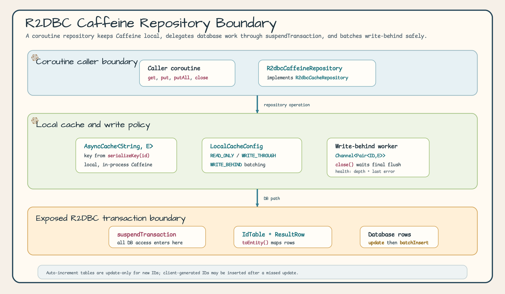
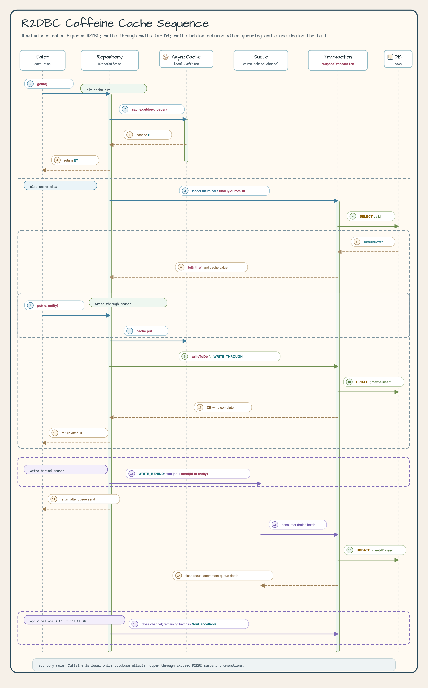

# exposed-r2dbc-caffeine

[English](./README.md) | 한국어

Caffeine 로컬(인프로세스) 캐시를 사용하는 Exposed R2DBC 저장소입니다. JDBC 의존 없이 `exposed-cache` 모듈만 참조합니다.

> **참고**: [exposed-cache — 전체 모듈 생태계 및 인터페이스 계층 구조](../exposed-cache/README.ko.md)

## 아키텍처

아키텍처 그림은 코루틴에서 호출하는 저장소 계약, 로컬 `AsyncCache`, Exposed R2DBC 트랜잭션 경로, write-behind 작업자를 분리해서 보여줍니다. 캐시 설정, 테이블 매핑, DB 쓰기 책임이 어디에 있는지 확인할 때 보면 됩니다.



시퀀스 그림은 실제 메시지 순서를 따릅니다. read-through의 hit/miss 분기, write-through가 DB 쓰기까지 기다리는 흐름, write-behind가 큐에 넣은 뒤 반환하는 흐름, `close()`가 마지막 batch를 flush하는 과정을 한눈에 볼 수 있습니다.



## 주요 기능

- **Read-Through**: 캐시 미스 시 R2DBC `suspendTransaction`으로 DB 로드, 결과를 Caffeine에 캐싱
- **Write-Through**: `put()` 호출 시 Caffeine과 DB를 동기적으로 갱신
- **Write-Behind**: `put()` 호출 시 Caffeine은 즉시 갱신, DB 쓰기는 `Channel`을 통해 비동기 배치 처리
- **JDBC 무의존**: 순수 R2DBC + `exposed-cache` 인터페이스만 사용
- **Caffeine AsyncCache**: `CompletableFuture` 기반 논블로킹 캐시
- **코루틴 네이티브**: 모든 DB 작업이 `suspendTransaction` 사용

<!-- R2DBC-SNAPSHOT-CACHE -->
## 커밋에 맞춰 공개하는 R2DBC 스냅샷 캐시 (opt-in)

`R2dbcCaffeineSnapshotCache`는 위 Repository 캐시와 별개인 opt-in 캐시 전용 facade입니다. 분리된 불변 DTO를
받고, 현재 최상위 `R2dbcTransaction`이 커밋될 때 준비한 `CacheSnapshot`만 공개합니다.
롤백하면 준비한 작업을 버리고, 같은 key를 여러 번 바꾸면 마지막 변경만 반영합니다. 프로세스 로컬 fence는
더 새로운 로컬 변경보다 늦게 도착한 fill을 거부합니다. 기존 Repository 캐시의 데이터는 옮기지 않습니다.

DB를 읽기 전에 `lookup`해야 처리 중인 miss 용량 소진을 R2DBC 작업 전에 확인할 수 있습니다. 반환된
`SnapshotCacheMiss`는 값 변환이나 준비 작업이 실패해도 다시 쓸 수 없습니다. `stageSnapshot`은 현재 최상위
트랜잭션에서 값을 변환하고 중첩 트랜잭션과 savepoint를 쓰는 트랜잭션을 거부합니다. 스냅샷 적재에는 `maxAttempts = 1`이
필요합니다. 애플리케이션 재시도는 lookup + `suspendTransaction` + DB 읽기 전체를 감싸고, 시도마다 새로
lookup해야 합니다. `stageInvalidation`은 시도별로 분리되며 성공한 재시도 뒤 한 번만 공개됩니다.

트랜잭션 종료 후처리는 suspend하지 않고 캐시만 다루며 DB에 쓰지 않습니다. 앞선 후처리가 실패하면 공개가
막혀 이전 값이 남을 수 있습니다. 용량이 제한된 `SnapshotCacheFailureBuffer`를 관찰하고 outbox나 repair path는
애플리케이션이 따로 운영해야 합니다. commit-safe가 DB/캐시 원자성이나 장애 후 내구성을 보장하지는 않습니다.

### Canonical R2DBC 예제

아래 코드는 English README의 블록과 byte-for-byte로 같으며 source-usage fixture로 실제 컴파일합니다.

<!-- README-CANONICAL-R2DBC-BEGIN -->
```kotlin
import io.bluetape4k.exposed.cache.snapshot.CacheSnapshot
import io.bluetape4k.exposed.cache.snapshot.CacheSnapshotMapper
import io.bluetape4k.exposed.cache.snapshot.CaffeineSnapshotCacheConfig
import io.bluetape4k.exposed.cache.snapshot.SnapshotCacheConfig
import io.bluetape4k.exposed.r2dbc.caffeine.snapshot.R2dbcCaffeineSnapshotCache
import io.bluetape4k.exposed.r2dbc.caffeine.snapshot.r2dbcCaffeineSnapshotCache
import io.bluetape4k.exposed.r2dbc.caffeine.snapshot.stageInvalidation
import io.bluetape4k.exposed.r2dbc.caffeine.snapshot.stageSnapshot
import org.jetbrains.exposed.v1.r2dbc.R2dbcTransaction
import java.io.Serializable

data class R2dbcOrderRow(val id: Long, val description: String)

data class R2dbcOrderSnapshot(val id: Long, val description: String) : Serializable {
    private companion object {
        private const val serialVersionUID: Long = 1L
    }
}

private val r2dbcOrderSnapshotCache = r2dbcCaffeineSnapshotCache<Long, R2dbcOrderSnapshot>(
    CaffeineSnapshotCacheConfig(
        snapshot = SnapshotCacheConfig(namespace = "orders:v1", schemaVersion = "order-dto-v1"),
    ),
)

suspend fun R2dbcTransaction.cacheOrderSnapshot(
    id: Long,
    loadFromDatabase: suspend R2dbcTransaction.(Long) -> R2dbcOrderRow,
): CacheSnapshot<R2dbcOrderSnapshot> {
    val lookup = r2dbcOrderSnapshotCache.lookup(id)
    lookup.snapshot?.let { return it }
    val row = loadFromDatabase(id)
    return stageSnapshot(
        cache = r2dbcOrderSnapshotCache,
        miss = requireNotNull(lookup.miss),
        source = row,
        mapper = CacheSnapshotMapper { CacheSnapshot(R2dbcOrderSnapshot(it.id, it.description)) },
    )
}

fun R2dbcTransaction.invalidateOrderSnapshot(id: Long) {
    stageInvalidation(r2dbcOrderSnapshotCache, id)
}
```
<!-- README-CANONICAL-R2DBC-END -->

## 사용 예시

```kotlin
class ActorRepository(
    config: LocalCacheConfig = LocalCacheConfig.WRITE_THROUGH,
) : AbstractR2dbcCaffeineRepository<Long, ActorRecord>(config) {

    override val table = ActorTable

    override suspend fun ResultRow.toEntity() = toActorRecord()

    override fun UpdateStatement.updateEntity(entity: ActorRecord) {
        this[ActorTable.firstName] = entity.firstName
        this[ActorTable.lastName] = entity.lastName
        this[ActorTable.email] = entity.email
    }

    override fun BatchInsertStatement.insertEntity(entity: ActorRecord) {
        this[ActorTable.firstName] = entity.firstName
        this[ActorTable.lastName] = entity.lastName
        this[ActorTable.email] = entity.email
    }

    override fun extractId(entity: ActorRecord) = entity.id
}

// Read-Through (캐시 미스 → DB 로드)
val actor = repository.get(1L)

// Write-Through (캐시 + DB 동기 반영)
repository.put(1L, updatedActor)

// Write-Behind (캐시 즉시, DB 비동기 배치)
val behindConfig = LocalCacheConfig(writeMode = CacheWriteMode.WRITE_BEHIND)
val behindRepo = ActorRepository(behindConfig)
behindRepo.put(1L, updatedActor)  // 즉시 반환
```

## 의존성

| 의존성 | 용도 |
|---|---|
| `exposed-r2dbc` | Exposed R2DBC 트랜잭션 지원 |
| `exposed-cache` | `R2dbcCacheRepository`, `LocalCacheConfig`, `CacheMode` |
| `bluetape4k-coroutines` | 코루틴 유틸리티 |
| `com.github.ben-manes.caffeine:caffeine` | 인프로세스 비동기 캐시 |

```kotlin
dependencies {
    implementation("io.github.bluetape4k.exposed:bluetape4k-exposed-r2dbc-caffeine")
}
```

애플리케이션이 `bluetape4k-dependencies` BOM 버전을 소유하므로 모듈 좌표에는 버전을 쓰지 않습니다.
