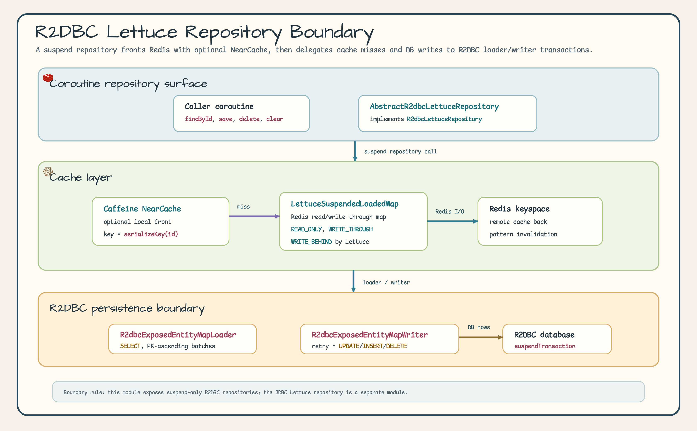
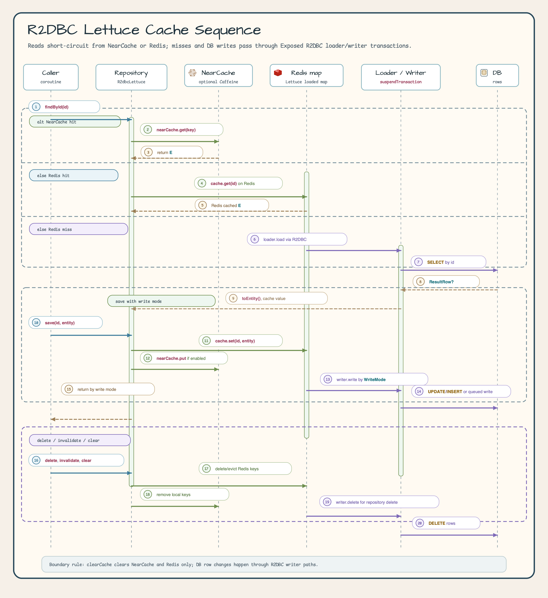

# Module exposed-r2dbc-lettuce

English | [한국어](./README.ko.md)

A coroutine-native Read-through / Write-through / Write-behind cache repository module that combines Exposed R2DBC with Lettuce Redis. Data-access operations use `suspendTransaction` and the suspend `ExposedR2dbcLettuceSuspendedLoadedMap`; no JDBC repository path is provided.

## Overview

`exposed-r2dbc-lettuce` provides:

- **Read-through cache**: On `findById` cache miss, automatically loads from DB via R2DBC
  `suspendTransaction` and caches in Redis
- **Write-through / Write-behind**: On `save`, reflects changes in Redis and DB simultaneously (or asynchronously)
- **NearCache support**: Optional 2-tier cache with Caffeine local cache (front) + Redis (back)
- **Coroutine repository**: `R2dbcLettuceRepository` / `AbstractR2dbcLettuceRepository`
- **MapLoader / MapWriter**: R2DBC-based implementations for repository loaded-map integration
    - `loadAllKeys()` keeps the existing `List` API; ordered scalar IDs use keyset pages and unsupported custom IDs use the legacy offset fallback
    - `loadAllKeysFlow()` provides bounded page streaming with one `suspendTransaction` per page when no ambient caller-owned transaction is active, follows Exposed ambient reuse otherwise, and propagates downstream cancellation
    - Enumeration is weakly consistent; a page-side delete can skip an unseen row on the custom-ID offset fallback path
    - `chunkSize` (writer) and `batchSize` (loader) must be greater than 0

## Architecture

The architecture view separates the repository surface, optional Caffeine NearCache, Redis loaded map, and R2DBC loader/writer. Use it to see which component owns read-through loading, write-mode behavior, and DB retry policy.



The sequence view follows the real message order: NearCache hit, Redis hit, Redis miss through the R2DBC loader, save through the configured write mode, and cache cleanup for delete, invalidate, and clear operations.



## Dependency

```kotlin
dependencies {
    implementation("io.github.bluetape4k.exposed:bluetape4k-exposed-r2dbc-lettuce:${version}")
}
```

## Basic Usage

### Coroutine Repository (AbstractR2dbcLettuceRepository)

```kotlin
import io.bluetape4k.exposed.r2dbc.lettuce.repository.AbstractR2dbcLettuceRepository
import io.bluetape4k.exposed.r2dbc.lettuce.repository.ExposedR2dbcLettuceCodecs
import io.bluetape4k.redis.lettuce.map.LettuceCacheConfig
import io.lettuce.core.RedisClient

data class UserRecord(val id: Long, val name: String, val email: String): java.io.Serializable

class UserR2dbcLettuceRepository(redisClient: RedisClient):
    AbstractR2dbcLettuceRepository<Long, UserRecord>(
        client = redisClient,
        config = LettuceCacheConfig.READ_WRITE_THROUGH,
        valueCodec = ExposedR2dbcLettuceCodecs.jackson3(UserRecord::class.java),
    ) {
    override val table = UserTable

    override suspend fun ResultRow.toEntity() = UserRecord(
        id = this[UserTable.id].value,
        name = this[UserTable.name],
        email = this[UserTable.email],
    )

    override fun UpdateStatement.updateEntity(entity: UserRecord) {
        this[UserTable.name] = entity.name
        this[UserTable.email] = entity.email
    }

    override fun BatchInsertStatement.insertEntity(entity: UserRecord) {
        this[UserTable.id] = entity.id
        this[UserTable.name] = entity.name
        this[UserTable.email] = entity.email
    }

    override fun extractId(entity: UserRecord) = entity.id
}

// Use as suspend functions
suspend fun example(repo: UserR2dbcLettuceRepository) {
    repo.save(1L, UserRecord(1L, "Hong Gildong", "hong@example.com"))
    val user = repo.findById(1L)   // Checks NearCache → Redis → DB in order
    repo.delete(1L)                // Deletes from both Redis and DB
    repo.clearCache()              // Clears all Redis cache keys
}
```

## Key Methods of R2dbcLettuceRepository

| Method                                | Description                                                        |
|---------------------------------------|--------------------------------------------------------------------|
| `suspend findById(id)`                | NearCache → Redis → DB Read-through                                |
| `suspend findAll(ids)`                | Batch lookup; only missed keys fall through to Redis → DB          |
| `suspend findAll(limit, offset, ...)` | DB query via R2DBC with results loaded into Redis                  |
| `suspend findByIdFromDb(id)`          | Bypasses cache, queries DB directly via R2DBC `suspendTransaction` |
| `suspend findAllFromDb(ids)`          | Bypasses cache, queries DB directly for multiple IDs               |
| `suspend countFromDb()`               | Total record count from R2DBC DB                                   |
| `suspend save(id, entity)`            | Stores in Redis + reflects in R2DBC DB according to WriteMode      |
| `suspend saveAll(entities)`           | Batch save                                                         |
| `suspend delete(id)`                  | Deletes from both Redis and R2DBC DB simultaneously                |
| `suspend deleteAll(ids)`              | Batch delete                                                       |
| `suspend clearCache()`                | Clears all NearCache + Redis keys (no effect on DB)                |

## LettuceCacheConfig — Write Modes

| WriteMode            | Behavior                                                                 |
|----------------------|--------------------------------------------------------------------------|
| `READ_WRITE_THROUGH` | On save, writes to Redis + R2DBC DB simultaneously (default)             |
| `READ_WRITE_BEHIND`  | On save, writes to Redis immediately; R2DBC DB is updated asynchronously |
| `READ_ONLY`          | Stores in Redis only; no DB writes                                       |

## Redis Codec Safety

Repository constructors require an explicit `RedisCodec<String, E>` for values. The inherited
Lettuce binary map codec uses LZ4/Fory, so it is not selected by default for repository data.
Use `ExposedR2dbcLettuceCodecs.jackson3(Entity::class.java)` or provide a reviewed codec for
your entity type. Fory/Kryo-family binary codecs should be used only when Redis contents are
fully trusted and not shared with untrusted writers.

## NearCache Configuration

Enable a Caffeine local cache (front) with `LettuceCacheConfig.nearCacheEnabled = true`.

```kotlin
val config = LettuceCacheConfig(
    writeMode = WriteMode.WRITE_THROUGH,
    nearCacheEnabled = true,
    nearCacheName = "user-near-cache",
    nearCacheMaxSize = 1000,
    nearCacheTtl = Duration.ofMinutes(5),
)
```

When NearCache is enabled, the lookup order is: **Caffeine (local) → Redis → DB**

## Differences from the JDBC Version

| Aspect                 | exposed-jdbc-lettuce                               | exposed-r2dbc-lettuce            |
|------------------------|----------------------------------------------------|----------------------------------|
| DB driver              | JDBC (blocking)                                    | R2DBC (non-blocking)             |
| Transaction            | `transaction {}` / `suspendedTransactionAsync(IO)` | `suspendTransaction {}`          |
| `toEntity`             | Regular function (`fun`)                           | Suspend function (`suspend fun`) |
| Uses `runBlocking`     | No (`ExposedLettuceSuspendedLoadedMap`)            | No (`ExposedR2dbcLettuceSuspendedLoadedMap`) |
| Synchronous repository | `JdbcLettuceRepository` provided                   | Not provided (suspend only)      |

## Key Files / Classes

| File                                           | Description                                                                 |
|------------------------------------------------|-----------------------------------------------------------------------------|
| `repository/R2dbcLettuceRepository.kt`         | Suspend cache repository interface                                          |
| `repository/AbstractR2dbcLettuceRepository.kt` | Abstract implementation (ExposedR2dbcLettuceSuspendedLoadedMap + NearCache) |
| `repository/ExposedR2dbcLettuceCodecs.kt`      | Explicit value codec helpers for repository Redis values                    |
| `map/ExposedR2dbcLettuceSuspendedLoadedMap.kt` | Coroutine loaded map with caller-supplied value codec                       |
| `map/R2dbcEntityMapLoader.kt`                  | Abstract MapLoader based on R2DBC `suspendTransaction`                      |
| `map/R2dbcEntityMapWriter.kt`                  | Abstract MapWriter based on R2DBC `suspendTransaction` + Resilience4j Retry |
| `map/R2dbcExposedEntityMapLoader.kt`           | MapLoader implementation based on Exposed R2DBC DSL                         |
| `map/R2dbcExposedEntityMapWriter.kt`           | MapWriter implementation based on Exposed R2DBC DSL (upsert strategy)       |

## Testing

```bash
./gradlew :bluetape4k-exposed-r2dbc-lettuce:test
```

## References

- [exposed-r2dbc](../exposed-r2dbc)
- [exposed-jdbc-lettuce](../exposed-jdbc-lettuce)
- [bluetape4k-lettuce](../../infra/lettuce)
- [Lettuce Redis Client](https://lettuce.io)
