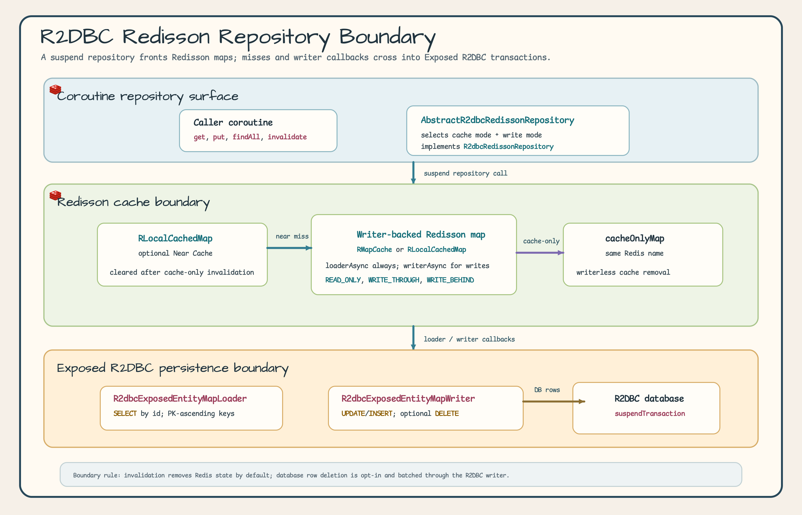
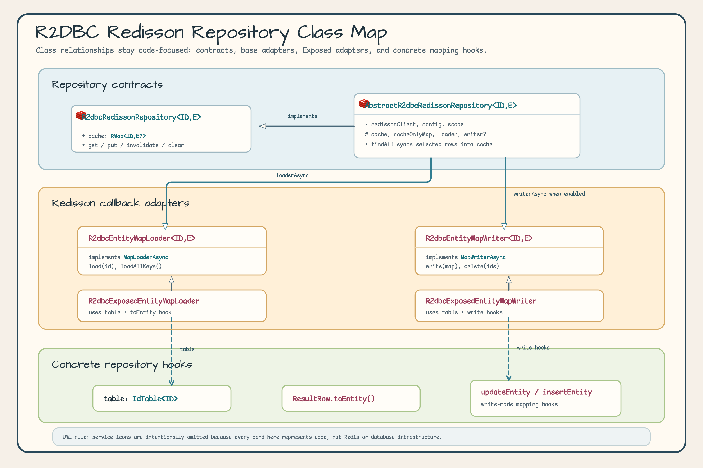
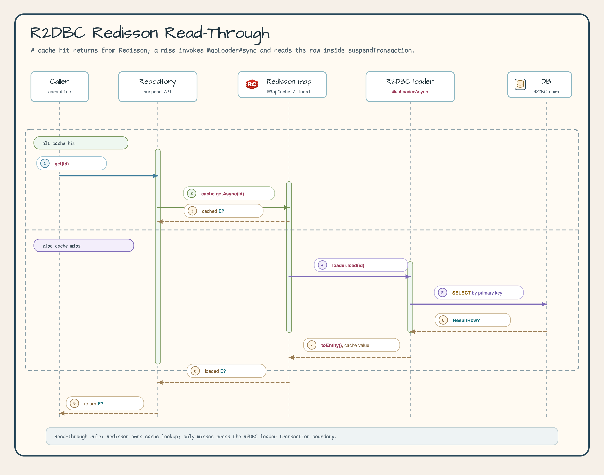
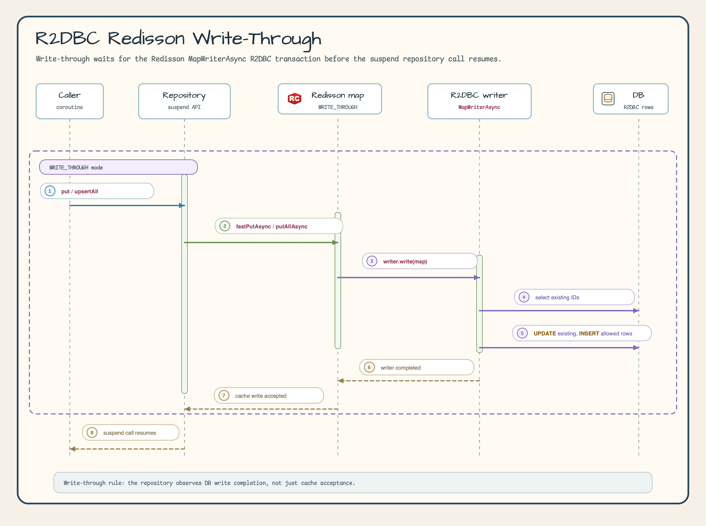
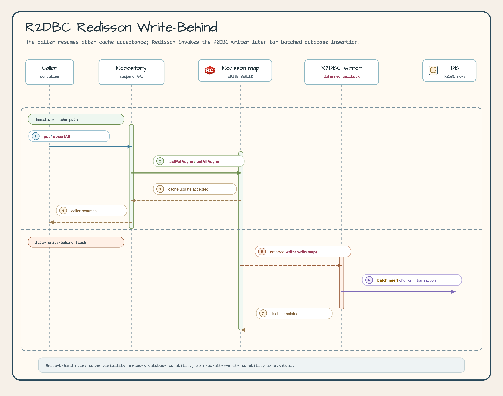

# Module exposed-r2dbc-redisson

[English](./README.md) | 한국어

Exposed R2DBC와 Redisson 캐시를 결합해 코루틴 기반 Read-Through, Write-Through, Write-Behind 캐시 패턴을 구성하는 모듈입니다.

## 개요

`exposed-r2dbc-redisson`은 Exposed R2DBC와 [Redisson](https://github.com/redisson/redisson) Redis 클라이언트를 통합해, 코루틴 우선 Repository API를 유지하면서 데이터베이스 행을 Redis에 캐싱할 수 있게 합니다. Repository 연산은 `suspend` 함수로 유지하고, Redisson `MapLoaderAsync`와 `MapWriterAsync` 어댑터가 캐시 미스와 캐시 쓰기 경로를 Exposed R2DBC `suspendTransaction`으로 연결합니다.

### 주요 기능

- **MapLoader/MapWriter 비동기 지원**: Redisson `AsyncMapLoader`/`AsyncMapWriter` 연동
    - `R2dbcExposedEntityMapLoader`는 지원되는 scalar ID에서 오름차순 keyset page를 사용하고 custom ID에는 기존 offset fallback을 사용
    - `loadAllKeys()`는 rendezvous channel back-pressure로 PK 오름차순을 안정적으로 순회하며 한 번에 `batchSize` page만 materialize합니다. 전체 열거는 weakly consistent합니다
    - top-level streaming에는 Exposed `maxAttempts = 1`을 적용해 retry 재방출을 막고, producer 오류와 timeout 원인은 정상 종료가 아닌 `AsyncIterator` 예외로 전달합니다
    - `loadAllKeys()`가 실행하는 각 database statement에는 Exposed transaction `queryTimeout` 30초를 적용합니다(`queryTimeout` 단위는 초). 전체 열거 예산은 별도 60초이며 timeout은 `AsyncIterator` 실패로 전달됩니다
    - caller-owned ambient transaction은 자체 retry 정책을 유지하므로 outer retry 뒤 partial ID가 다시 관찰될 수 있습니다. 정확히 한 번 관찰하려면 중복 제거·멱등 처리를 적용하거나 성공 전 외부 side effect를 buffer해야 하며, 전체 열거 재시도는 completeness만 복구합니다. 기본 loader scope는 한 번의 실패가 후속 호출을 취소하지 않도록 격리합니다
- **Repository 추상화**: 캐시 + DB 접근 공통 패턴 (`R2dbcRedissonRepository`)
- **Coroutines 네이티브 Repository API**: 캐시와 Repository 호출은 `suspend` 함수이고, Redisson SPI 어댑터는 내부적으로 async로 동작
- **Near Cache 지원**: Local Cache + Redis 2-Tier 캐시
- **Read-Through/Write-Through/Write-Behind**: 다양한 캐시 패턴 지원

## 의존성 추가

```kotlin
dependencies {
    implementation("io.github.bluetape4k.exposed:bluetape4k-exposed-r2dbc-redisson:${version}")
    implementation("org.redisson:redisson:3.37.0")

    // R2DBC 드라이버
    implementation("org.postgresql:r2dbc-postgresql:1.0.5.RELEASE")
}
```

## 아키텍처 개요

아키텍처 다이어그램은 suspend Repository API, writer-backed Redisson map, cache-only invalidation 경로, R2DBC loader/writer 어댑터를 나눠 보여줍니다. 핵심 규칙은 명확합니다. 기본 invalidation은 Redis 상태만 제거하며, 데이터베이스 행 삭제는 `deleteFromDBOnInvalidate`가 활성화된 경우에만 수행됩니다.



## 클래스 다이어그램

### R2DBC Redisson Repository 계층 구조

클래스 다이어그램은 Repository 계약과 어댑터 책임만 다룹니다. 실제 Repository 구현체는 자신의 직렬화 가능한 DTO에 맞춰 table 매핑, ID 추출, row-to-entity 변환, write DSL hook을 제공합니다.



## 기본 사용법

### 1. R2dbcRedissonRepository 구현

`AbstractR2dbcRedissonRepository`를 상속하여 비동기 캐시 Repository를 구현합니다.

```kotlin
import io.bluetape4k.exposed.r2dbc.redisson.repository.AbstractR2dbcRedissonRepository
import io.bluetape4k.redis.redisson.cache.RedissonCacheConfig
import org.jetbrains.exposed.v1.core.ResultRow
import org.jetbrains.exposed.v1.core.dao.id.LongIdTable
import org.jetbrains.exposed.v1.core.statements.BatchInsertStatement
import org.jetbrains.exposed.v1.core.statements.UpdateStatement
import org.redisson.api.RedissonClient

// 엔티티 (java.io.Serializable 필수)
data class UserRecord(
    val id: Long,
    val name: String,
    val email: String,
): java.io.Serializable

object UserTable: LongIdTable("users") {
    val name = varchar("name", 100)
    val email = varchar("email", 200)
}

class UserR2dbcRedissonRepository(
    redissonClient: RedissonClient,
    config: RedissonCacheConfig,
): AbstractR2dbcRedissonRepository<Long, UserRecord>(
    redissonClient = redissonClient,
    config = config,
    // Fory/Kryo/JDK 계열 binary codec을 신뢰된 Redis 데이터에 사용할 때만 필요합니다.
    trustedBinaryCache = true,
) {
    override val table = UserTable

    override fun extractId(entity: UserRecord): Long = entity.id

    override suspend fun ResultRow.toEntity() = UserRecord(
        id    = this[UserTable.id].value,
        name  = this[UserTable.name],
        email = this[UserTable.email],
    )

    // Write-Through 모드 시 구현 필요
    override fun UpdateStatement.updateEntity(entity: UserRecord) {
        this[UserTable.name]  = entity.name
        this[UserTable.email] = entity.email
    }

    override fun BatchInsertStatement.insertEntity(entity: UserRecord) {
        this[UserTable.name]  = entity.name
        this[UserTable.email] = entity.email
    }
}

// 사용 (모든 메서드가 suspend)
val repo = UserR2dbcRedissonRepository(redissonClient, RedissonCacheConfig.readOnly())

// 캐시에서 조회 (미스 시 DB에서 자동 로드)
val user = repo.get(1L)

// DB에서 직접 조회
val freshUser = repo.findByIdFromDb(1L)

// DB 조회 후 캐시 저장
val all = repo.findAll(limit = 100)

// 캐시에 저장
user?.let { repo.put(it.id, it.copy(name = "Jane")) }
val usersById = users.associateBy { it.id }
repo.putAll(usersById, batchSize = 100)
repo.upsertAll(usersById, batchSize = 100)

// 캐시 무효화
repo.invalidate(1L)
repo.invalidateAll(listOf(1L, 2L, 3L))
repo.clear()
repo.invalidateByPattern("user:*")
```

### 2. 캐시 패턴 설정

```kotlin
import io.bluetape4k.redis.redisson.cache.RedissonCacheConfig

// Read-Through Only
val readOnlyConfig = RedissonCacheConfig.readOnly(
    ttl = Duration.ofMinutes(30),
)

// Read-Through + Write-Through
val readWriteConfig = RedissonCacheConfig.readWrite(
    ttl = Duration.ofMinutes(30),
    writeMode = WriteMode.WRITE_THROUGH,
)

// Near Cache 활성화 (Local + Redis 2-Tier)
val nearCacheConfig = RedissonCacheConfig.readOnly(
    ttl = Duration.ofMinutes(30),
    nearCacheEnabled = true,
)
```

## Redis Codec 안전성

`RedissonCacheConfig` 상수는 기본적으로 Fory 계열 binary codec을 사용합니다. Repository 생성자는
`trustedBinaryCache = true`를 명시하지 않으면 Fory/Kryo/JDK 계열 binary codec을 거부합니다. 이 opt-in은
Redis 인스턴스가 private이고, Redis 내용을 신뢰할 수 없는 클라이언트가 쓸 수 없는 경우에만 사용하세요.
dependency 경계에 놓인 Redis 데이터에는 기본 binary codec 대신 검토된 custom codec을 제공하세요.

## 캐시 패턴

### Read-Through (R2DBC + suspend)

`get(id)`나 `getAll(ids)`에서 캐시 히트가 나면 Redisson이 바로 값을 돌려줍니다. 미스가 발생한 경우에만 `R2dbcExposedEntityMapLoader`가 R2DBC `suspendTransaction`으로 데이터베이스 행을 로드합니다.



### Write-Through (R2DBC + suspend)

`WRITE_THROUGH` 모드에서는 `put(id, entity)`, `putAll(...)`, `upsertAll(...)` 호출이 Redisson `writerAsync`의 R2DBC `suspendTransaction` 쓰기를 기다린 뒤 반환됩니다.



### Write-Behind (R2DBC + suspend + 비동기 DB)

`WRITE_BEHIND` 모드에서는 `put(id, entity)`와 bulk write가 Redisson의 캐시 갱신 수락 후 반환됩니다. 데이터베이스 배치 쓰기는 나중에 반영되므로, read-after-write 내구성은 즉시 보장되는 값이 아니라 eventual한 값으로 보아야 합니다.



## R2dbcRedissonRepository 주요 메서드

| 메서드                                     | 설명                                |
|-----------------------------------------|-----------------------------------|
| `containsKey(id)`                            | 캐시에 해당 ID 캐시 키 존재 여부 확인 (suspend)      |
| `get(id)`                               | 캐시에서 엔티티 조회, 미스 시 DB 로드 (suspend) |
| `getAll(ids, batchSize)`                | 캐시에서 여러 엔티티 배치 조회 (suspend)       |
| `findByIdFromDb(id)`                    | DB에서 직접 조회, 캐시 우회 (suspend)       |
| `findAllFromDb(ids)`                    | DB에서 여러 엔티티 직접 조회 (suspend)       |
| `findAll(limit, offset, sortBy, where)` | DB 조회 후 캐시 동기화 (suspend)          |
| `put(id, entity)`                       | 엔티티 하나를 캐시에 저장하며, writer 동작은 캐시 모드에 따라 달라짐 (suspend) |
| `putAll(entities, batchSize)`           | ID-to-entity map을 캐시에 일괄 저장하며, writer 동작은 캐시 모드에 따라 달라짐 (suspend) |
| `upsertAll(entities, batchSize)`        | 배치 map write 기반 명시적 벌크 캐시 upsert (suspend) |
| `invalidate(id)`                        | 캐시 엔트리 하나를 제거하며, DB 삭제는 `deleteFromDBOnInvalidate` 설정 시에만 수행 (suspend) |
| `invalidateAll(ids)`                    | 여러 캐시 엔트리를 제거하며, DB 삭제는 `deleteFromDBOnInvalidate` 설정 시에만 수행 (suspend) |
| `clear()`                               | map 엔트리를 비우며, 기본 경로는 writer 없는 cache-only 제거를 사용 (suspend) |
| `invalidateByPattern(pattern, count)`   | 패턴에 맞는 키 캐시 제거 (suspend)          |

## 캐시 설정 상수 (`RedissonCacheConfig`)

자주 사용하는 캐시 모드 설정값이 상수로 제공됩니다.

| 상수                                                    | 설명                              |
|-------------------------------------------------------|---------------------------------|
| `RedissonCacheConfig.READ_ONLY`                          | Read-Through 전용 (원격 캐시)         |
| `RedissonCacheConfig.READ_ONLY_WITH_NEAR_CACHE`          | Read-Through + Near Cache       |
| `RedissonCacheConfig.READ_WRITE_THROUGH`                 | Read-Through + Write-Through    |
| `RedissonCacheConfig.READ_WRITE_THROUGH_WITH_NEAR_CACHE` | Read-Write-Through + Near Cache |
| `RedissonCacheConfig.WRITE_BEHIND`                       | Write-Behind (원격 캐시)            |
| `RedissonCacheConfig.WRITE_BEHIND_WITH_NEAR_CACHE`       | Write-Behind + Near Cache       |

## 주요 파일/클래스 목록

### Repository (repository/)

| 파일                                   | 설명                                 |
|--------------------------------------|------------------------------------|
| `R2dbcRedissonRepository.kt`         | R2DBC 비동기 캐시 Repository 인터페이스      |
| `AbstractR2dbcRedissonRepository.kt` | R2DBC 비동기 캐시 Repository 추상 클래스     |
| `ExposedR2dbcRedissonCodecSafety.kt` | 신뢰된 binary codec opt-in guard             |

### Map (map/)

| 파일                               | 설명                                                            |
|----------------------------------|---------------------------------------------------------------|
| `R2dbcEntityMapLoader.kt`        | R2DBC 비동기 MapLoader 기본 구현 (`MapLoaderAsync`)                  |
| `R2dbcEntityMapWriter.kt`        | R2DBC 비동기 MapWriter 기본 구현 (`MapWriterAsync`)                  |
| `R2dbcExposedEntityMapLoader.kt` | Exposed IdTable 기반 MapLoader 구현체                              |
| `R2dbcExposedEntityMapWriter.kt` | Exposed IdTable 기반 MapWriter 구현체 (Write-Through/Write-Behind) |
| `AsyncIteratorSupport.kt`        | Redisson `AsyncIterator`를 `List`로 수집하는 확장 함수                  |

## 테스트

```bash
./gradlew :bluetape4k-exposed-r2dbc-redisson:test
```

## 참고

- [JetBrains Exposed R2DBC](https://github.com/JetBrains/Exposed)
- [Redisson](https://github.com/redisson/redisson)
- [Redisson AsyncMapLoader](https://www.javadoc.io/doc/org.redisson/redisson/latest/org/redisson/api/map/MapLoaderAsync.html)
- [exposed-r2dbc](../r2dbc)
- [exposed-jdbc-redisson](../jdbc-redisson)
