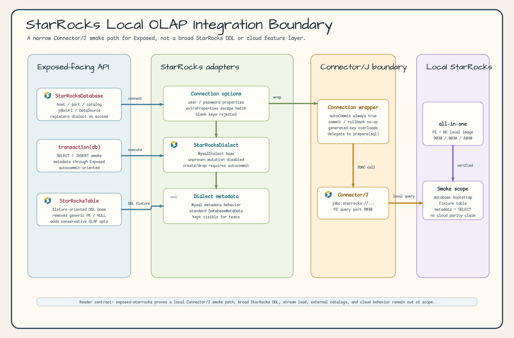
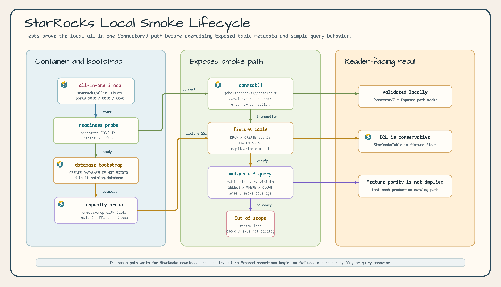

# Module exposed-starrocks

English | [한국어](./README.ko.md)

StarRocks JDBC integration for JetBrains Exposed ORM. This module proves a narrow local-first OLAP path: native StarRocks Connector/J connectivity, Exposed dialect registration, metadata discovery, fixture table setup, and simple query execution.

## Local OLAP Integration Boundary



### Local Smoke Lifecycle



## Scope

`exposed-starrocks` provides:

- **StarRocksDatabase**: connection factory for
  `jdbc:starrocks://<fe_host>:<fe_query_port>/<catalog>.<database>`.
- **StarRocksDialect**: minimal Exposed dialect registered as `starrocks`.
- **StarRocksDialectMetadata**: metadata adapter that keeps standard JDBC
  `DatabaseMetaData` discovery enabled.
- **StarRocksConnectionWrapper**: autocommit-oriented JDBC wrapper for Exposed compatibility.
- **StarRocksConnectionOptions**: narrow extra JDBC property holder.
-

**StarRocksTable**: simple fixture-oriented table base that removes generic primary-key syntax and appends conservative StarRocks OLAP table options.

This module does not claim MySQL, PostgreSQL, Trino, or ClickHouse parity. Broad StarRocks DDL, partitioning, aggregate key variants, stream load, external catalogs, and StarRocks Cloud verification are out of scope.

## Table option policy

Exposed `1.5.0` does not validate dialect compatibility of generic
`Table.options` or `storageParameters`. This policy applies to CREATE TABLE generation.

| Table / DB                | options                                                | storageParameters                                                                                     |
|---------------------------|--------------------------------------------------------|-------------------------------------------------------------------------------------------------------|
| Native Table / H2         | Upstream behavior unchanged; empty-option DDL verified | Empty list verified                                                                                   |
| Native Table / PostgreSQL | `USING heap` rendering and execution verified          | `FillFactorParameter(70)` and `AutovacuumEnabledParameter(false)` preservation and execution verified |
| StarRocksTable            | Nonempty lists throw `IllegalArgumentException`        | Nonempty lists throw `IllegalArgumentException`                                                       |
| ClickHouseTable           | Nonempty lists throw `IllegalArgumentException`        | Nonempty lists throw `IllegalArgumentException`                                                       |

Custom tables reject typed, raw, and user-defined options before generating SQL. They do not invoke option `toSQL()` or infer safety by sanitizing its output. Even an empty-string option is rejected. This is a behavior change for callers that previously supplied raw options.

StarRocks retains its fixed `ENGINE=OLAP PROPERTIES ("replication_num" = "1")`. ClickHouse retains `orderBy`, `partitionBy`, and `setting` through its existing
`engine` DSL. MySQL engine/charset and PostgreSQL WITH parameters are not implicitly translated into these settings. There is currently no validated generic-option allowlist, and no new raw SQL escape hatch is provided.

### Manual migration

The [Exposed Table option contract](https://github.com/JetBrains/Exposed/blob/1.5.0/exposed-core/src/main/kotlin/org/jetbrains/exposed/v1/core/Table.kt)
states that option changes are not tracked by migration diffs. Compare the current schema with the desired settings, write a separate DB-specific ALTER/recreation migration, and verify data preservation and recovery on a test database before applying it. Do not expect another `SchemaUtils.create` call or an automatic diff to update existing table options.

## Dependency

```kotlin
dependencies {
    implementation("io.github.bluetape4k.exposed:bluetape4k-exposed-starrocks:${version}")
}
```

The module uses StarRocks Connector/J:

```kotlin
implementation("com.starrocks:starrocks-connector-j:1.1.1")
```

## Local StarRocks

The tested local container path follows the official StarRocks all-in-one image:

```bash
docker run -p 9030:9030 -p 8030:8030 -p 8040:8040 -itd \
  --name quickstart starrocks/allin1-ubuntu
```

Docker should have at least 4 GB RAM and 10 GB free disk available. The FE query port is `9030`.

## Basic Usage

```kotlin
import io.bluetape4k.exposed.starrocks.StarRocksDatabase
import org.jetbrains.exposed.v1.jdbc.transactions.transaction

val db = StarRocksDatabase.connect(
    host = "localhost",
    port = 9030,
    catalog = "default_catalog",
    database = "analytics",
    user = "root",
)

transaction(db) {
    exec("SELECT 1") { rs ->
        rs.next()
        rs.getInt(1)
    }
}
```

Create the target database before connecting to
`default_catalog.<database>`. The local tests bootstrap a dedicated database and then verify table metadata and `SELECT` queries through Exposed.

## Verification

```bash
./gradlew :bluetape4k-exposed-starrocks:test --no-configuration-cache --no-daemon
```
