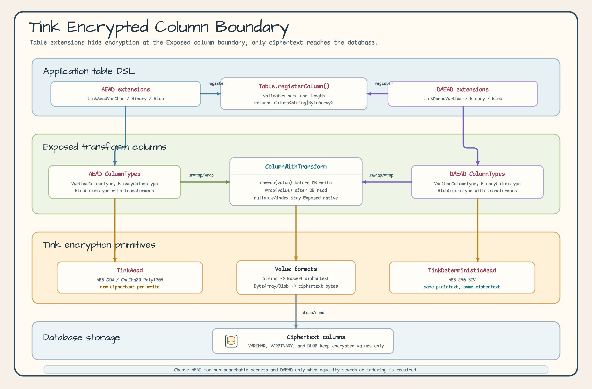
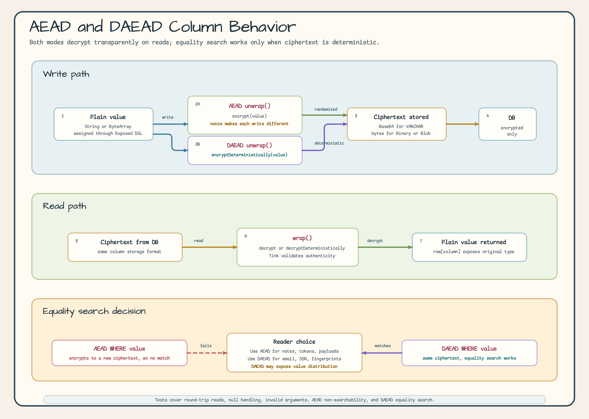

# Module exposed-tink

English | [한국어](./README.ko.md)

A module for encrypting and decrypting Exposed column values using [Google Tink](https://developers.google.com/tink).

## Overview

`exposed-tink` provides transparent authenticated encryption (AEAD — Authenticated Encryption with Associated Data) of JetBrains Exposed `VARCHAR`, `VARBINARY`, and `BLOB` column values using the Google Tink library.

Google Tink is a modern cryptography library developed by Google, designed to be hard to misuse and to prevent incorrect usage by design. This module supports two encryption modes:

- **AEAD** (non-deterministic): Produces a different ciphertext every time → maximum security
- **Deterministic AEAD** (deterministic): Same plaintext always produces the same ciphertext → supports equality search and indexing when the database column type supports it

## Jasypt vs Google Tink Comparison

| Aspect                                | `exposed-jasypt`           | `exposed-tink` (AEAD)               | `exposed-tink` (DAEAD)     |
|---------------------------------------|----------------------------|-------------------------------------|----------------------------|
| **Encryption algorithm**              | AES/RC4/3DES (legacy)      | AES-GCM, ChaCha20-Poly1305 (modern) | AES-256-SIV (modern)       |
| **Deterministic**                     | ✅ (same ciphertext always) | ❌ (different ciphertext each time)  | ✅ (same ciphertext always) |
| **Authentication (tamper detection)** | ❌                          | ✅ AEAD                              | ✅ AEAD                     |
| **WHERE condition search**            | ✅                          | ❌                                   | ✅                          |
| **Indexable**                         | ✅                          | ❌                                   | ✅                          |
| **Pattern analysis risk**             | ⚠️ Yes                     | ✅ No                                | ⚠️ Yes (deterministic)     |
| **Standard compliance**               | ⚠️ Legacy approach         | ✅ NIST/IETF standard                | ✅ NIST/IETF standard       |
| **Google recommended**                | ❌                          | ✅                                   | ✅                          |

### Why Choose Google Tink

1. **Built-in authentication**: AEAD guarantees data integrity alongside encryption. If a stored ciphertext is tampered with, it is detected immediately during decryption. Jasypt does not provide this.

2. **Modern algorithms**: Uses the latest NIST/IETF-recommended algorithms including AES-256-GCM, ChaCha20-Poly1305, and AES-256-SIV.

3. **Misuse-resistant design**: The API is designed to prevent weak algorithm choices, making it safe to use even without deep security expertise.

4. **Two modes**: Choose between AEAD (security-focused) and DAEAD (searchable) based on your requirements.

## Dependency

```kotlin
dependencies {
    implementation("io.github.bluetape4k.exposed:bluetape4k-exposed-tink:${version}")
}
```

## Architecture Diagram

### Encrypted Column Boundary



## Behavior Flow



## Basic Usage

### 1. Defining Columns

```kotlin
import io.bluetape4k.exposed.core.tink.*
import io.bluetape4k.tink.aead.TinkAead
import io.bluetape4k.tink.daead.TinkDeterministicAead
import io.bluetape4k.tink.keyset.keysetHandleOf
import org.jetbrains.exposed.v1.core.dao.id.IntIdTable

val persistedAead = TinkAead(keysetHandleOf(loadSecret("users-aead-keyset-json")))
val persistedDaead = TinkDeterministicAead(keysetHandleOf(loadSecret("users-daead-keyset-json")))

object Users: IntIdTable("users") {
    val name = varchar("name", 100)

    // ① Non-deterministic AEAD — sensitive data that doesn't need searching (password hints, notes, etc.)
    val memo = tinkAeadVarChar("memo", 512, persistedAead).nullable()

    // ② Deterministic DAEAD — identifiers that need searching (email, SSN, etc.)
    val email = tinkDaeadVarChar("email", 512, persistedDaead).index()

    // ③ Binary AEAD — sensitive binary data (public keys, certificates, etc.)
    val publicKey = tinkAeadBinary("public_key", 1024, persistedAead).nullable()

    // ④ Binary DAEAD — searchable binary data (fingerprints, hash values, etc.)
    val fingerprint = tinkDaeadBinary("fingerprint", 128, persistedDaead).nullable()

    // ⑤ Blob AEAD / DAEAD — large binary payloads
    val profileBlob = tinkAeadBlob("profile_blob", persistedAead).nullable()
    val searchableBlob = tinkDaeadBlob("searchable_blob", persistedDaead).nullable()
}
```

Persisted database columns must receive encryptors backed by keysets loaded from durable secret storage. Do not use
newly generated process-local keysets for data that must survive restarts or run across nodes.

### 2. Insert — Automatic Encryption

```kotlin
transaction {
    val id = Users.insertAndGetId {
        it[name] = "Hong Gildong"
        it[memo] = "VIP customer"        // automatically encrypted with AEAD
        it[email] = "hong@example.com"   // automatically encrypted with DAEAD
        it[publicKey] = rsaPublicKey.encoded
        it[fingerprint] = sha256(biometricData)
    }
}
```

### 3. Query — Automatic Decryption

```kotlin
transaction {
    val user = Users.selectAll().where { Users.id eq 1 }.single()

    val name = user[Users.name]   // "Hong Gildong"
    val memo = user[Users.memo]   // "VIP customer" (auto-decrypted)
    val email = user[Users.email] // "hong@example.com" (auto-decrypted)
}
```

### 4. Searching DAEAD Columns

```kotlin
// DAEAD is deterministic, so WHERE conditions and indexes work
transaction {
    val user = Users.selectAll()
        .where { Users.email eq "hong@example.com" }
        .singleOrNull()
}
```

> **Warning**: AEAD columns (`tinkAeadVarChar`, `tinkAeadBinary`, `tinkAeadBlob`) are non-deterministic, so
> `WHERE col = value` searches do not work. Even if you re-encrypt the same plaintext, it produces
> a new ciphertext with a new nonce that will not match. Use `tinkDaead*` variants for searchable columns.

## Associated Data Binding

`tinkAead*` and `tinkDaead*` table extension functions bind ciphertext to associated data by default. The default
provider uses the stable Exposed table name and column name, so ciphertext copied from one encrypted column or table
cannot be decrypted through another encrypted column with the same key.

```kotlin
object Users: IntIdTable("users") {
    // Default: associated data = "bluetape4k-exposed-tink:v1:users:email"
    val email = tinkDaeadVarChar("email", 512, persistedDaead)
}
```

Use `associatedDataProvider` when a stronger or compatibility-specific domain is required:

```kotlin
val provider = TinkColumnAssociatedDataProvider { tableName, columnName ->
    "tenant-a:$tableName:$columnName".toByteArray()
}

object Users: IntIdTable("users") {
    val email = tinkDaeadVarChar("email", 512, persistedDaead, associatedDataProvider = provider)
}
```

For legacy data written without associated data, use `TinkColumnAssociatedDataProvider.Empty` while migrating.

Direct public column-type constructors without `associatedData` are retained only for legacy migration compatibility and
are deprecated. Prefer the `tinkAead*`/`tinkDaead*` table extension functions, or pass explicit `associatedData` when
registering `Tink*ColumnType` manually.

Row-scoped associated data can bind ciphertext more tightly to a specific row, but it changes the searchable domain.
DAEAD equality search works only when encryption and query binding use the same associated data. If the associated data
contains a row id or other per-row value, ordinary `WHERE encrypted_col = value` queries cannot produce one shared
ciphertext for all candidate rows.

## Algorithm Selection Guide

### AEAD Algorithms (`tinkAeadVarChar`, `tinkAeadBinary`, `tinkAeadBlob`)

```kotlin
import io.bluetape4k.tink.aead.TinkAead

val aes256Gcm = TinkAead(keysetHandleOf(loadSecret("aes256-gcm-keyset-json")))
val aes128Gcm = TinkAead(keysetHandleOf(loadSecret("aes128-gcm-keyset-json")))
val chacha20Poly1305 = TinkAead(keysetHandleOf(loadSecret("chacha20-poly1305-keyset-json")))
val xchacha20Poly1305 = TinkAead(keysetHandleOf(loadSecret("xchacha20-poly1305-keyset-json")))

// AES-256-GCM — general-purpose, hardware-accelerated
val col1 = tinkAeadVarChar("col1", 512, aes256Gcm)

// AES-128-GCM — for performance-sensitive cases
val col2 = tinkAeadVarChar("col2", 512, aes128Gcm)

// ChaCha20-Poly1305 — for environments without hardware AES acceleration (mobile, embedded)
val col3 = tinkAeadVarChar("col3", 512, chacha20Poly1305)

// XChaCha20-Poly1305 — larger nonce (192-bit) to minimize nonce reuse risk
val col4 = tinkAeadVarChar("col4", 512, xchacha20Poly1305)
```

### Deterministic AEAD Algorithms (`tinkDaeadVarChar`, `tinkDaeadBinary`, `tinkDaeadBlob`)

```kotlin
import io.bluetape4k.tink.daead.TinkDeterministicAead

val aes256Siv = TinkDeterministicAead(keysetHandleOf(loadSecret("aes256-siv-keyset-json")))

// AES-256-SIV (standard for deterministic AEAD)
val col5 = tinkDaeadVarChar("col5", 512, aes256Siv)
```

| Algorithm          | Use Case              | Notes                                     |
|--------------------|-----------------------|-------------------------------------------|
| AES-256-GCM        | **Default / general** | Fast, hardware-accelerated, NIST standard |
| AES-128-GCM        | Performance-critical  | Faster than AES-256, but shorter key      |
| ChaCha20-Poly1305  | Mobile / embedded     | Fast even without HW acceleration         |
| XChaCha20-Poly1305 | High security         | Larger nonce reduces collision risk       |
| AES-256-SIV        | Searchable encryption | Deterministic, authenticated, indexable   |

## Column Length Guide

Encrypted values are larger than the original plaintext, so allocate enough length.

| Algorithm         | Overhead                                     | Recommended multiplier |
|-------------------|----------------------------------------------|------------------------|
| AES-GCM           | +28 bytes (12 IV + 16 Tag) + Base64 encoding | ~1.5–2x the original   |
| ChaCha20-Poly1305 | +28 bytes + Base64 encoding                  | ~1.5–2x the original   |
| AES-256-SIV       | +16 bytes (Tag) + Base64 encoding            | ~1.5–2x the original   |

```kotlin
// Example: email max 254 chars → Base64(254+28) ≈ 376 chars → 512 recommended
val email = tinkDaeadVarChar("email", 512, persistedDaead).index()

// Example: SSN 14 chars → Base64(14+28) ≈ 56 chars → 128 is sufficient
val ssn = tinkDaeadVarChar("ssn", 128, persistedDaead)
```

The default length of `255` for
`tinkAeadVarChar(...)/tinkDaeadVarChar(...)` is sufficient for short tokens and identifiers, but may be too short for longer strings like emails after Base64 expansion. Explicitly use
`512` or more for searchable columns and user-input columns with potentially long values.

## Real-World Example

### User Table with Privacy Protection

```kotlin
object UserPrivacy: IntIdTable("user_privacy") {
    // Regular columns
    val username = varchar("username", 50).uniqueIndex()
    val createdAt = datetime("created_at")

    // DAEAD — needs searching/indexing (login, duplicate check, etc.)
    val email = tinkDaeadVarChar("email", 512, persistedDaead).uniqueIndex()
    val phoneNumber = tinkDaeadVarChar("phone_number", 256, persistedDaead).nullable()

    // AEAD — sensitive data that doesn't need searching
    val ssn = tinkAeadVarChar("ssn", 256, persistedAead).nullable()
    val address = tinkAeadVarChar("address", 1024, persistedAead).nullable()
    val profileNote = tinkAeadVarChar("profile_note", 2048, persistedAead).nullable()

    // AEAD Binary — sensitive binary data
    val profileImage = tinkAeadBinary("profile_image", 65536, persistedAead).nullable()
}
```

### Using a Custom Key (Production)

```kotlin
import io.bluetape4k.tink.aead.TinkAead
import io.bluetape4k.tink.keyset.keysetHandleOf

// Load a keyset JSON from KMS, Vault, Kubernetes Secret, or another durable secret store.
val customEncryptor = TinkAead(keysetHandleOf(loadSecret("sensitive-data-aead-keyset-json")))

object SensitiveData: IntIdTable("sensitive_data") {
    val secret = tinkAeadVarChar("secret", 512, customEncryptor)
}
```

## Key Files / Classes

| File                            | Description                                         |
|---------------------------------|-----------------------------------------------------|
| `TinkAeadVarCharColumnType.kt`  | AEAD VARCHAR encrypted column type                  |
| `TinkAeadBinaryColumnType.kt`   | AEAD VARBINARY encrypted column type                |
| `TinkAeadBlobColumnType.kt`     | AEAD BLOB encrypted column type                     |
| `TinkDaeadVarCharColumnType.kt` | Deterministic AEAD VARCHAR encrypted column type    |
| `TinkDaeadBinaryColumnType.kt`  | Deterministic AEAD VARBINARY encrypted column type  |
| `TinkDaeadBlobColumnType.kt`    | Deterministic AEAD BLOB encrypted column type       |
| `TinkColumnAssociatedDataProvider.kt` | Associated data provider contract             |
| `Tables.kt`                     | Table extension functions (`tinkAeadVarChar`, etc.) |

## Notes

1. **AEAD columns are not searchable**: `tinkAeadVarChar`/
   `tinkAeadBinary`/`tinkAeadBlob` generate a new ciphertext on every encryption, so `WHERE col = value` does not work. Use
   `tinkDaead*` for searchable columns.

2. **Column length**: Data grows after encryption, so set the column length to at least 2x the original maximum length.

3. **Key management**: Lost encryption keys mean lost data. In production, integrate with an external KMS such as Google Cloud KMS or AWS KMS to securely manage keys.

4. **Key rotation**: Tink supports key rotation. Regular key rotation strengthens security.

5. **DAEAD pattern exposure**: Deterministic AEAD still maps the same plaintext to the same ciphertext, which can reveal value distribution and patterns. It is suitable for unique values (email, SSN) but use caution with frequently repeated values.

6. **Associated data domain**: The default associated data binds ciphertext to table and column identity. Changing table
   or column names changes the cryptographic domain, so plan migrations before renaming encrypted columns.

## Testing

```bash
./gradlew :bluetape4k-exposed-tink:test
```

## References

- [Google Tink Documentation](https://developers.google.com/tink)
- [Google Tink GitHub](https://github.com/google/tink)
- [JetBrains Exposed](https://github.com/JetBrains/Exposed)
- [bluetape4k-tink](../../io/tink/README.md) — Tink-based encryption utility module
- [exposed-jasypt](../exposed-jasypt/README.md) — Jasypt-based encrypted column module (legacy)
