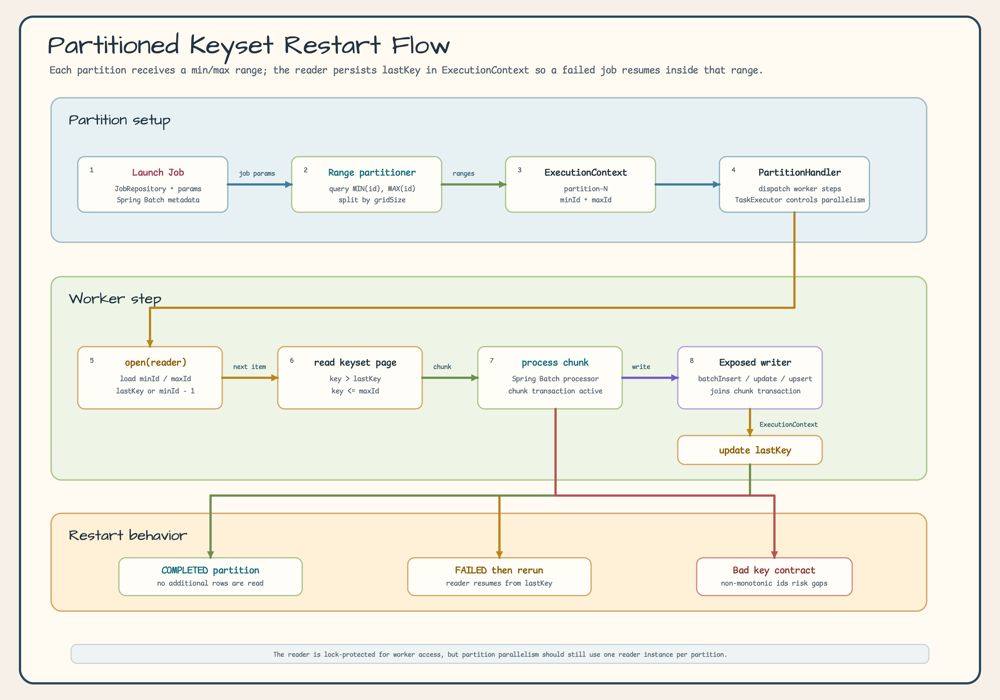

# exposed-spring-boot-batch

[English](./README.md) | 한국어

**Spring Boot + Spring Batch + Exposed 통합 모듈**

Spring Batch와 JetBrains Exposed를 통합하는 고성능 배치 처리 모듈입니다.
Keyset 기반 페이지 읽기 Reader, Exposed 기반 Writer, VirtualThread 병렬 실행을 위한
Range Partitioner, Spring Boot Auto-Configuration을 제공합니다.

## 아키텍처




## 주요 기능

- **`ExposedKeysetItemReader<T>`** — Keyset 페이지 읽기 Reader
  - `WHERE column > lastKey AND column <= maxId ORDER BY column LIMIT pageSize`
  - 재시작 시 `lastKey`를 `ExecutionContext`에 저장하여 마지막 위치부터 재개
  - `read()`에서 `reentrantLock().withLock { ... }`로 스레드 안전 보장 (Virtual Thread 친화적)
  - 팩토리: `forEntityId(table, pageSize, rowMapper, database)`

- **`ExposedItemWriter<T>`** — Exposed `batchInsert` 기반 대량 INSERT

- **`ExposedUpdateItemWriter<T>`** — Exposed DSL 기반 대량 UPDATE

- **`ExposedUpsertItemWriter<T>`** — Exposed `batchUpsert` 기반 대량 UPSERT

- **`ExposedRangePartitioner`** — `[minId, maxId]` 범위를 N개 파티션으로 분할
  - 테이블에서 `MIN(id)` / `MAX(id)` 자동 조회
  - 파티션별 `minId` / `maxId`를 `ExecutionContext`에 저장

- **`ExposedBatchAutoConfiguration`** — Spring Boot Auto-Configuration
  - `batchPartitionTaskExecutor` (설정 가능한 `TaskExecutor`) 자동 등록

- **`virtualThreadPartitionTaskExecutor(concurrencyLimit)`** — 동시성 제한 VirtualThread `TaskExecutor` 생성 헬퍼

- **`partitionedBatchJob` DSL** — 파티션된 `Job` 빌드를 위한 Kotlin DSL

## 사용 예시

### build.gradle.kts

```kotlin
implementation("io.github.bluetape4k.exposed:bluetape4k-exposed-spring-boot-batch")
```

### Auto-Configuration

`ExposedBatchAutoConfiguration`은 애플리케이션이 같은 이름의 빈을 제공하지
않고 설정으로 비활성화하지 않은 경우 기본 `batchPartitionTaskExecutor`를
등록합니다.

```yaml
bluetape4k:
  batch:
    executor:
      enabled: true
      virtual-threads: true
      concurrency-limit: 8
      await-termination-seconds: 30
```

### 파티션 마이그레이션 Job

```kotlin
@TestConfiguration
class MigrationJobConfig(
    private val jobRepository: JobRepository,
    private val transactionManager: PlatformTransactionManager,
    private val database: Database,
) {
    @Bean
    fun migrationJob(): Job = partitionedBatchJob("my-migration-job", jobRepository) {
        start(partitionedStep())
    }

    @Bean
    fun partitionedStep(): Step = StepBuilder("migration-manager", jobRepository)
        .partitioner("migration-worker", rangePartitioner())
        .partitionHandler(partitionHandler())
        .build()

    @Bean
    fun rangePartitioner(): ExposedRangePartitioner = ExposedRangePartitioner.forEntityId(
        table = SourceTable,
        gridSize = 4,
        database = database,
    )

    @Bean
    fun partitionHandler(): TaskExecutorPartitionHandler = TaskExecutorPartitionHandler().apply {
        setStep(workerStep())
        setTaskExecutor(virtualThreadPartitionTaskExecutor(concurrencyLimit = 4))
        gridSize = 4
    }

    @Bean
    fun workerStep(): Step = StepBuilder("migration-worker", jobRepository)
        .chunk<SourceRecord, TargetRecord>(500, transactionManager)
        .reader(keysetReader())
        .processor(ItemProcessor { source ->
            TargetRecord(sourceName = source.name.uppercase(), transformedValue = source.value * 2)
        })
        .writer(itemWriter())
        .build()

    @Bean
    @StepScope
    fun keysetReader(): ExposedKeysetItemReader<SourceRecord> = ExposedKeysetItemReader.forEntityId(
        table = SourceTable,
        pageSize = 500,
        rowMapper = { row ->
            SourceRecord(id = row[SourceTable.id].value, name = row[SourceTable.name], value = row[SourceTable.value])
        },
        database = database,
    )

    @Bean
    fun itemWriter(): ExposedItemWriter<TargetRecord> = ExposedItemWriter(table = TargetTable) {
        this[TargetTable.sourceName] = it.sourceName
        this[TargetTable.transformedValue] = it.transformedValue
    }
}
```

### 재시작 지원

동일한 Job 파라미터로 재실행하면 `lastKey` 이후부터 자동 재개됩니다:

```kotlin
// 1차 실행: 중간에 실패
val firstExecution = jobLauncher.run(job, params)  // BatchStatus.FAILED

// 2차 실행: 동일 params — lastKey부터 재개
val restartExecution = jobLauncher.run(job, params)  // BatchStatus.COMPLETED
```

## 모듈 의존성

```
exposed-spring-boot-batch
  ├── spring-batch-core
  ├── spring-batch-test
  ├── exposed-jdbc
  └── bluetape4k-virtualthread-api
```
