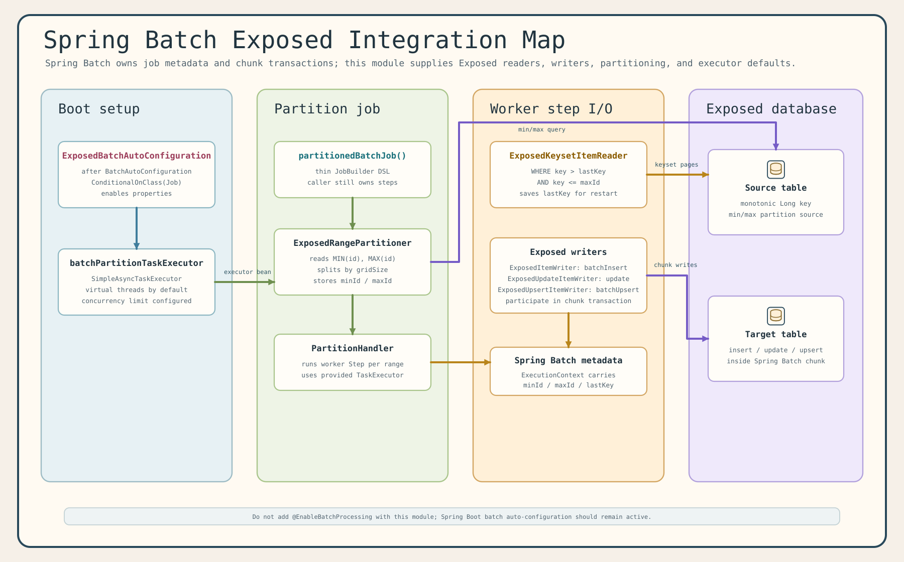
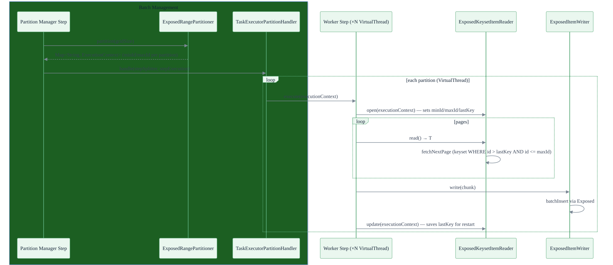

# exposed-spring-boot-batch

English | [한국어](./README.ko.md)

**Spring Batch + Exposed Integration for Spring Boot**

A high-performance batch processing module that integrates Spring Batch with JetBrains Exposed.
Provides keyset-based pagination readers, efficient Exposed-backed writers, range partitioners
for VirtualThread parallel execution, and Spring Boot Auto-Configuration.

## Architecture





## Features

- **`ExposedKeysetItemReader<T>`** — Keyset pagination reader
  - `WHERE column > lastKey AND column <= maxId ORDER BY column LIMIT pageSize`
  - Persists `lastKey` in `ExecutionContext` for restart support
  - Thread-safe with `reentrantLock().withLock { ... }` in `read()` (Virtual Thread-friendly)
  - Factory: `forEntityId(table, pageSize, rowMapper, database)`

- **`ExposedItemWriter<T>`** — Batch INSERT via Exposed `batchInsert`

- **`ExposedUpdateItemWriter<T>`** — Batch UPDATE via Exposed DSL

- **`ExposedUpsertItemWriter<T>`** — Batch UPSERT via Exposed `batchUpsert`

- **`ExposedRangePartitioner`** — Divides `[minId, maxId]` range into N partitions
  - Reads `MIN(id)` and `MAX(id)` from the table
  - Stores `minId` / `maxId` per partition in `ExecutionContext`

- **`ExposedBatchAutoConfiguration`** — Spring Boot Auto-Configuration
  - Registers `batchPartitionTaskExecutor` (VirtualThread-based `TaskExecutor`)

- **`virtualThreadPartitionTaskExecutor(concurrencyLimit)`** — Helper to create a VirtualThread `TaskExecutor` with concurrency limit

- **`partitionedBatchJob` DSL** — Kotlin DSL for building partitioned `Job`

## Usage

### build.gradle.kts

```kotlin
implementation("io.github.bluetape4k.exposed:bluetape4k-exposed-spring-boot-batch")
```

### Partitioned Migration Job

```kotlin
@TestConfiguration
class MigrationJobConfig(
    private val jobRepository: JobRepository,
    private val transactionManager: PlatformTransactionManager,
    private val database: Database,
) {
    @Bean
    fun migrationJob(): Job = partitionedBatchJob("my-migration-job", jobRepository) {
        start(partitionedStep())
    }

    @Bean
    fun partitionedStep(): Step = StepBuilder("migration-manager", jobRepository)
        .partitioner("migration-worker", rangePartitioner())
        .partitionHandler(partitionHandler())
        .build()

    @Bean
    fun rangePartitioner(): ExposedRangePartitioner = ExposedRangePartitioner.forEntityId(
        table = SourceTable,
        gridSize = 4,
        database = database,
    )

    @Bean
    fun partitionHandler(): TaskExecutorPartitionHandler = TaskExecutorPartitionHandler().apply {
        setStep(workerStep())
        setTaskExecutor(virtualThreadPartitionTaskExecutor(concurrencyLimit = 4))
        gridSize = 4
    }

    @Bean
    fun workerStep(): Step = StepBuilder("migration-worker", jobRepository)
        .chunk<SourceRecord, TargetRecord>(500, transactionManager)
        .reader(keysetReader())
        .processor(ItemProcessor { source ->
            TargetRecord(sourceName = source.name.uppercase(), transformedValue = source.value * 2)
        })
        .writer(itemWriter())
        .build()

    @Bean
    @StepScope
    fun keysetReader(): ExposedKeysetItemReader<SourceRecord> = ExposedKeysetItemReader.forEntityId(
        table = SourceTable,
        pageSize = 500,
        rowMapper = { row ->
            SourceRecord(id = row[SourceTable.id].value, name = row[SourceTable.name], value = row[SourceTable.value])
        },
        database = database,
    )

    @Bean
    fun itemWriter(): ExposedItemWriter<TargetRecord> = ExposedItemWriter(table = TargetTable) {
        this[TargetTable.sourceName] = it.sourceName
        this[TargetTable.transformedValue] = it.transformedValue
    }
}
```

## Module Dependencies

```
exposed-spring-boot-batch
  ├── spring-batch-core
  ├── spring-batch-test
  ├── exposed-jdbc
  └── bluetape4k-virtualthread-api
```
