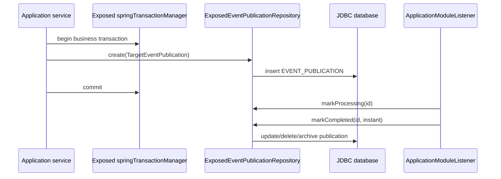

# exposed-spring-modulith

Exposed DSL 기반 JDBC-only Spring Modulith `EventPublicationRepository`를
제공하는 Spring Boot 자동 설정 모듈입니다.

artifact는 공식 Spring Modulith 저장소 모듈처럼 보이지 않도록
`spring-modulith-exposed`가 아니라 `exposed-spring-modulith` 형태를
사용합니다.

## 의존성

```kotlin
dependencies {
    implementation("io.github.bluetape4k.exposed:exposed-spring-boot-jdbc:1.8.0-SNAPSHOT")
    implementation("io.github.bluetape4k.exposed:exposed-spring-modulith:1.8.0-SNAPSHOT")
}
```

## 런타임 모델



Repository는 애플리케이션과 같은 `DataSource` 및 Exposed
`springTransactionManager`를 사용합니다. Spring Modulith 2.x의
`EventPublicationRepository` SPI가 동기 인터페이스이므로 R2DBC 또는
`suspend` 구현은 제공하지 않습니다.

## 설정

```yaml
bluetape4k:
  spring:
    modulith:
      exposed:
        table-name: EVENT_PUBLICATION
        archive-table-name: EVENT_PUBLICATION_ARCHIVE
        completion-mode: update
        initialize-schema: false
```

`completion-mode`는 Spring Modulith의 `UPDATE`, `DELETE`, `ARCHIVE`를
지원합니다. 운영 스키마 관리는 Flyway 또는 Liquibase 사용을 권장합니다.
`initialize-schema`는 Exposed `SchemaUtils`를 사용하므로 테스트나 작은 로컬
애플리케이션에 적합합니다.

## 검증

통합 테스트는 `exposed-jdbc-tests`의 `TestDB.enabledDialects()`를
사용하므로 기본 범위는 H2, PostgreSQL, MySQL 8입니다. CI에서는
`EXPOSED_TEST_DB=POSTGRESQL` 또는 `EXPOSED_TEST_DB=MYSQL_V8`로 매트릭스를
줄일 수 있습니다.
