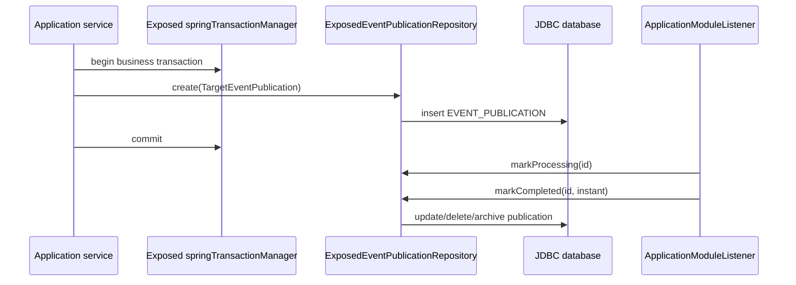

# bluetape4k-spring-boot-exposed-spring-modulith

Spring Boot auto-configuration for a JDBC-only Spring Modulith
`EventPublicationRepository` backed by Exposed DSL.

The module intentionally uses the `exposed-spring-modulith` artifact shape
instead of `spring-modulith-exposed` so it does not look like an official Spring
Modulith store module.

## Dependency

```kotlin
dependencies {
    implementation("io.github.bluetape4k.exposed:bluetape4k-spring-boot-exposed-jdbc:1.8.0-SNAPSHOT")
    implementation("io.github.bluetape4k.exposed:bluetape4k-spring-boot-exposed-spring-modulith:1.8.0-SNAPSHOT")
}
```

## Runtime Model



The repository uses the same `DataSource` and Exposed
`springTransactionManager` as the application. It does not provide an R2DBC or
`suspend` implementation because Spring Modulith 2.x exposes a synchronous
`EventPublicationRepository` SPI.

## Configuration

```yaml
bluetape4k:
  spring:
    modulith:
      exposed:
        table-name: EVENT_PUBLICATION
        archive-table-name: EVENT_PUBLICATION_ARCHIVE
        completion-mode: update
        initialize-schema: false
```

`completion-mode` supports Spring Modulith `UPDATE`, `DELETE`, and `ARCHIVE`.
Use Flyway or Liquibase for production schema management. `initialize-schema`
uses Exposed `SchemaUtils` and is intended for tests or small local
applications.

## Verification

The integration test uses `TestDB.enabledDialects()` from
`bluetape4k-exposed-jdbc-tests`, so the default coverage is H2, PostgreSQL, and
MySQL 8. CI can narrow the matrix with `EXPOSED_TEST_DB=POSTGRESQL` or
`EXPOSED_TEST_DB=MYSQL_V8`.
