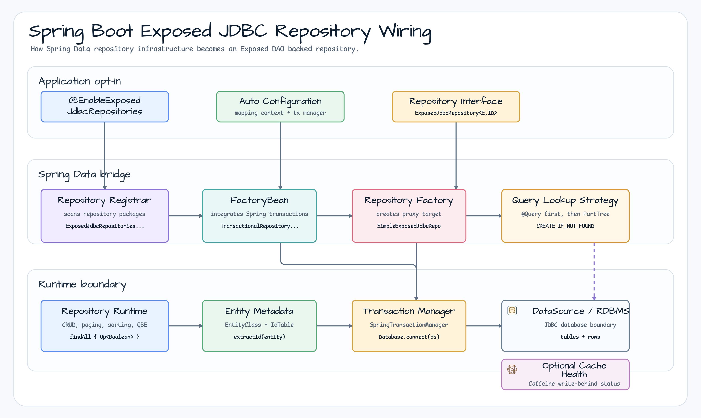
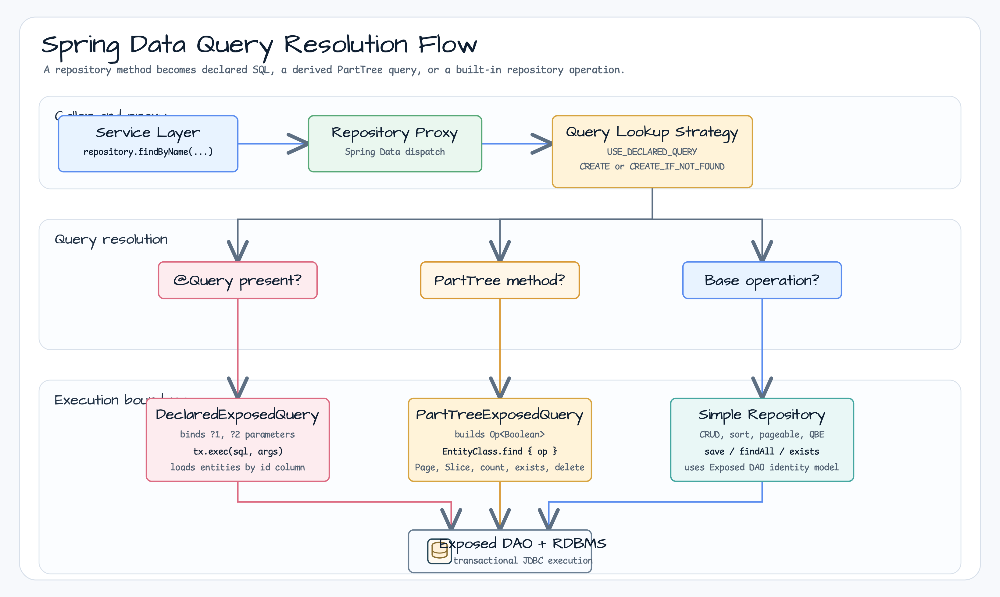
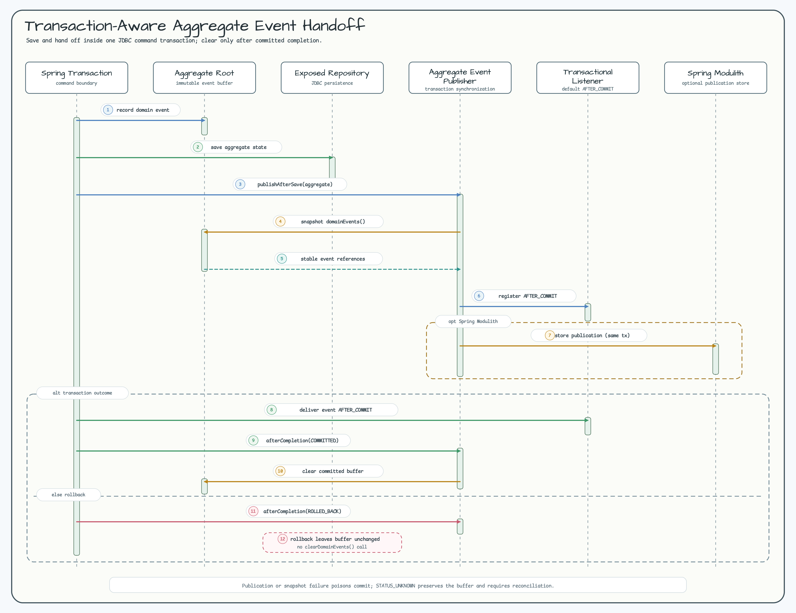

# exposed-spring-boot-jdbc

English | [한국어](./README.ko.md)

**Exposed DAO Entity-based Spring Data JDBC Repository (Spring Boot 4.x / Spring 7)**

A Spring Data repository bridge for Exposed DAO entities. It wires Spring Boot
auto-configuration, Spring Data repository factories, Exposed transactions, and
method-name query parsing into one JDBC repository model.

## Repository Wiring



## Query Resolution Flow



## Installation

```gradle
dependencies {
    implementation(platform(Libs.spring_boot_dependencies))
    implementation("io.github.bluetape4k.exposed:bluetape4k-exposed-spring-boot-jdbc:${version}")
}
```

## Key Features

### 1. ExposedJdbcRepository - Spring Data Standard Interface

```kotlin
@NoRepositoryBean
interface ExposedJdbcRepository<E: Entity<ID>, ID: Any>:
    ListCrudRepository<E, ID>,
    ListPagingAndSortingRepository<E, ID>,
    QueryByExampleExecutor<E>
```

- **ListCrudRepository**: `save`, `findById`, `findAll`, `delete`, `deleteById`, etc.
- **ListPagingAndSortingRepository**: Pagination and sorting support
- **QueryByExampleExecutor**: Query by example
- **Exposed DSL extensions**: `findAll { op }`, `count { op }`, `exists { op }`

### 2. Automatic PartTree Query Generation

Queries are automatically generated from method names:

```kotlin
interface UserRepository : ExposedJdbcRepository<User, Long> {
    // Automatically generated queries
    fun findByName(name: String): List<User>
    fun findByAgeGreaterThan(age: Int): List<User>
    fun findByEmailContaining(keyword: String): List<User>
    fun findByNameAndAge(name: String, age: Int): User?
    fun findByAgeBetween(min: Int, max: Int): List<User>
    fun findByNameOrderByAgeDesc(name: String): List<User>
    fun findTop3ByOrderByAgeDesc(): List<User>
    fun countByAge(age: Int): Long
    fun existsByEmail(email: String): Boolean
    fun deleteByName(name: String): Long
}
```

### 3. @Query Annotation - Write SQL Directly

```kotlin
interface UserRepository : ExposedJdbcRepository<User, Long> {
    @Query("SELECT * FROM users WHERE email = ?1")
    fun findByEmailNative(email: String): List<User>

    @Query("SELECT * FROM users WHERE age = ?2 AND email = ?1")
    fun findByEmailAndAgeNative(email: String, age: Int): List<User>

    @Query("SELECT * FROM users WHERE age BETWEEN ?1 AND ?2")
    fun findByAgeRangeNative(minAge: Int, maxAge: Int): List<User>
}
```

### 4. Auto Configuration

```kotlin
@Configuration
@EnableExposedJdbcRepositories(basePackages = ["com.example.repository"])
class RepositoryConfig
```

Or use Spring Boot auto-configuration:

```kotlin
// application.properties
spring.data.exposed-jdbc.repositories.enabled=true
spring.data.exposed-jdbc.repositories.base-packages=com.example.repository
```

### 5. Actuator Cache Health

When Spring Boot Actuator and `bluetape4k-exposed-jdbc-caffeine` are on the
classpath, auto-configuration registers `exposedJdbcCacheHealthIndicator`.
It reports Caffeine write-through/write-behind state through Boot health
details: cache mode, queue depth, flush job state, and the last flush error.

```properties
bluetape4k.exposed.cache.health.enabled=true
```

Flush failures map to `DOWN`; a write-behind queue with no running flush job
maps to `OUT_OF_SERVICE`. Set the property to `false` to disable the indicator.

## Usage Examples

### Entity Definition

```kotlin
object Users : LongIdTable("users") {
    val name = varchar("name", 255)
    val email = varchar("email", 255).uniqueIndex()
    val age = integer("age")
}

@ExposedEntity
class User(id: EntityID<Long>) : LongEntity(id) {
    companion object : LongEntityClass<User>(Users)

    var name: String by Users.name
    var email: String by Users.email
    var age: Int by Users.age
}
```

### Repository Definition

```kotlin
interface UserRepository : ExposedJdbcRepository<User, Long> {
    fun findByName(name: String): List<User>
    fun findByAgeGreaterThan(age: Int): List<User>
    fun findByEmailContaining(keyword: String): List<User>
}
```

### Service Usage

```kotlin
@Service
@Transactional
class UserService(
    private val userRepository: UserRepository
) {
    fun createUser(name: String, email: String, age: Int): User {
        return transaction {
            User.new {
                this.name = name
                this.email = email
                this.age = age
            }
        }
    }

    fun getUserByName(name: String): List<User> {
        return userRepository.findByName(name)
    }

    fun getAdultUsers(): List<User> {
        return userRepository.findByAgeGreaterThan(18)
    }

    fun getUserPage(pageable: Pageable): Page<User> {
        return userRepository.findAll(pageable)
    }

    fun getUsersWithDslCondition(): List<User> {
        return userRepository.findAll { Users.age greaterEq 18 }
    }
}
```

### REST Controller Example

```kotlin
@RestController
@RequestMapping("/api/users")
class UserController(
    private val userService: UserService
) {
    @PostMapping
    fun createUser(@RequestBody request: CreateUserRequest): ResponseEntity<User> {
        val user = userService.createUser(request.name, request.email, request.age)
        return ResponseEntity.status(HttpStatus.CREATED).body(user)
    }

    @GetMapping
    fun listUsers(@ParameterObject pageable: Pageable): Page<User> {
        return userService.getUserPage(pageable)
    }

    @GetMapping("/by-name")
    fun searchByName(@RequestParam name: String): List<User> {
        return userService.getUserByName(name)
    }

    @GetMapping("/adults")
    fun getAdults(): List<User> {
        return userService.getAdultUsers()
    }
}
```

## Exposed DSL Extension Methods

Additional methods available in the Repository interface:

```kotlin
@Service
@Transactional(readOnly = true)
class UserQueryService(
    private val userRepository: UserRepository
) {
    // Query with DSL condition
    fun findActiveUsers(): List<User> =
        userRepository.findAll { Users.age greaterEq 18 }

    // Count with DSL condition
    fun countAdults(): Long =
        userRepository.count { Users.age greaterEq 18 }

    // Check existence with DSL condition
    fun hasAdults(): Boolean =
        userRepository.exists { Users.age greaterEq 18 }
}
```

## Dependencies

- **Spring Boot**: 4.0.x or later
- **Spring Data**: 3.4.x or later
- **Exposed**: 1.0.x or later
- **Kotlin**: 2.0 or later

### Spring Boot BOM

```gradle
dependencies {
    implementation(platform(Libs.spring_boot_dependencies))
}
```

Note: Use `platform()` instead of the
`dependencyManagement` plugin, which has compatibility issues with the Kotlin Gradle Plugin.

<a id="transaction-aware-domain-events"></a>
## Transaction-Aware Domain Events



`ExposedAggregateEventPublisher` hands an aggregate's independent read-only event list, containing deeply immutable
event objects, to Spring immediately after the repository save while the command transaction is still active. The JDBC
starter auto-configures it when
`AggregateRoot`, Spring's application-event and transaction-synchronization APIs are present, exactly one
`PlatformTransactionManager` is selectable (including one `@Primary` among several), and no publisher bean was
declared by the application.

Call `publishAfterSave` exactly once, as the final aggregate operation in the same command transaction:

```kotlin
transactionTemplate.executeWithoutResult {
    repository.save(OrderEntity.from(aggregate))
    aggregateEventPublisher.publishAfterSave(aggregate)
}
```

An aggregate with no events is a no-op even without a transaction. An event-bearing aggregate requires active
Spring transaction synchronization and an actual active transaction. Spring handoff is immediate, so synchronous
listeners run in the caller and default `@TransactionalEventListener` / Spring Modulith listeners run in
`AFTER_COMMIT`. On committed completion the registered aggregate buffer is cleared; full rollback and
`STATUS_UNKNOWN` preserve it. Publication failure, duplicate registration, or snapshot mutation poisons the
transaction even if caller code catches the first exception. A synchronous listener therefore participates in the
command failure boundary, and any irreversible side effect it performs must be deduplicated independently.

Duplicate registration means the same aggregate object in the same transaction. Separate objects
with the same aggregate id and registrations in later transactions are not deduplicated; application-level idempotency
owns those cases.

Events and their payload graphs must be deeply immutable, and callers must retain stable event object references.
The publisher keeps the original snapshot for identity verification; it does not copy or serialize events. Do not
append, remove, reorder, or replace events after handoff. Use one final call per aggregate. `PROPAGATION_NESTED`
savepoints and same-instance reuse across overlapping `REQUIRES_NEW` transactions are unsupported. Distinct aggregate
instances in suspended `REQUIRES_NEW` transactions are isolated. A listener that writes to the database after commit
must open a `REQUIRES_NEW` transaction.

The publisher is plain Spring Boot infrastructure. Spring Modulith is optional: when present, it can persist a
publication and replay listener work, but this bridge is neither an outbox nor an exactly-once delivery mechanism.
Consumers remain idempotent. R2DBC is intentionally excluded because this publisher uses Spring's synchronous JDBC
transaction synchronization. Audit history, snapshot persistence, and JaVers commit semantics are forbidden
dependencies of the publisher; connect those concerns in application-owned listeners or services instead.

### Multiple Transaction Managers

Auto-configuration follows Spring's single-candidate rule: one manager, or exactly one `@Primary`, enables the bean.
The publisher does not select or retain a manager. Ambiguous applications must declare the publisher explicitly and
keep the repository, command transaction, and event handoff on the intended manager. `transactionManagerRef` selects
the repository manager; the command boundary must select the same manager as this compiled example:

<!-- issue-323-multi-manager:start -->
```kotlin
@Configuration(proxyBeanMethods = false)
@EnableExposedJdbcRepositories(
    basePackageClasses = [OrderRepository::class],
    transactionManagerRef = "secondTransactionManager",
)
class SecondOrderStoreConfiguration {
    @Bean("secondTransactionManager")
    fun secondTransactionManager(
        @Qualifier("secondDataSource") dataSource: DataSource,
    ): PlatformTransactionManager = SpringTransactionManager(dataSource, DatabaseConfig {}, false)

    @Bean("secondTransactionTemplate")
    fun secondTransactionTemplate(
        @Qualifier("secondTransactionManager") manager: PlatformTransactionManager,
    ): TransactionTemplate = TransactionTemplate(manager)
}

class OrderCommandService(
    private val repository: OrderRepository,
    private val aggregateEventPublisher: ExposedAggregateEventPublisher,
    @Qualifier("secondTransactionTemplate") private val transactionTemplate: TransactionTemplate,
) {
    fun save(aggregate: OrderAggregate, rollback: Boolean = false) {
        transactionTemplate.executeWithoutResult { status ->
            repository.save(OrderEntity.from(aggregate))
            aggregateEventPublisher.publishAfterSave(aggregate)
            if (rollback) status.setRollbackOnly()
        }
    }
}
```
<!-- issue-323-multi-manager:end -->

### Outcomes And Retry Decisions

<!-- issue-323-outcome-table:start -->
| Outcome | Persistence | Buffer | Command retry |
|---|---|---|---|
| No active transaction or same-transaction precondition violation | Indeterminate | Preserved | No automatic retry; reconcile first |
| Full rollback or poisoned handoff | Rolled back | Preserved | Allowed only in a fresh transaction; synchronous side effects may need deduplication |
| Committed listener failure | Committed | Cleared | Never retry command; use listener retry/replay |
| Committed cleanup failure | Committed | May remain | Never retry; discard aggregate instance |
| `STATUS_UNKNOWN` | Indeterminate | Preserved | No automatic retry; reconcile first |
<!-- issue-323-outcome-table:end -->

Two sanitized completion anomalies are emitted: `aggregate-event-cleanup-failed` after committed persistence when a
buffer cannot be cleared, and `aggregate-event-completion-unknown` when Spring cannot determine the transaction
outcome. Logs include aggregate/event types, count, and only valid allowlisted `traceId`, `spanId`, or `requestId`
values. They never include event payloads or exception messages.

<!-- issue-323-reconciliation:start -->
<!-- issue-323-reconciliation:state=present-present;action=listener-recovery;command-retry=false -->
- Persistence present + publication present: do not replay the command; use Modulith replay or listener recovery.
<!-- issue-323-reconciliation:state=present-absent;action=idempotent-repair;command-retry=false -->
- Persistence present + publication absent: do not replay the command; run application-owned idempotent repair from persisted state.
<!-- issue-323-reconciliation:state=absent-absent;action=fresh-command-after-side-effect-check;command-retry=conditional -->
- Persistence absent + publication absent: retry only as a new command after ruling out irreversible synchronous side effects.
<!-- issue-323-reconciliation:state=absent-present;action=quarantine-and-compensate;command-retry=false -->
- Persistence absent + publication present: quarantine the invariant breach and compensate manually; replay neither path.
<!-- issue-323-reconciliation:end -->

### Production Rollout Checklist

The application owner must be named before canary. Configure alerts for both anomaly categories, propagate at least
one allowlisted correlation field, provide audit/trace-to-persistence-key lookup, and grant operators database read access
plus publication-table read access. The canary must prove one persisted aggregate, one durable publication,
one listener side effect, and zero anomaly-category logs.

<!-- issue-323-rollout:01-stop -->
1. Stop rollout when the canary or either anomaly alert fails.
<!-- issue-323-rollout:02-preserve -->
2. Preserve logs, aggregate records, publication rows, and listener evidence before changing state.
<!-- issue-323-rollout:03-reconcile-repair -->
3. Reconcile the four states above and repair the canary idempotently.
<!-- issue-323-rollout:04-binary-rollback-version-defect-only -->
4. Use full binary rollback only for a confirmed version defect, after evidence preservation and repair.

If no allowlisted correlation field is present, quarantine the affected time window, use application audit records;
automatic repair is forbidden. Migration is replacement-only: remove manual event loops and manual buffer clearing in
the same change, and do not run both paths. A binary rollback is not a command retry and must not begin until evidence
has been preserved and the persisted/publication state has been reconciled and repaired.

Treat a Modulith publication store as a security and privacy boundary. Apply least-privilege database access,
encryption at rest and encryption in transit as application infrastructure permits, integrity protection, an explicit
retention/deletion policy, and payload minimization. Stored event class names are exposed schema metadata; review
package names and migration plans accordingly. These controls do not make the publisher depend on audit history,
snapshot persistence, or JaVers commits.

## Important Notes

### Transaction Handling

Exposed DAO entities must be created and modified within a `transaction` block:

```kotlin
@Transactional
fun createUser(name: String, email: String): User {
    return transaction {  // Integrates Spring and Exposed transactions
        User.new {
            this.name = name
            this.email = email
        }
    }
}
```

### PartTree Query Limitations

Supported keywords:

- **Comparison**: `GreaterThan`, `LessThan`, `Between`, `In`, `Contains`
- **Sorting**: `OrderBy`
- **Aggregation**: `count`, `exists`
- **Deletion**: `deleteBy`
- **Paging**: `Top`, `First`

Unsupported patterns:

- Complex OR/AND combinations → use `@Query` or DSL methods
- Joins → use Exposed DSL directly

### @Query Placeholders

- `?1`, `?2`, ... : Method parameters by position (1-indexed)
- Repeated placeholders supported: `?1 OR ?1`
- Skipping placeholders not supported: cannot use `?1` and `?3` simultaneously

## Multi-Database Support

Supports H2, PostgreSQL, MySQL, and MariaDB with the same Repository pattern:

```properties
# application.properties (MySQL example)
spring.datasource.url=jdbc:mysql://localhost:3306/mydb
spring.datasource.username=root
spring.datasource.password=password
```

```properties
# application.properties (PostgreSQL example)
spring.datasource.url=jdbc:postgresql://localhost:5432/mydb
```

## Performance Optimization

### Paginated Queries

```kotlin
val page = userRepository.findAll(PageRequest.of(0, 10, Sort.by("age").descending()))
```

### Batch Operations

```kotlin
val users = listOf(
    User(null, "Alice", 30),
    User(null, "Bob", 25)
)
userRepository.saveAll(users)
```

### Direct DSL Usage

For complex conditions, use DSL methods:

```kotlin
val users = userRepository.findAll {
    (Users.age greaterEq 18) and (Users.name like "%A%")
}
```

## Troubleshooting

### "Repository bean not created"

```kotlin
@EnableExposedJdbcRepositories(basePackages = ["com.example.repository"])
class AppConfig
```

Or check auto-configuration:

```properties
# application.properties
spring.data.exposed-jdbc.repositories.enabled=true
spring.data.exposed-jdbc.repositories.base-packages=com.example.repository
```

### "PartTree query parsing error"

Use simpler method names or the `@Query` annotation:

```kotlin
// Instead of a complex method name
@Query("SELECT * FROM users WHERE age > ?1 AND status = ?2")
fun findActiveAdults(age: Int, status: String): List<User>
```

### "LazyInitializationException"

Load all associated data before the transaction ends when building response objects:

```kotlin
@Transactional(readOnly = true)
fun getUser(id: Long): UserDto {
    val user = userRepository.findById(id).get()
    // All lazy loading happens here
    return user.toDto()
}
```

## Related Modules

- **exposed-jdbc**: Core Exposed JDBC Repository implementation
- **exposed-spring-boot-jdbc**: Spring Boot 4 version
- **exposed-spring-boot-r2dbc**: R2DBC coroutine Repository
