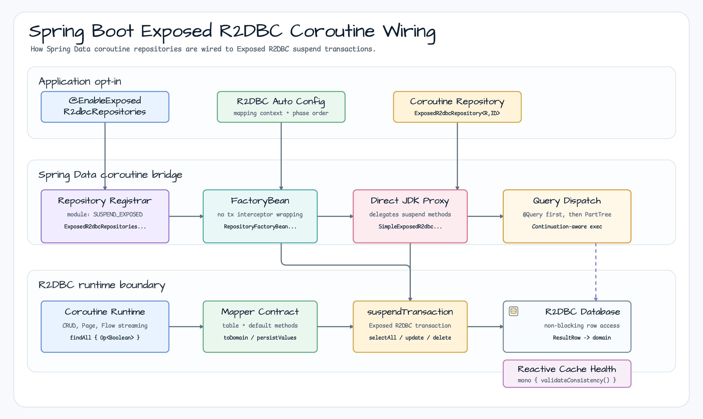
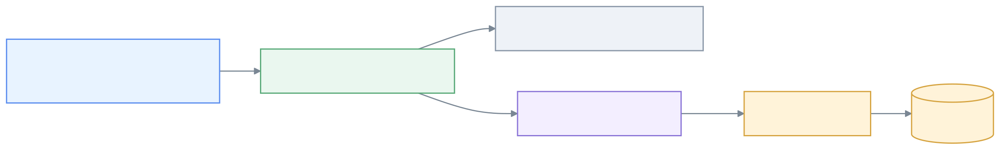

# exposed-spring-boot-r2dbc

English | [한국어](./README.ko.md)

**Exposed R2DBC DSL-based Coroutine Spring Data Repository (Spring Boot 4.x / Spring 7)**

Provides an Exposed R2DBC repository bridge for Spring Data coroutine
repositories. It keeps suspend and `Flow` signatures intact while delegating
transactional execution to Exposed R2DBC `suspendTransaction` blocks.

## Coroutine Repository Wiring



## Suspend Query and Flow Execution



## Installation

```gradle
dependencies {
    implementation(platform("org.springframework.boot:spring-boot-dependencies:<spring-boot-version>"))
    implementation(platform("io.github.bluetape4k:bluetape4k-dependencies:<bluetape4k-version>"))
    implementation("io.github.bluetape4k.exposed:bluetape4k-exposed-spring-boot-r2dbc")

    // Coroutines support (required)
    implementation("org.jetbrains.kotlinx:kotlinx-coroutines-reactor")
}
```

## Key Features

### 1. ExposedR2dbcRepository - Spring Data Coroutine Standard

```kotlin
@NoRepositoryBean
interface ExposedR2dbcRepository<R : Any, ID : Any> : CoroutineCrudRepository<R, ID>
```

- **CoroutineCrudRepository**: Suspend-based standard CRUD operations
- **Flow support**: Large-dataset streaming with backpressure
- **Pagination**: Suspend-based paginated retrieval
- **Exposed DSL integration**: R2DBC conditional queries
- **PartTree derived queries**: Spring Data method-name queries such as `findByName`, `countByAge`, `existsByEmail`, and `deleteByName`

### 2. Domain Object Mapping

Define Row-to-Domain conversion in the interface:

```kotlin
interface UserRepository : ExposedR2dbcRepository<User, Long> {
    override val table: IdTable<Long> get() = Users

    override fun extractId(entity: User): Long? = entity.id

    override fun toDomain(row: ResultRow): User =
        User(
            id = row[Users.id].value,
            name = row[Users.name],
            email = row[Users.email],
            age = row[Users.age],
        )

    override fun toPersistValues(domain: User): Map<Column<*>, Any?> =
        mapOf(
            Users.name to domain.name,
            Users.email to domain.email,
            Users.age to domain.age,
        )
}
```

### 3. Suspend-based CRUD

```kotlin
interface UserRepository : ExposedR2dbcRepository<User, Long> {
    // Automatically implemented
}

// Usage
suspend fun getUser(id: Long): User? {
    return userRepository.findByIdOrNull(id)
}

suspend fun saveUser(user: User): User {
    return userRepository.save(user)
}
```

### 4. Flow Streaming

Process large datasets with backpressure:

```kotlin
suspend fun processAllUsers() {
    userRepository.findAll()
        .collect { user ->
            println("Processing: $user")
        }
}

// Conditional streaming
userRepository.findAll { Users.age greaterEq 18 }
    .collect { adult ->
        // process...
    }

// Row-by-row streaming (memory efficient)
userRepository.streamAll()
    .collect { user ->
        // process...
    }
```

### 5. Method-name Derived Queries

Spring Data PartTree queries are available as suspend repository methods:

```kotlin
interface UserRepository : ExposedR2dbcRepository<User, Long> {
    suspend fun findByName(name: String): List<User>
    suspend fun findByAgeGreaterThan(age: Int): List<User>
    suspend fun findByEmailContaining(keyword: String): List<User>
    suspend fun findByNameAndAge(name: String, age: Int): User?
    suspend fun countByAge(age: Int): Long
    suspend fun existsByEmail(email: String): Boolean
    suspend fun deleteByName(name: String): Long
    suspend fun findTop3ByOrderByAgeDesc(): List<User>
    suspend fun findFirstByNameOrderByAgeDesc(name: String): User?
}
```

Supported query forms follow the same column-name mapping as the Exposed DSL helpers, including equality, comparison, `Containing`, count/exists/delete projections, declared ordering, and top/first limits.

### 6. Raw SQL with `@Query`

Use the `@Query` annotation for native SQL queries. Positional placeholders `?1`, `?2`, ... map to method parameters in order.

```kotlin
import io.bluetape4k.spring.data.exposed.jdbc.annotation.Query

interface UserRepository : ExposedR2dbcRepository<User, Long> {
    @Query("SELECT * FROM users WHERE email = ?1")
    suspend fun findByEmailNative(email: String): List<User>

    @Query("SELECT * FROM users WHERE age = ?2 AND email = ?1")
    suspend fun findByEmailAndAgeNative(email: String, age: Int): List<User>

    @Query("SELECT * FROM users WHERE age BETWEEN ?1 AND ?2")
    suspend fun findByAgeRangeNative(minAge: Int, maxAge: Int): List<User>

    @Query("SELECT id FROM users ORDER BY age DESC LIMIT 10")
    suspend fun findTopTenByAgeNative(): List<User>
}
```

Parameters are bound as prepared-statement placeholders, so SQL injection is prevented.

The raw SQL must select the entity ID column under its mapped column name. Entities are reloaded
through Exposed and returned in the exact ID order produced by the SQL, so `ORDER BY`, `LIMIT`,
and join ordering are preserved. In joins, alias the selected entity ID to its mapped name when
needed, for example `SELECT u.id AS id FROM users u JOIN ...`.

> **Limitation**: Scalar projections and grouping queries that do not select the entity ID are not
> entity queries and fail with a clear `IllegalArgumentException`. Use a dedicated row mapper or
> the Exposed DSL for projection and aggregation result shapes.

### 7. Actuator Cache Health

When Spring Boot Actuator and `bluetape4k-exposed-r2dbc-caffeine` are on the
classpath, auto-configuration registers `exposedR2dbcCacheHealthIndicator` as a
reactive health indicator. It reports cache mode, queue depth, `workerState`,
and the last flush error from suspend cache consistency checks.
The indicator is not registered when no compatible R2DBC Caffeine repository bean exists, avoiding a misleading
optional `UP` component with `repositoryCount=0`.

```properties
bluetape4k.exposed.cache.health.enabled=true
```

| Report | Actuator status |
|---|---|
| No flush error and `workerState=NOT_APPLICABLE|IDLE|RUNNING` | `UP` |
| No flush error and `workerState=DRAINING|STOPPED` | `OUT_OF_SERVICE` |
| Flush error or `workerState=FAILED` | `DOWN` |

Set the property to `false` to disable the indicator. Spring Boot discovers the
reactive indicator automatically. Ktor requires an explicit
`ExposedKtorCacheContributor` and maps `DRAINING`, `FAILED`, and `STOPPED` to
readiness `DOWN` with redacted details. Keep Actuator management-endpoint access
policy separate from the Ktor route security policy.

### 8. Paginated Retrieval

```kotlin
suspend fun getUsersPage(pageNo: Int, pageSize: Int): Page<User> {
    return userRepository.findAll(PageRequest.of(pageNo, pageSize))
}

suspend fun getUsersSorted(): Page<User> {
    return userRepository.findAll(
        PageRequest.of(0, 20, Sort.by("age").descending())
    )
}
```

### 9. Exposed DSL Conditions

Express complex conditions using DSL:

```kotlin
val adults = userRepository.findAll { Users.age greaterEq 18 }.toList()

val emailContains = userRepository.findAll {
    (Users.email like "%@example.com") and (Users.age greaterEq 20)
}.toList()

val count = userRepository.count { Users.age greaterEq 18 }

val exists = userRepository.exists { Users.email eq "alice@example.com" }
```

<!-- r2dbc-coroutine-fluent-query:START -->
### 10. Coroutine Query by Example and FluentQuery

<!-- contract-key:coroutine-only -->
<!-- contract-key:suspend-terminal -->
<!-- contract-key:cold-flow -->
<!-- contract-key:flow-collection-context -->
<!-- contract-key:outer-transaction -->
<!-- contract-key:database-selection -->
<!-- contract-key:nested-transactions-rejected -->
<!-- contract-key:closed-projection -->
<!-- contract-key:open-projection-rejected -->
<!-- contract-key:matcher-projection-matrix -->
<!-- contract-key:find-one-cardinality -->
<!-- contract-key:first-one-all-page-slice-count-exists -->
<!-- contract-key:error-taxonomy -->
<!-- contract-key:callback-scope -->
<!-- contract-key:cancellation -->
<!-- contract-key:streaming-retry-no-duplicate -->
<!-- contract-key:terminal-retry-delegated -->

Use `ExposedR2dbcQueryByExampleRepository` when a repository needs a
coroutine-native Query by Example API. It exposes only `suspend` and Kotlin
`Flow`; Reactor `Mono`/`Flux` is not part of this contract.

```kotlin
interface UserRepository : ExposedR2dbcQueryByExampleRepository<User, Long> {
    override val table: IdTable<Long> get() = Users
    override fun extractId(entity: User): Long? = entity.id
    override fun toDomain(row: ResultRow): User = User(
        id = row[Users.id].value,
        name = row[Users.name],
        email = row[Users.email],
        age = row[Users.age],
    )
    override fun toPersistValues(domain: User): Map<Column<*>, Any?> = mapOf(
        Users.name to domain.name,
        Users.email to domain.email,
        Users.age to domain.age,
    )
}

val example = Example.of(
    User(name = "Alice", email = "ignored", age = 0),
    ExampleMatcher.matching().withIgnorePaths("id", "email", "age"),
)

val alice: User? = userRepository.findOne(example)
val users: Flow<User> = userRepository.findAll(example)
val names: Flow<NameView> = userRepository.findBy(example) { query ->
    query.asType(NameView::class)
        .project("name")
        .sortBy(Sort.by(Sort.Direction.DESC, "age"))
        .all()
}
```

The supported matcher forms are exact/default, `CONTAINING`, `STARTING`, and
`ENDING`, with explicit null inclusion. Regex, ignore-case, nested properties,
open/SpEL projections, and partial domain projections fail before SQL. `findOne`
and fluent `one()` use strict cardinality: zero rows return `null`, one row is
returned, and multiple rows raise `IncorrectResultSizeDataAccessException`.

Fluent plans are immutable. Non-empty `project()` must exactly match the closed
projection's required source properties; an empty call resets to automatic
selection. A closed interface, Kotlin constructor type, or Java record is selected
only from the required columns. `first()`, `one()`, `all()`, `page()`, `slice()`,
`count()`, and `exists()` keep their documented terminal semantics, including
`Pageable` precedence and ID-only existence checks.

`Flow` is cold and the query is collected inside the current coroutine context, so
collecting the same flow twice executes two independent transactions. A
caller-owned active Exposed transaction is reused; to choose another database,
collect inside `suspendTransaction(database) { flow.collect { ... } }`.
`useNestedTransactions=true` is rejected before SQL. Callback scope is valid for
building and invoking a terminal inside `findBy`; cancellation preserves the
original `CancellationException` and releases the transaction lease.

Top-level streaming uses `maxAttempts = 1` so a row emitted before a driver error
is never duplicated. Non-streaming terminal retry, backoff, timeout, and outer
transaction settings remain delegated to Exposed and the caller. Unsupported
matcher/projection/sort usage raises `UnsupportedOperationException` or
`InvalidDataAccessApiUsageException`; mapping failures are sanitized
`MappingException` values and cardinality violations are
`IncorrectResultSizeDataAccessException`.

<!-- r2dbc-coroutine-fluent-query:END -->

## Usage Examples

### Entity and Table Definitions

```kotlin
object Users : LongIdTable("users") {
    val name = varchar("name", 255)
    val email = varchar("email", 255)
    val age = integer("age")
}

data class User(
    val id: Long? = null,
    val name: String,
    val email: String,
    val age: Int,
) : java.io.Serializable
```

### Repository Implementation

```kotlin
interface UserRepository : ExposedR2dbcRepository<User, Long> {
    override val table: IdTable<Long> get() = Users

    override fun extractId(entity: User): Long? = entity.id

    override fun toDomain(row: ResultRow): User =
        User(
            id = row[Users.id].value,
            name = row[Users.name],
            email = row[Users.email],
            age = row[Users.age],
        )

    override fun toPersistValues(domain: User): Map<Column<*>, Any?> =
        mapOf(
            Users.name to domain.name,
            Users.email to domain.email,
            Users.age to domain.age,
        )
}
```

### Service Usage

```kotlin
@Service
class UserService(
    private val userRepository: UserRepository
) {
    suspend fun createUser(name: String, email: String, age: Int): User {
        return userRepository.save(User(name = name, email = email, age = age))
    }

    suspend fun getUserById(id: Long): User? {
        return userRepository.findByIdOrNull(id)
    }

    suspend fun getAdultUsers(): List<User> {
        return userRepository.findAll { Users.age greaterEq 18 }.toList()
    }

    suspend fun getUsersPage(pageable: Pageable): Page<User> {
        return userRepository.findAll(pageable)
    }

    suspend fun streamLargeUserList(): Flow<User> {
        return userRepository.streamAll()
    }

    suspend fun countByAge(age: Int): Long {
        return userRepository.count { Users.age eq age }
    }
}
```

### REST Controller (WebFlux)

```kotlin
@RestController
@RequestMapping("/api/users")
class UserController(
    private val userService: UserService
) {
    @PostMapping
    suspend fun createUser(@RequestBody request: CreateUserRequest): ResponseEntity<User> {
        val user = userService.createUser(request.name, request.email, request.age)
        return ResponseEntity.status(HttpStatus.CREATED).body(user)
    }

    @GetMapping("/{id}")
    suspend fun getUser(@PathVariable id: Long): ResponseEntity<User> {
        return userService.getUserById(id)
            ?.let { ResponseEntity.ok(it) }
            ?: ResponseEntity.notFound().build()
    }

    @GetMapping
    suspend fun listUsers(@ParameterObject pageable: Pageable): Page<User> {
        return userService.getUsersPage(pageable)
    }

    @GetMapping("/adults")
    fun getAdults(): Flow<User> = flow {
        userService.getAdultUsers().forEach { emit(it) }
    }

    @GetMapping("/stream")
    fun streamUsers(): Flow<User> {
        return userService.streamLargeUserList()
    }

    @GetMapping("/count")
    suspend fun countAdults(): ResponseEntity<Long> {
        val count = userService.countByAge(18)
        return ResponseEntity.ok(count)
    }

    @DeleteMapping("/{id}")
    suspend fun deleteUser(@PathVariable id: Long): ResponseEntity<Void> {
        userService.deleteUser(id)
        return ResponseEntity.noContent().build()
    }
}
```

## Core Methods

### CRUD Operations

```kotlin
// Save
suspend fun save(entity: User): User

// Find
suspend fun findByIdOrNull(id: Long): User?

// Find all
suspend fun findAllAsList(): List<User>  // Loads into memory

// Stream (backpressure)
fun findAll(): Flow<User>

// Existence check
suspend fun existsById(id: Long): Boolean

// Delete
suspend fun deleteById(id: Long)

// Count
suspend fun count(): Long
```

### Pagination and Sorting

```kotlin
suspend fun findAll(pageable: Pageable): Page<User>

// Example
val pageable = PageRequest.of(
    0,  // page number
    20, // page size
    Sort.by("age").descending()
)
```

### Flow and Streaming

```kotlin
// Load all then return as Flow
fun findAll(): Flow<User>

// Row-by-row streaming (memory efficient)
fun streamAll(database: R2dbcDatabase? = null): Flow<User>

// Conditional streaming
fun findAll(op: () -> Op<Boolean>): Flow<User>
```

### Bulk Operations

```kotlin
// Save multiple entities
fun saveAll(entities: Iterable<User>): Flow<User>

// Save from Flow (atomic transaction; emits after commit)
fun saveAll(entityStream: Flow<User>): Flow<User>

// Delete multiple
suspend fun deleteAllById(ids: Iterable<Long>)
```

`saveAll(entityStream: Flow<User>)` is a cold `Flow`. It persists entities sequentially in
one Exposed transaction and retains the saved results until that transaction block
completes. At top level, normal completion commits the transaction before any saved result
is emitted; cancellation or an exception while collecting the input rolls it back and emits no
result. A downstream cancellation or exception after commit cannot roll back the completed
transaction and only stops remaining result emission. When an active
outer transaction is reused, the nested block may return and emit results before the outer
transaction commits; the caller owns that final commit or rollback boundary, so defer
external side effects until the outer scope succeeds. Repository-owned top-level
`saveAll(Flow)` and `saveAll(Iterable)` explicitly use `maxAttempts = 1`, so a database
exception is propagated without recollecting or re-iterating the input. If the caller wraps
the operation in an active outer transaction, that transaction's retry policy remains
caller-owned; use a replayable, side-effect-free input when the outer block may retry.
Because the results are materialized inside one atomic transaction, large or unbounded
inputs can hold memory and keep the transaction open; chunked persistence requires a
separate API.

## Writing Tests

### Unit Tests

```kotlin
@SpringBootTest
class UserRepositoryTest {
    @Autowired
    private lateinit var userRepository: UserRepository

    @Autowired
    private lateinit var r2dbcDatabase: R2dbcDatabase

    @Test
    fun `save and findById`() = runTest {
        val user = User(name = "Alice", email = "alice@example.com", age = 30)
        val saved = userRepository.save(user)

        val found = userRepository.findByIdOrNull(saved.id!!)
        assertThat(found).isNotNull()
        assertThat(found?.name).isEqualTo("Alice")
    }

    @Test
    fun `findAll returns users`() = runTest {
        suspendTransaction(r2dbcDatabase) {
            Users.deleteAll()
        }

        userRepository.save(User(name = "Alice", email = "alice@example.com", age = 30))
        userRepository.save(User(name = "Bob", email = "bob@example.com", age = 25))

        val users = userRepository.findAllAsList()
        assertThat(users).hasSize(2)
    }

    @Test
    fun `streamAll processes large dataset`() = runTest {
        val count = AtomicInteger(0)

        userRepository.streamAll()
            .collect { user ->
                count.incrementAndGet()
            }

        assertThat(count.get()).isGreaterThan(0)
    }
}
```

## Dependencies

- **Spring Boot**: 4.0.x or later
- **Spring Data Reactive**: 3.4.x or later
- **Exposed**: 1.0.x or later (R2DBC support)
- **Kotlin**: 2.0 or later
- **Coroutines**: 1.8.x or later
- **R2DBC Driver**: H2, PostgreSQL, MySQL, MariaDB, etc.

### Database Drivers

```gradle
dependencies {
    // H2
    implementation("io.r2dbc:r2dbc-h2:${r2dbcH2Version}")

    // PostgreSQL
    implementation("io.r2dbc:r2dbc-postgresql:${r2dbcPostgresqlVersion}")

    // MySQL
    implementation("io.r2dbc:r2dbc-mysql:${r2dbcMysqlVersion}")

    // MariaDB
    implementation("io.r2dbc:r2dbc-mariadb:${r2dbcMariadbVersion}")
}
```

## Configuration

### Spring Boot Auto-configuration

```properties
# application.properties (H2 example)
spring.r2dbc.url=r2dbc:h2:mem:///test
spring.r2dbc.username=sa
spring.r2dbc.password=
```

```properties
# application.properties (PostgreSQL example)
spring.r2dbc.url=r2dbc:postgresql://localhost:5432/mydb
spring.r2dbc.username=postgres
spring.r2dbc.password=password
```

### Explicit Configuration

```kotlin
@Configuration
@EnableExposedR2dbcRepositories(basePackages = ["com.example.repository"])
class RepositoryConfig {
    // Handled by auto-configuration
}
```

## Important Notes

### Using Suspend Functions

All find/save/delete methods in the Repository are suspend functions:

```kotlin
// Must be called from a coroutine context
suspend fun getUser(id: Long) = userRepository.findByIdOrNull(id)

// In a controller
@GetMapping("/{id}")
suspend fun get(@PathVariable id: Long): User? = getUser(id)
```

### Flow Consumption

Differences between `findAll()` and `streamAll()`:

```kotlin
// findAll: loads all results into memory then returns as Flow
userRepository.findAll().toList()  // Higher memory usage

// streamAll: row-by-row streaming with backpressure
userRepository.streamAll()  // Memory efficient
    .collect { user -> /* process */ }

// saveAll(Flow): sequential persistence; results are emitted after the transaction completes
userRepository.saveAll(inputUsers)
    .collect { savedUser -> /* process each saved entity */ }
```

The `saveAll(Flow)` overload starts only when collected. It consumes the input and persists
all entities before emitting the saved results, so the collector does not control the input
persistence rate. A repository-owned top-level call does not retry a database exception;
an active outer transaction may retry according to its caller-owned policy. Use
`streamAll()` for row-by-row read streaming; this overload intentionally keeps one atomic
transaction and does not provide chunked writes.

### Implementing toDomain and toPersistValues

Must be defined when implementing a Repository interface:

```kotlin
interface UserRepository : ExposedR2dbcRepository<User, Long> {
    // Required: row conversion
    override fun toDomain(row: ResultRow): User

    // Required: persist value definition
    override fun toPersistValues(domain: User): Map<Column<*>, Any?>
}
```

### Excluding the ID Column

Always exclude the ID column from `toPersistValues`:

```kotlin
override fun toPersistValues(domain: User): Map<Column<*>, Any?> =
    mapOf(
        Users.name to domain.name,
        Users.email to domain.email,
        // Users.id excluded (auto-generated)
    )
```

### Transaction Scope

R2DBC-based operations are automatically handled within suspend functions. Use
`suspendTransaction` for complex operations:

```kotlin
suspend fun complexOperation() {
    suspendTransaction(r2dbcDatabase) {
        userRepository.save(user1)
        userRepository.save(user2)
        // All succeed or all fail within the transaction
    }
}
```

`@EnableExposedR2dbcRepositories(transactionManagerRef = ...)` is retained only
for source and binary compatibility and is deprecated. This adapter bypasses
Spring's transaction interceptor, so a non-default value is rejected during
repository registration and never selects an Exposed `R2dbcDatabase`. For
multiple databases, choose the target explicitly with
`suspendTransaction(database) { ... }`; use `streamAll(database)` when the
streaming API itself owns the database choice.

## Performance Optimization

### Large-Volume Streaming

```kotlin
userRepository.streamAll()
    .buffer(256)  // Adjust buffer size
    .collect { user ->
        // Backpressure control
    }
```

### Batch Inserts

```kotlin
userRepository.saveAll(
    listOf(
        User(name = "Alice", email = "alice@example.com", age = 30),
        User(name = "Bob", email = "bob@example.com", age = 25)
    )
).toList()
```

### Conditional Streaming

Use DSL for complex conditions:

```kotlin
userRepository.findAll {
    (Users.age greaterEq 18) and (Users.email like "%example.com")
}.toList()
```

## Troubleshooting

### "Cannot call suspend function from blocking context"

Requires WebFlux or a coroutine context:

```kotlin
// Incorrect usage
fun getUser(id: Long) {
    val user = userRepository.findByIdOrNull(id)  // Compile error
}

// Correct usage
suspend fun getUser(id: Long) {
    val user = userRepository.findByIdOrNull(id)  // OK
}

// Or
@GetMapping
suspend fun getUser(): User? = userRepository.findByIdOrNull(1)
```

### "Using Flow without toList()"

Return a stream as the response:

```kotlin
@GetMapping("/stream")
fun getUsers(): Flow<User> = userRepository.findAll()
```

Or convert explicitly to a list:

```kotlin
@GetMapping
suspend fun getUsers(): List<User> =
    userRepository.findAll().toList()
```

## Related Modules

- **exposed-r2dbc**: Core Exposed R2DBC Repository implementation
- **exposed-spring-boot-r2dbc**: Spring Boot 4 version
- **exposed-spring-boot-jdbc**: JDBC-based Repository
- **bluetape4k-coroutines**: Coroutine utilities
