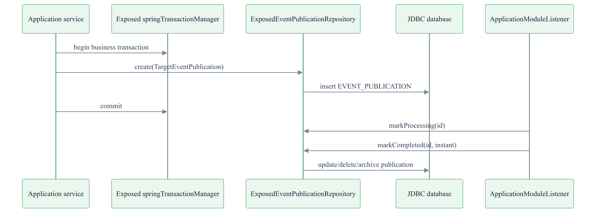
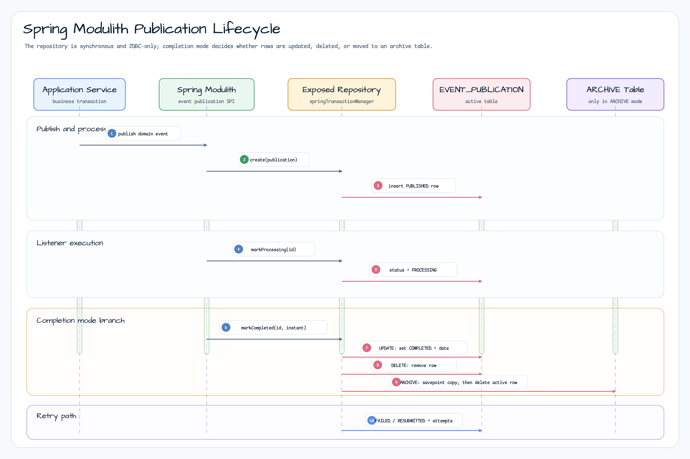

# exposed-spring-modulith

[English](./README.md) | 한국어

Exposed DSL 기반 JDBC-only Spring Modulith `EventPublicationRepository`를 제공하는 Spring Boot 자동 설정
모듈입니다. Spring Modulith event publication을 애플리케이션의 JDBC 데이터베이스에 저장하면서 Exposed
`springTransactionManager`를 그대로 사용합니다.

artifact는 공식 Spring Modulith 저장소 모듈처럼 보이지 않도록
`spring-modulith-exposed`가 아니라 `exposed-spring-modulith` 형태를
사용합니다.

## 의존성

```kotlin
dependencies {
    implementation("io.github.bluetape4k.exposed:bluetape4k-exposed-spring-boot-jdbc:1.10.0")
    implementation("io.github.bluetape4k.exposed:bluetape4k-exposed-spring-modulith:1.10.0")
}
```

## 런타임 구성



Repository는 애플리케이션과 같은 `DataSource` 및 Exposed
`springTransactionManager`를 사용합니다. Spring Modulith 2.x의
`EventPublicationRepository` SPI가 동기 인터페이스이므로 R2DBC 또는
`suspend` 구현은 제공하지 않습니다.

## Publication 생명주기



`create(publication)`은 active publication row를 추가합니다. Listener 실행 중에는 row가 `PROCESSING`,
`FAILED`, `RESUBMITTED` 상태를 거칠 수 있고, `markCompleted(...)`는 설정된 completion mode에 따라 처리합니다.

- `UPDATE`: active row를 유지하고 `COMPLETED`와 `COMPLETION_DATE`를 기록합니다.
- `DELETE`: 완료된 active row를 제거합니다.
- `ARCHIVE`: savepoint로 archive table에 복사한 뒤 active row를 삭제합니다.

## 로드할 수 없는 이벤트 타입

`EVENT_TYPE`을 더 이상 로드할 수 없는 row도 incomplete, failed, status query에서 계속 보입니다. package rename,
dependency drift, classpath 문제 이후에도 미전달 publication을 운영자가 확인할 수 있게 하기 위해서입니다.
이런 row에서 `publication.event`에 접근하면 publication id, listener id, event type을 담은
`UnloadableEventPublicationException`이 발생합니다.

운영자는 event class를 classpath에 복구하거나, event type과 payload를 마이그레이션하거나, 저장된 publication을
수정한 뒤 명시적으로 삭제 또는 재전송해야 합니다. 로드할 수 없는 event type을 전달 완료로 간주하면 안 됩니다.

## 설정

```yaml
bluetape4k:
  spring:
    modulith:
      exposed:
        table-name: EVENT_PUBLICATION
        archive-table-name: EVENT_PUBLICATION_ARCHIVE
        completion-mode: update
        initialize-schema: false
```

`completion-mode`는 Spring Modulith의 `UPDATE`, `DELETE`, `ARCHIVE`를
지원합니다. 운영 스키마 관리는 Flyway 또는 Liquibase 사용을 권장합니다.
`initialize-schema`는 Exposed `SchemaUtils`를 사용하므로 테스트나 작은 로컬
애플리케이션에 적합합니다.

기본 table은 Spring Modulith JDBC schema 형태를 따릅니다. event id, listener id, event type, serialized
payload, publication date, completion date, status, completion attempts, last resubmission date를 저장합니다.

## 검증

통합 테스트는 `exposed-jdbc-tests`의 `TestDB.enabledDialects()`를
사용하므로 기본 범위는 H2, PostgreSQL, MySQL 8입니다. CI에서는
`EXPOSED_TEST_DB=POSTGRESQL` 또는 `EXPOSED_TEST_DB=MYSQL_V8`로 매트릭스를
줄일 수 있습니다.
