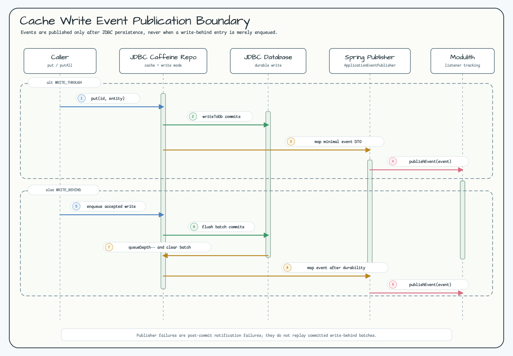

# exposed-spring-modulith

English | [한국어](./README.ko.md)

Spring Boot auto-configuration for a JDBC-only Spring Modulith `EventPublicationRepository` backed by Exposed DSL.
It stores Spring Modulith event publications in the application's JDBC database while reusing the Exposed
`springTransactionManager`.

The module intentionally uses the `exposed-spring-modulith` artifact shape
instead of `spring-modulith-exposed` so it does not look like an official Spring
Modulith store module.

## Dependency

```kotlin
dependencies {
    implementation("io.github.bluetape4k.exposed:bluetape4k-exposed-spring-boot-jdbc:1.12.0")
    implementation("io.github.bluetape4k.exposed:bluetape4k-exposed-spring-modulith:1.12.0")
}
```

## Runtime Wiring


The repository uses the same `DataSource` and Exposed
`springTransactionManager` as the application. It does not provide an R2DBC or
`suspend` implementation because Spring Modulith 2.x exposes a synchronous
`EventPublicationRepository` SPI.

## Publication Lifecycle


`create(publication)` inserts an active publication row. Listener execution can move the row through
`PROCESSING`, `FAILED`, and `RESUBMITTED` states, and `markCompleted(...)` applies the configured completion
mode:

- `UPDATE`: keep the active row and set `COMPLETED` plus `COMPLETION_DATE`.
- `DELETE`: remove the active row after successful completion.
- `ARCHIVE`: copy the row to `EVENT_PUBLICATION_ARCHIVE` with a savepoint, then delete the active row.

Completion operations are idempotent for duplicate retry calls. `UPDATE` mode preserves the first
`COMPLETION_DATE`, `DELETE` mode leaves no completed row behind, and `ARCHIVE` mode keeps a single archived row.
Repeated `markResubmitted(...)` calls update attempts and timestamp only on the first resubmission.

### Outstanding Publication Restart

Spring Modulith can republish incomplete publications during application startup:

```yaml
spring:
  modulith:
    events:
      republish-outstanding-events-on-restart: true
```

When this property is enabled, Spring Modulith reads incomplete rows from the Exposed-backed publication table and
invokes the matching `@ApplicationModuleListener` again. Completed rows are skipped, so a listener that was already
marked complete is not replayed during restart. The completion mode still applies after a successful restart replay:
`UPDATE` keeps the completed row, `DELETE` removes it, and `ARCHIVE` moves it to the archive table.

Republished events can repeat external side effects that happened before the previous process stopped. Keep
`@ApplicationModuleListener` consumers idempotent, use stable listener ids, and guard outbound calls, projection writes,
or message sends with an application-level deduplication key when duplicates are unsafe. Rows with unloadable event
types remain incomplete until the event class is restored or the stored row is migrated.

## Observability

When Micrometer is on the classpath and a `MeterRegistry` bean is available, the module registers Exposed-store gauges
automatically. Disable them if another component owns the same operational view:

```yaml
bluetape4k:
  spring:
    modulith:
      exposed:
        observability:
          enabled: true
          include-unloadable: true
          tags:
            application: orders
```

The main meter is `bluetape4k.exposed.modulith.publications`. It uses low-cardinality tags only:

- `state`: `incomplete`, `completed`, `failed`, or `unloadable`.
- `completion.mode`: `update`, `delete`, or `archive`.
- Additional configured `tags` are appended to every meter and should stay bounded to deployment-level values such as
  application, region, or environment.

Spring Modulith's own event-publishing metrics, such as `module.events.published`, still describe application event
emission. These Exposed gauges describe the durable publication store state: pending rows, completed rows according to
the configured completion mode, failed rows, and incomplete rows whose event type can no longer be loaded.

Kotlin callers can use package functions instead of Spring Modulith's Java-style static factories:

```kotlin
val publication = targetEventPublicationOf(
    event = "order-1",
    targetIdentifier = publicationTargetIdentifierOf("listener.order-submitted"),
    publicationDate = Instant.now(),
)
```

## Cache Write Event Publication



`SpringModulithJdbcCaffeineRepository` is an opt-in base class for synchronous JDBC Caffeine repositories. It
publishes Spring application events only after the cache write has reached the JDBC persistence boundary:

- `WRITE_THROUGH`: after the synchronous database write succeeds.
- `WRITE_BEHIND`: after the background flush commits, queue depth is decremented, and the retained batch is cleared.
- `READ_ONLY`, `invalidate`, `invalidateAll`, and `clear`: no event is published.

The write-behind queue is process-local and is not a durable outbox. If the process stops before a flush, queued
writes and their events can be lost. If the database commit succeeds but event publication fails, the committed batch
is not replayed; the failure is logged as a post-commit notification failure. Pass a Spring `TransactionOperations`
when consumers use `@ApplicationModuleListener`, especially in `WRITE_BEHIND` mode, so the Spring application event is
published inside a transaction that Spring Modulith can complete after commit.

```kotlin
data class ActorRenamedEvent(val actorId: Long) : Serializable {
    companion object {
        private const val serialVersionUID: Long = 1L
    }
}

class ActorRepository(
    events: ApplicationEventPublisher,
    transactions: TransactionOperations,
) :
    SpringModulithJdbcCaffeineRepository<Long, ActorRecord>(
        config = LocalCacheConfig.WRITE_THROUGH,
        eventPublisher = events,
        transactionOperations = transactions,
    ) {
    override fun toDomainEvent(id: Long, entity: ActorRecord): Any =
        ActorRenamedEvent(actorId = id)
}

@Component
class ActorProjection {
    @ApplicationModuleListener
    fun on(event: ActorRenamedEvent) {
        // update projection
    }
}
```

Use a stable, public, Jackson-serializable event DTO with a minimal payload. Do not publish cached entities, `Pair`
values, credentials, tokens, raw secrets, raw email addresses, or full records. Spring Modulith stores the event type
and serialized payload; package renames or DTO shape drift can create unloadable event rows.

### Migration From JDBC Caffeine

This feature is available in `1.12.0+`. Existing JDBC Caffeine repositories opt in by changing their base class from
`AbstractJdbcCaffeineRepository` to `SpringModulithJdbcCaffeineRepository`, injecting `ApplicationEventPublisher`,
choosing `LocalCacheConfig.WRITE_THROUGH` or `WRITE_BEHIND`, optionally injecting `TransactionOperations` for
transactional Modulith listeners, implementing `toDomainEvent(...)`, and adding `@ApplicationModuleListener`
consumers.

Before deploy or rollback in `WRITE_BEHIND` mode, drain the queue and check `validateConsistency().queueDepth == 0`
and `lastFlushError == null`. Roll back by returning `null` from `toDomainEvent(...)` or switching the repository back
to `AbstractJdbcCaffeineRepository`. Existing Spring Modulith publication rows remain governed by the configured
completion mode.

### Operator Runbook

- Queue full: reduce write rate or increase `writeBehindQueueCapacity`; rejected writes are not cached or published.
- Close timeout: check logs for unflushed write-behind entries and verify the database state before replaying writes.
- Prefer `WRITE_THROUGH` when write/event coupling matters more than write latency.
- Use an application-level durable outbox when queued write-behind entries must survive process crashes.
- Unsupported in this integration: suspended JDBC Caffeine, R2DBC Caffeine, delete/invalidation events, auto-wrapping
  existing repository beans, and a durable write-behind queue.

## Unloadable Event Types

Rows whose `EVENT_TYPE` can no longer be loaded remain visible through incomplete, failed, and status queries.
This keeps undelivered publications available to operators after package renames, dependency drift, or classpath
mistakes. Accessing `publication.event` for those rows throws `UnloadableEventPublicationException` with the
publication id, listener id, and event type.

Restore the event class on the classpath, migrate the event type and payload, or explicitly delete/resubmit the row
after correcting the stored publication. Do not treat an unloadable event type as a delivered publication.

## Configuration

```yaml
bluetape4k:
  spring:
    modulith:
      exposed:
        table-name: EVENT_PUBLICATION
        archive-table-name: EVENT_PUBLICATION_ARCHIVE
        completion-mode: update
        initialize-schema: false
```

`completion-mode` supports Spring Modulith `UPDATE`, `DELETE`, and `ARCHIVE`.
Use Flyway or Liquibase for production schema management. `initialize-schema`
uses Exposed `SchemaUtils` and is intended for tests or small local
applications.

The default table follows the Spring Modulith JDBC schema shape: event id, listener id, event type, serialized
payload, publication date, completion date, status, completion attempts, and last resubmission date.

## Verification

The integration test uses `TestDB.enabledDialects()` from
`exposed-jdbc-tests`, so the default coverage is H2, PostgreSQL, and
MySQL 8. CI can narrow the matrix with `EXPOSED_TEST_DB=POSTGRESQL` or
`EXPOSED_TEST_DB=MYSQL_V8`.

## See Also

- [Transaction-Aware Domain Events](../jdbc/README.md#transaction-aware-domain-events) documents
  `ExposedAggregateEventPublisher`, immediate handoff, `AFTER_COMMIT` listener timing, and commit/rollback buffer
  ownership. The [DDD Spring Modulith demo](../../examples/ddd-spring-modulith-demo/README.md) shows the runnable
  integration. This module keeps only the durable publication-store lifecycle and does not duplicate that command
  transaction contract.
