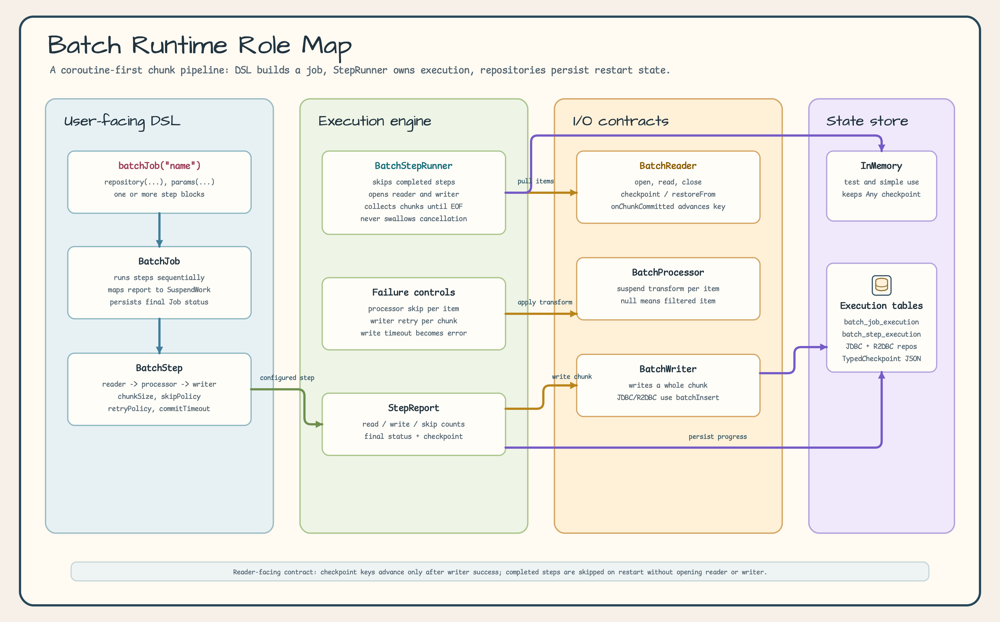
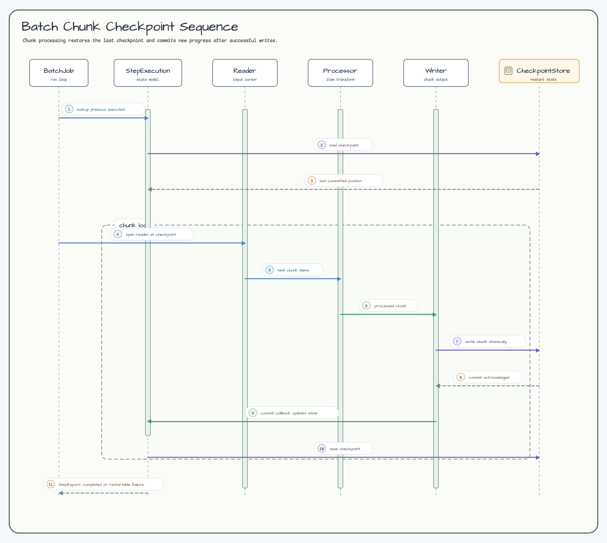
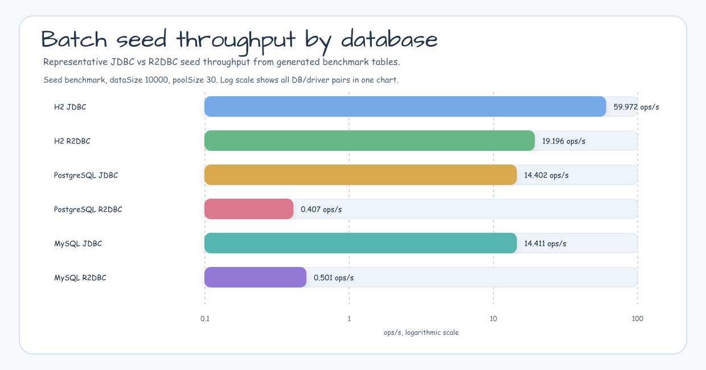

# exposed-batch

한국어 | [English](./README.md)

Kotlin 코루틴 네이티브 배치 처리 프레임워크. Spring Batch 없이 경량화된 체크포인트 기반 청크 처리 파이프라인을 구현한다.

## Runtime 역할 맵



## Chunk 체크포인트 흐름



## 주요 기능

- **코루틴 우선**: 모든 인터페이스가 `suspend`; `runBlocking` 및 스레드 블로킹 없음
- **체크포인트 재시작**: keyset 기반 체크포인트가 JVM 재시작 후에도 유지됨; 이미 완료된 Step은 자동 skip
- **청크 기반 파이프라인**: `BatchReader → BatchProcessor → BatchWriter` 파이프라인, 청크 크기 설정 가능
- **Skip 정책**: Processor/Writer 실패 시 per-item skip (`NONE` / `ALL` / `maxSkips(n)` / 커스텀 람다)
- **지수 백오프 재시도**: 청크 단위 재시도, 지연 시간 및 지수 백오프 설정 가능
- **커밋 타임아웃**: `WriteTimeoutException` 래퍼로 무한 대기 방지; 일반 오류처럼 재시도/skip
- **취소 안전**: `CancellationException`은 절대 삼키지 않음; `STOPPED` 상태 영속화 후 재던짐
- **Workflow 통합**: `BatchJob`이 `SuspendWork`를 구현하여 `bluetape4k-workflow` 파이프라인에 임베딩 가능
- **JDBC + R2DBC Reader/Writer**: Exposed 기반의 blocking/reactive 데이터베이스 구현체 제공

## 빠른 시작

### DSL로 Job 구성

```kotlin
val job = batchJob("importUsers") {
    repository(myJdbcRepository)
    params("date" to "2026-04-10")
    step<UserCsv, UserEntity>("loadStep") {
        reader(csvReader)
        processor { csv -> UserEntity(csv.name, csv.email) }
        writer(jdbcWriter)
        chunkSize(500)
        skipPolicy(SkipPolicy.maxSkips(100))
        retryPolicy(RetryPolicy(maxAttempts = 3, delay = 1.seconds))
        commitTimeout(30.seconds)
    }
}

private object ExampleLog : io.bluetape4k.logging.KLogging()
val report = job.run()
when (report) {
    is BatchReport.Success           -> ExampleLog.log.info { "완료: ${report.stepReports[0].writeCount} rows" }
    is BatchReport.PartiallyCompleted -> ExampleLog.log.info { "부분완료: skip=${report.stepReports.sumOf { it.skipCount }}" }
    is BatchReport.Failure           -> ExampleLog.log.error(report.error) { "실패" }
}
```

### 재시작 시나리오

```kotlin
// 1차 실행 — step2에서 실패
val report1 = job.run()  // BatchReport.Failure

// 2차 실행 — step1은 COMPLETED이므로 자동 skip, step2만 재실행
val report2 = job.run()
```

### Job 파라미터 식별자

영속 JDBC 및 R2DBC 저장소는 `jobName + BatchParameterHash`로 재시작 가능한
Job을 식별합니다. 공유 `v2` 인코딩은 key를 정렬하고 모든 key/value의 UTF-8
바이트 길이와 runtime type을 기록한 뒤 lowercase SHA-256 digest를 계산합니다.
따라서 값 안의 구분자나 `1`(`Int`)과 `"1"`(`String`)처럼 문자열 표현이 같은
서로 다른 값도 별개의 파라미터로 유지됩니다. JDBC와 R2DBC는 같은 core 구현을
사용합니다.

지원 값은 재현 가능한 scalar(`String`, 숫자, `Boolean`, `Char`, `Enum`, `UUID`,
`Instant`, `LocalDate`, `LocalDateTime`, `LocalTime`, `OffsetDateTime`, `OffsetTime`,
`ZonedDateTime`, `Year`, `YearMonth`, `ZoneId`, `ZoneOffset`), `Map`, `List`, `Set`,
array입니다. 임의 객체와 generic `Iterable`은 process별 `toString()` 또는 순회 순서가
달라질 수 있으므로 거부합니다.
사용자 정의 값은 지원 scalar/collection으로 먼저 정규화하세요.

String은 올바른 UTF-16이어야 하며, 짝이 없는 surrogate는 UTF-8 변환에서 치환하지 않고
거부합니다. canonical 입력은 UTF-8 1 MiB, scalar 하나는 256 KiB, container 하나는
1,000항목, 전체 tree는 10,000 value, 중첩은 32단계로 제한합니다. 상한을 넘으면
`IllegalArgumentException`을 던집니다.

repository 호출이 끝날 때까지 파라미터 Map과 모든 nested collection/array를 immutable로
유지하세요. 동시 mutation은 identity hash와 영속 parameter payload가 서로 다른 입력을
나타낼 수 있으므로 지원하지 않습니다.

빈 파라미터 Map은 기존 `""` hash 규칙을 유지합니다. `v2` 알고리즘은 기존
`key=value&...` 형식에서 non-empty hash를 변경하므로, legacy hash를 가진 기존
row를 조용히 재사용하지 않습니다. 배포 전에 영속된 파라미터를 기준으로
활성 legacy row를 통제된 migration에서 re-key하거나 종료한 뒤, 새 실행에는
`v2`만 사용하세요.

### Workflow에 임베딩

```kotlin
val pipeline = sequentialWorkflow {
    work(validationJob)  // BatchJob이 SuspendWork를 구현함
    work(importJob)
    work(reportJob)
}
val workReport = pipeline.run(WorkContext())
```

## 컴포넌트 설명

### 핵심 클래스

| 클래스 | 설명 |
|--------|------|
| `BatchJob` | Step들을 순차적으로 실행; 재시작 지원; `SuspendWork` 구현 |
| `BatchStep` | Reader → Processor → Writer 파이프라인 설정 |
| `BatchStepRunner` | 단일 Step의 청크 루프 실행 (skip/retry/checkpoint 포함) |

### API 인터페이스

| 인터페이스 | 설명 |
|-----------|------|
| `BatchReader<T>` | 아이템을 하나씩 읽음; 체크포인트 제공 |
| `BatchProcessor<I, O>` | 아이템 변환 (null 반환 = 필터링) |
| `BatchWriter<T>` | 청크 단위 아이템 저장 |
| `BatchJobRepository` | Job/Step 실행 상태 영속화 |
| `SkipPolicy` | 예외 발생 시 skip 여부 결정 |

### 구현체

| 클래스 | 설명 |
|--------|------|
| `InMemoryBatchJobRepository` | 메모리 기반 저장소 (테스트/단순 사용) |
| `ExposedJdbcBatchJobRepository` | Exposed + Virtual Threads JDBC 기반 저장소 |
| `ExposedR2dbcBatchJobRepository` | Exposed suspend 트랜잭션 R2DBC 기반 저장소 |
| `ExposedJdbcBatchReader<K, E>` | keyset 페이징 JDBC Reader |
| `ExposedR2dbcBatchReader<K, E>` | keyset 페이징 R2DBC Reader |
| `ExposedJdbcBatchWriter` | 벌크 JDBC insert/update Writer |
| `ExposedR2dbcBatchWriter` | 벌크 R2DBC insert Writer |

### Skip 정책

```kotlin
SkipPolicy.NONE                      // skip 없음 (기본값)
SkipPolicy.ALL                       // 모든 예외 skip
SkipPolicy.maxSkips(100L)            // 최대 100개 skip
SkipPolicy { e, count -> e is DataException && count < 50 }  // 커스텀
```

## 체크포인트 프로토콜

1. Reader가 `onChunkCommitted()` 호출 후 `checkpoint()`로 체크포인트 값을 반환
2. `BatchStepRunner`가 write 성공 후 Repository에 체크포인트 저장
3. 재시작 시 청크 루프 시작 전 `reader.restoreFrom(checkpoint)` 호출로 상태 복원
4. `TypedCheckpoint` 봉투(Jackson 3)로 모든 직렬화 가능 타입의 타입 안전 round-trip 보장

## Repository 동시성 및 schema prerequisite

`batch_job_execution`은 `(job_name, params_hash, active_key)` unique index로 재사용 가능한 실행을 하나만 허용합니다. `STARTING`, `RUNNING`, `FAILED`, `STOPPED` row의 `active_key`는 `ACTIVE`이고, `COMPLETED`, `COMPLETED_WITH_SKIPS` 이력은 `NULL`입니다. 이 계약은 PostgreSQL, MySQL 8.0.16+ InnoDB, H2의 `NULLS DISTINCT` 동작을 사용합니다.

기존 schema는 runtime 시작 전에 다음 artifact를 순서대로 적용해야 합니다. library가 application startup에서 DDL을 실행하지는 않습니다.

1. writer를 정지하고 `schema/<backend>/V001__active_job_execution_key_preflight.sql` 결과에 unknown status, 모든 상태의 null `params_hash`, active duplicate가 없는지 확인합니다.
2. `schema/<backend>/V001__active_job_execution_key_migrate.sql`을 migration 권한으로 실행합니다.
3. `schema/<backend>/V001__active_job_execution_key_postflight.sql`의 진단 count가 모두 0이고 `batch_job_execution_active_uidx`가 존재하는지 확인한 뒤 traffic을 엽니다.

MySQL migration은 implicit commit에 대비해 column, CHECK, index DDL을 각각
guard합니다. 중간 실패 시 writer를 계속 정지한 상태에서 preflight를 다시 통과한
뒤 같은 migration 파일을 처음부터 재실행합니다.

unique conflict가 발생하면 repository는 active winner를 다시 조회합니다. 그 사이 winner가 terminal로 전이했다면 새 active execution을 한 번 생성하고, 다시 경합하면 마지막 winner 조회 후 종료합니다. JDBC/R2DBC 회귀 테스트는 H2, PostgreSQL, MySQL에서 conflict 후 re-query barrier를 검증합니다.

`completeJobExecution`과 `completeStepExecution`은 `BatchStatus.isTerminal`인 `COMPLETED`, `COMPLETED_WITH_SKIPS`, `FAILED`, `STOPPED`만 허용합니다. `STARTING` 또는 `RUNNING`은 저장 전에 status를 담은 `BatchCompletionStatusException`으로 거부됩니다. 제한된 복구가 소진되면 16자 Base58 correlation ID를 가진 `BatchRepositoryRecoveryExhaustedException`이 발생합니다.

## BatchStatus 상태 전이

```
STARTING → RUNNING → COMPLETED
                   → COMPLETED_WITH_SKIPS
                   → FAILED
                   → STOPPED (취소)
```

**중요**: `COMPLETED` / `COMPLETED_WITH_SKIPS` 상태의 StepExecution은 재시작 시 자동으로 skip된다.

## 벤치마크

benchmark 체계는 `kotlinx-benchmark` 기반으로 재구성되었고, JDBC + Virtual Threads 및 R2DBC를 DB별 profile로 분리해 실행합니다.

| DB | 요약 | 상세 문서 |
|----|------|-----------|
| H2 | `seedBenchmark`, `endToEndBatchJobBenchmark` 기준 JDBC vs R2DBC 비교 | [H2 상세 결과](benchmark/h2.md) |
| PostgreSQL | Testcontainers 기반으로 같은 시나리오를 JDBC/R2DBC로 비교 | [PostgreSQL 상세 결과](benchmark/postgresql.md) |
| MySQL | seed 및 전체 batch job 실행을 JDBC/R2DBC로 비교 | [MySQL 상세 결과](benchmark/mysql.md) |

- [Benchmark 문서 허브](benchmark/README.ko.md)
- 실행 예시: `./gradlew :bluetape4k-exposed-batch:h2JdbcBenchmark`, `./gradlew :bluetape4k-exposed-batch:postgresR2dbcBenchmark`, `./gradlew :bluetape4k-exposed-batch:generateBenchmarkDocs` (각 benchmark task가 `metadata.json` sidecar를 만들고 검증합니다)

### 비교 초점

- 핵심 비교 축: **JDBC vs R2DBC**
- 시나리오: `seedBenchmark`, `endToEndBatchJobBenchmark`
- 파라미터: `dataSize = 1000/10000/100000`, `poolSize = 10/30/60`, `parallelism = 1/4/8`
- 상세 표와 차트는 `benchmark/*.md`에서 관리



## 모듈 의존성

```kotlin
dependencies {
    implementation(platform("io.github.bluetape4k:bluetape4k-dependencies:<version>"))

    // 기존 사용자는 호환성 aggregator를 계속 사용할 수 있습니다.
    implementation("io.github.bluetape4k.exposed:bluetape4k-exposed-batch")

    // 필요한 runtime 경계만 선택합니다.
    implementation("io.github.bluetape4k.exposed:bluetape4k-exposed-batch-core")
    implementation("io.github.bluetape4k.exposed:bluetape4k-exposed-batch-jdbc")
    // 또는: implementation("io.github.bluetape4k.exposed:bluetape4k-exposed-batch-r2dbc")

    // 같은 BOM이 Workflow 버전도 정렬합니다.
    implementation("io.github.bluetape4k:bluetape4k-workflow")
}
```

`bluetape4k-exposed-batch-core`는 Exposed, JDBC, R2DBC, Jackson을 runtime
의존성으로 노출하지 않습니다. 해당 adapter가 애플리케이션 경계에 있을 때만
JDBC 또는 R2DBC child를 선택하세요. `CheckpointJson`은 명시적인 strategy입니다.
core artifact는 Jackson 없는 custom 구현을 지원하고,
`CheckpointJson.jackson3()`는 runtime classpath에 `bluetape4k-jackson3`가 있어야
합니다.

## Lease 안전성과 운영

각 Job과 Step execution은 `ownerId`와 단조 증가하는 `version`으로 fencing됩니다.
Repository는 Job과 Step lease를 atomic하게 갱신하고, runner는 각 Writer 호출과
checkpoint mutation 직전에 마지막 lease 검사를 수행합니다. Lease를 잃으면
sanitized lease-loss failure를 반환하고 다음 Writer 호출을 시작하지 않습니다.
사용자 정의 `BatchJobRepository` 구현체는 Job 시작 전에 authoritative claim과
atomic renewal 지원 능력을 광고해야 하며, 이를 구현하지 않은 adapter는
fail-closed로 거부됩니다.

DSL Job과 Step에 같은 lease를 설정하세요. 지원 범위는 30초부터 24시간이며
기본값은 15분입니다.

JDBC와 R2DBC lease 데이터베이스 timeout은 현재 PostgreSQL, H2, MySQL
dialect에서만 구현되어 있습니다. 다른 Exposed dialect에서 lease 연산을
호출하면 `Unsupported database dialect for batch lease timeout` 오류로
즉시 실패하므로, lease renewal을 활성화하기 전에 지원 dialect를 사용하세요.

```kotlin
val job = batchJob("importUsers") {
    executionLease(15.minutes)
    step<UserCsv, UserEntity>("loadStep") {
        executionLease(15.minutes)
    }
}
```

Lease-loss가 발생하면 같은 execution 객체를 자동 재시도하지 마세요. DB의
owner/version/lease 상태를 읽기 전용으로 확인하고, 외부 writer가 idempotency key,
outbox 또는 동등한 fencing을 사용했는지 reconcile한 뒤 새 execution을 시작해야
합니다. 이 library는 외부 시스템의 exactly-once를 제공하지 않습니다.
